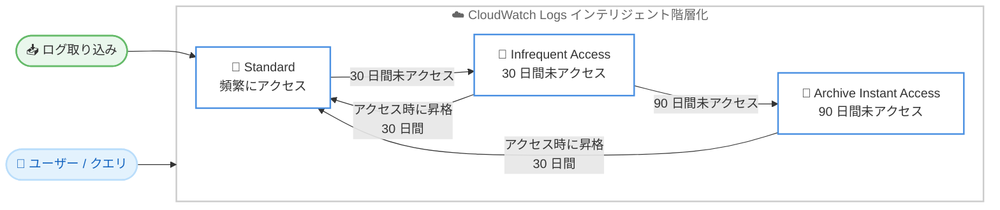

# Amazon CloudWatch Logs - ストレージのインテリジェント階層化

**リリース日**: 2026年07月15日
**サービス**: Amazon CloudWatch Logs
**機能**: ストレージのインテリジェント階層化 (Intelligent Tiering)

📊 [このアップデートのインフォグラフィックを見る](https://takech9203.github.io/aws-news-summary/20260715-amazon-cloudwatch-intelligent-tiering.html)
<!-- INFOGRAPHIC_BASE_URL は環境変数から取得 -->

## 概要

Amazon CloudWatch Logs は、ストレージのインテリジェント階層化を発表しました。この機能は、ログデータのアクセス頻度に応じて、3 つのストレージ階層 (Standard、Infrequent Access、Archive Instant Access) にログデータを自動的に分類します。これにより、追加の運用作業なしに、ログをより長期間、低コストで保持できるようになります。

従来、大容量で冗長なログを長期間保持しようとすると、ストレージコストが増大するため、ログをフィルタリングしたり、他のストレージへエクスポートしたりする必要がありました。インテリジェント階層化により、お客様はログを CloudWatch にネイティブに保持したまま、どの階層にデータが存在していても同一のクエリ体験を維持できます。

この機能は、ログをひとつのツールに集約して完全な可視性を確保したいお客様を対象としています。単一の場所で分析とアラートを実行できるため、運用オーバーヘッドを削減し、平均修復時間 (MTTR) の短縮に貢献します。

**アップデート前の課題**

- 大容量で冗長なログを長期間保持すると、ストレージコストが増大していた
- コストを抑えるために、ログをフィルタリングしたり外部にエクスポートしたりする必要があった
- ログが複数の場所に分散し、可視性が低下して運用オーバーヘッドが増加していた

**アップデート後の改善**

- アクセス頻度に応じてログデータが 3 つの階層に自動分類され、長期保持のコストが低減された
- どの階層にデータが存在していても同一のクエリ体験が維持される
- ログを CloudWatch に集約したまま保持できるため、可視性が向上し MTTR が短縮される

## アーキテクチャ図

ログデータはアクセス頻度に応じて Standard から Infrequent Access、Archive Instant Access へと自動的に移行し、古いデータにアクセスすると Standard 階層へ 30 日間昇格します。

## サービスアップデートの詳細

### 主要機能

1. **3 つのストレージ階層への自動分類**
   - Standard: 頻繁にアクセスされるログデータ向けの既存の階層
   - Infrequent Access: 30 日間アクセスされなかったデータが移行する階層
   - Archive Instant Access: 90 日間アクセスされなかったデータが移行する階層

2. **アクセスパターンに基づく自動階層移行**
   - CloudWatch Logs が使用状況をモニタリングし、データを自動的に再分類
   - 30 日間アクセスされなかったデータは Infrequent Access へ移行
   - 90 日間アクセスされなかったデータは Archive Instant Access へ移行

3. **アクセス時の自動昇格**
   - 古いデータにアクセスすると、自動的に Standard 階層へ昇格
   - 昇格後は 30 日間 Standard 階層に保持される

4. **一貫したクエリ体験**
   - データがどの階層に存在していても、同一のクエリ体験を維持
   - 階層を意識することなく CloudWatch Logs Insights などでログを分析可能

## 技術仕様

### ストレージ階層の移行条件

| 階層 | 移行条件 | 用途 |
|------|----------|------|
| Standard | ログ取り込み時の既定の階層 | 頻繁にアクセスされるログ |
| Infrequent Access | 30 日間アクセスなし | アクセス頻度が低いログ |
| Archive Instant Access | 90 日間アクセスなし | 長期保持のためのログ |
| Standard へ昇格 | 古いデータにアクセス | アクセス後 30 日間 Standard に保持 |

### 有効化のスコープ

インテリジェント階層化はアカウントレベルで有効化します。AWS マネジメントコンソール、AWS SDK、または AWS CLI から設定できます。

## 設定方法

### 前提条件

1. Amazon CloudWatch Logs を使用していること
2. アカウントレベルの設定を変更できる IAM 権限を保有していること
3. 対象リージョンがインテリジェント階層化に対応していること

### 手順

#### ステップ1: 有効化方法の選択

インテリジェント階層化は、以下のいずれかの方法でアカウントレベルで有効化します。

- AWS マネジメントコンソール
- AWS SDK
- AWS CLI

#### ステップ2: アカウントレベルでの有効化

AWS マネジメントコンソールまたは AWS CLI / SDK を使用して、アカウントレベルでインテリジェント階層化を有効化します。有効化後は、CloudWatch Logs がアクセスパターンをモニタリングし、ログデータを適切な階層へ自動的に分類します。

設定の詳細な API やパラメータについては、最新の [CloudWatch Logs ドキュメント](https://docs.aws.amazon.com/AmazonCloudWatch/latest/logs/) を参照してください。

## メリット

### ビジネス面

- **ストレージコストの最適化**: アクセス頻度が低いログを低コストの階層へ自動移行し、長期保持のコストを削減
- **運用オーバーヘッドの削減**: ログのフィルタリングやエクスポートが不要になり、追加の運用作業なしにコストを最適化
- **MTTR の短縮**: ログを単一のツールに集約し、分析とアラートを一箇所で実行できるため、問題解決が迅速化

### 技術面

- **自動階層化**: アクセスパターンに基づいてデータを自動分類し、手動管理が不要
- **一貫したクエリ体験**: どの階層にデータがあっても同一のクエリ操作が可能
- **ネイティブな長期保持**: ログを CloudWatch に保持したまま、大容量で冗長なログも長期間保存可能

## デメリット・制約事項

### 制限事項

- Middle East (Bahrain) および Middle East (UAE) リージョンでは利用できない
- 有効化はアカウントレベルでの設定となる
- 階層移行はアクセスパターンに基づく自動処理であり、個別の細かい制御はできない

### 考慮すべき点

- アクセス頻度が低い階層に移行したデータへアクセスすると、Standard 階層へ昇格し 30 日間保持される点を考慮する
- 各階層のストレージ料金体系を確認し、コスト最適化の効果を見積もる
- 移行条件 (30 日 / 90 日) を踏まえて、既存のログ保持ポリシーとの整合性を確認する

## ユースケース

### ユースケース1: 大容量ログの長期保持

**シナリオ**: コンプライアンス要件のため、大容量で冗長なアプリケーションログを長期間保持する必要がある

**効果**: アクセス頻度が低いログが自動的に Infrequent Access や Archive Instant Access へ移行し、フィルタリングやエクスポートを行わずに低コストで長期保持を実現

### ユースケース2: インシデント調査時の過去ログ参照

**シナリオ**: 過去に発生した事象を調査するため、数か月前のログを参照する

**効果**: Archive Instant Access に保存された古いデータへアクセスすると自動的に Standard 階層へ昇格し、同一のクエリ体験で即座に分析可能

### ユースケース3: ログの一元管理による運用効率化

**シナリオ**: 複数の場所に分散していたログを CloudWatch に集約し、単一のツールで監視したい

**効果**: すべてのログを CloudWatch にネイティブ保持したままコストを最適化でき、分析とアラートを一箇所で実行して MTTR を短縮

## 料金

インテリジェント階層化では、ログデータが存在するストレージ階層に応じた料金が適用されます。アクセス頻度の低い階層へ移行することで、Standard 階層と比較してストレージコストを削減できます。正確な料金は、リージョンや使用量によって異なるため、最新の [Amazon CloudWatch 料金ページ](https://aws.amazon.com/cloudwatch/pricing/) を参照してください。

## 利用可能リージョン

すべての AWS 商用リージョンで利用可能です。ただし、Middle East (Bahrain) および Middle East (UAE) リージョンは対象外です。

## 関連サービス・機能

- **Amazon CloudWatch Logs Insights**: ログデータをインタラクティブに検索・分析するクエリ機能。どの階層のデータに対しても一貫したクエリ体験を提供
- **CloudWatch Logs ロググループ**: ログを整理・保持する単位。保持ポリシーと組み合わせてログのライフサイクルを管理
- **Amazon S3**: 従来ログのエクスポート先として利用されていたストレージ。インテリジェント階層化により、エクスポートせずに CloudWatch 内で低コスト保持が可能

## 参考リンク

- 📊 [インフォグラフィック](https://takech9203.github.io/aws-news-summary/20260715-amazon-cloudwatch-intelligent-tiering.html)
- [公式発表 (What's New)](https://aws.amazon.com/about-aws/whats-new/2026/07/amazon-cloudwatch-intelligent-tiering/)
- [Amazon CloudWatch product page](https://aws.amazon.com/cloudwatch/)
- [CloudWatch Logs ドキュメント](https://docs.aws.amazon.com/AmazonCloudWatch/latest/logs/)
- [Amazon CloudWatch 料金ページ](https://aws.amazon.com/cloudwatch/pricing/)

## まとめ

Amazon CloudWatch Logs のストレージのインテリジェント階層化により、ログデータをアクセス頻度に応じて自動的に最適な階層へ分類し、追加の運用作業なしに長期保持のコストを削減できるようになりました。大容量のログを CloudWatch にネイティブ保持したまま一貫したクエリ体験を維持できるため、ログの保持戦略とコスト最適化を検討しているお客様は、対象リージョンでアカウントレベルでの有効化を検討することをお勧めします。
