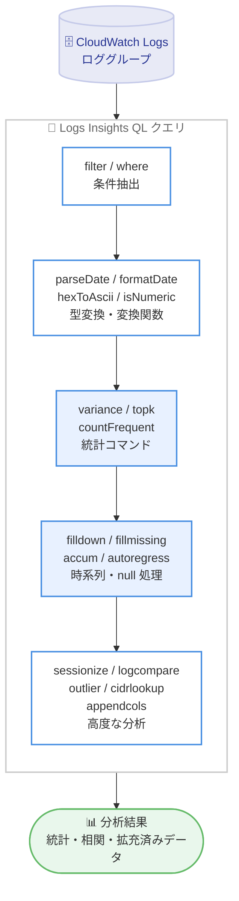

# Amazon CloudWatch Logs Insights - 25 個の新しいクエリコマンドと関数の追加

**リリース日**: 2026年7月15日
**サービス**: Amazon CloudWatch Logs
**機能**: CloudWatch Logs Insights クエリ言語 (Logs Insights QL) への新コマンド / 関数追加

📊 [このアップデートのインフォグラフィックを見る](https://takech9203.github.io/aws-news-summary/20260715-amazon-cloudwatch-logs-insights-ql.html)
<!-- INFOGRAPHIC_BASE_URL は環境変数から取得 -->

## 概要

Amazon CloudWatch Logs Insights のクエリ言語 (Logs Insights QL) に、25 個の新しいコマンドと関数が追加されました。今回追加されたコマンドと関数により、お客様はログデータのクエリ、変換、相関分析、統計分析をこれまで以上に柔軟に実行できるようになります。

お客様はログ分析において、統計的な集計の実行、時系列データにおける null 値の処理、異なる時間ウィンドウ間でのログ比較、外れ値の検出、ルックアップデータによるイベントの拡充といった作業を必要とすることが少なくありません。今回のアップデートは、こうした高度な分析作業を追加のツールやデータのエクスポートなしに、Logs Insights QL のクエリ内で完結させることを目的としています。

追加された機能は、型変換 / エンコーディング関数、日時関数、文字列関数、JSON 検査関数、統計コマンド、行シーケンス / null 処理コマンド、セッション化 / 時間比較コマンド、ルックアップ拡充コマンドなど、幅広いカテゴリにわたります。これらの機能は、すべての商用 AWS リージョンで本日から利用可能です。

**アップデート前の課題**

- 分散や上位頻度値、外れ値といった統計分析を Logs Insights のクエリ内で完結させることが難しく、データを別ツールへエクスポートする必要があった
- 時系列データにおける欠損値や null 値の処理 (前方補完、欠損行の補完など) を標準機能だけで行うことが困難だった
- 異なる時間ウィンドウ間でのログ比較や、IP アドレスの CIDR 範囲によるルックアップ拡充を柔軟に実行できなかった

**アップデート後の改善**

- variance、topk、countFrequent などの統計コマンドにより、クエリ内で直接統計分析を実行できるようになった
- filldown、fillmissing、accum、autoregress により、時系列データの null 処理や累積計算をクエリ内で完結できるようになった
- logcompare、sessionize、outlier、cidrlookup、appendcols、where により、時間比較、セッション化、外れ値検出、CIDR ルックアップ、列結合などの高度な分析が可能になった

## アーキテクチャ図



ロググループのログデータを Logs Insights QL のクエリでパイプ処理し、抽出、変換、統計分析、時系列処理、高度な分析といった各段階を経て、統計・相関・拡充済みの分析結果を得る流れを示しています。

## サービスアップデートの詳細

### 主要機能

追加された 25 個のコマンドと関数は、以下のカテゴリに分類されます。

1. **型変換 / エンコーディング関数**
   - `hexToAscii`: 16 進数文字列を ASCII 文字列へ変換
   - `hexToDec`: 16 進数を 10 進数へ変換
   - `decToHex`: 10 進数を 16 進数へ変換

2. **日時関数**
   - `parseDate`: 文字列を日時値としてパース
   - `formatDate`: 日時値を指定した形式の文字列へフォーマット
   - `queryStartTime` / `queryEndTime`: クエリ対象期間の開始 / 終了時刻を取得
   - `queryTimeRange`: クエリ対象期間の範囲を取得

3. **文字列関数**
   - `messageSize`: メッセージのサイズを取得

4. **JSON 検査関数**
   - `jsonArraySize`: JSON 配列の要素数を取得
   - `jsonArrayContains`: JSON 配列に特定の値が含まれるかを判定

5. **条件検証関数**
   - `isNumeric`: 値が数値かどうかを判定

6. **統計コマンド**
   - `variance`: 分散を計算
   - `topk`: 上位 k 件を抽出
   - `countFrequent`: 一意なフィールド値の組み合わせごとの概算件数を降順で返す

7. **行シーケンス / null 処理コマンド**
   - `autoregress`: フィールド値の遅延 (前の行) コピーを作成
   - `accum`: 数値フィールドの累積合計を計算
   - `filldown`: 直前の非 null 値を前方へ補完してギャップを埋める
   - `fillmissing`: `bin()` による集計後の空の時間ビンに行を挿入し、任意で定数を補完

8. **セッション化 / 時間比較コマンド**
   - `sessionize`: 識別フィールドと非アクティブ時間 (ギャップ) でイベントをセッションにグループ化
   - `logcompare`: 現在の時間ウィンドウを、指定した期間だけ過去にシフトしたベースラインウィンドウと比較

9. **データ分析コマンド**
   - `outlier`: 四分位範囲 (IQR) に基づいて統計的な外れ値を検出し、外れ値の行を除去または変換

10. **クエリ構成 / 結合コマンド**
    - `where`: `filter` コマンドの文法エイリアスであり、同一の構文を受け付ける
    - `appendcols`: サブクエリの列を位置による行マッチングで現在の結果へ追加

11. **ルックアップ拡充コマンド**
    - `cidrlookup`: IP フィールドをルックアップテーブル内の CIDR 範囲と照合してイベントを拡充

## 技術仕様

### 主なコマンド / 関数の概要

| コマンド / 関数 | カテゴリ | 説明 |
|------|------|------|
| variance | 統計 | 数値フィールドの分散を計算 |
| topk | 統計 | 上位 k 件を抽出 |
| countFrequent | 統計 | 一意な値の組み合わせごとの概算件数を降順で返す |
| autoregress | 行シーケンス | フィールド値の前行コピー (ラグ) を作成 |
| accum | 行シーケンス | 数値フィールドの累積合計を計算 |
| filldown | null 処理 | 直前の非 null 値を前方補完 |
| fillmissing | null 処理 | 集計後の空の時間ビンに行を挿入 |
| sessionize | セッション化 | 識別フィールドと非アクティブギャップでセッション化 |
| logcompare | 時間比較 | 現在ウィンドウとシフト済みベースラインを比較 |
| outlier | データ分析 | IQR に基づく外れ値の検出・除去・変換 |
| cidrlookup | ルックアップ拡充 | IP を CIDR 範囲と照合して拡充 |
| appendcols | 結合 | サブクエリの列を位置マッチングで追加 |
| where | 構成 | filter のエイリアス (同一構文) |

### ログクラスのサポート

| 項目 | 詳細 |
|------|------|
| Standard ログクラス | すべての Logs Insights QL コマンドをサポート |
| Infrequent Access ログクラス | `pattern`、`diff`、`unmask` を除くすべてのコマンドをサポート |

### クエリ構文の基本

CloudWatch Logs Insights QL では、複数のコマンドをパイプ文字 (`|`) で連結してクエリを構成します。今回追加されたコマンドも既存のコマンドと同様にパイプで連結して利用できます。

```text
fields @timestamp, @message
| filter status = 500
| stats variance(latency) as latencyVariance by bin(5m)
| filldown latencyVariance
```

上記は、`filter` (または `where`) で条件抽出し、`variance` で分散を計算し、`filldown` で null 値を前方補完する例です。

## 設定方法

### 前提条件

1. Amazon CloudWatch Logs にログを送信しているロググループが存在すること
2. `logs:StartQuery` および `logs:GetQueryResults` などの Logs Insights クエリ実行に必要な IAM 権限を持つこと
3. `pattern`、`diff`、`unmask` を除くコマンドは Infrequent Access ログクラスでも利用できることを理解していること

### 手順

#### ステップ1: CloudWatch Logs Insights を開く

CloudWatch コンソールで [ログのインサイト] (Logs Insights) を開き、対象のロググループを選択します。追加された新しいコマンドと関数は、既存のクエリエディタからそのまま利用できます。

#### ステップ2: 新しいコマンドを含むクエリを実行する

```text
fields @timestamp, srcIp, @message
| cidrlookup srcIp in "internal_ranges" as network
| stats countFrequent(network) as cnt by network
```

上記は、`cidrlookup` で送信元 IP を CIDR 範囲のルックアップテーブルと照合してネットワーク名で拡充し、`countFrequent` でネットワークごとの概算件数を降順に集計する例です。

#### ステップ3: 時系列分析と外れ値検出を組み合わせる

```text
fields @timestamp, latency
| stats avg(latency) as avgLatency by bin(1m)
| fillmissing avgLatency with 0
| outlier avgLatency
```

`bin()` による集計後、`fillmissing` で空の時間ビンを 0 で補完し、`outlier` で IQR に基づく外れ値を検出します。これにより、欠損のない時系列に対して外れ値分析を実行できます。

## メリット

### ビジネス面

- **分析の内製化**: 統計分析や外れ値検出をログ分析基盤内で完結でき、外部ツールへのデータエクスポートや追加のパイプライン構築が不要になる
- **運用の迅速化**: 時間ウィンドウ比較やセッション化により、障害調査やトレンド分析を素早く実行でき、問題の特定にかかる時間を短縮できる
- **既存資産の活用**: 既存の CloudWatch Logs Insights のクエリエディタからそのまま利用でき、追加の環境構築なしに高度な分析を導入できる

### 技術面

- **表現力の向上**: variance、topk、countFrequent などにより、クエリ 1 本で統計的な集計が可能になる
- **時系列処理の強化**: filldown、fillmissing、accum、autoregress により、null 処理や累積計算、ラグ計算がクエリ内で完結する
- **相関分析の高度化**: logcompare、sessionize、appendcols、cidrlookup により、時間比較、セッション化、列結合、ルックアップ拡充といった相関分析を柔軟に構成できる

## デメリット・制約事項

### 制限事項

- `pattern`、`diff`、`unmask` は Infrequent Access ログクラスでは利用できない (これらは今回追加されたコマンドではないが、ログクラスによるコマンド差異に注意が必要)
- `countFrequent` は概算値を返すため、厳密な件数が必要な用途では留意が必要
- クエリのスキャン対象データ量が大きいほど料金が増加するため、時間範囲とロググループの絞り込みが引き続き重要

### 考慮すべき点

- 高度なコマンドを多用する複雑なクエリは、対象データ量によってはクエリ実行時間やコストに影響する可能性がある
- ダッシュボードに Logs Insights ウィジェットを配置する場合、高頻度の更新は都度クエリを起動しコスト増につながるため、更新頻度を適切に設定する

## ユースケース

### ユースケース1: レイテンシーの外れ値検出

**シナリオ**: API のレイテンシーログから、通常とは異なる遅延が発生した時間帯を特定したい

**実装例**:
```text
fields @timestamp, latency
| stats avg(latency) as avgLatency by bin(1m)
| fillmissing avgLatency with 0
| outlier avgLatency
```

**効果**: 欠損のない時系列に対して IQR に基づく外れ値検出を実行でき、異常な遅延が発生した時間帯を自動的に抽出できる

### ユースケース2: 期間比較によるトレンド分析

**シナリオ**: 直近のエラー発生状況を、過去の同じ長さの期間と比較して増減傾向を把握したい

**実装例**:
```text
fields @timestamp, @message
| filter @message like /ERROR/
| stats count(*) as errorCount by bin(5m)
| logcompare errorCount shift 1d
```

**効果**: 現在の時間ウィンドウを 1 日前のベースラインウィンドウと比較でき、エラー件数のトレンドや急増を素早く把握できる

### ユースケース3: 送信元 IP のネットワーク別集計

**シナリオ**: アクセスログの送信元 IP を社内ネットワーク定義と照合し、ネットワークごとのアクセス傾向を分析したい

**実装例**:
```text
fields @timestamp, srcIp
| cidrlookup srcIp in "internal_ranges" as network
| stats countFrequent(network) as cnt by network
```

**効果**: `cidrlookup` で IP を CIDR 範囲のルックアップテーブルと照合してネットワーク名で拡充し、ネットワーク単位でアクセス傾向を集計できる

## 料金

今回追加されたコマンドと関数の利用に対する追加料金はありません。CloudWatch Logs Insights は、クエリがスキャンしたログデータ量に基づいて課金される従来の料金体系が適用されます。過度なコストを避けるため、クエリ対象のロググループと時間範囲をできるだけ絞り込むことが推奨されます。

### 料金例

| 使用量 | 月額料金（概算） |
|--------|------------------|
| 新しいコマンド / 関数の利用 | 追加料金なし |
| Logs Insights クエリ | スキャンしたログデータ量に応じた従量課金 (標準の CloudWatch Logs 料金が適用) |

## 利用可能リージョン

すべての商用 AWS リージョンで利用できます。

## 関連サービス・機能

- **Amazon CloudWatch Logs**: ログの収集、保存、モニタリングを行うサービス。今回のアップデートはこのサービスの Logs Insights クエリ言語の拡張
- **CloudWatch Logs Insights**: ロググループに対してインタラクティブにクエリを実行し、ログデータを分析する機能。今回追加のコマンド / 関数の実行基盤
- **Amazon CloudWatch ダッシュボード**: Logs Insights のクエリ結果をウィジェットとして可視化でき、追加コマンドを用いた分析結果の共有に活用できる

## 参考リンク

- 📊 [インフォグラフィック](https://takech9203.github.io/aws-news-summary/20260715-amazon-cloudwatch-logs-insights-ql.html)
- [公式発表 (What's New)](https://aws.amazon.com/about-aws/whats-new/2026/7/amazon-cloudwatch-logs-insights-ql/)
- [AWS Blog: This Month in AWS Observability: June 2026](https://aws.amazon.com/blogs/mt/this-month-in-aws-observability-june-2026/)
- [CloudWatch Logs Insights クエリ構文 (ドキュメント)](https://docs.aws.amazon.com/AmazonCloudWatch/latest/logs/CWL_QuerySyntax.html)
- [Amazon CloudWatch 料金](https://aws.amazon.com/cloudwatch/pricing/)

## まとめ

今回のアップデートは、CloudWatch Logs Insights のクエリ言語に統計分析、時系列処理、相関分析、ルックアップ拡充のための 25 個のコマンドと関数を追加し、ログ分析の表現力を大きく高める重要な機能強化です。追加料金なしですべての商用リージョンで利用できるため、これまで外部ツールで行っていた統計分析や外れ値検出を Logs Insights のクエリへ移行できないか検討し、既存のクエリに新しいコマンドを組み込んで分析を強化することを推奨します。
