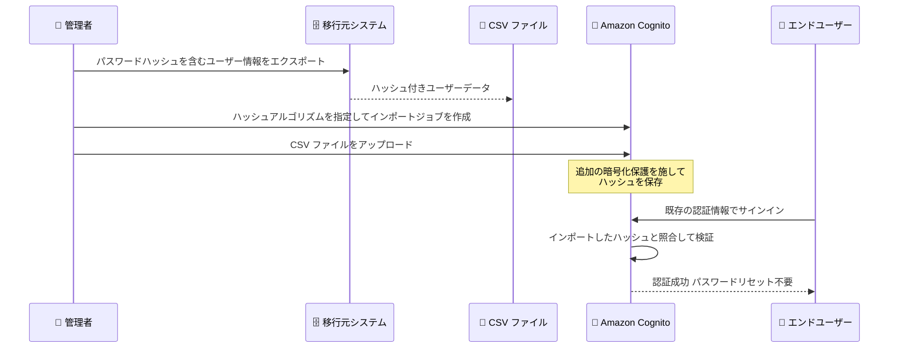

# Amazon Cognito - パスワードハッシュを含むユーザーインポート

**リリース日**: 2026 年 7 月 15 日
**サービス**: Amazon Cognito
**機能**: パスワードハッシュを含む CSV ユーザーインポート

📊 [このアップデートのインフォグラフィックを見る](https://takech9203.github.io/aws-news-summary/20260715-amazon-cognito-password-hash-import.html)
<!-- INFOGRAPHIC_BASE_URL は環境変数から取得 -->

## 概要

Amazon Cognito は、CSV ファイルによるユーザーインポート時に、ユーザーのパスワードハッシュを一緒にインポートできるようになりました。これにより、他の認証システムから Cognito ユーザープールへ移行する際に、ユーザーは既存の認証情報でそのままサインインできます。

これまで Cognito にユーザーをインポートした場合、パスワードは移行できず、インポートされたユーザーは初回サインイン時に必ずパスワードをリセットする必要がありました。今回のアップデートでは、bcrypt、scrypt、Argon2id、PBKDF2 with SHA-256 の 4 つのハッシュアルゴリズムに対応し、移行元システムで使用していたハッシュ形式を指定することで、パスワードそのものを再設定させることなくユーザーを移行できます。

この機能は、既存の ID 管理システムやカスタム認証基盤から Cognito への移行を検討している開発者や運用担当者を対象としています。移行に伴うユーザー体験の低下を抑え、大規模なユーザーベースをスムーズに Cognito へ引き継ぐことを支援します。

**アップデート前の課題**

このアップデート以前は、ユーザー移行時にパスワードを引き継ぐ手段がありませんでした。

- 以前はインポートされたユーザーが初回サインイン時に必ずパスワードをリセットする必要があった
- 以前は移行元システムのパスワードハッシュを Cognito に持ち込めず、認証情報の継続利用ができなかった
- 以前はパスワードリセットの案内やメール送信が必要で、移行時のユーザー体験と運用負荷に課題があった

**アップデート後の改善**

今回のアップデートにより、パスワードを維持したままの移行が可能になりました。

- 今回のアップデートにより、インポートされたユーザーが既存の認証情報でそのままサインインできるようになった
- 今回のアップデートにより、移行時の一斉パスワードリセットが不要になった
- 今回のアップデートにより、bcrypt、scrypt、Argon2id、PBKDF2 with SHA-256 のハッシュ形式を指定してインポートできるようになった

## アーキテクチャ図

管理者が移行元システムからパスワードハッシュを含むユーザーデータを CSV でインポートし、エンドユーザーが既存の認証情報でそのままサインインできる流れを示しています。

## サービスアップデートの詳細

### 主要機能

1. **パスワードハッシュのインポート**
   - CSV ユーザーインポート時に、パスワードハッシュを含めてインポートできる
   - インポートされたユーザーは初回サインイン時にパスワードをリセットする必要がない
   - 既存の認証情報のまま Cognito ユーザープールへ移行できる

2. **複数のハッシュアルゴリズムへの対応**
   - bcrypt、scrypt、Argon2id、PBKDF2 with SHA-256 の 4 つのアルゴリズムに対応
   - CSV インポートの設定時に、移行元システムで使用していたハッシュアルゴリズムを指定する
   - 一般的なパスワードハッシュ形式をカバーし、多様な移行元からの移行を支援する

3. **サインイン時のハッシュ検証と追加の暗号化保護**
   - ユーザーの初回サインイン時に、入力されたパスワードをインポート済みのハッシュと照合して検証する
   - インポートされたすべてのハッシュは、保存前に追加の暗号化保護レイヤーが適用される
   - 移行後のパスワード管理を Cognito が引き継ぐ

## 技術仕様

### 対応ハッシュアルゴリズム

| アルゴリズム | 概要 |
|------|------|
| bcrypt | Blowfish ベースの広く利用されているパスワードハッシュ関数 |
| scrypt | メモリハードなハッシュ関数で、ハードウェア攻撃への耐性が高い |
| Argon2id | パスワードハッシュコンペティションの受賞アルゴリズムで、推奨される最新方式 |
| PBKDF2 with SHA-256 | 反復処理を用いた鍵導出関数で、SHA-256 を利用 |

### 設定・実行方法

インポートジョブは AWS マネジメントコンソール、AWS CLI、AWS SDK のいずれからでも作成できます。

## 設定方法

### 前提条件

1. インポート先の Amazon Cognito ユーザープールが作成済みであること
2. 移行元システムからパスワードハッシュを含むユーザーデータを取得できること
3. 移行元システムで使用しているハッシュアルゴリズムが対応形式 (bcrypt、scrypt、Argon2id、PBKDF2 with SHA-256) であること

### 手順

#### ステップ 1: CSV ヘッダーの取得とデータ準備

ユーザープールに対応した CSV ヘッダーを取得し、パスワードハッシュ列を含めてユーザーデータを整形します。移行元システムからエクスポートしたハッシュ値を該当列に格納します。

#### ステップ 2: インポートジョブの作成

コンソール、CLI、または SDK からユーザーインポートジョブを作成します。この際、移行元システムで使用していたハッシュアルゴリズムを指定します。

#### ステップ 3: CSV のアップロードとジョブ実行

作成したインポートジョブに CSV ファイルをアップロードして実行します。実行後、インポートされたユーザーは既存の認証情報でサインインでき、初回サインイン時に Cognito がパスワードをハッシュと照合して検証します。

## メリット

### ビジネス面

- **移行時のユーザー体験の維持**: 一斉パスワードリセットが不要になり、ユーザーは慣れ親しんだ認証情報のまま利用を継続できる
- **移行プロジェクトの簡素化**: パスワード再設定の案内やサポート対応が不要になり、移行に伴う運用負荷を軽減できる
- **サービス継続性の確保**: 移行のためにユーザーへ追加のアクションを求めずに済むため、離脱リスクを抑えられる

### 技術面

- **多様な移行元への対応**: 主要な 4 つのハッシュアルゴリズムに対応し、既存の認証基盤からの移行を柔軟に実現できる
- **セキュリティの強化**: インポートしたハッシュに対して追加の暗号化保護レイヤーが適用され、保存時の安全性が高まる
- **標準ツールでの実行**: コンソール、CLI、SDK から実行できるため、自動化された移行パイプラインに組み込みやすい

## デメリット・制約事項

### 制限事項

- 対応するハッシュアルゴリズムは bcrypt、scrypt、Argon2id、PBKDF2 with SHA-256 の 4 つに限られる
- 移行元システムが上記以外の独自ハッシュ形式を使用している場合は、この方法でパスワードを移行できない

### 考慮すべき点

- ハッシュ形式やパラメータが移行元システムと一致していることを事前に確認する必要がある
- パスワードハッシュは機密情報であるため、CSV ファイルの取り扱いやアップロード経路のセキュリティに十分注意する

## ユースケース

### ユースケース 1: 既存 ID 基盤から Cognito への移行

**シナリオ**: 自社構築の認証システムで bcrypt を使ってパスワードを保存している企業が、Amazon Cognito へ移行する。

**効果**: 既存ユーザーはパスワードを再設定することなく、これまでと同じ認証情報でサインインでき、移行を意識させないシームレスな体験を提供できる。

### ユースケース 2: 他社 IDaaS からの乗り換え

**シナリオ**: 別の ID 管理サービスから Cognito へ乗り換える際に、Argon2id でハッシュ化されたパスワードを引き継ぎたい。

**効果**: 対応アルゴリズムを指定してインポートすることで、大規模なユーザーベースでも一斉リセットを行わずに移行できる。

### ユースケース 3: 段階的な認証基盤の統合

**シナリオ**: 複数のアプリケーションで分散していたユーザー認証を Cognito に統合する。

**効果**: 各システムのハッシュ形式に合わせてインポートすることで、ユーザーへの影響を最小化しながら認証基盤を一元化できる。

## 料金

今回のアップデートに関する追加料金の情報は公式発表には記載されていません。Amazon Cognito の料金体系については、公式の料金ページを参照してください。

## 利用可能リージョン

Amazon Cognito が利用可能なすべての AWS リージョンで提供されます。

## 関連サービス・機能

- **AWS Lambda**: Cognito のトリガーと組み合わせることで、移行やサインインの前後にカスタムロジックを実行できる
- **AWS IAM**: ユーザーインポートジョブの実行に必要な権限管理を担う
- **Amazon S3 / Amazon CloudWatch Logs**: インポートジョブのログ出力先として利用され、移行の成否確認に役立つ

## 参考リンク

- 📊 [インフォグラフィック](https://takech9203.github.io/aws-news-summary/20260715-amazon-cognito-password-hash-import.html)
- [公式発表 (What's New)](https://aws.amazon.com/about-aws/whats-new/2026/07/amazon-cognito-password-hash-import/)
- [Amazon Cognito ドキュメント (ユーザープールへのユーザーのインポート)](https://docs.aws.amazon.com/cognito/latest/developerguide/cognito-user-pools-import-users.html)
- [Amazon Cognito 料金ページ](https://aws.amazon.com/cognito/pricing/)

## まとめ

このアップデートにより、Amazon Cognito への移行時にパスワードハッシュをそのまま引き継げるようになり、一斉パスワードリセットという移行時の大きな障壁が解消されました。既存の認証基盤からの移行を検討している場合は、移行元のハッシュアルゴリズムが対応形式かを確認し、CSV インポートによる移行手順の検証を進めることを推奨します。
