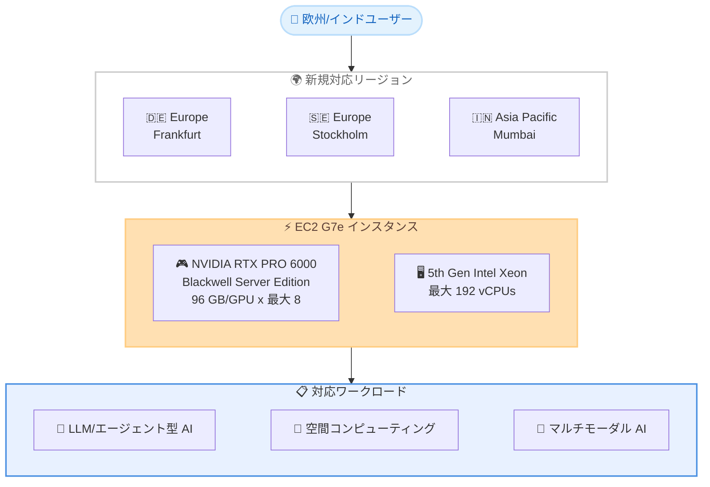

# Amazon EC2 G7e - 追加リージョンで利用可能に

**リリース日**: 2026 年 7 月 15 日
**サービス**: Amazon Elastic Compute Cloud (Amazon EC2)
**機能**: G7e インスタンス 追加リージョン対応 (Frankfurt、Stockholm、Mumbai)

📊 [このアップデートのインフォグラフィックを見る](https://takech9203.github.io/aws-news-summary/20260715-amazon-g7e-additional-regions.html)

## 概要

Amazon EC2 G7e インスタンスが Europe (Frankfurt)、Europe (Stockholm)、Asia Pacific (Mumbai) の 3 リージョンで新たに利用可能になった。G7e インスタンスは NVIDIA RTX PRO 6000 Blackwell Server Edition GPU を搭載し、前世代の G6e インスタンスと比較して最大 2.3 倍の推論パフォーマンスを提供する。

G7e インスタンスは、大規模言語モデル (LLM)、エージェント型 AI モデル、マルチモーダル生成 AI モデル、フィジカル AI モデルのデプロイに適している。また、空間コンピューティングワークロードやグラフィックスと AI 処理の両方を必要とするワークロードにおいて最高のパフォーマンスを提供する。今回の追加により、ドイツ、スウェーデン、インドおよびその近隣地域のユーザーは、低レイテンシーでデータレジデンシー要件を満たしながら Blackwell GPU ベースの AI 推論やグラフィックスワークロードを実行できるようになった。

このアップデートにより、G7e の利用可能リージョンは US West (Oregon)、US East (N. Virginia、Ohio)、Europe (Spain、London、Frankfurt、Stockholm)、Asia Pacific (Tokyo、Seoul、Mumbai) の 10 リージョンに拡大した。

**アップデート前の課題**

- 欧州で G7e インスタンスを利用する場合、Europe (Spain) および Europe (London) リージョンのみが選択肢であり、ドイツやスウェーデンのユーザーは地理的に近いリージョンでの利用ができなかった
- インドおよび南アジアのユーザーは、G7e を利用できる近隣リージョンがなく、遠隔リージョン経由での高レイテンシーな利用を余儀なくされていた
- ドイツやインドのデータレジデンシー要件を満たしながら最新の Blackwell GPU パフォーマンスを活用することが困難だった

**アップデート後の改善**

- Europe (Frankfurt)、Europe (Stockholm)、Asia Pacific (Mumbai) の 3 リージョンで G7e インスタンスが利用可能になった
- ドイツ、スウェーデン、インドのユーザーが自国または近隣リージョンで Blackwell GPU のパフォーマンスを活用できるようになった
- 各国のデータレジデンシーおよびコンプライアンス要件を満たしながら、G6e と比較して最大 2.3 倍の推論パフォーマンスを実現できるようになった

## アーキテクチャ図



新たに対応した 3 リージョンで G7e インスタンスを起動し、NVIDIA RTX PRO 6000 Blackwell GPU を活用して AI 推論、空間コンピューティング、マルチモーダル AI など多様なワークロードを低レイテンシーで実行できる。

## サービスアップデートの詳細

### 主要機能

1. **NVIDIA RTX PRO 6000 Blackwell Server Edition GPU**
   - GPU あたり 96 GB の GDDR7 メモリ
   - 最新の NVIDIA Blackwell アーキテクチャで FP4 精度をサポート
   - 第 4 世代レイトレーシングコアでニューラルグラフィクスベースの技術に対応
   - 最大 8 GPU (合計 768 GB GPU メモリ) を搭載可能

2. **高性能ネットワーキング**
   - EFA で最大 1600 Gbps のネットワーク帯域幅
   - NVIDIA GPUDirect Peer to Peer (P2P) によるマルチ GPU ワークロードのパフォーマンス向上
   - NVIDIA GPUDirect RDMA (EFA 対応) で EC2 UltraClusters における小規模マルチノードワークロードのレイテンシーを削減

3. **AI 推論パフォーマンスの大幅向上**
   - G6e と比較して最大 2.3 倍の推論パフォーマンス
   - 第 5 世代 Intel Xeon プロセッサで最大 192 vCPU を提供
   - リアルタイムエージェント型 AI およびマルチモーダル AI 推論に対応

## 技術仕様

### インスタンスサイズ

| インスタンスサイズ | GPU 数 | GPU メモリ | vCPUs | ネットワーク帯域幅 |
|---|---|---|---|---|
| g7e.2xlarge | 1 | 96 GB | 8 | 50 Gbps |
| g7e.4xlarge | 1 | 96 GB | 16 | 50 Gbps |
| g7e.8xlarge | 1 | 96 GB | 32 | 100 Gbps |
| g7e.12xlarge | 2 | 192 GB | 48 | 400 Gbps |
| g7e.24xlarge | 4 | 384 GB | 96 | 800 Gbps |
| g7e.48xlarge | 8 | 768 GB | 192 | 1600 Gbps |

### 主な仕様

| 項目 | 詳細 |
|------|------|
| GPU | NVIDIA RTX PRO 6000 Blackwell Server Edition |
| GPU メモリ/GPU | 96 GB |
| GPU 最大数 | 8 (合計 768 GB GPU メモリ) |
| プロセッサ | 第 5 世代 Intel Xeon |
| 最大 vCPU | 192 |
| 最大ネットワーク帯域幅 | 1600 Gbps |
| 推論パフォーマンス | G6e 比 最大 2.3 倍 |

## 設定方法

### 前提条件

1. AWS アカウント
2. 対象リージョン (Frankfurt: eu-central-1、Stockholm: eu-north-1、Mumbai: ap-south-1) での G7e インスタンスのサービスクォータ (必要に応じてクォータ引き上げをリクエスト)
3. NVIDIA ドライバーがインストールされた AMI (AWS Deep Learning AMI 推奨)

### 手順

#### ステップ 1: サービスクォータの確認

```bash
aws service-quotas get-service-quota \
  --region eu-central-1 \
  --service-code ec2 \
  --quota-code L-3819A6DF
```

対象リージョンでの G インスタンスファミリーの vCPU クォータを確認する。不足している場合はクォータ引き上げをリクエストする。上記は Europe (Frankfurt) の例で、Stockholm は eu-north-1、Mumbai は ap-south-1 を指定する。

#### ステップ 2: AWS CLI でインスタンスを起動

```bash
aws ec2 run-instances \
  --region ap-south-1 \
  --instance-type g7e.2xlarge \
  --image-id ami-xxxxxxxx \
  --key-name my-key-pair \
  --security-group-ids sg-xxxxxxxx \
  --subnet-id subnet-xxxxxxxx
```

Asia Pacific (Mumbai) リージョン (ap-south-1) で G7e インスタンスを起動するコマンド。AMI ID は NVIDIA ドライバーがプリインストールされた Deep Learning AMI を指定する。

#### ステップ 3: GPU の動作確認

```bash
nvidia-smi
```

インスタンスに SSH 接続後、nvidia-smi コマンドで NVIDIA RTX PRO 6000 GPU が正しく認識されていることを確認する。

## メリット

### ビジネス面

- **データ主権への対応**: ドイツ、スウェーデン、インドの各国データ保護規制に準拠しながら、最新の GPU アクセラレーテッドワークロードを実行できる
- **低レイテンシー AI 推論**: 各リージョンで推論を実行することで、地域内のエンドユーザーに対してレスポンス時間を短縮できる
- **コスト効率**: G6e と比較して 2.3 倍の推論パフォーマンスにより、スループットあたりのコストを削減できる

### 技術面

- **Blackwell アーキテクチャ**: 最新の NVIDIA Blackwell GPU により、FP4 精度サポートやニューラルグラフィクスなど最先端の機能を利用可能
- **高帯域幅ネットワーキング**: EFA で最大 1600 Gbps のネットワーク帯域幅を提供し、マルチノードワークロードに対応
- **大容量 GPU メモリ**: GPU あたり 96 GB のメモリにより、大規模モデルを単一 GPU 上で実行可能

## デメリット・制約事項

### 制限事項

- 新規提供リージョンであるため、初期段階ではキャパシティに制約がある可能性がある
- ベアメタルインスタンスサイズは提供されていない (最大 g7e.48xlarge まで)
- リージョンごとに提供されるインスタンスサイズが異なる場合がある

### 考慮すべき点

- G6e からの移行時には、NVIDIA ドライバーバージョンの互換性確認が必要
- 大規模なマルチノードトレーニングには P5/P6 インスタンスの方が適している場合がある (G7e は主に推論と中規模トレーニング向け)
- リージョンによって料金が異なるため、事前に料金ページで確認が必要

## ユースケース

### ユースケース 1: ドイツ製造業でのフィジカル AI モデル

**シナリオ**: ドイツの製造業が、GDPR に準拠しながらフィジカル AI モデルを用いた工場のシミュレーションと自動化を実現する必要がある。

**実装例**:
```bash
# g7e.12xlarge (2 GPU, 192 GB) でフィジカル AI モデルをデプロイ
aws ec2 run-instances \
  --region eu-central-1 \
  --instance-type g7e.12xlarge \
  --image-id ami-xxxxxxxx \
  --tag-specifications 'ResourceType=instance,Tags=[{Key=Environment,Value=production}]'
```

**効果**: Frankfurt リージョンで実行することで、ドイツのデータ主権を維持しながら、GPUDirect P2P による高速なマルチ GPU 処理でリアルタイムシミュレーションを実現できる。

### ユースケース 2: インド市場向けマルチモーダル生成 AI サービス

**シナリオ**: インドの企業が、多言語対応のマルチモーダル生成 AI サービスを低レイテンシーで提供する必要がある。

**実装例**:
```bash
# g7e.8xlarge (1 GPU, 96 GB) でマルチモーダルモデルをデプロイ
aws ec2 run-instances \
  --region ap-south-1 \
  --instance-type g7e.8xlarge \
  --image-id ami-xxxxxxxx
```

**効果**: Mumbai リージョンで実行することで、インド国内のユーザーに対して低レイテンシーな推論を提供でき、96 GB の GPU メモリにより大規模モデルを単一 GPU に収容可能。

### ユースケース 3: 北欧での空間コンピューティング

**シナリオ**: スウェーデンの企業がデジタルツインシミュレーションで、リアルタイムなレイトレーシングと AI 処理を組み合わせる。

**実装例**:
```bash
# g7e.48xlarge (8 GPU, 768 GB) で大規模空間コンピューティング
aws ec2 run-instances \
  --region eu-north-1 \
  --instance-type g7e.48xlarge \
  --image-id ami-xxxxxxxx \
  --placement GroupName=my-cluster-group
```

**効果**: Stockholm リージョンの再生可能エネルギーを活用した環境で、第 4 世代レイトレーシングコアとニューラルグラフィクス対応による高品質なリアルタイムビジュアライゼーションを提供。最大 1600 Gbps のネットワーク帯域幅でマルチノード構成にも対応。

## 料金

G7e インスタンスは、オンデマンド、スポットインスタンス、Savings Plans で購入可能。各リージョンの具体的な料金は [EC2 料金ページ](https://aws.amazon.com/ec2/pricing/on-demand/) を参照。

### 購入オプション

| 購入方法 | 説明 |
|----------|------|
| オンデマンド | 長期コミットメントなしで利用可能 |
| スポットインスタンス | 中断許容ワークロード向けの割引価格 |
| Savings Plans | 1 年または 3 年のコミットメントで割引 |

## 利用可能リージョン

| リージョン | 提供状況 |
|------------|----------|
| US East (N. Virginia) | 利用可能 |
| US East (Ohio) | 利用可能 |
| US West (Oregon) | 利用可能 |
| Europe (Spain) | 利用可能 |
| Europe (London) | 利用可能 |
| Europe (Frankfurt) | **新規** - 2026 年 7 月 15 日より利用可能 |
| Europe (Stockholm) | **新規** - 2026 年 7 月 15 日より利用可能 |
| Asia Pacific (Tokyo) | 利用可能 |
| Asia Pacific (Seoul) | 利用可能 |
| Asia Pacific (Mumbai) | **新規** - 2026 年 7 月 15 日より利用可能 |

## 関連サービス・機能

- **Amazon SageMaker AI**: G7e インスタンスをマネージド ML プラットフォームから利用し、モデルトレーニングと推論のデプロイを簡素化
- **AWS Deep Learning AMI**: NVIDIA ドライバーとフレームワークがプリインストールされた AMI で迅速にセットアップ可能
- **Amazon EKS / Amazon ECS**: コンテナオーケストレーションで G7e インスタンスを GPU ワークロード用ノードとして活用
- **EC2 UltraClusters**: EFA と GPUDirect RDMA を活用したマルチノード GPU クラスタリング

## 参考リンク

- 📊 [インフォグラフィック](https://takech9203.github.io/aws-news-summary/20260715-amazon-g7e-additional-regions.html)
- [公式発表 (What's New)](https://aws.amazon.com/about-aws/whats-new/2026/07/amazon-g7e-additional-regions/)
- [AWS Blog - Announcing Amazon EC2 G7e instances](https://aws.amazon.com/blogs/aws/announcing-amazon-ec2-g7e-instances-accelerated-by-nvidia-rtx-pro-6000-blackwell-server-edition-gpus/)
- [G7e インスタンス製品ページ](https://aws.amazon.com/ec2/instance-types/g7e/)
- [EC2 料金ページ](https://aws.amazon.com/ec2/pricing/on-demand/)

## まとめ

Amazon EC2 G7e インスタンスの Europe (Frankfurt、Stockholm)、Asia Pacific (Mumbai) 対応により、ドイツ、スウェーデン、インドおよびその近隣地域のユーザーは、NVIDIA RTX PRO 6000 Blackwell GPU の最大 2.3 倍の推論パフォーマンス向上を低レイテンシーかつデータ主権を維持した状態で活用できるようになった。これにより G7e は合計 10 リージョンに拡大した。各地域で AI 推論、空間コンピューティング、マルチモーダル AI など GPU 集約型ワークロードを実行する場合、サービスクォータの確認と G7e の利用検討を推奨する。
