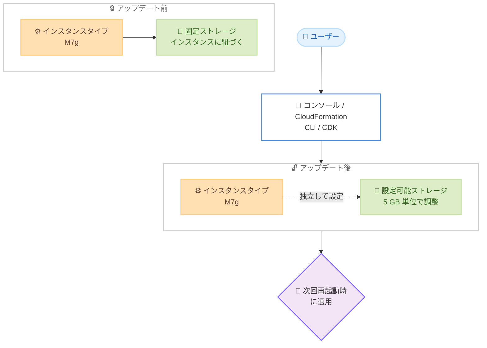

# Amazon MQ - RabbitMQ ブローカー向け設定可能なストレージ

**リリース日**: 2026 年 7 月 15 日
**サービス**: Amazon MQ
**機能**: RabbitMQ ブローカー向け設定可能なストレージ (Configurable Storage)

📊 [このアップデートのインフォグラフィックを見る](https://takech9203.github.io/aws-news-summary/20260715-amazon-mq-rabbitmq-configurable-storage.html)
<!-- INFOGRAPHIC_BASE_URL は環境変数から取得 -->

## 概要

Amazon MQ は、RabbitMQ ブローカーの EBS ディスクストレージサイズをインスタンスタイプとは独立して設定できる機能を発表しました。ブローカーの作成時または更新時に、任意のストレージサイズを指定できるようになり、インスタンスサイズとは切り離してストレージを適切なサイズに調整 (right-size) できます。

従来、RabbitMQ ブローカーのストレージ容量はインスタンスタイプによって固定されていました。この機能により、ワークロードのメッセージ量やメッセージ保持要件に合わせて、ストレージを柔軟に設定できるようになります。

設定可能なストレージは、クラスタデプロイの RabbitMQ M7g ブローカー (バージョン 4.2 以降) で利用できます。ストレージサイズは M7g のデフォルト値からインスタンスサイズに応じた最大許容値まで、5 GB 単位で選択できます。設定は AWS マネジメントコンソール、CloudFormation、CLI、CDK から実施でき、ストレージの変更は次回のブローカー再起動時に適用されます。

**アップデート前の課題**

- RabbitMQ ブローカーのストレージ容量がインスタンスタイプに紐づいており、独立して調整できなかった
- ストレージ容量を増やすためだけに、より大きなインスタンスタイプへのスケールアップが必要になる場合があった
- ワークロードに対してストレージが過剰または不足しやすく、コスト最適化が難しかった

**アップデート後の改善**

- インスタンスタイプとは独立してストレージサイズを設定できるようになった
- ワークロードに合わせてストレージを適切なサイズに調整でき、コスト最適化が可能になった
- コンソール、CloudFormation、CLI、CDK から 5 GB 単位で柔軟に設定できるようになった

## アーキテクチャ図



インスタンスタイプに固定されていたストレージを、ユーザーが独立して設定できるようになった変化を示しています。

## サービスアップデートの詳細

### 主要機能

1. **インスタンスタイプから独立したストレージ設定**
   - EBS ディスクストレージサイズをインスタンスタイプとは切り離して指定できる
   - ワークロードに合わせてストレージを適切なサイズに調整できる
   - ストレージ増強のためだけにインスタンスをスケールアップする必要がない

2. **柔軟なストレージサイズの選択**
   - M7g のデフォルト値からインスタンスサイズに応じた最大許容値まで選択可能
   - 5 GB 単位でストレージサイズを指定できる
   - 最大値はインスタンスサイズに依存する

3. **複数の設定手段**
   - AWS マネジメントコンソール、CloudFormation、CLI、CDK から設定可能
   - ブローカーの作成時と更新時の両方で指定できる
   - ストレージの変更は次回のブローカー再起動時に適用される

## 技術仕様

### 対応条件と仕様

| 項目 | 詳細 |
|------|------|
| 対象インスタンス | RabbitMQ M7g ブローカー (AWS Graviton3 ベース) |
| 対象バージョン | RabbitMQ 4.2 以降 |
| デプロイモード | クラスタデプロイのみ |
| ストレージ種別 | Amazon EBS ディスクストレージ |
| ストレージ単位 | 5 GB 単位 |
| 最小値 | M7g のデフォルトストレージ値 |
| 最大値 | インスタンスサイズに応じた最大許容値 |
| 設定手段 | コンソール、CloudFormation、CLI、CDK |
| 変更の適用タイミング | 次回のブローカー再起動時 |

## 設定方法

### 前提条件

1. RabbitMQ M7g インスタンスタイプを使用していること
2. RabbitMQ バージョン 4.2 以降であること
3. クラスタデプロイモードでブローカーを構成していること

### 手順

#### ステップ 1: 新規ブローカー作成時にストレージを指定する

```bash
aws mq create-broker \
    --broker-name my-rabbitmq-broker \
    --engine-type RABBITMQ \
    --engine-version 4.2 \
    --host-instance-type mq.m7g.large \
    --deployment-mode CLUSTER_MULTI_AZ \
    --data-replication-mode NONE \
    --storage-type EBS \
    --publicly-accessible false \
    --users Username=admin,Password=SecurePassword123
```

新規に RabbitMQ M7g クラスタブローカーを作成するコマンドです。ストレージサイズを指定するパラメータと組み合わせて、任意のサイズを 5 GB 単位で設定できます。

#### ステップ 2: 既存ブローカーのストレージを更新する

```bash
aws mq update-broker \
    --broker-id b-1234a5b6-78cd-901e-2fgh-3i45j6k178l9 \
    --engine-version 4.2
```

既存ブローカーの設定を更新するコマンドです。ストレージサイズの変更を指定した場合、変更は次回のブローカー再起動時に適用されます。実際のパラメータ名や指定範囲は最新の公式ドキュメントを確認してください。

#### ステップ 3: 変更の適用

ストレージサイズの変更はメンテナンスウィンドウまたは手動での再起動など、次回のブローカー再起動時に反映されます。可用性への影響を最小限にするため、適切なタイミングでの再起動を計画してください。

## メリット

### ビジネス面

- **コスト最適化**: ワークロードに合わせてストレージを適切なサイズに調整でき、過剰なプロビジョニングを回避できる
- **無駄なスケールアップの削減**: ストレージ増強のためだけに大きなインスタンスタイプを選択する必要がなくなる
- **運用の柔軟性**: メッセージ量や保持要件の変化に応じてストレージを調整できる

### 技術面

- **独立したスケーリング**: コンピュートリソースとストレージを分離して管理できる
- **Infrastructure as Code 対応**: CloudFormation や CDK でストレージサイズを宣言的に管理できる
- **段階的な調整**: 5 GB 単位での細かなサイズ設定が可能

## デメリット・制約事項

### 制限事項

- RabbitMQ M7g ブローカーのバージョン 4.2 以降でのみ利用可能
- クラスタデプロイのみが対象で、シングルインスタンスデプロイでは利用できない
- 最大ストレージサイズはインスタンスサイズに依存する
- ストレージの変更は次回のブローカー再起動時にのみ適用される

### 考慮すべき点

- ストレージ変更には再起動が必要なため、可用性への影響を考慮した計画が必要
- RabbitMQ はディスク空き容量のしきい値を超えるとパブリッシャーをブロックするため、十分なストレージのヘッドルームを確保する
- CloudWatch メトリクスでディスク使用量を監視し、適切なサイズを見極める

## ユースケース

### ユースケース 1: メッセージ量増加への対応

**シナリオ**: メッセージのスループットや保持期間が増加し、ストレージが不足しそうだが、CPU やメモリには余裕がある。

**効果**: インスタンスタイプを変更せずにストレージのみを増やすことで、必要なリソースだけを増強し、不要なコンピュートコストを抑えられます。

### ユースケース 2: コスト最適化のための適切なサイジング

**シナリオ**: 現在のブローカーのストレージが過剰にプロビジョニングされており、実際の使用量に対して余剰がある。

**効果**: 実際のワークロードに合わせてストレージを 5 GB 単位で調整し、ストレージコストを最適化できます。

### ユースケース 3: IaC による一貫したブローカー構成

**シナリオ**: 複数環境 (開発、検証、本番) で RabbitMQ ブローカーを CloudFormation や CDK で管理しており、環境ごとにストレージ要件が異なる。

**効果**: テンプレート内でストレージサイズをパラメータ化することで、環境ごとに適切なストレージを宣言的かつ再現性のある形で構成できます。

## 料金

標準の Amazon MQ ストレージ料金が適用されます。ストレージ料金はディスクサイズに基づいて課金されます。詳細は Amazon MQ の料金ページを参照してください。

## 利用可能リージョン

Amazon MQ for RabbitMQ が提供されているすべての商用 AWS リージョンで利用可能です。

## 関連サービス・機能

- **Amazon EBS**: RabbitMQ ブローカーのストレージとして使用される永続的なブロックストレージ
- **AWS Graviton3 (M7g)**: 本機能の対象となる ARM ベースのインスタンスファミリー
- **Amazon CloudWatch**: ブローカーのディスク使用量を監視し、適切なストレージサイズを判断するために活用
- **AWS CloudFormation / AWS CDK**: ストレージサイズを含むブローカー構成を Infrastructure as Code で管理

## 参考リンク

- 📊 [インフォグラフィック](https://takech9203.github.io/aws-news-summary/20260715-amazon-mq-rabbitmq-configurable-storage.html)
- [公式発表 (What's New)](https://aws.amazon.com/about-aws/whats-new/2026/07/amazon-mq-rabbitmq-configurable-storage/)
- [Amazon MQ ドキュメント](https://docs.aws.amazon.com/amazon-mq/)
- [Amazon MQ 料金ページ](https://aws.amazon.com/amazon-mq/pricing/)

## まとめ

このアップデートにより、RabbitMQ M7g ブローカーのストレージをインスタンスタイプから独立して設定できるようになり、コンピュートとストレージを分離した柔軟なサイジングが可能になりました。ワークロードのメッセージ量や保持要件に応じてストレージを適切に調整することで、コスト最適化と運用の柔軟性を両立できます。RabbitMQ をクラスタデプロイで運用しているユーザーは、現在のストレージ使用状況を CloudWatch で確認し、適切なサイズへの見直しを検討することをおすすめします。
