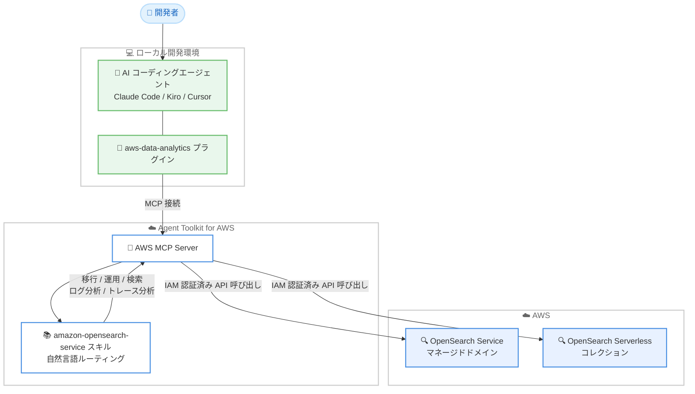

# Amazon OpenSearch Service - Agent Toolkit for AWS 対応

**リリース日**: 2026年7月15日
**サービス**: Amazon OpenSearch Service
**機能**: Agent Toolkit for AWS 連携 (amazon-opensearch-service スキル)

📊 [このアップデートのインフォグラフィックを見る](https://takech9203.github.io/aws-news-summary/20260715-amazon-opensearch-service-agent.html)
<!-- INFOGRAPHIC_BASE_URL は環境変数から取得 -->

## 概要

Amazon OpenSearch Service が Agent Toolkit for AWS と連携し、Claude Code、Kiro、Cursor といった AI コーディングエージェントから OpenSearch Service ドメインおよび OpenSearch Serverless コレクションを直接構築、管理、クエリできるようになりました。この連携は、お客様に代わって AWS API 呼び出しを実行する AWS MCP (Model Context Protocol) サーバーと、自然言語のリクエストを適切な機能へ自動的にルーティングするキュレーション済みの amazon-opensearch-service スキルによって実現されています。

このスキルは、移行 (Migration)、運用 (Operations)、検索 (Search)、ログ分析 (Log analytics)、トレース分析 (Trace analytics) の 5 つの領域をカバーします。自己管理型 OpenSearch から OpenSearch Service または Serverless への移行、ドメインとコレクションのプロビジョニングと管理、ベクトル / セマンティック / ハイブリッド / RAG 検索の構築、PPL と OpenSearch Ingestion を用いたログ分析、OpenTelemetry による分散トレースの調査までを、自然言語による指示で実行できます。

この機能はマネージドドメインとコレクションの両方、かつすべてのバージョンで動作し、既存のインフラストラクチャへの変更を必要とせず、追加料金なしで利用できます。利用を開始するには、AI コーディングエージェントに aws-data-analytics プラグインをインストールするだけです。

**アップデート前の課題**

- OpenSearch ドメインやコレクションの構築、運用、移行には OpenSearch 固有の専門知識と手作業のコンソール操作や API 呼び出しが必要だった
- AI コーディングエージェントは学習データが古く、OpenSearch Service の最新の機能や設定に関する正確なガイダンスを提供できないことがあった
- ベクトル検索や RAG、ログ分析、トレース分析など目的の異なるタスクごとに、利用すべき機能を利用者自身が判断して手順を組み立てる必要があった

**アップデート後の改善**

- Claude Code、Kiro、Cursor から自然言語で OpenSearch Service ドメインと Serverless コレクションを構築、管理、クエリできるようになった
- amazon-opensearch-service スキルが自然言語リクエストを移行、運用、検索、ログ分析、トレース分析の適切な機能へ自動的にルーティングする
- aws-data-analytics プラグインのインストールのみで導入でき、既存インフラの変更が不要で追加料金も発生しない

## アーキテクチャ図



開発者が AI コーディングエージェントへ自然言語で指示すると、aws-data-analytics プラグイン経由で AWS MCP Server に接続し、amazon-opensearch-service スキルが適切な機能を選択して、IAM 認証済みの API 呼び出しにより OpenSearch Service ドメインや Serverless コレクションの操作を実行します。

## サービスアップデートの詳細

### 主要機能

1. **移行 (Migration)**
   - 自己管理型 OpenSearch を OpenSearch Service または OpenSearch Serverless へ移行する作業を支援
   - 移行元と移行先の構成に応じたガイダンスを提供

2. **運用 (Operations)**
   - OpenSearch Service ドメインと OpenSearch Serverless コレクションのプロビジョニングと管理を実行
   - 自然言語による指示でリソースの作成や変更が可能

3. **検索 (Search)**
   - ベクトル検索、セマンティック検索、ハイブリッド検索の構築を支援
   - RAG (Retrieval-Augmented Generation) 検索の構築に対応

4. **ログ分析 (Log analytics)**
   - PPL (Piped Processing Language) を用いたログ分析を実行
   - OpenSearch Ingestion を活用したデータ取り込みを支援

5. **トレース分析 (Trace analytics)**
   - OpenTelemetry による分散トレースの調査を実行
   - トレースデータを用いた問題調査を支援

## 技術仕様

### 連携の構成要素

| 項目 | 詳細 |
|------|------|
| AWS MCP Server | Model Context Protocol を通じてエージェントに AWS へのアクセスを提供し、お客様に代わって AWS API 呼び出しを実行するサーバー |
| amazon-opensearch-service スキル | 自然言語のリクエストを移行、運用、検索、ログ分析、トレース分析の適切な機能へ自動的にルーティングするキュレーション済みスキル |
| aws-data-analytics プラグイン | AWS MCP Server の設定と OpenSearch スキルを 1 ステップでインストールできるプラグイン |
| 対応エージェント | Claude Code、Kiro、Cursor |

### 対応範囲

| 項目 | 詳細 |
|------|------|
| 対象リソース | OpenSearch Service マネージドドメイン、OpenSearch Serverless コレクション |
| 対応バージョン | すべてのバージョン |
| インフラ変更 | 不要 (既存インフラストラクチャへの変更なし) |
| 料金 | 追加料金なし |

## 設定方法

### 前提条件

1. Claude Code、Kiro、Cursor のいずれかの AI コーディングエージェントが利用可能であること
2. OpenSearch Service ドメインまたは OpenSearch Serverless コレクションを操作するための適切な IAM 権限を持つこと
3. AWS 認証情報が設定されていること

### 手順

#### ステップ1: aws-data-analytics プラグインのインストール

```text
# AI コーディングエージェントに aws-data-analytics プラグインをインストールする
```

aws-data-analytics プラグインをインストールすると、AWS MCP Server の設定と amazon-opensearch-service スキルが 1 ステップで導入されます。個別に MCP Server の設定やスキルの追加を行う必要はありません。

#### ステップ2: 自然言語でエージェントに指示する

```text
# エージェントへの指示例
自己管理型 OpenSearch を OpenSearch Serverless へ移行したい
ベクトル検索用のコレクションを構築して
```

プラグインのインストール後、コーディングエージェントに OpenSearch Service に関する指示を自然言語で入力します。amazon-opensearch-service スキルが指示を適切な機能へルーティングし、AWS MCP Server が IAM 認証済みの API 呼び出しで操作を実行します。

## メリット

### ビジネス面

- **導入の容易さ**: aws-data-analytics プラグインのインストールのみで利用を開始でき、既存インフラの変更が不要
- **コスト面の優位性**: 追加料金なしで利用でき、OpenSearch Service の標準料金のみが発生する
- **既存ツールの活用**: 開発者が使い慣れた Claude Code、Kiro、Cursor をそのまま利用でき、学習コストを抑えられる

### 技術面

- **幅広い作業のカバー**: 移行、運用、検索、ログ分析、トレース分析の 5 領域を単一のスキルでカバー
- **自動ルーティング**: 自然言語リクエストが適切な機能へ自動的にルーティングされ、利用者が手順を組み立てる必要がない
- **マネージドとサーバーレスの両対応**: マネージドドメインと Serverless コレクションの両方、かつすべてのバージョンで動作する

## デメリット・制約事項

### 制限事項

- 利用には Claude Code、Kiro、Cursor のいずれかの MCP 対応 AI コーディングエージェントが必要
- エージェントが API 呼び出しを行うには適切な IAM 権限が必要

### 考慮すべき点

- エージェントに付与する IAM 権限は最小権限の原則に従って慎重にスコープダウンする必要がある
- AI エージェントが生成する提案や操作は、本番環境へ適用する前に内容を確認することが望ましい

## ユースケース

### ユースケース1: 自己管理型 OpenSearch の移行

**シナリオ**: 自社で運用している自己管理型 OpenSearch を、運用負荷の低い OpenSearch Serverless へ移行したい

**実装例**:
```text
自己管理型 OpenSearch を OpenSearch Serverless へ移行して
```

**効果**: amazon-opensearch-service スキルが移行機能へルーティングし、移行元と移行先の構成に応じた手順で移行作業を支援する

### ユースケース2: ベクトル / RAG 検索の構築

**シナリオ**: 生成 AI アプリケーション向けに、ベクトル検索や RAG 検索の基盤を素早く構築したい

**実装例**:
```text
RAG 用のベクトル検索コレクションを構築して
```

**効果**: 検索機能へ自動的にルーティングされ、ベクトル、セマンティック、ハイブリッド、RAG 検索の構成を支援することで、検索基盤の構築を加速できる

### ユースケース3: ログとトレースの分析

**シナリオ**: アプリケーションのログと分散トレースを分析し、問題の原因を調査したい

**実装例**:
```text
PPL でエラーログを分析して、OpenTelemetry のトレースから遅延の原因を調べて
```

**効果**: ログ分析機能とトレース分析機能へルーティングされ、PPL や OpenTelemetry を用いた分析を通じて問題の原因究明を支援する

## 料金

Agent Toolkit for AWS を通じた Amazon OpenSearch Service との連携は、追加料金なしで利用できます。お客様はエージェントがプロビジョニングまたは操作した OpenSearch Service ドメインおよび OpenSearch Serverless コレクションに対して、標準の AWS 料金のみを支払います。

### 料金例

| 使用量 | 月額料金（概算） |
|--------|------------------|
| amazon-opensearch-service スキルおよび Agent Toolkit for AWS の利用 | 追加料金なし |
| OpenSearch Service / OpenSearch Serverless | 標準の OpenSearch 料金が適用 |

## 利用可能リージョン

Amazon OpenSearch Service および OpenSearch Serverless が提供されているすべての AWS リージョンで利用できます。

## 関連サービス・機能

- **Agent Toolkit for AWS**: AI コーディングエージェントに AWS 上でのアプリケーション構築、管理、クエリのためのツールと知識を提供する基盤
- **AWS MCP Server**: Model Context Protocol を通じてエージェントに AWS へのアクセスを提供し、お客様に代わって API 呼び出しを実行するサーバー
- **Amazon OpenSearch Serverless**: プロビジョニング不要でスケールする OpenSearch のサーバーレスオプション。本連携でコレクションの構築と管理に対応
- **Kiro**: AWS が提供する AI 搭載 IDE。本連携の対応エージェントの 1 つ

## 参考リンク

- 📊 [インフォグラフィック](https://takech9203.github.io/aws-news-summary/20260715-amazon-opensearch-service-agent.html)
- [公式発表 (What's New)](https://aws.amazon.com/about-aws/whats-new/2026/07/amazon-opensearch-service-agent/)
- [Agent Toolkit for AWS とは](https://docs.aws.amazon.com/agent-toolkit/latest/userguide/what-is-agent-toolkit.html)
- [Amazon OpenSearch Service](https://aws.amazon.com/opensearch-service/)
- [Amazon OpenSearch Serverless](https://aws.amazon.com/opensearch-service/features/serverless/)

## まとめ

Amazon OpenSearch Service の Agent Toolkit for AWS 対応は、移行、運用、検索、ログ分析、トレース分析といった幅広い作業を Claude Code、Kiro、Cursor から自然言語で実行できるようにする重要なアップデートです。追加料金なしかつ既存インフラの変更も不要なため、まずは aws-data-analytics プラグインをインストールし、実際に OpenSearch Service や Serverless コレクションに関する指示を試してみることを推奨します。
