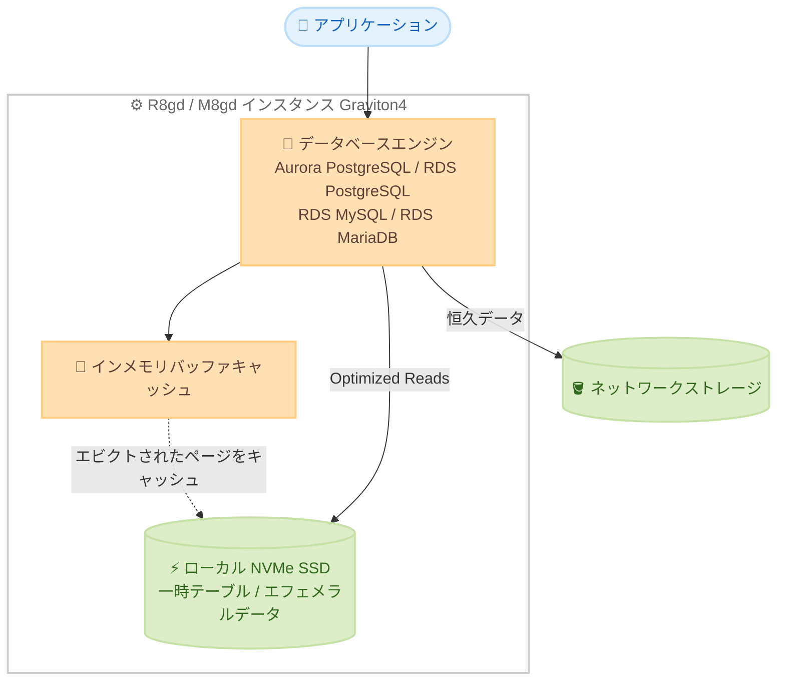

# Amazon RDS / Aurora - R8gd および M8gd データベースインスタンスの対応リージョン拡大

**リリース日**: 2026 年 7 月 15 日
**サービス**: Amazon RDS, Amazon Aurora
**機能**: R8gd および M8gd データベースインスタンス (Optimized Reads 対応) の対応リージョン拡大

📊 [このアップデートのインフォグラフィックを見る](https://takech9203.github.io/aws-news-summary/20260715-amazon-rds-aurora-r8gd-m8gd-regions.html)
<!-- INFOGRAPHIC_BASE_URL は環境変数から取得 -->

## 概要

Amazon RDS および Amazon Aurora は、AWS Graviton4 ベースの R8gd データベースインスタンスを新たに 12 リージョンで、M8gd データベースインスタンスを新たに 6 リージョンで利用可能にしました。これらのインスタンスは、Amazon Aurora PostgreSQL、RDS for PostgreSQL、RDS for MySQL、RDS for MariaDB において Optimized Reads に対応しています。

R8gd および M8gd インスタンスは、ローカル NVMe ベースの SSD ブロックストレージを搭載した Graviton4 世代のインスタンスです。Aurora PostgreSQL において、R6g インスタンスと比較して最大 165% 高いスループットと最大 120% 優れた価格性能比を実現します。Optimized Reads は、一時テーブルなどのエフェメラルデータをローカルストレージに格納することで、ネットワークストレージへのアクセスを削減し、クエリレイテンシーを改善します。

今回のリージョン拡大により、より多くのリージョンのお客様が、高性能かつコスト効率の高いデータベースインスタンスを、データ所在地要件やレイテンシー要件に合わせて利用できるようになりました。特に複雑なクエリやインデックス再構築を多用するワークロードにおいて効果を発揮します。

**アップデート前の課題**

このアップデート以前は、以下の制約がありました。

- R8gd および M8gd インスタンスの利用可能リージョンが限定されており、多くのリージョンのお客様は最新の Graviton4 世代インスタンスと Optimized Reads の恩恵を受けられなかった
- 対象外リージョンでは、一時テーブルなどのエフェメラルデータがネットワークストレージ経由でアクセスされ、複雑なクエリのレイテンシーが高くなる場合があった
- データ所在地要件により特定リージョンでの稼働が求められるワークロードでは、旧世代インスタンスを選択せざるを得なかった

**アップデート後の改善**

今回のアップデートにより、以下が可能になりました。

- R8gd インスタンスを追加 12 リージョン、M8gd インスタンスを追加 6 リージョンで利用可能になった
- より多くのリージョンで、ローカル NVMe SSD による Optimized Reads を活用したクエリレイテンシーの改善が可能になった
- R6g 世代と比較して最大 165% のスループット向上と最大 120% の価格性能比改善を、対応リージョンを広げて享受できるようになった

## アーキテクチャ図



Optimized Reads は、一時テーブルなどのエフェメラルデータやバッファキャッシュからエビクトされたページをローカル NVMe SSD にキャッシュすることで、ネットワークストレージへのアクセスを削減し、クエリレイテンシーを改善します。

## サービスアップデートの詳細

### 主要機能

1. **R8gd インスタンスの追加リージョン対応 (12 リージョン)**
   - AWS Graviton4 プロセッサとローカル NVMe SSD ストレージを搭載したメモリ最適化インスタンス
   - Aurora PostgreSQL で R6g 比 最大 165% のスループット向上、最大 120% の価格性能比改善
   - Optimized Reads によりクエリレイテンシーとインデックス再構築を高速化

2. **M8gd インスタンスの追加リージョン対応 (6 リージョン)**
   - AWS Graviton4 プロセッサとローカル NVMe SSD ストレージを搭載した汎用インスタンス
   - メモリと vCPU のバランスが求められるワークロードに適合
   - R8gd と同様に Optimized Reads に対応

3. **Optimized Reads による性能向上**
   - 一時テーブルなどのエフェメラルデータをローカル NVMe SSD に格納
   - ネットワークストレージへのアクセスを削減し、複雑なクエリのレイテンシーを改善
   - Aurora PostgreSQL の I/O-Optimized 構成では、バッファキャッシュからエビクトされたデータベースページをローカルストレージにキャッシュし、キャッシュ容量を拡張

## 技術仕様

### インスタンスと対応エンジン

| 項目 | 詳細 |
|------|------|
| インスタンスファミリー | R8gd (メモリ最適化), M8gd (汎用) |
| プロセッサ | AWS Graviton4 |
| ローカルストレージ | NVMe ベース SSD ブロックストレージ |
| 対応エンジン | Amazon Aurora PostgreSQL, RDS for PostgreSQL, RDS for MySQL, RDS for MariaDB |
| 性能 (Aurora PostgreSQL) | R6g 比 最大 165% スループット向上、最大 120% 価格性能比改善 |
| 主要機能 | Optimized Reads |

### API 変更履歴

今回のアップデートはインスタンスタイプの対応リージョン拡大であり、新規 API メソッドの追加はありません。既存の `ModifyDBInstance` および `CreateDBInstance` API でインスタンスクラスを指定して利用できます。

## 設定方法

### 前提条件

1. 対象リージョンで Amazon RDS または Amazon Aurora を利用可能であること
2. 対応エンジン (Aurora PostgreSQL, RDS for PostgreSQL, RDS for MySQL, RDS for MariaDB) の対応バージョンを使用していること
3. AWS Management Console、AWS CLI、または SDK にアクセスできること

### 手順

#### ステップ 1: 新規インスタンスの作成

```bash
aws rds create-db-instance \
  --db-instance-identifier my-db-instance \
  --db-instance-class db.r8gd.2xlarge \
  --engine postgres \
  --allocated-storage 100 \
  --master-username admin \
  --master-user-password <password>
```

対応リージョンで R8gd インスタンスクラスを指定して、新しい RDS データベースインスタンスを作成します。

#### ステップ 2: 既存インスタンスの変更

```bash
aws rds modify-db-instance \
  --db-instance-identifier my-db-instance \
  --db-instance-class db.m8gd.2xlarge \
  --apply-immediately
```

既存のデータベースインスタンスのインスタンスクラスを M8gd に変更します。`--apply-immediately` を指定すると即時に、指定しない場合は次回のメンテナンスウィンドウで適用されます。

## メリット

### ビジネス面

- **コスト効率の向上**: Aurora PostgreSQL で R6g 比 最大 120% の価格性能比改善により、同一予算でより高い処理能力を実現
- **対応リージョンの拡大**: データ所在地やレイテンシー要件を満たしつつ最新世代インスタンスを選択可能
- **移行の容易さ**: 既存インスタンスのインスタンスクラス変更のみで導入可能

### 技術面

- **スループット向上**: R6g 比 最大 165% のスループット向上により、高負荷ワークロードに対応
- **クエリレイテンシーの改善**: Optimized Reads によりエフェメラルデータをローカル NVMe SSD に格納し、複雑なクエリを高速化
- **キャッシュ容量の拡張**: Aurora PostgreSQL の I/O-Optimized 構成でローカルストレージをキャッシュとして活用

## デメリット・制約事項

### 制限事項

- Optimized Reads の対応エンジンは Aurora PostgreSQL, RDS for PostgreSQL, RDS for MySQL, RDS for MariaDB に限定される
- ローカル NVMe SSD 上のデータはエフェメラル (一時的) であり、永続化には利用できない
- エンジンバージョンによっては対応していない場合があるため、事前確認が必要

### 考慮すべき点

- インスタンスクラスの変更時にはダウンタイムや再起動が発生する場合があるため、メンテナンスウィンドウを考慮する
- 性能向上の効果はワークロード特性 (一時テーブルの利用頻度、クエリの複雑さなど) に依存する
- 各リージョンおよびエンジンバージョンでの提供状況は料金ページとドキュメントで確認する

## ユースケース

### ユースケース 1: 複雑な分析クエリの高速化

**シナリオ**: 大量の一時テーブルを生成する分析クエリを実行する PostgreSQL ワークロードで、クエリレイテンシーが課題となっている。

**効果**: Optimized Reads により一時テーブルがローカル NVMe SSD に格納され、ネットワークストレージへのアクセスが削減されてクエリレイテンシーが改善する。

### ユースケース 2: コスト最適化を伴う性能向上

**シナリオ**: R6g インスタンスで稼働する Aurora PostgreSQL クラスターのコストと性能の両立を図りたい。

**効果**: R8gd への移行により最大 165% のスループット向上と最大 120% の価格性能比改善を実現し、同一予算でより高い処理能力を得られる。

### ユースケース 3: データ所在地要件を満たすワークロード

**シナリオ**: 欧州 (アイルランド、ロンドン) や南米 (サンパウロ) など特定リージョンでのデータ保持が求められるワークロードで、最新世代インスタンスを利用したい。

**効果**: 今回のリージョン拡大により、対象リージョンで R8gd / M8gd インスタンスを選択でき、要件を満たしつつ性能を向上できる。

## 料金

R8gd および M8gd インスタンスの料金は、インスタンスタイプ、リージョン、エンジン、および課金モデル (オンデマンド / リザーブドインスタンス) により異なります。ローカル NVMe SSD ストレージはインスタンス料金に含まれます。正確な料金は Amazon RDS および Amazon Aurora の料金ページを参照してください。

## 利用可能リージョン

今回追加されたリージョンは以下のとおりです。

**R8gd 追加リージョン (12 リージョン)**: 欧州 (アイルランド)、アジアパシフィック (ソウル、マレーシア、シドニー、ジャカルタ、香港)、欧州 (ロンドン)、米国西部 (北カリフォルニア)、カナダ (中部)、アフリカ (ケープタウン)、カナダ西部 (カルガリー)、南米 (サンパウロ)

**M8gd 追加リージョン (6 リージョン)**: 欧州 (アイルランド)、アジアパシフィック (マレーシア、シドニー)、欧州 (ロンドン)、南米 (サンパウロ)、カナダ (中部)

## 関連サービス・機能

- **AWS Graviton4**: R8gd / M8gd インスタンスを支える最新世代の AWS プロセッサ
- **Amazon Aurora Optimized Reads**: ローカル NVMe SSD を活用してクエリ性能を向上させる機能
- **Amazon RDS Optimized Reads**: RDS for PostgreSQL / MySQL / MariaDB でローカルストレージを活用する機能

## 参考リンク

- 📊 [インフォグラフィック](https://takech9203.github.io/aws-news-summary/20260715-amazon-rds-aurora-r8gd-m8gd-regions.html)
- [公式発表 (What's New)](https://aws.amazon.com/about-aws/whats-new/2026/07/amazon-rds-aurora-r8gd-m8gd-regions/)
- [Amazon RDS 料金ページ](https://aws.amazon.com/rds/pricing/)
- [Amazon Aurora 料金ページ](https://aws.amazon.com/rds/aurora/pricing/)

## まとめ

今回のアップデートにより、Graviton4 ベースの R8gd および M8gd データベースインスタンスがより多くのリージョンで利用可能になり、Optimized Reads による性能向上とコスト効率の恩恵を広範なお客様が享受できるようになりました。対応リージョンで RDS / Aurora を運用している場合は、対象エンジンのワークロードについてインスタンスクラスの移行を検討し、価格性能比とクエリレイテンシーの改善効果を評価することをお勧めします。
