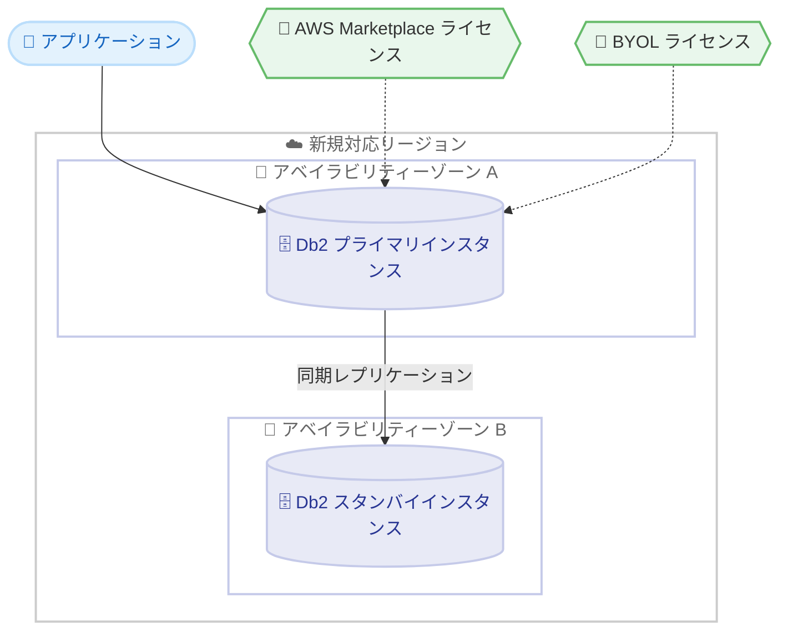

# Amazon RDS for Db2 - 追加の AWS 商用リージョンで利用可能に

**リリース日**: 2026年7月15日
**サービス**: Amazon Relational Database Service (Amazon RDS)
**機能**: Amazon RDS for Db2 の追加リージョン展開

📊 [このアップデートのインフォグラフィックを見る](https://takech9203.github.io/aws-news-summary/20260715-amazon-rds-db2-available-additional-aws-commercial-regions.html)
<!-- INFOGRAPHIC_BASE_URL は環境変数から取得 -->

## 概要

Amazon RDS for Db2 が、新たに 5 つの AWS 商用リージョンで利用可能になりました。今回追加されたリージョンは、アジアパシフィック (タイ)、アジアパシフィック (マレーシア)、アジアパシフィック (台北)、メキシコ (中部)、カナダ西部 (カルガリー) です。

Amazon RDS for Db2 は、クラウド上での Db2 データベースのセットアップ、運用、スケーリングを容易にするマネージドサービスです。お客様は、パフォーマンスを最適化するために自動構成されたパラメーターを使用して、数分で Db2 データベースをデプロイできます。マルチ AZ 構成では、Amazon RDS が別のアベイラビリティーゾーンにあるスタンバイインスタンスへの同期レプリケーションを実行し、高可用性を提供します。

ライセンスについては、AWS Marketplace から Db2 ライセンスを購入して時間単位の従量課金で利用する方法と、Bring Your Own License (BYOL) を利用する方法の 2 通りがあります。いずれの方式も Standard Edition と Advanced Edition で利用可能です。また、開発およびテスト用途向けに、商用ソフトウェアのライセンス料金が不要な最新の Db2 Community Edition も利用できます。

**アップデート前の課題**

これまで、上記の新規リージョンでは Amazon RDS for Db2 を利用できませんでした。

- 対象リージョン内では、Db2 データベースをマネージドサービスとして運用できなかった
- データレジデンシー要件のあるお客様が、地理的に近いリージョンでマネージド Db2 を利用できなかった
- 対象地域のお客様は、より遠方のリージョンを利用することでレイテンシーやコンプライアンス上の制約を受けていた

**アップデート後の改善**

今回のアップデートにより、対象の 5 リージョンでも Amazon RDS for Db2 を利用できるようになりました。

- アジアパシフィック (タイ、マレーシア、台北)、メキシコ (中部)、カナダ西部 (カルガリー) でマネージド Db2 が利用可能になった
- データレジデンシーやコンプライアンス要件に対応しつつ、地理的に近いリージョンで Db2 を運用できるようになった
- 対象地域のお客様がより低レイテンシーで Db2 データベースにアクセスできるようになった

## アーキテクチャ図



マルチ AZ 構成では、プライマリインスタンスからスタンバイインスタンスへ同期レプリケーションが行われ、ライセンスは AWS Marketplace または BYOL のいずれかで提供されます。

## サービスアップデートの詳細

### 主要機能

1. **追加リージョンでの提供**
   - アジアパシフィック (タイ)、アジアパシフィック (マレーシア)、アジアパシフィック (台北) で利用可能
   - メキシコ (中部)、カナダ西部 (カルガリー) で利用可能
   - 対象地域のデータレジデンシーおよびコンプライアンス要件に対応

2. **マネージドな Db2 データベース運用**
   - 自動構成されたパラメーターにより数分でデータベースをデプロイ
   - セットアップ、運用、スケーリングをマネージドサービスとして提供
   - マルチ AZ 構成による同期レプリケーションと高可用性

3. **柔軟なライセンスオプション**
   - AWS Marketplace での時間単位の従量課金 (pay-as-you-go)
   - Bring Your Own License (BYOL) による既存ライセンスの持ち込み
   - Standard Edition と Advanced Edition の両方に対応
   - 開発およびテスト向けの Db2 Community Edition (商用ライセンス料金不要)

## 技術仕様

### エディションとライセンス

| 項目 | 詳細 |
|------|------|
| 対応エディション | Standard Edition、Advanced Edition |
| ライセンス方式 | AWS Marketplace (時間単位従量課金)、BYOL |
| Community Edition | 開発・テスト用途向け、商用ライセンス料金不要 |
| 高可用性 | マルチ AZ 構成での同期レプリケーション |

### 今回追加されたリージョン

| リージョン名 | リージョンコード |
|------|------|
| アジアパシフィック (タイ) | ap-southeast-7 |
| アジアパシフィック (マレーシア) | ap-southeast-5 |
| アジアパシフィック (台北) | ap-east-2 |
| メキシコ (中部) | mx-central-1 |
| カナダ西部 (カルガリー) | ca-west-1 |

## 設定方法

### 前提条件

1. 対象リージョンにアクセス可能な AWS アカウント
2. Db2 ライセンス (AWS Marketplace で購入、または BYOL 用の既存ライセンス)
3. データベースを配置する VPC およびサブネットの準備

### 手順

#### ステップ1: リージョンの選択と DB インスタンスの作成

```bash
aws rds create-db-instance \
  --db-instance-identifier my-db2-instance \
  --db-instance-class db.m6i.large \
  --engine db2-se \
  --allocated-storage 100 \
  --master-username admin \
  --master-user-password <password> \
  --region ap-southeast-7
```

新規対応リージョン (例: アジアパシフィック (タイ)) を指定して Amazon RDS for Db2 インスタンスを作成します。`--engine` には Standard Edition (db2-se) または Advanced Edition (db2-ae) を指定します。

#### ステップ2: マルチ AZ 構成の有効化

```bash
aws rds modify-db-instance \
  --db-instance-identifier my-db2-instance \
  --multi-az \
  --apply-immediately \
  --region ap-southeast-7
```

マルチ AZ を有効化し、別のアベイラビリティーゾーンへの同期レプリケーションによる高可用性を構成します。

#### ステップ3: 接続確認

作成した DB インスタンスのエンドポイントに接続し、アプリケーションからの疎通を確認します。ライセンスは AWS Marketplace で購入したものが自動的に適用されるか、BYOL の場合は事前に登録したライセンスが使用されます。

## メリット

### ビジネス面

- **データレジデンシー対応**: 対象地域内でデータを保持しつつマネージド Db2 を利用できる
- **コスト最適化**: 時間単位の従量課金または既存ライセンスの活用 (BYOL) を選択できる
- **市場拡大**: 東南アジアや北米・中南米の各地域でのサービス展開を支援

### 技術面

- **低レイテンシー**: 地理的に近いリージョンでの運用によりレイテンシーを削減
- **高可用性**: マルチ AZ 構成による同期レプリケーションで障害時の可用性を確保
- **運用負荷軽減**: パラメーター自動構成とマネージドサービスにより運用工数を削減

## デメリット・制約事項

### 制限事項

- 今回のアップデートはリージョン展開であり、機能自体の変更は含まれていない
- 各リージョンで利用可能なインスタンスタイプや機能に差異がある場合がある
- Community Edition は開発・テスト用途向けであり、本番環境での利用は想定されていない

### 考慮すべき点

- 利用前に対象リージョンで必要なインスタンスタイプが提供されているか確認する
- ライセンス方式 (Marketplace / BYOL) は要件とコストに応じて選択する
- マルチ AZ 構成はコストが増加するため、可用性要件とのバランスを検討する

## ユースケース

### ユースケース1: 東南アジア地域でのデータレジデンシー対応

**シナリオ**: タイやマレーシアで事業を展開する企業が、規制上データを国内リージョンに保持する必要がある場合。

**効果**: アジアパシフィック (タイ) やアジアパシフィック (マレーシア) で Amazon RDS for Db2 を運用することで、データレジデンシー要件を満たしつつマネージドサービスの利点を享受できます。

### ユースケース2: 既存 Db2 ワークロードのクラウド移行

**シナリオ**: オンプレミスで Db2 を運用している企業が、既存ライセンスを活用しつつクラウドへ移行したい場合。

**効果**: BYOL を利用することで既存ライセンス投資を無駄にせず、対象リージョンでマネージド Db2 に移行でき、運用負荷を軽減できます。

### ユースケース3: 開発・テスト環境の迅速な構築

**シナリオ**: 開発チームが Db2 アプリケーションの検証環境を素早く用意したい場合。

**効果**: Db2 Community Edition を利用することで、商用ライセンス料金を負担することなく、対象リージョンで開発・テスト環境を迅速に構築できます。

## 料金

Amazon RDS for Db2 の料金は、DB インスタンスの利用時間、ストレージ、データ転送量などに基づきます。ライセンス費用は、AWS Marketplace を利用する場合は時間単位の従量課金として RDS の利用料金に含まれ、BYOL の場合は別途お客様が保有するライセンスを使用します。Db2 Community Edition は商用ソフトウェアのライセンス料金がかかりません。詳細な料金は Amazon RDS for Db2 の料金ページを参照してください。

## 利用可能リージョン

今回のアップデートにより、以下の 5 リージョンが新たに追加されました。

- アジアパシフィック (タイ)
- アジアパシフィック (マレーシア)
- アジアパシフィック (台北)
- メキシコ (中部)
- カナダ西部 (カルガリー)

これらに加えて、Amazon RDS for Db2 は既存の多数の AWS リージョンでも引き続き利用可能です。

## 関連サービス・機能

- **Amazon RDS**: Amazon RDS for Db2 の基盤となるマネージドリレーショナルデータベースサービス
- **AWS Marketplace**: 時間単位の従量課金で Db2 ライセンスを購入できるマーケットプレイス
- **AWS Directory Service**: Db2 の認証で利用できるディレクトリサービス (セルフマネージド Active Directory 連携などに対応)

## 参考リンク

- 📊 [インフォグラフィック](https://takech9203.github.io/aws-news-summary/20260715-amazon-rds-db2-available-additional-aws-commercial-regions.html)
- [公式発表 (What's New)](https://aws.amazon.com/about-aws/whats-new/2026/07/amazon-rds-db2-available-additional-aws-commercial-regions)
- [ドキュメント](https://docs.aws.amazon.com/AmazonRDS/latest/UserGuide/CHAP_Db2.html)
- [料金ページ](https://aws.amazon.com/rds/db2/pricing/)

## まとめ

今回のアップデートにより、Amazon RDS for Db2 がアジアパシフィック (タイ、マレーシア、台北)、メキシコ (中部)、カナダ西部 (カルガリー) の 5 リージョンで新たに利用可能になりました。これにより、対象地域のお客様はデータレジデンシー要件に対応しつつ、低レイテンシーでマネージド Db2 を運用できます。対象リージョンでの Db2 ワークロードを検討している場合は、ライセンス方式やマルチ AZ 構成を含めた利用計画を進めることが推奨されます。
