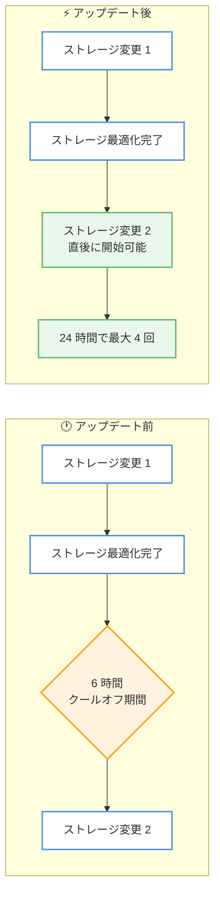

# Amazon RDS - 24 時間以内に最大 4 回のストレージ変更をサポート

**リリース日**: 2026年7月15日
**サービス**: Amazon Relational Database Service (Amazon RDS)
**機能**: 24 時間のローリングウィンドウ内で最大 4 回のストレージ変更

📊 [このアップデートのインフォグラフィックを見る](https://takech9203.github.io/aws-news-summary/20260715-amazon-rds-upto-four-storage-modifications-24-hours.html)
<!-- INFOGRAPHIC_BASE_URL は環境変数から取得 -->

## 概要

Amazon RDS は、データベースインスタンスごとに 24 時間のローリングウィンドウ内で最大 4 回のストレージ変更を実行できるようになりました。ストレージ変更では、ストレージボリュームのサイズの拡張、タイプの変更、パフォーマンスの調整が可能です。これにより、突発的なデータ増加や予期しないワークロードの急増が発生した場合でも、ストレージ容量のスケーリングやパフォーマンスの調整を柔軟に行えます。

これまでは、あるストレージ変更が完了した後、次の変更を開始するまでに 6 時間のクールオフ期間を待つ必要がありました。今回のアップデートにより、前回の変更に対するストレージ最適化が完了した直後に、6 時間のクールオフ期間を待たずに新しい変更を開始できるようになりました。ボリュームの変更はダウンタイムなしで実行され、アプリケーションを稼働させたまま最小限のパフォーマンス影響で対応できます。

この機能は、Amazon RDS for PostgreSQL、MariaDB、MySQL、Db2、Oracle、Microsoft SQL Server のすべてのインスタンスで、すべての商用 AWS リージョンおよび AWS GovCloud (US) リージョンにおいて自動的に有効化されます。

**アップデート前の課題**

- ストレージ変更が完了した後、次の変更を開始するまでに 6 時間のクールオフ期間を待つ必要があった
- 突発的なデータ増加やワークロードの急増に対して、短時間で複数回のストレージ調整を行うことが困難だった
- 運用の柔軟性が制限され、緊急時のスケーリング対応に時間を要していた

**アップデート後の改善**

- 24 時間のローリングウィンドウ内で最大 4 回のストレージ変更が可能になった
- 前回の変更に対するストレージ最適化が完了した直後に、次の変更を開始できるようになった
- 6 時間のクールオフ期間の待機が不要になり、運用の俊敏性が向上した

## アーキテクチャ図



アップデート前は各ストレージ変更後に 6 時間のクールオフ期間が必要でしたが、アップデート後は最適化完了直後に次の変更を開始でき、24 時間で最大 4 回まで実行できます。

## サービスアップデートの詳細

### 主要機能

1. **24 時間で最大 4 回のストレージ変更**
   - データベースインスタンスごとに 24 時間のローリングウィンドウ内で最大 4 回のストレージ変更が可能
   - ストレージサイズの拡張、ストレージタイプの変更、パフォーマンス (IOPS/スループット) の調整に対応
   - ローリングウィンドウ方式のため、直近 24 時間の変更回数がカウントされる

2. **6 時間クールオフ期間の撤廃**
   - 前回の変更に対するストレージ最適化が完了した直後に、次の変更を開始できる
   - 従来必要だった 6 時間の待機が不要になり、緊急時の対応が迅速化される

3. **ダウンタイムなしのボリューム変更**
   - ストレージ変更はダウンタイムなしで実行される
   - アプリケーションを稼働させたまま、最小限のパフォーマンス影響で対応可能

## 技術仕様

### ストレージ変更の仕様

| 項目 | 詳細 |
|------|------|
| 最大変更回数 | 24 時間のローリングウィンドウ内で最大 4 回 |
| クールオフ期間 | 撤廃 (ストレージ最適化完了後すぐに次の変更が可能) |
| 変更可能な内容 | サイズの拡張、ストレージタイプの変更、パフォーマンスの調整 |
| ダウンタイム | なし |
| 対応エンジン | PostgreSQL、MariaDB、MySQL、Db2、Oracle、SQL Server |
| 有効化 | すべての対象インスタンスで自動的に有効 |

### ストレージ最適化について

ストレージ変更を適用すると、RDS は変更を反映するためにストレージ最適化を実行します。この最適化が完了するまでは次の変更を開始できませんが、完了後は従来のような追加の待機期間なしに次の変更を実行できます。

## 設定方法

### 前提条件

1. 対象の Amazon RDS DB インスタンスが稼働していること
2. 対応するデータベースエンジン (PostgreSQL、MariaDB、MySQL、Db2、Oracle、SQL Server) を使用していること
3. ストレージ変更を実行するための IAM 権限 (`rds:ModifyDBInstance`) を保有していること

### 手順

#### ステップ1: 現在のストレージ設定を確認する

```bash
aws rds describe-db-instances \
    --db-instance-identifier my-database \
    --query 'DBInstances[0].{Storage:AllocatedStorage,Type:StorageType,Iops:Iops}'
```

対象インスタンスの現在のストレージサイズ、ストレージタイプ、IOPS を確認します。

#### ステップ2: ストレージ変更を適用する

```bash
aws rds modify-db-instance \
    --db-instance-identifier my-database \
    --allocated-storage 500 \
    --storage-type gp3 \
    --apply-immediately
```

ストレージサイズを 500 GiB に拡張し、ストレージタイプを gp3 に変更します。`--apply-immediately` を指定すると即座に変更が適用されます。

#### ステップ3: ストレージ最適化の完了を確認して次の変更を実行する

```bash
aws rds describe-db-instances \
    --db-instance-identifier my-database \
    --query 'DBInstances[0].StatusInfos'
```

ストレージのステータスを確認し、最適化が完了 (ステータスが `storage-optimization` から `available` に戻る) したら、6 時間待たずに次の変更を開始できます。24 時間以内であれば合計 4 回まで変更を実行できます。

## メリット

### ビジネス面

- **運用の俊敏性向上**: 突発的なデータ増加やワークロードの急増に対して、待機時間なく迅速に対応できる
- **サービス継続性の確保**: ダウンタイムなしでストレージを調整でき、ビジネスへの影響を最小化できる
- **緊急対応力の強化**: 短時間で複数回のストレージ調整が可能になり、予期しない負荷にも柔軟に対応できる

### 技術面

- **スケーリングの柔軟性**: サイズ、タイプ、パフォーマンスを 24 時間で最大 4 回調整可能
- **クールオフ期間の排除**: 従来の 6 時間待機が不要になり、変更サイクルが短縮される
- **追加設定不要**: すべての対象インスタンスで自動的に有効化されるため、設定変更が不要

## デメリット・制約事項

### 制限事項

- ストレージ変更は 24 時間のローリングウィンドウ内で最大 4 回に制限される
- 前回の変更に対するストレージ最適化が完了するまで、次の変更は開始できない
- ストレージサイズは拡張のみ可能で、縮小はできない (従来からの RDS の仕様)

### 考慮すべき点

- ストレージ最適化中はパフォーマンスに影響が生じる可能性があるため、繁忙時間帯の変更には注意が必要
- 頻繁なストレージ変更を行う場合でも、24 時間で 4 回という上限を考慮した計画が必要
- ストレージ容量の増加に伴い、ストレージコストが増加する

## ユースケース

### ユースケース1: 突発的なデータ増加への対応

**シナリオ**: 大規模なキャンペーンにより想定を超えるデータが短時間で蓄積され、ストレージ容量が逼迫した状況。

**実装例**:
```bash
# 1 回目: ストレージサイズを緊急拡張
aws rds modify-db-instance \
    --db-instance-identifier campaign-db \
    --allocated-storage 1000 \
    --apply-immediately
```

**効果**: 最適化完了後すぐに追加の拡張やパフォーマンス調整を行えるため、データ増加に段階的かつ迅速に対応できます。

### ユースケース2: ワークロード急増時のパフォーマンス調整

**シナリオ**: 予期しないトラフィック増加により、ストレージの IOPS が不足しレスポンスが低下した状況。

**実装例**:
```bash
# IOPS とスループットを引き上げてパフォーマンスを強化
aws rds modify-db-instance \
    --db-instance-identifier api-db \
    --iops 12000 \
    --storage-throughput 500 \
    --apply-immediately
```

**効果**: ダウンタイムなしでパフォーマンスを引き上げ、負荷が落ち着いた後に再調整することも可能です。

### ユースケース3: 段階的なストレージタイプ移行

**シナリオ**: コスト最適化のため gp2 から gp3 へ移行し、その後にサイズとパフォーマンスを微調整したい状況。

**実装例**:
```bash
# ストレージタイプを gp3 へ変更
aws rds modify-db-instance \
    --db-instance-identifier prod-db \
    --storage-type gp3 \
    --apply-immediately
```

**効果**: タイプ変更後の最適化完了を待って、6 時間のクールオフなしにサイズやパフォーマンスの調整を続けて実施できます。

## 料金

本機能自体の追加料金はありません。ストレージ変更に関する料金は、変更後のストレージタイプ、割り当てストレージサイズ、プロビジョニングした IOPS およびスループットに基づいて、通常の Amazon RDS ストレージ料金が適用されます。詳細は料金ページを参照してください。

## 利用可能リージョン

すべての商用 AWS リージョンおよび AWS GovCloud (US) リージョンで、対象のすべての Amazon RDS インスタンスに対して自動的に有効化されます。東京リージョンを含むすべての商用リージョンで利用可能です。

## 関連サービス・機能

- **Amazon RDS ストレージ自動スケーリング**: ストレージ使用量に応じて自動的に容量を拡張する機能。本アップデートと組み合わせることで柔軟な容量管理が可能
- **General Purpose SSD (gp3)**: サイズと独立して IOPS およびスループットを設定できるストレージタイプ
- **Provisioned IOPS SSD (io2)**: 高い I/O パフォーマンスを要求するワークロード向けのストレージタイプ

## 参考リンク

- 📊 [インフォグラフィック](https://takech9203.github.io/aws-news-summary/20260715-amazon-rds-upto-four-storage-modifications-24-hours.html)
- [公式発表 (What's New)](https://aws.amazon.com/about-aws/whats-new/2026/07/amazon-rds-upto-four-storage-modifications-24-hours)
- [ドキュメント (Working with storage for Amazon RDS DB instances)](https://docs.aws.amazon.com/AmazonRDS/latest/UserGuide/USER_PIOPS.StorageTypes.html)
- [料金ページ (Amazon RDS Pricing)](https://aws.amazon.com/rds/pricing/)

## まとめ

今回のアップデートにより、Amazon RDS では 24 時間で最大 4 回のストレージ変更が可能になり、従来の 6 時間クールオフ期間が撤廃されました。突発的なデータ増加やワークロード急増時に、ダウンタイムなしで迅速にストレージのスケーリングやパフォーマンス調整を行えます。追加設定なしで全対象インスタンスに自動適用されるため、運用チームは緊急時のストレージ管理計画を見直し、この柔軟性を活用することを推奨します。
