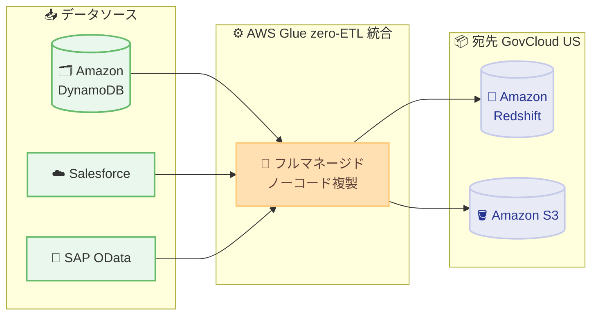

# AWS Glue - SAP OData コネクタと zero-ETL 統合の GovCloud (US) 対応

**リリース日**: 2026 年 7 月 15 日
**サービス**: AWS Glue
**機能**: SAP OData コネクタおよび zero-ETL 統合 (AWS GovCloud (US) リージョン)

📊 [このアップデートのインフォグラフィックを見る](https://takech9203.github.io/aws-news-summary/20260715-aws-glue-sap-zero-etl-govcloud.html)
<!-- INFOGRAPHIC_BASE_URL は環境変数から取得 -->

## 概要

AWS Glue の SAP OData コネクタと zero-ETL 統合が、AWS GovCloud (US-West) および AWS GovCloud (US-East) の両リージョンで利用可能になりました。これにより、規制環境で稼働する政府機関やその関連組織においても、フルマネージドなデータ統合機能を活用できます。

zero-ETL 統合では、データソースとして Amazon DynamoDB、Salesforce、SAP OData をサポートします。これらのソースから、Amazon Redshift、Amazon S3、およびその他のサポート対象の宛先へ、カスタムパイプラインを構築することなくデータを複製できます。ノーコードのインターフェイスを通じて設定でき、データレイクやデータウェアハウスへの継続的なデータ複製をフルマネージドで実現します。

特に SAP OData コネクタは、OData サービスを公開している SAP システムからデータを抽出する際に、カスタムの抽出ロジックやサードパーティのミドルウェアを不要にします。これにより、データサイロを解消し、分析基盤へのデータ集約を加速することで、運用効率の向上とインサイトの獲得を支援します。

**アップデート前の課題**

これまで AWS GovCloud (US) リージョンでは、これらのデータ統合機能を直接利用できませんでした。

- 以前は GovCloud (US) 環境で SAP、DynamoDB、Salesforce のデータを分析基盤に取り込むために、カスタムの ETL パイプラインを設計・構築・テストする必要があった
- 以前は SAP システムからのデータ抽出に、独自の抽出ロジックやサードパーティのミドルウェアを用意する必要があった
- 以前はソースのスキーマ変更や継続的なデータ同期を維持するための運用負荷が大きかった

**アップデート後の改善**

今回のアップデートにより、規制環境でも同等のデータ統合機能を利用できるようになりました。

- 今回のアップデートにより GovCloud (US-West) および (US-East) で SAP OData コネクタと zero-ETL 統合が利用可能になった
- 今回のアップデートにより ETL パイプラインの構築・テストにかかる数週間規模のエンジニアリング工数が不要になった
- 今回のアップデートによりノーコードで設定でき、宛先データストア内に最新のレプリカを自動的かつ継続的に維持できるようになった

## アーキテクチャ図

複数のデータソースから AWS Glue の zero-ETL 統合を経由して、コードを書かずに GovCloud (US) 内の分析ストアへ継続的にデータが複製される流れを示しています。

## サービスアップデートの詳細

### 主要機能

1. **SAP OData コネクタ**
   - OData サービスを公開している SAP システムからデータを抽出
   - カスタムの抽出ロジックやサードパーティのミドルウェアが不要
   - GovCloud (US) の規制環境で SAP データを分析基盤に取り込み可能

2. **zero-ETL 統合**
   - Amazon DynamoDB、Salesforce、SAP OData をソースとしてサポート
   - Amazon Redshift、Amazon S3、およびその他のサポート対象の宛先へデータを複製
   - ETL パイプラインの設計・構築・テストにかかる工数を削減

3. **フルマネージドかつノーコードの運用**
   - ノーコードインターフェイスで統合を設定
   - 宛先データストア内に最新のレプリカを自動的に取り込み、継続的に維持
   - AWS が統合を管理するため運用負荷を軽減

## 技術仕様

### サポート対象のソースと宛先

| 項目 | 詳細 |
|------|------|
| ソース | Amazon DynamoDB、Salesforce、SAP OData |
| 宛先 | Amazon Redshift、Amazon S3、その他のサポート対象の宛先 |
| 統合方式 | zero-ETL (フルマネージド、ノーコード) |
| データ同期 | 継続的な複製により最新レプリカを維持 |
| 対応リージョン | AWS GovCloud (US-West)、AWS GovCloud (US-East) |

## 設定方法

### 前提条件

1. AWS GovCloud (US-West) または AWS GovCloud (US-East) の AWS アカウント
2. ソース (DynamoDB、Salesforce、または SAP OData) へのアクセスと接続設定
3. 宛先 (Amazon Redshift または Amazon S3 など) の準備

### 手順

#### ステップ 1: AWS Glue コンソールへアクセス

AWS Glue コンソールを開き、zero-ETL 統合の作成メニューへ移動します。ここから新しい統合の構成を開始します。

#### ステップ 2: ソースと宛先を選択

ノーコードインターフェイス上で、ソース (DynamoDB、Salesforce、SAP OData) と宛先 (Amazon Redshift、Amazon S3 など) を選択し、必要な接続情報を設定します。SAP OData の場合は対象システムの OData サービスエンドポイントを指定します。

#### ステップ 3: 統合を作成して複製を開始

設定内容を確認して統合を作成すると、AWS Glue がフルマネージドでデータを取り込み、宛先データストア内に最新のレプリカを継続的に維持します。

## メリット

### ビジネス面

- **規制環境での活用**: GovCloud (US) で稼働する政府機関やその関連組織でもフルマネージドなデータ統合を利用可能
- **開発工数の削減**: ETL パイプラインの設計・構築・テストにかかる数週間規模の工数を削減
- **データサイロの解消**: 分散したデータを分析基盤に集約し、インサイト獲得と運用効率の向上を支援

### 技術面

- **ノーコード運用**: プログラミングなしで統合を構成でき、運用負荷を軽減
- **継続的な同期**: ソースの変更を反映した最新レプリカを自動的に維持
- **ミドルウェア不要**: SAP OData コネクタによりカスタム抽出ロジックやサードパーティ製品が不要

## デメリット・制約事項

### 制限事項

- 対応リージョンは AWS GovCloud (US-West) および (US-East) に限定される
- ソースは Amazon DynamoDB、Salesforce、SAP OData に対応
- SAP OData コネクタの利用には、ソース側で OData サービスが公開されている必要がある

### 考慮すべき点

- ソースおよび宛先のリソース、複製されるデータ量に応じた料金が発生する
- 実際の利用にあたっては最新の公式ドキュメントで対応ソース・宛先の組み合わせを確認することを推奨

## ユースケース

### ユースケース 1: SAP データの分析基盤への統合

**シナリオ**: GovCloud (US) 環境で稼働する組織が、SAP システムの業務データを Amazon Redshift に集約し、分析やレポーティングに活用したい。

**効果**: SAP OData コネクタと zero-ETL 統合により、カスタム抽出ロジックを構築せずに継続的なデータ複製を実現し、迅速な分析基盤の構築が可能になる。

### ユースケース 2: Salesforce データのデータレイク集約

**シナリオ**: CRM データを Amazon S3 のデータレイクに取り込み、他のデータソースと組み合わせた横断分析を行いたい。

**効果**: ノーコードで Salesforce と S3 の統合を設定でき、最新の CRM データを自動的に維持しながらデータサイロを解消できる。

### ユースケース 3: DynamoDB データのウェアハウス連携

**シナリオ**: アプリケーションの運用データを保持する DynamoDB のデータを Amazon Redshift に複製し、分析ワークロードから参照したい。

**効果**: フルマネージドな zero-ETL 統合により、運用データベースに負荷をかけずに分析用の最新レプリカを維持できる。

## 料金

AWS Glue の zero-ETL 統合では、利用するリソースや処理・複製されるデータ量に応じた料金が発生します。最新の詳細については AWS Glue の料金ページを参照してください。

## 利用可能リージョン

- AWS GovCloud (US-West)
- AWS GovCloud (US-East)

## 関連サービス・機能

- **Amazon Redshift**: zero-ETL 統合の主要な宛先。複製したデータに対する高速な分析クエリを提供
- **Amazon S3**: データレイクの宛先。複製データを長期保存し多様な分析に活用
- **Amazon DynamoDB / Salesforce / SAP**: サポート対象のデータソース

## 参考リンク

- 📊 [インフォグラフィック](https://takech9203.github.io/aws-news-summary/20260715-aws-glue-sap-zero-etl-govcloud.html)
- [公式発表 (What's New)](https://aws.amazon.com/about-aws/whats-new/2026/07/aws-glue-sap-zero-etl-govcloud)
- [AWS Glue zero-ETL 統合ドキュメント](https://docs.aws.amazon.com/glue/latest/dg/zero-etl-using.html)
- [AWS Glue 料金ページ](https://aws.amazon.com/glue/pricing/)

## まとめ

AWS Glue の SAP OData コネクタと zero-ETL 統合が GovCloud (US) の両リージョンで利用可能になり、規制環境でもノーコードかつフルマネージドなデータ統合を実現できるようになりました。SAP、DynamoDB、Salesforce のデータを Amazon Redshift や Amazon S3 に継続的に複製することで、ETL パイプラインの構築工数を削減できます。GovCloud (US) で分析基盤を運用している組織は、AWS Glue コンソールから zero-ETL 統合の作成を検討することを推奨します。
