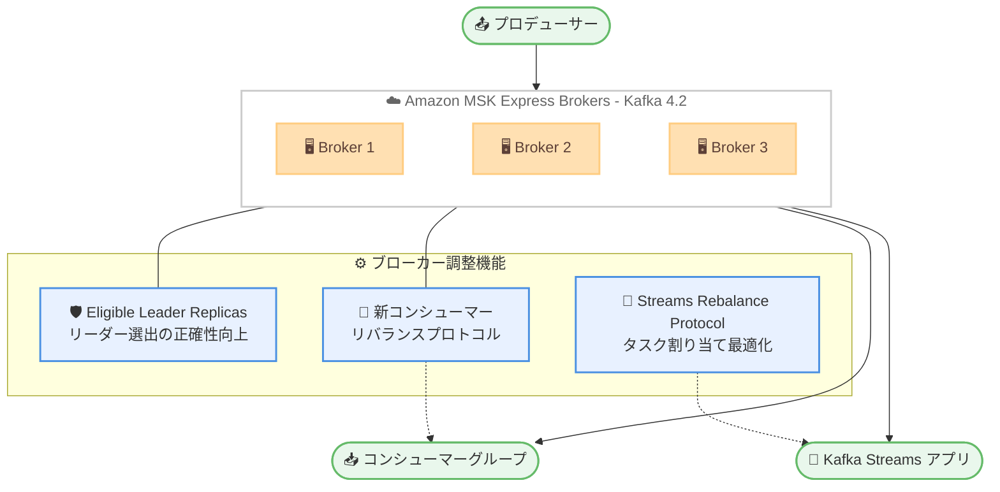

# Amazon MSK - Express Brokers が Apache Kafka 4.2 をサポート

**リリース日**: 2026 年 7 月 15 日
**サービス**: Amazon Managed Streaming for Apache Kafka (Amazon MSK)
**機能**: Express Brokers における Apache Kafka バージョン 4.2 サポート

📊 [このアップデートのインフォグラフィックを見る](https://takech9203.github.io/aws-news-summary/20260715-aws-msk-express-version-42.html)
<!-- INFOGRAPHIC_BASE_URL は環境変数から取得 -->

## 概要

Amazon Managed Streaming for Apache Kafka (Amazon MSK) の Express Brokers が、Apache Kafka バージョン 4.2 のサポートを開始しました。今回のリリースにより、オープンソースの最新の信頼性とパフォーマンスの改善が MSK Express Brokers で利用可能になります。

このリリースには、リーダー選出の正確性を向上させて可用性を強化する Eligible Leader Replicas (ELR) の機能拡張が含まれます。また、グループのリバランスをよりスムーズかつ高速に実行する新しいコンシューマーリバランスプロトコルと、ブローカーの調整機能を Kafka Streams に拡張してタスク割り当てを最適化する新しい Streams Rebalance Protocol が導入されています。

Express Brokers は、ブローカーあたり最大 3 倍のスループット、最大 20 倍高速なスケーリング、90% のリカバリー時間短縮を実現するように設計されており、ストリーミングワークロードを運用する開発者や SRE がスケーラビリティと可用性を高い水準で維持できるように支援します。

**アップデート前の課題**

- 以前は Express Brokers で Apache Kafka 4.2 の最新機能を利用できなかった
- 以前はコンシューマーグループのリバランス時に処理の一時停止が長引き、再割り当てに時間がかかる場合があった
- 以前は Kafka Streams のタスク割り当てがブローカー側で調整されず、クライアント主導の調整に依存していた

**アップデート後の改善**

- 今回のアップデートにより Express Brokers で Apache Kafka 4.2.x を選択して利用できるようになった
- 今回のアップデートにより新しいコンシューマーリバランスプロトコルでリバランスがよりスムーズかつ高速になった
- 今回のアップデートにより ELR の機能拡張でリーダー選出の正確性が向上し、可用性が強化された

## アーキテクチャ図



Apache Kafka 4.2 では、ブローカー側の調整機能が強化され、ELR による可用性向上、新しいリバランスプロトコルによるコンシューマーグループと Kafka Streams の効率的な処理が実現されます。

## サービスアップデートの詳細

### 主要機能

1. **Eligible Leader Replicas (ELR) の機能拡張**
   - リーダー選出の正確性を向上させ、可用性を強化する
   - 障害発生時に適切なレプリカがリーダーとして選出されるようになる
   - データの整合性と耐久性の維持に貢献する

2. **新しいコンシューマーリバランスプロトコル**
   - コンシューマーグループのリバランスをよりスムーズかつ高速に実行する
   - リバランス中の処理停止時間を短縮する
   - コンシューマーの追加・削除やスケーリング時の影響を軽減する

3. **Streams Rebalance Protocol**
   - ブローカーの調整機能を Kafka Streams に拡張する
   - Kafka Streams アプリケーションのタスク割り当てを最適化する
   - ストリーム処理の効率性と安定性を高める

4. **Express Brokers の性能特性の継承**
   - ブローカーあたり最大 3 倍のスループットを実現する
   - 最大 20 倍高速なスケーリングを実現する
   - リカバリー時間を 90% 短縮する

## 技術仕様

### バージョンと性能特性

| 項目 | 詳細 |
|------|------|
| 対応 Kafka バージョン | Apache Kafka 4.2.x |
| ブローカータイプ | MSK Express Brokers |
| スループット | ブローカーあたり最大 3 倍 |
| スケーリング速度 | 最大 20 倍高速 |
| リカバリー時間 | 90% 短縮 |
| アップグレード方式 | インプレースローリングアップデート |

### アップグレードの挙動

Amazon MSK が既存の Express Brokers に対してブローカーの再起動をオーケストレーションし、アップグレード中の可用性とデータを保護します。既存クラスターはインプレースローリングアップデートによって Kafka 4.2 へ移行できます。

## 設定方法

### 前提条件

1. Amazon MSK Express Brokers が提供されている AWS リージョンを利用していること
2. 新規クラスター作成、または既存クラスターのアップグレードに必要な IAM 権限を持つこと
3. アプリケーションが Apache Kafka 4.2 のクライアント互換性を満たしていること

### 手順

#### ステップ1: 新規クラスターの作成

```bash
aws kafka create-cluster-v2 \
  --cluster-name my-express-cluster \
  --provisioned '{
    "brokerNodeGroupInfo": {
      "instanceType": "express.m7g.large",
      "clientSubnets": ["subnet-xxxx", "subnet-yyyy", "subnet-zzzz"]
    },
    "kafkaVersion": "4.2.x",
    "numberOfBrokerNodes": 3
  }'
```

AWS Management Console、AWS CLI、または AWS SDK から Express Brokers のクラスターを作成する際に、Kafka バージョンとして 4.2.x を選択します。

#### ステップ2: 既存クラスターのアップグレード

```bash
aws kafka update-cluster-kafka-version \
  --cluster-arn arn:aws:kafka:region:account-id:cluster/my-express-cluster/xxxx \
  --current-version "K3AEGXETSR30VB" \
  --target-kafka-version "4.2.x"
```

既存の Express Brokers はインプレースローリングアップデートで Kafka 4.2 へアップグレードできます。Amazon MSK がブローカーの再起動を順次オーケストレーションし、可用性とデータを保護します。

## メリット

### ビジネス面

- **可用性の向上**: ELR の機能拡張によりリーダー選出の正確性が高まり、障害時の可用性が強化される
- **運用効率の向上**: 高速なスケーリングと短いリカバリー時間により、運用負荷とダウンタイムを削減できる
- **段階的な移行**: インプレースローリングアップデートにより、既存ワークロードを停止せずに最新バージョンへ移行できる

### 技術面

- **リバランスの高速化**: 新しいコンシューマーリバランスプロトコルにより、リバランス中の処理停止を最小化できる
- **Kafka Streams の最適化**: Streams Rebalance Protocol によりタスク割り当てが最適化され、ストリーム処理の効率が向上する
- **高スループット**: ブローカーあたり最大 3 倍のスループットにより、より少ないブローカー数で高い処理性能を維持できる

## デメリット・制約事項

### 制限事項

- Apache Kafka 4.2 のクライアント互換性を満たさないアプリケーションは、事前の検証や更新が必要になる場合がある
- 本サポートは Express Brokers が提供されているリージョンに限定される

### 考慮すべき点

- 本番環境へ適用する前に、検証環境でアップグレードとアプリケーションの互換性を確認することが望ましい
- インプレースローリングアップデート中はブローカーが順次再起動されるため、クライアント側の再接続やリトライ設定を確認する

## ユースケース

### ユースケース1: 高頻度でスケールするストリーミング基盤

**シナリオ**: トラフィックが急増するイベント駆動型アプリケーションで、コンシューマーの追加・削除が頻繁に発生する。

**効果**: 新しいコンシューマーリバランスプロトコルにより、スケーリング時のリバランスがスムーズになり、処理停止時間が短縮される。

### ユースケース2: Kafka Streams によるリアルタイム処理

**シナリオ**: Kafka Streams を用いた集計・変換処理で、多数のタスクを複数のインスタンスに分散させている。

**効果**: Streams Rebalance Protocol によりブローカー側でタスク割り当てが最適化され、ストリーム処理の効率と安定性が向上する。

### ユースケース3: 高可用性が求められるミッションクリティカルなワークロード

**シナリオ**: 金融取引や決済など、障害時にもデータ整合性と可用性を維持する必要があるワークロード。

**効果**: ELR の機能拡張によりリーダー選出の正確性が高まり、障害発生時の可用性とデータ整合性が強化される。

## 料金

本アップデートによる追加料金はありません。Amazon MSK Express Brokers の通常の料金が適用されます。料金はブローカーのインスタンスサイズと稼働時間、ストレージ、データ転送に基づきます。詳細は Amazon MSK の料金ページを参照してください。

## 利用可能リージョン

Amazon MSK Express Brokers が提供されているすべての AWS リージョンで利用可能です。

## 関連サービス・機能

- **Amazon MSK Provisioned / Serverless**: MSK の他のブローカー構成。ワークロード特性に応じて選択できる
- **Apache Kafka**: 本アップデートの基盤となるオープンソースの分散ストリーミングプラットフォーム
- **Kafka Streams**: Streams Rebalance Protocol による最適化の対象となるストリーム処理ライブラリ

## 参考リンク

- 📊 [インフォグラフィック](https://takech9203.github.io/aws-news-summary/20260715-aws-msk-express-version-42.html)
- [公式発表 (What's New)](https://aws.amazon.com/about-aws/whats-new/2026/07/aws-msk-express-version-42/)
- [Amazon MSK ドキュメント](https://docs.aws.amazon.com/msk/latest/developerguide/what-is-msk.html)
- [Amazon MSK 料金ページ](https://aws.amazon.com/msk/pricing/)

## まとめ

Amazon MSK Express Brokers が Apache Kafka 4.2 に対応し、ELR による可用性強化、コンシューマーおよび Kafka Streams のリバランス最適化といった最新のオープンソース改善を利用できるようになりました。既存クラスターはインプレースローリングアップデートで移行できるため、まずは検証環境でアプリケーションの互換性を確認したうえで、本番環境への適用を検討することをおすすめします。
