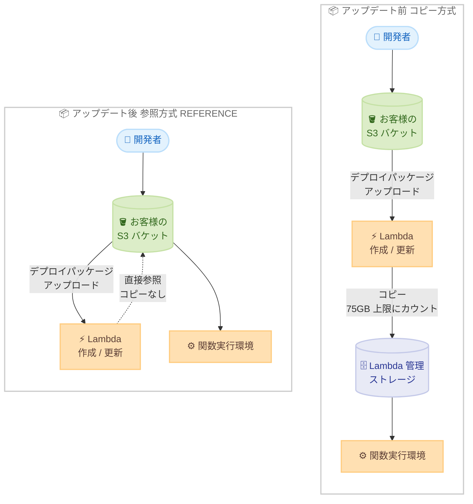

# AWS Lambda - 自己管理型コードストレージ

**リリース日**: 2026年7月15日
**サービス**: AWS Lambda
**機能**: 自己管理型コードストレージ (Self-managed code storage)

📊 [このアップデートのインフォグラフィックを見る](https://takech9203.github.io/aws-news-summary/20260715-lambda-self-managed-code-storage.html)
<!-- INFOGRAPHIC_BASE_URL は環境変数から取得 -->

## 概要

AWS Lambda は、コードストレージとして自己管理型の Amazon S3 バケットをサポートするようになりました。この機能により、お客様は自身の S3 バケット内のソースコードを直接参照でき、Lambda が中間コピーを作成することなく関数やレイヤーを作成、更新できます。

従来、Lambda は関数やレイヤーの作成時に、デプロイパッケージを常に Lambda 管理のストレージへコピーしていました。このコピーはリージョンごとに 75GB という上限にカウントされ、上限を超える場合はサポートケースによるクォータ引き上げが必要でした。今回のアップデートでは、S3ObjectStorageMode パラメータを REFERENCE に設定することで、Lambda がコピーを作成せずにお客様の S3 バケット内のコードを直接参照します。

これにより、コードストレージの上限が実質的に解消され、コピー処理が不要になることで関数の作成、更新後のアクティベーション時間が短縮されます。自己管理型ストレージに対する Lambda の追加料金は発生せず、標準の S3 ストレージ料金と、該当する場合はクロスリージョンのデータ転送料金のみが課金されます。あわせて、Lambda 管理のコードストレージのデフォルト上限も、リージョンごとアカウントごとに 75GB から 300GB へ引き上げられました。

**アップデート前の課題**

- Lambda は関数やレイヤーの作成時に、デプロイパッケージを常に Lambda 管理のストレージへコピーしていた
- コピーされたコードはリージョンごとに 75GB の上限にカウントされ、大量の関数やレイヤーを持つアカウントでは上限に達しやすかった
- コピー処理が発生するため、関数の作成、更新後にアクティベーションまでの時間がかかっていた
- デプロイパッケージが Lambda 管理ストレージに複製されるため、単一の信頼できる情報源 (single source of truth) を維持しにくかった

**アップデート後の改善**

- S3ObjectStorageMode を REFERENCE に設定することで、Lambda がお客様の S3 バケット内のコードを直接参照するようになった
- コピーを作成しないため、コードストレージの上限が実質的に解消された
- コピー処理を省くことで、関数の作成、更新後のアクティベーション時間が短縮された
- Lambda 管理ストレージのデフォルト上限も 75GB から 300GB へ引き上げられた
- デプロイパッケージをお客様のアカウント内で一元管理でき、単一の信頼できる情報源を維持できる

## アーキテクチャ図



アップデート前はデプロイパッケージが Lambda 管理ストレージへコピーされ、75GB の上限にカウントされていました。アップデート後は REFERENCE モードにより、Lambda がお客様の S3 バケットを直接参照するため、コピー処理と上限の制約が解消されます。

## サービスアップデートの詳細

### 主要機能

1. **自己管理型 S3 バケットによるコード参照**
   - お客様自身の S3 バケット内のデプロイパッケージを直接参照する
   - Lambda が中間コピーを作成しないため、コードストレージの上限が実質的に解消される
   - デプロイパッケージをお客様のアカウント内で一元管理できる

2. **アクティベーション時間の短縮**
   - コピー処理を省くことで、関数の作成、更新後のアクティベーション時間が短縮される
   - 大きなデプロイパッケージを扱う場合ほど効果が大きい

3. **Lambda 管理ストレージのデフォルト上限引き上げ**
   - Lambda 管理のコードストレージのデフォルト上限が、リージョンごとアカウントごとに 75GB から 300GB へ引き上げられた
   - 従来のコピー方式を継続する場合も、より多くの関数やレイヤーを保持できる

4. **追加の Lambda 料金なし**
   - 自己管理型ストレージに対する Lambda の追加料金は発生しない
   - 標準の S3 ストレージ料金と、該当する場合のクロスリージョンデータ転送料金のみが課金される

## 技術仕様

### 主要パラメータと制限

| 項目 | 詳細 |
|------|------|
| パラメータ名 | S3ObjectStorageMode |
| 設定値 | REFERENCE (自己管理型), 未指定時は従来のコピー方式 |
| 対応インターフェイス | AWS CLI, CloudFormation, SAM, SDK, Lambda コンソール |
| 対象リソース | 関数 (Function), レイヤー (Layer) |
| 必要な権限 | s3:GetObject, s3:GetObjectVersion (Lambda サービスプリンシパルに付与) |
| Lambda 管理ストレージのデフォルト上限 | 75GB から 300GB へ引き上げ (リージョンごとアカウントごと) |
| 自己管理型ストレージの上限 | S3 バケットの容量に依存 (実質的に上限なし) |

### API変更履歴

| 日付 | サービス | 変更内容 |
|------|----------|----------|
| 2026/07/15 | AWS Lambda | CreateFunction / UpdateFunctionCode / PublishLayerVersion 等に S3ObjectStorageMode パラメータを追加 |

### IAM ポリシー設定例

Lambda サービスプリンシパルに、対象の S3 バケットへの読み取り権限を付与するバケットポリシーの例です。

```json
{
  "Version": "2012-10-17",
  "Statement": [
    {
      "Sid": "AllowLambdaReadAccess",
      "Effect": "Allow",
      "Principal": {
        "Service": "lambda.amazonaws.com"
      },
      "Action": [
        "s3:GetObject",
        "s3:GetObjectVersion"
      ],
      "Resource": "arn:aws:s3:::my-lambda-code-bucket/*"
    }
  ]
}
```

## 設定方法

### 前提条件

1. デプロイパッケージ (ZIP) を格納する S3 バケットを用意する
2. Lambda サービスプリンシパルに s3:GetObject と s3:GetObjectVersion の権限を付与する
3. AWS CLI, CloudFormation, SAM, SDK のいずれかを使用できる環境を用意する

### 手順

#### ステップ1: デプロイパッケージを S3 にアップロード

```bash
aws s3 cp function.zip s3://my-lambda-code-bucket/function.zip
```

デプロイパッケージをお客様の S3 バケットにアップロードします。このバケットが単一の信頼できる情報源となります。

#### ステップ2: REFERENCE モードで関数を作成

```bash
aws lambda create-function \
  --function-name my-function \
  --runtime python3.13 \
  --role arn:aws:iam::123456789012:role/lambda-exec-role \
  --handler index.handler \
  --code S3Bucket=my-lambda-code-bucket,S3Key=function.zip \
  --s3-object-storage-mode REFERENCE
```

S3ObjectStorageMode を REFERENCE に設定して関数を作成します。これにより Lambda はコピーを作成せず、指定した S3 オブジェクトを直接参照します。

#### ステップ3: CloudFormation / SAM での設定

```yaml
Resources:
  MyFunction:
    Type: AWS::Lambda::Function
    Properties:
      FunctionName: my-function
      Runtime: python3.13
      Handler: index.handler
      Role: !GetAtt LambdaExecRole.Arn
      Code:
        S3Bucket: my-lambda-code-bucket
        S3Key: function.zip
      S3ObjectStorageMode: REFERENCE
```

Infrastructure as Code で管理する場合は、リソースプロパティに S3ObjectStorageMode: REFERENCE を追加します。

## メリット

### ビジネス面

- **コスト最適化**: 自己管理型ストレージに Lambda の追加料金は発生せず、標準の S3 ストレージ料金のみで運用できる
- **ストレージ上限の解消**: 大量の関数やレイヤーを持つ組織でも、コードストレージ上限を気にせずデプロイできる
- **運用負荷の軽減**: 75GB 上限に達した際のサポートケースによるクォータ引き上げが不要になる

### 技術面

- **アクティベーション時間の短縮**: コピー処理を省くことで、関数の作成、更新後のアクティベーションが高速化する
- **単一の信頼できる情報源**: デプロイパッケージをお客様のアカウント内で一元管理できる
- **既存ツールとの統合**: AWS CLI, CloudFormation, SAM, SDK でパラメータを 1 つ追加するだけで利用できる

## デメリット・制約事項

### 制限事項

- Lambda サービスプリンシパルに s3:GetObject と s3:GetObjectVersion の権限を付与する必要がある
- S3 バケット内のオブジェクトを削除、変更すると関数の動作に影響する可能性があるため、ライフサイクル管理に注意が必要
- クロスリージョンで参照する場合、データ転送料金が発生する場合がある

### 考慮すべき点

- 参照先の S3 オブジェクトが削除された場合の関数動作について、事前に検証しておくことが望ましい
- バケットポリシーやオブジェクトのバージョニング設定を適切に管理する必要がある
- 従来のコピー方式 (未指定) と REFERENCE 方式を用途に応じて使い分ける

## ユースケース

### ユースケース1: 大量の関数を持つ大規模組織

**シナリオ**: 数百から数千の Lambda 関数を運用しており、75GB のコードストレージ上限に頻繁に達していた組織。

**実装例**:
```bash
aws lambda update-function-configuration \
  --function-name existing-function \
  --s3-object-storage-mode REFERENCE
```

**効果**: コードストレージ上限の制約が解消され、クォータ引き上げのためのサポートケース対応が不要になります。

### ユースケース2: 大きなデプロイパッケージの高速デプロイ

**シナリオ**: 機械学習の推論ライブラリなど、サイズの大きいデプロイパッケージを頻繁に更新するワークロード。

**実装例**:
```bash
aws s3 cp large-package.zip s3://my-lambda-code-bucket/large-package.zip
aws lambda update-function-code \
  --function-name ml-inference \
  --s3-bucket my-lambda-code-bucket \
  --s3-key large-package.zip \
  --s3-object-storage-mode REFERENCE
```

**効果**: コピー処理を省くことで、更新後のアクティベーション時間が短縮され、デプロイのリードタイムが改善します。

### ユースケース3: デプロイパッケージの一元管理

**シナリオ**: 複数チームで共通のアーティファクトバケットを利用し、デプロイパッケージを一元管理したい環境。

**実装例**:
```yaml
Code:
  S3Bucket: shared-artifact-bucket
  S3Key: services/api/v1.2.3/package.zip
S3ObjectStorageMode: REFERENCE
```

**効果**: お客様のバケットが単一の信頼できる情報源となり、成果物のガバナンスとバージョン管理が容易になります。

## 料金

自己管理型ストレージに対する Lambda の追加料金は発生しません。以下の料金のみが課金されます。

- 標準の Amazon S3 ストレージ料金
- 該当する場合のクロスリージョンデータ転送料金

Lambda 管理のコードストレージについても、料金体系に変更はありません。

### 料金例

| 使用量 | 月額料金（概算） |
|--------|------------------|
| S3 標準ストレージ 100GB (デプロイパッケージ) | 標準の S3 ストレージ料金に準拠 |
| 同一リージョン内での参照 | データ転送料金なし |
| クロスリージョンでの参照 | 該当リージョン間のデータ転送料金 |

## 利用可能リージョン

すべての商用 AWS リージョンで利用可能です。

## 関連サービス・機能

- **Amazon S3**: デプロイパッケージの格納先であり、REFERENCE モードでは Lambda が直接参照する
- **AWS CloudFormation / AWS SAM**: S3ObjectStorageMode パラメータを IaC で管理できる
- **AWS Lambda レイヤー**: 関数と同様に REFERENCE モードでコードストレージ上限を回避できる

## 参考リンク

- 📊 [インフォグラフィック](https://takech9203.github.io/aws-news-summary/20260715-lambda-self-managed-code-storage.html)
- [公式発表 (What's New)](https://aws.amazon.com/about-aws/whats-new/2026/07/lambda-self-managed-code-storage/)
- [AWS Lambda ドキュメント](https://docs.aws.amazon.com/lambda/)

## まとめ

自己管理型コードストレージは、Lambda のコードストレージ上限という長年の運用上の制約を解消する重要なアップデートです。追加の Lambda 料金なしでアクティベーション時間を短縮でき、大量の関数やレイヤーを扱う組織や大きなデプロイパッケージを扱うワークロードで特に効果を発揮します。既存の関数についても S3ObjectStorageMode を REFERENCE に設定するだけで移行できるため、ストレージ上限に課題を抱えている場合はまず検証環境での導入を検討することをおすすめします。
