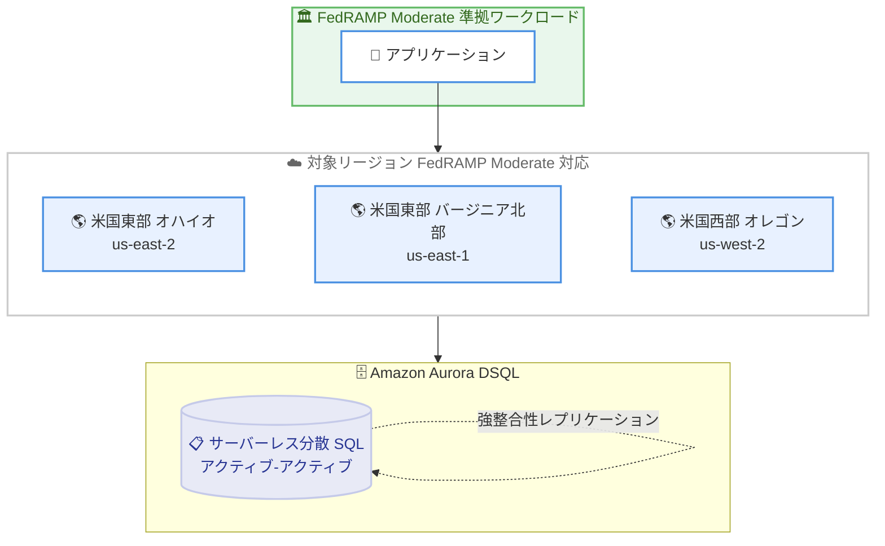

# Amazon Aurora DSQL - FedRAMP Moderate 対応

**リリース日**: 2026 年 7 月 16 日
**サービス**: Amazon Aurora DSQL
**機能**: FedRAMP Moderate コンプライアンス対応

📊 [このアップデートのインフォグラフィックを見る](https://takech9203.github.io/aws-news-summary/20260716-amazon-aurora-dsql-now-in-scope-for-fedramp-moderate.html)
<!-- INFOGRAPHIC_BASE_URL は環境変数から取得 -->

## 概要

Amazon Aurora DSQL が、米国東部 (オハイオ)、米国東部 (バージニア北部)、米国西部 (オレゴン) の 3 つのリージョンで FedRAMP Moderate の対象範囲に含まれました。これにより、お客様は FedRAMP Moderate のコンプライアンス要件が適用されるアプリケーションの構築やワークロードの実行に Aurora DSQL を利用できます。

FedRAMP (Federal Risk and Authorization Management Program) は、クラウド製品およびサービスのセキュリティ評価、認可、継続的なモニタリングに対する標準的なアプローチを提供する米国政府全体のプログラムです。今回の対応により、米国政府機関やその関連事業者、コンプライアンス要件の厳しい業界のお客様が、Aurora DSQL の高い可用性とスケーラビリティを享受しながら規制要件を満たすことが可能になります。

Aurora DSQL は、アクティブ - アクティブの高可用性とマルチリージョンでの強整合性を備えた、最速のサーバーレス分散 SQL データベースです。インフラストラクチャの管理を必要とせず、事実上無制限のスケールで常時利用可能なアプリケーションを構築できます。

**アップデート前の課題**

- 以前は Aurora DSQL が FedRAMP Moderate の対象範囲外であったため、FedRAMP Moderate 準拠が求められるワークロードに採用できなかった
- コンプライアンス要件を満たすために、他のデータベースサービスを選択するか、独自の対策を追加する必要があった
- 規制対象のワークロードでは、Aurora DSQL のサーバーレスかつ分散型のアーキテクチャによる利点を活用できなかった

**アップデート後の改善**

- 今回のアップデートにより、FedRAMP Moderate 準拠のアプリケーションを Aurora DSQL 上で構築できるようになった
- 対象 3 リージョンにおいて、コンプライアンス要件を満たしながらアクティブ - アクティブの高可用性を利用できるようになった
- サードパーティによる継続的なモニタリングと認可のもとで、規制対象のワークロードを安心して運用できるようになった

## アーキテクチャ図



FedRAMP Moderate 準拠が求められるアプリケーションから、対象 3 リージョンの Aurora DSQL を利用する構成を示しています。各リージョン間では強整合性を保ったレプリケーションが行われます。

## サービスアップデートの詳細

### 主要機能

1. **FedRAMP Moderate コンプライアンス対応**
   - Aurora DSQL が FedRAMP Moderate の対象範囲に追加された
   - 米国東部 (オハイオ)、米国東部 (バージニア北部)、米国西部 (オレゴン) の 3 リージョンで利用可能
   - FedRAMP のセキュリティ評価、認可、継続的なモニタリングの標準アプローチに準拠

2. **アクティブ - アクティブの高可用性**
   - 単一リージョンで 99.99%、マルチリージョンで 99.999% の可用性を提供
   - インフラストラクチャコンポーネントの障害時に、自動的に正常なインフラへリクエストをルーティング
   - 従来のデータベースフェイルオーバーを意識する必要がない

3. **マルチリージョンでの強整合性**
   - ピアリングされたマルチリージョンクラスターが 2 つのリージョナルエンドポイントを提供
   - 両エンドポイントが単一の論理データベースとして動作し、同時読み書きに対応
   - リーダーは常に同一のデータを参照できる

## 技術仕様

### Aurora DSQL の主な特性

| 項目 | 詳細 |
|------|------|
| データベース種別 | サーバーレス分散リレーショナルデータベース |
| 互換性 | PostgreSQL 16 互換 |
| 可用性 (単一リージョン) | 99.99% |
| 可用性 (マルチリージョン) | 99.999% |
| トランザクション | ACID (強整合性、スナップショット分離) |
| インフラ管理 | 不要 (サーバーレス) |
| 対象リージョン (FedRAMP Moderate) | us-east-1、us-east-2、us-west-2 |

### FedRAMP エンドポイント

対象リージョンでは、FIPS 準拠のエンドポイントも利用できます。

| リージョン | 標準エンドポイント | FIPS エンドポイント |
|------------|--------------------|---------------------|
| 米国東部 (オハイオ) | dsql.us-east-2.api.aws | dsql-fips.us-east-2.api.aws |
| 米国東部 (バージニア北部) | dsql.us-east-1.api.aws | dsql-fips.us-east-1.api.aws |
| 米国西部 (オレゴン) | dsql.us-west-2.api.aws | dsql-fips.us-west-2.api.aws |

## 設定方法

### 前提条件

1. 対象リージョン (us-east-1、us-east-2、us-west-2 のいずれか) を利用可能な AWS アカウント
2. Aurora DSQL クラスターの作成・管理に必要な IAM 権限
3. PostgreSQL 互換のクライアントまたはドライバー (例: `psql`)

### 手順

#### ステップ1: Aurora DSQL クラスターの作成

```bash
aws dsql create-cluster \
  --region us-east-1
```

対象リージョンで Aurora DSQL クラスターを作成します。FedRAMP Moderate 準拠が必要な場合は、対象 3 リージョンのいずれかを選択します。

#### ステップ2: FIPS エンドポイントへの接続

```bash
psql "host=<cluster-id>.dsql-fips.us-east-1.api.aws \
  dbname=postgres user=admin sslmode=require"
```

FIPS 準拠が求められる環境では、標準エンドポイントの代わりに FIPS エンドポイントを使用して接続します。SSL による接続を必須とします。

#### ステップ3: コンプライアンス範囲の確認

AWS のコンプライアンス対応状況は、AWS Artifact や「AWS services in scope by compliance program」ページで最新の対象範囲を確認します。監査対応時には、これらの情報をエビデンスとして活用します。

## メリット

### ビジネス面

- **規制対応の拡大**: FedRAMP Moderate 準拠が求められる政府機関や規制業界のワークロードで Aurora DSQL を採用できる
- **コンプライアンスコストの削減**: AWS による第三者評価と継続的なモニタリングを活用でき、独自対策の負担を軽減できる
- **調達の簡素化**: FedRAMP 認可済みサービスとして、政府調達要件への適合が容易になる

### 技術面

- **高可用性の維持**: コンプライアンス要件を満たしながら、アクティブ - アクティブ構成による高可用性を利用できる
- **運用負荷の低減**: サーバーレスアーキテクチャにより、プロビジョニングやパッチ適用などの保守作業が不要
- **既存資産の活用**: PostgreSQL 互換のため、既存のドライバーや ORM、SQL の知識をそのまま利用できる

## デメリット・制約事項

### 制限事項

- FedRAMP Moderate の対象は現時点で米国東部 (オハイオ)、米国東部 (バージニア北部)、米国西部 (オレゴン) の 3 リージョンに限定される
- マルチリージョンクラスターは同一の Region set 内でのみ作成でき、大陸をまたぐ構成はサポートされない
- 一部の PostgreSQL 機能は Aurora DSQL で未対応の場合がある

### 考慮すべき点

- 最新のコンプライアンス対象範囲は AWS の公式ページで随時確認する必要がある
- FedRAMP Moderate 準拠を実現するには、Aurora DSQL 単体だけでなく、関連するアーキテクチャ全体での対応が求められる
- FIPS 要件がある場合は、FIPS エンドポイントの利用を明示的に構成する必要がある

## ユースケース

### ユースケース1: 政府機関向けの常時稼働アプリケーション

**シナリオ**: 米国政府機関のシステムで、FedRAMP Moderate 準拠が必須かつ高い可用性が求められるトランザクションアプリケーションを構築する。

**効果**: Aurora DSQL のアクティブ - アクティブ構成により、コンプライアンス要件を満たしながら 99.999% (マルチリージョン) の可用性を実現できる。

### ユースケース2: 規制業界のマイクロサービス基盤

**シナリオ**: 金融やヘルスケアなど、FedRAMP Moderate に準拠する必要がある規制業界で、サーバーレスのマイクロサービスアーキテクチャを採用する。

**効果**: インフラ管理不要でスケールする分散 SQL データベースを、規制要件を満たしながら利用でき、運用負荷を抑えられる。

### ユースケース3: クロスリージョンディザスタリカバリ

**シナリオ**: 対象 3 リージョンを活用し、コンプライアンス準拠のワークロードでリージョン障害に備えた冗長構成を構築する。

**効果**: マルチリージョンの強整合性により、フェイルオーバー時のデータ欠損や結果整合性を意識することなく、事業継続性を確保できる。

## 料金

FedRAMP Moderate 対応に伴う追加料金はありません。Aurora DSQL の通常の料金体系が適用されます。料金は使用したリソース (コンピュート、I/O、ストレージ) に基づく従量課金です。詳細は Aurora DSQL の料金ページを参照してください。

## 利用可能リージョン

FedRAMP Moderate の対象範囲となるのは以下の 3 リージョンです。

- 米国東部 (オハイオ) - us-east-2
- 米国東部 (バージニア北部) - us-east-1
- 米国西部 (オレゴン) - us-west-2

なお、Aurora DSQL サービス自体は、これら以外にもアジアパシフィック (東京) やヨーロッパ (フランクフルト) など複数のリージョンで利用可能です。

## 関連サービス・機能

- **AWS Artifact**: FedRAMP を含むコンプライアンスレポートや認証情報をオンデマンドで取得できるサービス
- **Amazon Aurora**: PostgreSQL / MySQL 互換のリレーショナルデータベース。プロビジョンド型のワークロードで選択肢となる
- **AWS Identity and Access Management (IAM)**: Aurora DSQL クラスターへのアクセス制御と認証に利用

## 参考リンク

- 📊 [インフォグラフィック](https://takech9203.github.io/aws-news-summary/20260716-amazon-aurora-dsql-now-in-scope-for-fedramp-moderate.html)
- [公式発表 (What's New)](https://aws.amazon.com/about-aws/whats-new/2026/07/amazon-aurora-dsql-now-in-scope-for-fedramp-moderate/)
- [Amazon Aurora DSQL ドキュメント](https://docs.aws.amazon.com/aurora-dsql/latest/userguide/what-is-aurora-dsql.html)
- [AWS services in scope by compliance program](https://aws.amazon.com/compliance/services-in-scope/)
- [FedRAMP コンプライアンス](https://aws.amazon.com/compliance/fedramp/)
- [Aurora DSQL 料金ページ](https://aws.amazon.com/rds/aurora/dsql/pricing/)

## まとめ

Amazon Aurora DSQL が対象 3 リージョンで FedRAMP Moderate の対象範囲に加わったことで、米国政府機関や規制業界のお客様が、サーバーレス分散 SQL データベースの高可用性とスケーラビリティをコンプライアンス要件を満たしながら活用できるようになりました。FedRAMP Moderate 準拠のワークロードを検討している場合は、AWS の最新のコンプライアンス対象範囲を確認したうえで、Aurora DSQL の採用を評価することをお勧めします。
