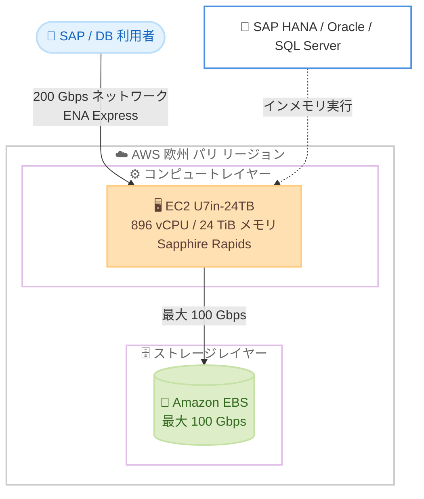

# Amazon EC2 High Memory - U7in-24TB インスタンスの欧州 (パリ) リージョン提供開始

**リリース日**: 2026 年 7 月 16 日
**サービス**: Amazon EC2
**機能**: EC2 High Memory U7in-24TB インスタンス (u7in-24tb.224xlarge)

📊 [このアップデートのインフォグラフィックを見る](https://takech9203.github.io/aws-news-summary/20260716-amazon-ec2-high-memory-europe.html)
<!-- INFOGRAPHIC_BASE_URL は環境変数から取得 -->

## 概要

Amazon EC2 High Memory U7in-24TB インスタンス (u7in-24tb.224xlarge) が、新たに AWS 欧州 (パリ) リージョンで利用可能になりました。U7in-24TB インスタンスは、24 TiB の DDR5 メモリと 896 個の vCPU を単一インスタンスで提供する大規模メモリインスタンスです。SAP HANA、Oracle、SQL Server などのミッションクリティカルなインメモリデータベースを対象に設計されています。

これらのインスタンスは、第 4 世代インテル Xeon スケーラブルプロセッサ (Sapphire Rapids) を搭載しており、SAP により本番環境での稼働が認定されています。200 Gbps のネットワーク帯域幅 (ENA Express 対応) と最大 100 Gbps の EBS 帯域幅を備え、大規模なトランザクション処理のスループット向上を実現します。

AWS の発表によると、U7in-24TB インスタンスは既存の U-1 インスタンスと比較して最大 45% 優れた価格性能比を提供します。これにより、成長するデータ環境において、大規模なインメモリワークロードをより経済的に AWS 上でスケールさせることが可能になります。

**アップデート前の課題**

- これまで欧州 (パリ) リージョンでは、24 TiB クラスの大規模メモリを持つ最新世代の U7in インスタンスを利用できなかった
- 大規模な SAP HANA 環境をパリリージョンで構築する際、旧世代の U-1 インスタンスなど選択肢が限られていた
- 特定の大規模インメモリワークロードでは、地理的・データ主権上の要件によりリージョン選択に制約があった

**アップデート後の改善**

- 欧州 (パリ) リージョンで 24 TiB メモリの U7in-24TB インスタンスを利用できるようになった
- 最新の Sapphire Rapids プロセッサと DDR5 メモリにより、U-1 インスタンス比で最大 45% 優れた価格性能比を実現
- データ主権やレイテンシーの要件からフランス国内での稼働が求められるワークロードに対応可能になった

## アーキテクチャ図

大規模インメモリデータベースが単一の U7in-24TB インスタンス上で稼働し、Amazon EBS と高帯域幅ネットワークを介して利用者に高スループットで応答する構成を示しています。

## サービスアップデートの詳細

### 主要機能

1. **24 TiB の大規模メモリ**
   - 単一インスタンスで 24,576 GiB (24 TiB) の DDR5 メモリを提供
   - 大規模な SAP HANA スケールアップ構成やインメモリデータベースに対応
   - メモリ集約型ワークロードをシンプルな単一ノード構成で実行可能

2. **最新世代プロセッサによる価格性能比の向上**
   - 第 4 世代インテル Xeon スケーラブルプロセッサ (Sapphire Rapids) を搭載
   - 896 個の vCPU を提供
   - 既存の U-1 インスタンスと比較して最大 45% 優れた価格性能比

3. **高帯域幅のネットワークとストレージ**
   - 200 Gbps のネットワーク帯域幅と ENA Express のサポート
   - 最大 100 Gbps の EBS 帯域幅
   - 大規模なトランザクション処理のスループット向上を支援

## 技術仕様

### U7in-24TB インスタンスの仕様

| 項目 | 詳細 |
|------|------|
| インスタンスサイズ | u7in-24tb.224xlarge |
| vCPU | 896 |
| メモリ | 24,576 GiB (24 TiB) DDR5 |
| プロセッサ | 第 4 世代インテル Xeon スケーラブル (Sapphire Rapids) |
| ネットワーク帯域幅 | 200 Gbps (ENA Express 対応) |
| EBS 帯域幅 | 最大 100 Gbps |
| ストレージ | EBS のみ |
| SAP 認定 | 本番環境での稼働を認定 |

### U7i ファミリーのラインナップ

| インスタンスサイズ | vCPU | メモリ (GiB) | ネットワーク (Gbps) | EBS (Gbps) |
|------|------|------|------|------|
| u7i-6tb.112xlarge | 448 | 6,144 | 100 | 100 |
| u7i-8tb.112xlarge | 448 | 8,192 | 100 | 100 |
| u7i-12tb.224xlarge | 896 | 12,288 | 100 | 100 |
| u7in-16tb.224xlarge | 896 | 16,384 | 200 | 100 |
| **u7in-24tb.224xlarge** | **896** | **24,576** | **200** | **100** |
| u7in-32tb.224xlarge | 896 | 32,768 | 200 | 100 |
| u7inh-32tb.480xlarge | 1,920 | 32,768 | 200 | 160 |

## メリット

### ビジネス面

- **価格性能比の向上**: U-1 インスタンス比で最大 45% 優れた価格性能比により、大規模インメモリワークロードのコスト効率を改善
- **データ主権への対応**: 欧州 (パリ) リージョンでの提供により、フランス国内でのデータ配置が求められるワークロードに対応
- **投資保護**: 既存の SAP HANA 環境を最新世代インフラへ移行し、将来の拡張余地を確保

### 技術面

- **単一ノードでの大規模メモリ**: 24 TiB を単一インスタンスで提供し、複雑なスケールアウト構成を回避
- **高スループット**: 200 Gbps ネットワークと最大 100 Gbps の EBS 帯域幅により大規模トランザクション処理に対応
- **最新プロセッサ**: Sapphire Rapids と DDR5 メモリによる処理性能の向上

## デメリット・制約事項

### 制限事項

- 現時点でこのアップデートによる提供は欧州 (パリ) リージョンに限定される
- ストレージは EBS のみで、インスタンスストアは提供されない
- 大規模インスタンスであるため、利用にあたっては事前のキャパシティ確認やクォータ引き上げが必要になる場合がある

### 考慮すべき点

- 大規模メモリインスタンスは相応のコストが発生するため、ワークロードの実メモリ要件に基づくサイジングが重要
- 本番の SAP ワークロードでは、SAP 認定構成およびオペレーティングシステム要件の確認が必要
- コスト最適化のため、Savings Plans やリザーブドインスタンスなどの購入オプションの検討を推奨

## ユースケース

### ユースケース1: 大規模 SAP HANA 環境のスケールアップ

**シナリオ**: 数十 TiB 規模のインメモリデータを扱う SAP S/4HANA 本番環境を、フランス国内のリージョンで単一ノードとして稼働させたい。

**効果**: 24 TiB の単一インスタンスにより、複雑なスケールアウト構成を避けつつ、SAP 認定構成で本番稼働が可能になります。

### ユースケース2: ミッションクリティカルなインメモリデータベース

**シナリオ**: Oracle や SQL Server の大規模インメモリデータベースで、トランザクション処理のスループット向上が求められている。

**効果**: 896 vCPU と 200 Gbps ネットワークにより、高いトランザクションスループットと低レイテンシーを実現します。

### ユースケース3: 既存 U-1 環境からの移行

**シナリオ**: 既存の U-1 インスタンス上で稼働する大規模メモリワークロードのコスト効率を改善したい。

**効果**: 最大 45% 優れた価格性能比により、同等のワークロードをより低いコストで実行できます。

## 料金

U7in-24TB インスタンスの料金は、利用するリージョンおよび購入オプション (オンデマンド、Savings Plans、リザーブドインスタンスなど) によって異なります。今回の発表では具体的な料金は示されていないため、最新の料金は Amazon EC2 の料金ページで確認してください。

## 利用可能リージョン

今回のアップデートにより、Amazon EC2 High Memory U7in-24TB インスタンスは AWS 欧州 (パリ) リージョンで利用可能になりました。他リージョンでの提供状況については AWS の公式情報を確認してください。

## 関連サービス・機能

- **Amazon EBS**: U7in インスタンスのストレージとして使用され、最大 100 Gbps の帯域幅で接続
- **ENA Express**: 200 Gbps のネットワーク帯域幅を活用し、高スループット通信を実現
- **AWS Savings Plans / リザーブドインスタンス**: 長期利用時のコスト最適化に活用可能

## 参考リンク

- 📊 [インフォグラフィック](https://takech9203.github.io/aws-news-summary/20260716-amazon-ec2-high-memory-europe.html)
- [公式発表 (What's New)](https://aws.amazon.com/about-aws/whats-new/2026/07/amazon-ec2-high-memory-europe/)
- [Amazon EC2 U7i インスタンス](https://aws.amazon.com/ec2/instance-types/u7i/)
- [Amazon EC2 High Memory インスタンス](https://aws.amazon.com/ec2/instance-types/high-memory/)
- [Amazon EC2 料金ページ](https://aws.amazon.com/ec2/pricing/)

## まとめ

欧州 (パリ) リージョンで U7in-24TB インスタンスが利用可能になったことで、フランス国内でのデータ配置が求められる大規模 SAP HANA やインメモリデータベースワークロードの選択肢が広がりました。最新世代プロセッサによる最大 45% の価格性能比向上を活かせるため、既存の U-1 環境を運用している場合は移行によるコスト最適化を検討することを推奨します。
