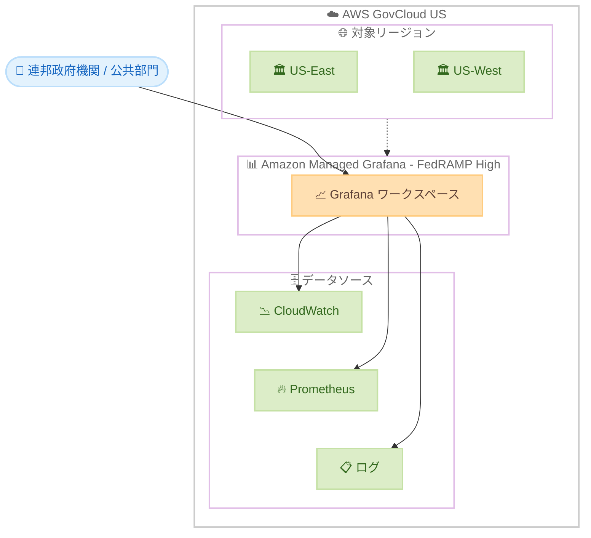

# Amazon Managed Grafana - AWS GovCloud (US) での FedRAMP High 認証取得

**リリース日**: 2026年7月16日
**サービス**: Amazon Managed Grafana
**機能**: AWS GovCloud (US) における FedRAMP High 認証

📊 [このアップデートのインフォグラフィックを見る](https://takech9203.github.io/aws-news-summary/20260716-amazon-managed-grafana-fedramp-high.html)
<!-- INFOGRAPHIC_BASE_URL は環境変数から取得 -->

## 概要

Amazon Managed Grafana が、AWS GovCloud (US-East) および AWS GovCloud (US-West) の両リージョンで FedRAMP High 認証を取得しました。これにより、FedRAMP High のコンプライアンス要件を持つ連邦政府機関、公共部門の組織、企業が、Amazon Managed Grafana を運用データのモニタリングに利用できるようになりました。

Amazon Managed Grafana は、オープンソースの Grafana をベースとしたフルマネージドサービスです。運用データを大規模に可視化、クエリ、分析する作業を容易にします。今回の認証取得により、対象組織は AWS およびハイブリッド環境全体の運用メトリクスに対して、可視化、クエリ、アラート設定を行えるようになります。

FedRAMP (Federal Risk and Authorization Management Program) は、クラウド製品およびサービスのセキュリティ評価、認証、継続的モニタリングに対して標準的なアプローチを提供する米国政府全体のプログラムです。FedRAMP High は、機密性の高いデータを扱うワークロードに適用される最も厳格な認証レベルです。

**アップデート前の課題**

- 以前は AWS GovCloud (US) 環境において、FedRAMP High 要件を満たすマネージドな Grafana 可視化サービスを利用できなかった
- 高いコンプライアンス要件を持つ組織は、運用データの可視化基盤を自前で構築、運用、認証対応する必要があった
- 連邦政府機関が承認済みサービスの範囲内で運用メトリクスを可視化する選択肢が限られていた

**アップデート後の改善**

- 今回のアップデートにより、FedRAMP High 認証済みサービスとして Amazon Managed Grafana を GovCloud (US) の両リージョンで利用可能になった
- 組織は Grafana 環境の構築や運用の負担なしに、コンプライアンス要件を満たした可視化基盤を利用できるようになった
- 運用メトリクスの可視化、クエリ、アラート設定を、承認済みの環境内で実施できるようになった

## アーキテクチャ図

上図は、FedRAMP High 認証を取得した Amazon Managed Grafana が GovCloud (US-East / US-West) 上で稼働し、CloudWatch や Prometheus などのデータソースを可視化する構成を示しています。

## サービスアップデートの詳細

### 主要機能

1. **FedRAMP High 認証の取得**
   - AWS GovCloud (US-East) および (US-West) の両リージョンで認証を取得
   - 最も厳格な FedRAMP レベルである High に対応
   - 機密性の高い連邦政府ワークロードでの利用が可能

2. **運用データの可視化とクエリ**
   - AWS およびハイブリッド環境の運用メトリクスを可視化
   - オープンソース Grafana ベースの豊富なダッシュボード機能を利用可能
   - 複数のデータソースを横断したクエリを実行可能

3. **アラート機能**
   - 運用メトリクスに基づくアラートの設定が可能
   - 承認済みの環境内で運用監視ワークフローを構築可能

## 技術仕様

### 認証とサービス概要

| 項目 | 詳細 |
|------|------|
| 認証レベル | FedRAMP High |
| 対象リージョン | AWS GovCloud (US-East)、AWS GovCloud (US-West) |
| サービス種別 | フルマネージド (オープンソース Grafana ベース) |
| 主な用途 | 運用データの可視化、クエリ、アラート |
| 対象ユーザー | 連邦政府機関、公共部門組織、FedRAMP High 要件を持つ企業 |

## メリット

### ビジネス面

- **コンプライアンス対応**: FedRAMP High 認証により、厳格なコンプライアンス要件を持つ組織が承認済みサービスとして利用可能
- **運用負担の軽減**: フルマネージドサービスのため、Grafana 環境の構築、運用、認証維持の負担が不要
- **導入の迅速化**: 認証済みサービスを利用することで、コンプライアンス審査の対象範囲を縮小し、導入を加速

### 技術面

- **統合された可視化**: AWS およびハイブリッド環境の運用データを一元的に可視化
- **オープンソース互換性**: オープンソース Grafana ベースのため、既存のダッシュボードやプラグインの知見を活用可能
- **スケーラビリティ**: マネージドサービスとして大規模な運用データの分析に対応

## デメリット・制約事項

### 制限事項

- 本認証は AWS GovCloud (US-East) および (US-West) を対象とする
- 標準の AWS リージョンとは異なる GovCloud 特有の運用要件が適用される
- GovCloud (US) の利用には米国の輸出管理規制などの要件を満たす必要がある

### 考慮すべき点

- FedRAMP High 環境での運用には、組織側での適切なアクセス管理とガバナンスの整備が必要
- 利用可能なデータソースやプラグインが GovCloud 環境で制限される場合がある点を事前に確認

## ユースケース

### ユースケース1: 連邦政府機関の運用監視基盤

**シナリオ**: FedRAMP High 要件を持つ連邦政府機関が、GovCloud 上のワークロードの運用メトリクスを一元的に監視したい。

**効果**: 承認済みサービスとして Amazon Managed Grafana を利用し、コンプライアンスを維持しながら運用監視ダッシュボードを迅速に構築できます。

### ユースケース2: 公共部門のハイブリッド環境監視

**シナリオ**: 公共部門の組織が、AWS 上のリソースとオンプレミス環境の運用データを統合的に可視化したい。

**効果**: 複数のデータソースを横断したダッシュボードにより、ハイブリッド環境全体の運用状況を把握できます。

### ユースケース3: コンプライアンス要件を持つ企業のアラート運用

**シナリオ**: FedRAMP High 要件を満たす必要のある企業が、運用メトリクスに基づく異常検知とアラートを実現したい。

**効果**: 承認済みの環境内でアラートを設定し、運用インシデントへの迅速な対応体制を整備できます。

## 料金

Amazon Managed Grafana の料金は、アクティブユーザー単位のライセンス料金体系に基づきます。詳細な料金については、公式の料金ページを参照してください。GovCloud (US) リージョンの料金は標準リージョンと異なる場合があります。

## 利用可能リージョン

- AWS GovCloud (US-East)
- AWS GovCloud (US-West)

## 関連サービス・機能

- **Amazon CloudWatch**: 運用メトリクスやログの主要なデータソースとして連携
- **Amazon Managed Service for Prometheus**: Prometheus 互換のメトリクスデータソースとして連携
- **AWS IAM Identity Center**: Amazon Managed Grafana へのユーザーアクセス管理に利用

## 参考リンク

- 📊 [インフォグラフィック](https://takech9203.github.io/aws-news-summary/20260716-amazon-managed-grafana-fedramp-high.html)
- [公式発表 (What's New)](https://aws.amazon.com/about-aws/whats-new/2026/07/amazon-managed-grafana-fedramp-high/)
- [AWS GovCloud (US) ドキュメント - Amazon Managed Grafana](https://docs.aws.amazon.com/govcloud-us/latest/UserGuide/grafana.html)
- [AWS FedRAMP コンプライアンス](https://aws.amazon.com/compliance/fedramp/)
- [Amazon Managed Grafana 製品ページ](https://aws.amazon.com/grafana/)

## まとめ

Amazon Managed Grafana の AWS GovCloud (US) における FedRAMP High 認証取得は、厳格なコンプライアンス要件を持つ連邦政府機関や公共部門組織にとって重要なマイルストーンです。これにより、承認済みのマネージドサービスとして運用データの可視化とアラートを実現できます。該当する組織は、GovCloud 環境での運用監視基盤として Amazon Managed Grafana の導入を検討することを推奨します。
