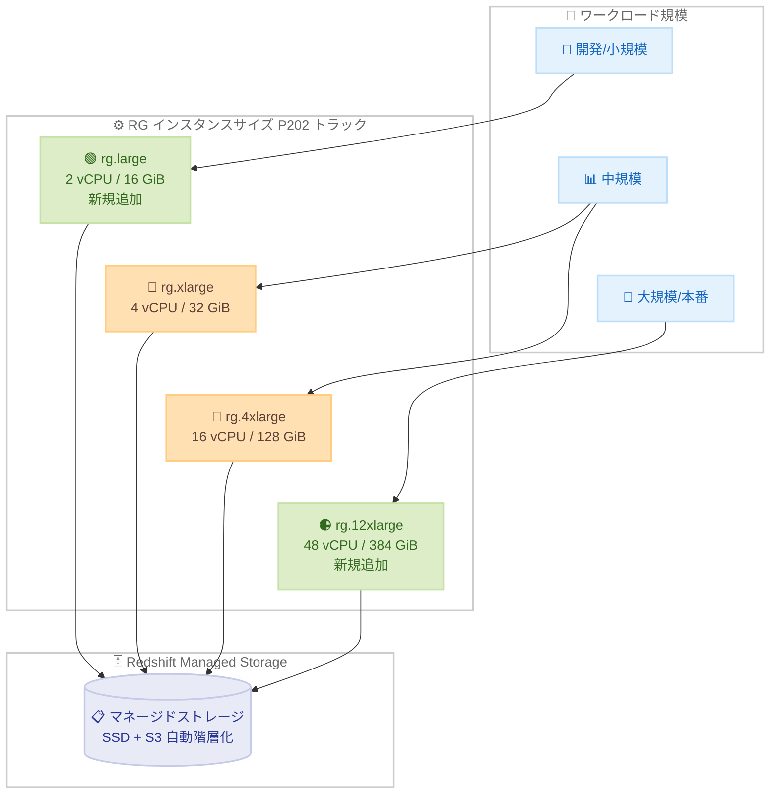

# Amazon Redshift - rg.large および rg.12xlarge インスタンスサイズの追加

**リリース日**: 2026 年 7 月 16 日
**サービス**: Amazon Redshift
**機能**: RG インスタンスの新しいサイズ (rg.large および rg.12xlarge)

📊 [このアップデートのインフォグラフィックを見る](https://takech9203.github.io/aws-news-summary/20260716-amazon-redshift-adds-rg-large-12xlarge-instance-sizes.html)

## 概要

Amazon Redshift が、AWS Graviton プロセッサを搭載した RG インスタンスに 2 つの新しいサイズ、rg.large と rg.12xlarge の一般提供 (GA) を開始した。これにより既存の rg.xlarge および rg.4xlarge と合わせて、RG インスタンスは 4 つのサイズから選択できるようになった。

RG インスタンスは、前世代の RA3 インスタンスと比較してクエリパフォーマンスが最大 2.4 倍高速で、vCPU あたりの価格が 30% 低い。今回追加された小規模な rg.large と大規模な rg.12xlarge により、お客様は小規模な開発環境から大規模な本番ワークロードまで、プロビジョンドクラスターをワークロードに応じて適切なサイズに調整できる柔軟性が高まった。

新しいサイズは現行トラック「P202」でのみ利用可能であり、トレーリングトラック「P201」を利用しているお客様は引き続き rg.xlarge と rg.4xlarge を使用できる。

**アップデート前の課題**

- RG インスタンスは rg.xlarge (4 vCPU) と rg.4xlarge (16 vCPU) の 2 サイズのみで、選択肢が限られていた
- 小規模なワークロードや開発環境向けに、より小さく低コストな RG 構成を選択できなかった
- 大規模ワークロード向けに、単一ノードあたりのコンピューティング能力が高い RG 構成を選択できなかった
- ワークロードの規模に応じた細かな適正サイジングが困難だった

**アップデート後の改善**

- 小規模向けの rg.large (2 vCPU / 16 GiB) が追加され、より低コストで RG インスタンスを利用開始できるようになった
- 大規模向けの rg.12xlarge (48 vCPU / 384 GiB) が追加され、高いコンピューティング能力を必要とするワークロードに対応できるようになった
- 2 サイズから 4 サイズに拡充され、ワークロードに応じた適正サイジングの柔軟性が向上した
- RA3 クラスターからのマイグレーションパス (スナップショット/リストア、エラスティックリサイズ、クラシックリサイズ) を通じて既存環境から移行できる

## アーキテクチャ図



新しい rg.large と rg.12xlarge の追加により、小規模から大規模まで幅広いワークロード規模に対して適正サイズの RG クラスターを選択できるようになった。いずれのサイズも Redshift Managed Storage を共有し、コンピューティングとストレージを独立してスケールおよび課金できる。

## サービスアップデートの詳細

### 主要機能

1. **rg.large の追加 (小規模向け)**
   - 2 vCPU、16 GiB RAM のエントリーサイズ
   - マルチノード構成で 2〜16 ノードをサポート
   - ノードあたりのマネージドストレージ上限は 8 TB、最大構成で合計 128 TB
   - 開発環境や小規模な本番ワークロードでの低コストな利用に適している

2. **rg.12xlarge の追加 (大規模向け)**
   - 48 vCPU、384 GiB RAM の最大サイズ
   - 2〜128 ノードをサポートし、最大構成で合計 16,384 TB のマネージドストレージ
   - 高いコンピューティング能力を必要とする大規模分析ワークロードに対応

3. **トラック要件 (P202)**
   - 新しい 2 サイズは現行トラック「P202」でのみ利用可能
   - トレーリングトラック「P201」では引き続き rg.xlarge と rg.4xlarge を利用可能
   - RG インスタンスは AWS Graviton プロセッサ搭載で、RA3 比で最大 2.4 倍のパフォーマンスと vCPU あたり 30% のコスト削減を提供

4. **RA3 からのマイグレーションパス**
   - 既存の RA3 クラスターは、スナップショット/リストア、エラスティックリサイズ、クラシックリサイズを通じて RG インスタンスへ移行可能

## 技術仕様

### RG ノードタイプ仕様

| ノードタイプ | vCPU | RAM (GiB) | ノードあたりスライス数 | ノードあたりマネージドストレージ上限 | ノード範囲 | 合計マネージドストレージ容量 |
|------|------|-----------|------------------|------------------------------|-----------|--------------------------|
| rg.large (マルチノード) | 2 | 16 | 2 | 8 TB | 2〜16 | 128 TB |
| rg.xlarge (マルチノード) | 4 | 32 | 2 | 32 TB | 2〜16 | 1,024 TB |
| rg.4xlarge | 16 | 128 | 8 | 128 TB | 2〜32 | 8,192 TB |
| rg.12xlarge | 48 | 384 | 16 | 128 TB | 2〜128 | 16,384 TB |

rg.xlarge (マルチノード) はエラスティックリサイズで最大 32 ノード、rg.4xlarge はエラスティックリサイズで最大 64 ノードまで拡張できる。

### RA3 との対応関係

| 項目 | RG インスタンス | RA3 インスタンス |
|------|----------------|-----------------|
| プロセッサ | AWS Graviton 搭載 | 前世代 |
| データレイククエリ | 統合データレイククエリエンジン (クラスター上で直接実行) | Redshift Spectrum を使用 |
| パフォーマンス | RA3 比で最大 2.4 倍高速 | 基準 |
| vCPU あたり価格 | RA3 比で 30% 低減 | 基準 |
| マネージドストレージ | 対応 | 対応 |

rg.large は ra3.large (マルチノード) に、rg.12xlarge は ra3.16xlarge (48 vCPU / 384 GiB) に相当するスペックであり、RA3 の全レンジをカバーする構成が RG でも選択可能になった。

## 設定方法

### 前提条件

1. 新しいサイズを利用するには、クラスターが現行トラック「P202」であること
2. RG インスタンスをサポートする AWS リージョンでクラスターを作成すること
3. VPC 内にクラスターを配置すること (RG ノードタイプは VPC 内で起動する)

### 手順

#### ステップ1: 新規クラスターの作成

```bash
aws redshift create-cluster \
  --cluster-identifier my-rg-cluster \
  --node-type rg.large \
  --number-of-nodes 2 \
  --master-username admin \
  --master-user-password <password> \
  --maintenance-track-name P202
```

このコマンドは、rg.large ノードタイプで 2 ノードのクラスターを P202 トラックで作成する。小規模ワークロードや開発環境に適した構成となる。

#### ステップ2: 既存 RA3 クラスターからのエラスティックリサイズ

```bash
aws redshift resize-cluster \
  --cluster-identifier my-existing-cluster \
  --node-type rg.12xlarge \
  --number-of-nodes 4 \
  --classic false
```

このコマンドは、既存クラスターを rg.12xlarge ノードタイプ 4 ノードへエラスティックリサイズする。大規模ワークロード向けにコンピューティング能力を高める場合に使用する。

#### ステップ3: スナップショットからのリストアによる移行

RA3 クラスターのスナップショットを取得し、リストア時に RG ノードタイプを指定することで移行できる。エラスティックリサイズが利用できない構成変更の場合は、スナップショット/リストアまたはクラシックリサイズを使用する。

## メリット

### ビジネス面

- **コスト最適化**: rg.large により低コストで RG インスタンスを利用開始でき、開発環境や小規模ワークロードの費用を抑えられる
- **柔軟な適正サイジング**: 4 つのサイズから選択でき、ワークロードの規模に応じて過剰プロビジョニングを避けられる
- **価格性能比の向上**: RA3 比で vCPU あたり 30% のコスト削減を、より広いサイズレンジで享受できる

### 技術面

- **スケーラビリティ**: rg.12xlarge により単一ノードあたり 48 vCPU / 384 GiB の高い処理能力を確保でき、大規模分析に対応
- **統合データレイククエリ**: RG インスタンスは Redshift Spectrum を必要とせず、クラスター上で直接データレイククエリを実行
- **既存環境からの移行容易性**: スナップショット/リストア、エラスティックリサイズ、クラシックリサイズで RA3 から移行可能

## デメリット・制約事項

### 制限事項

- 新しい 2 サイズ (rg.large、rg.12xlarge) は現行トラック「P202」でのみ利用可能で、トレーリングトラック「P201」では利用できない
- RG インスタンスはマルチノード構成が基本であり、rg.large の最小ノード数は 2 (本番用途にシングルノードは非推奨)
- ノードあたりのマネージドストレージ上限は各サイズで固定 (rg.large は 8 TB、rg.4xlarge / rg.12xlarge は 128 TB)

### 考慮すべき点

- P201 トラックを利用中のクラスターで新しいサイズを使うには、P202 トラックへの切り替えが必要
- ノードタイプ変更の方法 (エラスティックリサイズ/クラシックリサイズ/スナップショットリストア) は移行元と移行先の構成によって選択する必要がある
- リージョンによって利用可否が異なるため、対象リージョンでのサポート状況を確認すること

## ユースケース

### ユースケース1: 開発/検証環境のコスト削減

**シナリオ**: 本番は rg.4xlarge クラスターを運用しているが、開発・検証環境のコストを抑えたい。

**実装例**:
```
本番: rg.4xlarge × 4 ノード
開発: rg.large × 2 ノード (新規)
```

**効果**: 開発環境を小規模な rg.large で構成することで、RG インスタンスの価格性能比を維持しながら開発コストを大幅に削減できる。

### ユースケース2: 大規模分析ワークロードへの対応

**シナリオ**: データ量とクエリ同時実行数が増加し、既存クラスターのコンピューティング能力が不足している。

**実装例**:
```
変更前: rg.4xlarge × 16 ノード (256 vCPU)
変更後: rg.12xlarge × 6 ノード (288 vCPU)
```

**効果**: rg.12xlarge を利用することで、より少ないノード数で高いコンピューティング能力を確保でき、大規模分析ワークロードのパフォーマンスを向上できる。

### ユースケース3: RA3 からの段階的移行

**シナリオ**: ra3.large および ra3.16xlarge のクラスターを運用しており、価格性能比の高い RG インスタンスへ移行したい。

**実装例**:
```
ra3.large (マルチノード) → rg.large
ra3.16xlarge → rg.12xlarge
```

**効果**: RA3 の各サイズに対応する RG サイズが揃ったことで、既存構成に近いスペックを維持したままスナップショット/リストアやリサイズで移行でき、vCPU あたり 30% のコスト削減とパフォーマンス向上を実現できる。

## 料金

RG インスタンスは、オンデマンド料金に加えて、1 年および 3 年のリザーブドインスタンス (前払いなし) の柔軟な料金オプションをサポートする。料金はリージョン、ノードタイプ、ノード数、リザーブドの有無によって異なる。マネージドストレージは、コンピューティングとは独立して使用量に応じて課金される。

正確な料金は Amazon Redshift の料金ページを参照すること。

## 利用可能リージョン

新しい rg.large および rg.12xlarge サイズは、以下を含む多数の AWS リージョンで利用可能である。米国東部 (バージニア北部、オハイオ)、米国西部 (オレゴン、北カリフォルニア)、カナダ (中部)、メキシコ (中部)、南米 (サンパウロ)、欧州 (アイルランド、フランクフルト、ロンドン、パリ、ストックホルム、スペイン)、アフリカ (ケープタウン)、アジアパシフィック (東京、ソウル、シンガポール、シドニー、ムンバイ、ジャカルタ、香港、大阪、マレーシア、ハイデラバード、台湾、タイ、メルボルン)。

東京および大阪リージョンでも利用可能である。

## 関連サービス・機能

- **AWS Graviton**: RG インスタンスの基盤となるプロセッサで、分析ワークロードに優れた価格性能比を提供
- **Redshift Managed Storage (RMS)**: RG および RA3 ノードで使用されるマネージドストレージで、コンピューティングとストレージを独立してスケール可能
- **Amazon S3 / Apache Iceberg**: RG インスタンスの統合データレイククエリエンジンが直接クエリ可能なデータレイクストレージ
- **Amazon Redshift Serverless**: プロビジョニング不要でワークロードに応じて自動スケールする別のデプロイオプション

## 参考リンク

- 📊 [インフォグラフィック](https://takech9203.github.io/aws-news-summary/20260716-amazon-redshift-adds-rg-large-12xlarge-instance-sizes.html)
- [公式発表 (What's New)](https://aws.amazon.com/about-aws/whats-new/2026/07/amazon-redshift-adds-rg-large-12xlarge-instance-sizes)
- [ドキュメント (Amazon Redshift provisioned clusters - ノードタイプ詳細)](https://docs.aws.amazon.com/redshift/latest/mgmt/working-with-clusters.html)
- [料金ページ (Amazon Redshift pricing)](https://aws.amazon.com/redshift/pricing/)

## まとめ

今回のアップデートにより、Graviton 搭載の RG インスタンスに小規模な rg.large と大規模な rg.12xlarge が加わり、選択肢が 4 サイズに拡充された。これにより開発環境から大規模本番ワークロードまで幅広い規模で適正サイジングが可能になり、RA3 の全サイズレンジに対応する移行先が揃った。RA3 クラスターを運用しているお客様は、P202 トラックへの切り替えと適切なリサイズ手法を検討し、価格性能比の高い RG インスタンスへの移行を評価することを推奨する。
