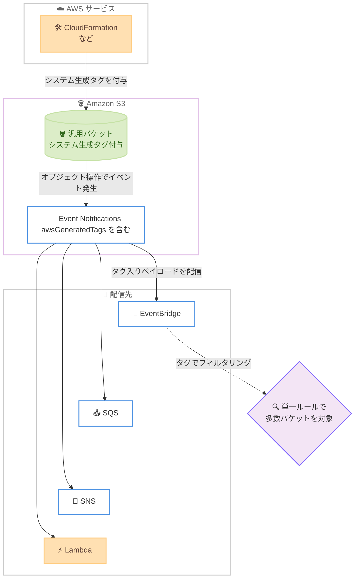

# Amazon S3 - Event Notifications にシステム生成タグを追加

**リリース日**: 2026年7月16日
**サービス**: Amazon Simple Storage Service (Amazon S3)
**機能**: Amazon S3 Event Notifications のシステム生成タグ

📊 [このアップデートのインフォグラフィックを見る](https://takech9203.github.io/aws-news-summary/20260716-amazon-s3-event-notifications-system-generated-tags.html)
<!-- INFOGRAPHIC_BASE_URL は環境変数から取得 -->

## 概要

Amazon S3 Event Notifications が、配信するイベントにシステム生成タグ (system-generated tags) を含めるようになりました。システム生成タグとは、AWS CloudFormation などの AWS サービスがバケットに付与するメタデータラベルです。今回のアップデートにより、これらのタグが通知ペイロード内のメタデータとして自動的に含まれるようになります。

汎用バケット (general purpose bucket) で S3 Event Notifications を有効化すると、AWS サービスが既にシステム生成タグを付与している場合、S3 は新しいイベント通知にそれらのタグを自動的に含めます。この機能により、数千個のバケットからのイベントを、バケット名を個別に指定することなく、単一の Amazon EventBridge ルールでフィルタリングできるようになります。

タグは Amazon EventBridge、Amazon SQS、Amazon SNS、AWS Lambda を含むすべての配信先に配信されます。既存の設定を変更する必要はなく、追加料金なしで利用できます。

**アップデート前の課題**

このアップデート以前は、S3 Event Notifications にバケットのシステム生成タグ情報が含まれていませんでした。

- 以前は多数のバケットからのイベントをフィルタリングするために、EventBridge ルールでバケット名を個別に列挙する必要があった
- 以前はイベント通知の受信側でバケットの分類情報 (プロジェクト、環境など) を取得するために、別途 S3 API を呼び出す必要があった
- 以前は AWS CloudFormation などが付与したタグをイベント処理ロジックで直接利用できなかった

**アップデート後の改善**

今回のアップデートにより、システム生成タグをイベント通知に含めて活用できるようになりました。

- 今回のアップデートにより、数千個のバケットからのイベントを単一の EventBridge ルールでフィルタリングできるようになった
- 今回のアップデートにより、通知ペイロードだけでバケットのメタデータを判別でき、追加の API 呼び出しが不要になった
- 今回のアップデートにより、既存の設定を変更することなくタグ情報を受け取れるようになった

## アーキテクチャ図



AWS サービスがバケットに付与したシステム生成タグが、S3 Event Notifications のペイロードに `awsGeneratedTags` として含まれ、各配信先に届く流れを示しています。EventBridge ではこのタグを用いて、多数のバケットを単一ルールで対象にできます。

## サービスアップデートの詳細

### 主要機能

1. **システム生成タグのイベント通知への自動包含**
   - AWS CloudFormation などの AWS サービスがバケットに付与したシステム生成タグを、S3 Event Notifications が自動的に検出する
   - 汎用バケットで S3 Event Notifications を有効化すると、既存のシステム生成タグが新しいイベント通知に含まれる
   - 既存の通知設定の変更は不要

2. **すべての配信先へのタグ配信**
   - Amazon EventBridge、Amazon SQS、Amazon SNS、AWS Lambda のすべての配信先にタグが配信される
   - 各配信先のイベント処理ロジックでタグを直接参照できる

3. **単一 EventBridge ルールによる多数バケットのフィルタリング**
   - バケット名を個別に指定することなく、システム生成タグを条件に数千個のバケットからのイベントをフィルタリングできる
   - タグベースの管理により、バケットの追加や削除があってもルールの更新が不要になる

## 技術仕様

### イベント通知の構造

イベント通知メッセージ (JSON) の `s3.bucket` ブロックに、新しく `awsGeneratedTags` フィールドが追加されます。これは AWS サービスが生成しバケットに付与したタグのキーとバリューのペアのマップです。

| 項目 | 詳細 |
|------|------|
| フィールド名 | `awsGeneratedTags` |
| 配置場所 | イベントペイロードの `s3.bucket` ブロック内 |
| 形式 | タグのキーとバリューのペアのマップ |
| 表示条件 | バケットに AWS 生成タグが存在する場合のみ含まれる |
| 対象外イベント | クロスリージョンレプリケーションイベントでは含まれない |
| イベントバージョン | version 2.4 以降で単一の統一バージョンを使用 (本フィールドは version 2.5 のスキーマ例に記載) |

### イベントペイロード例

```json
{
  "Records": [
    {
      "eventVersion": "2.5",
      "eventSource": "aws:s3",
      "awsRegion": "us-west-2",
      "eventName": "ObjectCreated:Put",
      "s3": {
        "s3SchemaVersion": "1.0",
        "configurationId": "testConfigRule",
        "bucket": {
          "name": "amzn-s3-demo-bucket",
          "ownerIdentity": {
            "principalId": "A3NL1KOZZKExample"
          },
          "arn": "arn:aws:s3:::amzn-s3-demo-bucket",
          "awsGeneratedTags": {
            "aws:cloudformation:stack-name": "my-app-stack",
            "aws:cloudformation:logical-id": "DataBucket"
          }
        },
        "object": {
          "key": "HappyFace.jpg",
          "size": 1024,
          "eTag": "d41d8cd98f00b204e9800998ecf8427e"
        }
      }
    }
  ]
}
```

`bucket` ブロックに `awsGeneratedTags` が含まれ、CloudFormation が付与したスタック名などのタグを参照できます。

### バージョン互換性に関する注意

- イベント構造のマイナーバージョンには、新しいフィールドの追加が含まれる
- アプリケーションはメジャーバージョン番号を等価比較し、マイナーバージョン番号は以上比較することが推奨される
- 新しいマイナーバージョンとの互換性を保つため、アプリケーションは未知のフィールドを無視するよう実装することが推奨される

## 設定方法

### 前提条件

1. 対象が汎用バケット (general purpose bucket) であること
2. バケットに AWS サービス (AWS CloudFormation など) によるシステム生成タグが付与されていること
3. イベントを受け取る配信先 (EventBridge、SQS、SNS、Lambda のいずれか) が用意されていること

### 手順

#### ステップ1: S3 Event Notifications を有効化する

```bash
# S3 バケットで EventBridge へのイベント通知を有効化する
aws s3api put-bucket-notification-configuration \
  --bucket amzn-s3-demo-bucket \
  --notification-configuration '{"EventBridgeConfiguration": {}}'
```

このコマンドは、対象バケットのオブジェクトイベントを Amazon EventBridge に送信するよう通知設定を有効化します。AWS Management Console、AWS SDK、AWS CLI から設定できます。

#### ステップ2: EventBridge ルールでシステム生成タグをフィルタリングする

```json
{
  "source": ["aws.s3"],
  "detail-type": ["Object Created"],
  "detail": {
    "bucket": {
      "awsGeneratedTags": {
        "aws:cloudformation:stack-name": ["my-app-stack"]
      }
    }
  }
}
```

このイベントパターンは、特定の CloudFormation スタックに属するすべてのバケットからのオブジェクト作成イベントを対象とします。バケット名を個別に列挙する必要はありません。

#### ステップ3: 配信先でタグを利用する

Lambda、SQS、SNS の各配信先では、受信したイベントペイロードの `s3.bucket.awsGeneratedTags` を参照することで、追加の API 呼び出しなしにバケットの分類情報を取得し、処理を分岐できます。

## メリット

### ビジネス面

- **運用管理の簡素化**: バケット名を個別に管理する代わりにタグベースでイベントを扱えるため、バケットが増減しても設定の更新が不要になる
- **追加コストなし**: 追加料金なしで利用でき、既存の設定変更も不要なため、導入のハードルが低い
- **一貫したガバナンス**: CloudFormation などが付与するタグをイベント処理に反映でき、リソース分類のルールをイベント駆動処理まで一貫して適用できる

### 技術面

- **API 呼び出しの削減**: 通知ペイロードにタグが含まれるため、バケットのメタデータ取得のための追加 API 呼び出しが不要になる
- **スケーラブルなフィルタリング**: 単一の EventBridge ルールで数千個のバケットを対象にでき、ルールの数を抑えられる
- **後方互換性のある変更**: 既存のイベント処理に影響を与えないマイナーバージョンの追加フィールドとして提供される

## デメリット・制約事項

### 制限事項

- 対象は汎用バケット (general purpose bucket) である
- クロスリージョンレプリケーションイベントには `awsGeneratedTags` フィールドは含まれない
- `awsGeneratedTags` は、バケットに AWS 生成タグが存在する場合のみペイロードに含まれる
- 含まれるのは AWS サービスが生成したシステム生成タグであり、ユーザーが手動で付与したタグとは区別される

### 考慮すべき点

- 既存のイベント処理コードが未知のフィールドを無視するように実装されているか確認する
- イベント構造のバージョン比較 (メジャーは等価比較、マイナーは以上比較) を実装しておくことで、将来のスキーマ変更に対応しやすくなる

## ユースケース

### ユースケース1: プロジェクト単位のイベント集約

**シナリオ**: CloudFormation で多数のバケットをプロビジョニングしており、特定スタックに属するバケットのオブジェクト作成イベントのみを一元的に処理したい。

**実装例**:
```json
{
  "detail": {
    "bucket": {
      "awsGeneratedTags": {
        "aws:cloudformation:stack-name": ["analytics-pipeline-stack"]
      }
    }
  }
}
```

**効果**: バケット名を列挙することなく、スタックに属するすべてのバケットのイベントを単一ルールで捕捉できる。

### ユースケース2: 環境別の処理分岐

**シナリオ**: 本番環境と検証環境のバケットが混在する環境で、Lambda 関数内で環境ごとに異なる処理を実行したい。

**実装例**:
```python
def handler(event, context):
    for record in event["Records"]:
        tags = record["s3"]["bucket"].get("awsGeneratedTags", {})
        stack = tags.get("aws:cloudformation:stack-name", "")
        if "prod" in stack:
            process_production(record)
        else:
            process_staging(record)
```

**効果**: 追加の API 呼び出しなしに、ペイロードのタグだけで処理を分岐できる。

### ユースケース3: 大規模なバケット群の監査

**シナリオ**: 数千個のバケットを運用しており、特定の分類タグを持つバケットへの書き込みを SQS 経由で監査基盤に集約したい。

**実装例**:
```json
{
  "detail-type": ["Object Created", "Object Deleted"],
  "detail": {
    "bucket": {
      "awsGeneratedTags": {
        "aws:cloudformation:stack-name": ["audited-data-stack"]
      }
    }
  }
}
```

**効果**: バケットの追加や削除に追従してルールを更新する運用が不要になり、監査の網羅性を維持できる。

## 料金

このアップデートは追加料金なしで利用できます。システム生成タグは既存の S3 Event Notifications のペイロードに含まれるため、通知機能そのものに追加のコストは発生しません。EventBridge、SQS、SNS、Lambda など各配信先の利用料金は、それぞれのサービスの通常の料金体系に従います。

## 利用可能リージョン

すべての AWS リージョンで利用可能です。

## 関連サービス・機能

- **Amazon EventBridge**: システム生成タグをイベントパターンに用いて、多数のバケットからのイベントを単一ルールでフィルタリングできる
- **Amazon SQS / Amazon SNS**: タグを含むイベントペイロードを配信先として受け取れる
- **AWS Lambda**: 受信イベントの `awsGeneratedTags` を参照して、タグに応じた処理を実行できる
- **AWS CloudFormation**: バケットにシステム生成タグ (スタック名、論理 ID など) を付与する代表的な AWS サービス

## 参考リンク

- 📊 [インフォグラフィック](https://takech9203.github.io/aws-news-summary/20260716-amazon-s3-event-notifications-system-generated-tags.html)
- [公式発表 (What's New)](https://aws.amazon.com/about-aws/whats-new/2026/07/amazon-s3-event-notifications-system-generated-tags/)
- [ドキュメント (Event message structure)](https://docs.aws.amazon.com/AmazonS3/latest/userguide/notification-content-structure.html)
- [Amazon S3 Event Notifications](https://docs.aws.amazon.com/AmazonS3/latest/userguide/EventNotifications.html)

## まとめ

このアップデートにより、S3 Event Notifications がバケットのシステム生成タグを配信ペイロードに含めるようになり、タグベースでのスケーラブルなイベント処理が可能になりました。特に多数のバケットを運用する環境では、単一の EventBridge ルールによるフィルタリングや、追加 API 呼び出しの削減という具体的なメリットがあります。追加料金なし、設定変更不要で利用できるため、既存のイベント駆動アーキテクチャを見直し、タグを活用したフィルタリングや処理分岐の導入を検討することをお勧めします。
