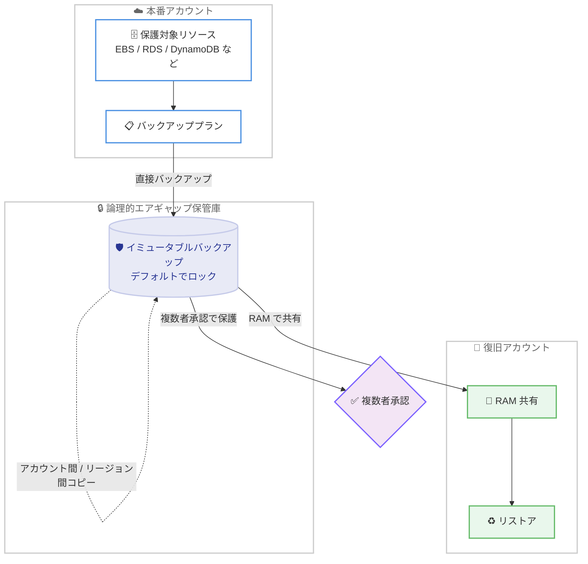

# AWS Backup - 論理的エアギャップ保管庫のリージョン拡大

**リリース日**: 2026 年 7 月 16 日
**サービス**: AWS Backup
**機能**: 論理的エアギャップ保管庫 (Logically Air-Gapped Vault)

📊 [このアップデートのインフォグラフィックを見る](https://takech9203.github.io/aws-news-summary/20260716-aws-backup-logically-air-gapped-vault-regions.html)
<!-- INFOGRAPHIC_BASE_URL は環境変数から取得 -->

## 概要

AWS Backup の論理的エアギャップ保管庫が、新たに 7 つの AWS リージョンで利用可能になりました。今回追加されたリージョンは、アジアパシフィック (台北)、アジアパシフィック (マレーシア)、アジアパシフィック (ニュージーランド)、アジアパシフィック (タイ)、イスラエル (テルアビブ)、メキシコ (中部)、カナダ西部 (カルガリー) です。これにより、より多くの地域のお客様がデータ保護とランサムウェア対策のためのイミュータブルなバックアップを利用できるようになりました。

論理的エアギャップ保管庫は、デフォルトでロックされたイミュータブル (変更不可) かつ隔離されたバックアップを保存するためのバックアップ保管庫です。バックアップは AWS 所有のキーまたはカスタマーマネージドキーで暗号化され、アカウント間およびリージョン間でのコピー、AWS Resource Access Manager (RAM) を利用した保管庫の共有、アカウント侵害時の保管庫アクセスを保護する複数者承認 (Multi-party approval) に対応しています。

この機能は、ランサムウェア攻撃や誤操作、悪意のある内部関係者によるデータ破壊からの復旧を目的とした組織にとって特に有用です。バックアップデータを本番アカウントから論理的に隔離することで、万が一プライマリアカウントが侵害された場合でも、クリーンなリカバリソースを確保できます。

**アップデート前の課題**

これまで論理的エアギャップ保管庫を利用できるリージョンは限られていました。

- 今回追加された 7 リージョンでは論理的エアギャップ保管庫を利用できなかった
- 対象リージョンでのデータレジデンシー要件を満たしつつイミュータブルバックアップを構成することが難しかった
- リージョン外に保管庫を作成した場合、リージョン内復旧のレイテンシーやコンプライアンス上の懸念があった

**アップデート後の改善**

今回のアップデートにより、対象 7 リージョンでも論理的エアギャップ保管庫を直接構成できるようになりました。

- 追加された 7 リージョンで論理的エアギャップ保管庫を作成し、イミュータブルバックアップを保存できるようになった
- 各リージョン内でデータレジデンシー要件を満たしながらランサムウェア対策を実施できるようになった
- アカウント間・リージョン間コピーや RAM 共有、複数者承認を対象リージョンでも活用できるようになった

## アーキテクチャ図



本番アカウントのリソースを論理的エアギャップ保管庫へ直接バックアップし、RAM 共有と複数者承認によって隔離された安全なリカバリ経路を確保する構成を示しています。

## サービスアップデートの詳細

### 主要機能

1. **イミュータブルで隔離されたバックアップ**
   - デフォルトでロックされ、変更や削除ができないイミュータブルなバックアップを保存
   - 本番環境から論理的に隔離することで、アカウント侵害時にもクリーンなリカバリソースを維持
   - ランサムウェアや誤操作、悪意のある削除からデータを保護

2. **柔軟な暗号化オプション**
   - AWS 所有のキー、またはカスタマーマネージドキー (customer-managed key) による暗号化に対応
   - 組織の鍵管理ポリシーやコンプライアンス要件に合わせて選択可能

3. **アカウント間・リージョン間コピー**
   - バックアップをアカウント間およびリージョン間でコピー可能
   - ディザスタリカバリやマルチリージョン戦略に対応

4. **RAM による保管庫共有と復旧**
   - AWS Resource Access Manager (RAM) を利用して、復旧用に保管庫を他のアカウントと共有
   - 復旧専用アカウントへの安全なアクセス経路を提供

5. **複数者承認 (Multi-party approval)**
   - アカウント侵害時における保管庫へのアクセスを保護
   - 重要な操作に対して複数者による承認を要求し、単一の侵害された認証情報による不正操作を防止

## 技術仕様

### 今回追加されたリージョン

| リージョン | リージョンコード (参考) |
|------|------|
| アジアパシフィック (台北) | ap-east-2 |
| アジアパシフィック (マレーシア) | ap-southeast-5 |
| アジアパシフィック (ニュージーランド) | ap-southeast-6 |
| アジアパシフィック (タイ) | ap-southeast-7 |
| イスラエル (テルアビブ) | il-central-1 |
| メキシコ (中部) | mx-central-1 |
| カナダ西部 (カルガリー) | ca-west-1 |

**注記**: リージョンコードは参考情報です。正確なコードは AWS 公式ドキュメントでご確認ください。

### 主な特性

| 項目 | 詳細 |
|------|------|
| バックアップの状態 | イミュータブル、デフォルトでロック |
| 隔離レベル | 本番アカウントから論理的に隔離 |
| 暗号化 | AWS 所有のキー または カスタマーマネージドキー |
| コピー | アカウント間 / リージョン間コピーに対応 |
| 共有 | AWS RAM による復旧用共有 |
| アクセス保護 | 複数者承認 (Multi-party approval) |

## 設定方法

### 前提条件

1. 対象リージョンで AWS Backup を利用できること
2. バックアップ対象リソースが AWS Backup でサポートされていること
3. 保管庫共有を利用する場合は AWS RAM の設定権限を持つこと

### 手順

#### ステップ 1: 論理的エアギャップ保管庫の作成

AWS Backup コンソール、AWS CLI、または AWS SDK を使用して、対象リージョンで論理的エアギャップ保管庫を作成します。以下は AWS CLI を使用した作成例です。

```bash
aws backup create-logically-air-gapped-backup-vault \
    --backup-vault-name my-lag-vault \
    --min-retention-days 7 \
    --max-retention-days 365 \
    --region ap-east-2
```

このコマンドは、指定したリージョン (ここでは台北) に論理的エアギャップ保管庫を作成し、最小保持期間と最大保持期間を指定しています。論理的エアギャップ保管庫では保持期間の指定が必須です。

#### ステップ 2: バックアッププランへの保管庫の指定

作成した保管庫を宛先とするバックアッププランを構成し、対象リソースを割り当てます。バックアップは作成した論理的エアギャップ保管庫へ直接保存されます。

#### ステップ 3: RAM による保管庫の共有 (任意)

復旧用に他のアカウントと保管庫を共有する場合は、AWS RAM を使用してリソース共有を作成します。これにより、侵害されていない別アカウントから安全にリストアを実行できます。

## メリット

### ビジネス面

- **コンプライアンス対応**: 対象リージョン内でデータレジデンシー要件を満たしながらイミュータブルバックアップを構成可能
- **事業継続性の向上**: ランサムウェア攻撃後もクリーンなリカバリソースから迅速に復旧可能
- **ガバナンス強化**: 複数者承認により重要操作に対する統制を強化

### 技術面

- **論理的隔離**: 本番アカウントから隔離された保管庫により攻撃対象領域を縮小
- **イミュータビリティ**: デフォルトロックにより意図しない削除や改ざんを防止
- **マルチリージョン / マルチアカウント対応**: コピーと RAM 共有により柔軟なディザスタリカバリ構成が可能

## デメリット・制約事項

### 制限事項

- 論理的エアギャップ保管庫では保持期間の設定が必須となる
- 対応リソースタイプは AWS Backup のサポート範囲に依存する
- 保管庫の共有は復旧を目的とした RAM 共有に限定される

### 考慮すべき点

- イミュータブルバックアップの保持期間はストレージコストに直結するため、保持ポリシーを慎重に設計する必要がある
- 複数者承認を運用する場合、承認者の体制や運用フローを事前に整備する必要がある
- 最新の対応リージョンおよび対応リソースは AWS 公式ドキュメントで確認することを推奨

## ユースケース

### ユースケース 1: ランサムウェア対策

**シナリオ**: 本番アカウントが侵害された場合でも、隔離されたクリーンなバックアップから復旧したい。

**効果**: 論理的エアギャップ保管庫のイミュータブルバックアップにより、攻撃者がバックアップを削除・改ざんできず、確実に復旧可能。

### ユースケース 2: データレジデンシー要件への対応

**シナリオ**: イスラエルやメキシコなど特定リージョン内にデータを保持する規制要件がある。

**効果**: 対象リージョン内で論理的エアギャップ保管庫を構成でき、データレジデンシー要件を満たしながらイミュータブルバックアップを実現。

### ユースケース 3: マルチアカウントのディザスタリカバリ

**シナリオ**: 復旧専用アカウントを分離し、有事の際に安全にリストアを実行したい。

**効果**: RAM 共有により復旧アカウントへ保管庫を共有し、複数者承認と組み合わせて統制の効いたリカバリ体制を構築。

## 料金

論理的エアギャップ保管庫の料金は、保存されるバックアップストレージ量に基づきます。詳細な料金体系は AWS Backup の料金ページでご確認ください。リージョンによって料金が異なる場合があります。

## 利用可能リージョン

今回のアップデートにより、以下の 7 リージョンが新たに追加されました。

- アジアパシフィック (台北)
- アジアパシフィック (マレーシア)
- アジアパシフィック (ニュージーランド)
- アジアパシフィック (タイ)
- イスラエル (テルアビブ)
- メキシコ (中部)
- カナダ西部 (カルガリー)

対応リージョンの完全なリストは AWS Backup の公式ドキュメントでご確認ください。

## 関連サービス・機能

- **AWS Resource Access Manager (RAM)**: 復旧用に論理的エアギャップ保管庫を他アカウントと共有
- **AWS Key Management Service (KMS)**: カスタマーマネージドキーによるバックアップの暗号化
- **AWS Organizations**: マルチアカウント環境でのバックアップポリシーの一元管理

## 参考リンク

- 📊 [インフォグラフィック](https://takech9203.github.io/aws-news-summary/20260716-aws-backup-logically-air-gapped-vault-regions.html)
- [公式発表 (What's New)](https://aws.amazon.com/about-aws/whats-new/2026/07/aws-backup-logically-air-gapped-vault-regions/)
- [ドキュメント (AWS Backup - Logically air-gapped vault)](https://docs.aws.amazon.com/aws-backup/latest/devguide/logicallyairgappedvault.html)
- [料金ページ (AWS Backup)](https://aws.amazon.com/backup/pricing/)

## まとめ

今回のアップデートにより、論理的エアギャップ保管庫が 7 つの新規リージョンで利用可能になり、より多くの地域でランサムウェア対策とデータレジデンシー要件への対応が可能になりました。対象リージョンでデータ保護を検討している組織は、イミュータブルバックアップと複数者承認を組み合わせた堅牢なリカバリ体制の構築を検討することを推奨します。
