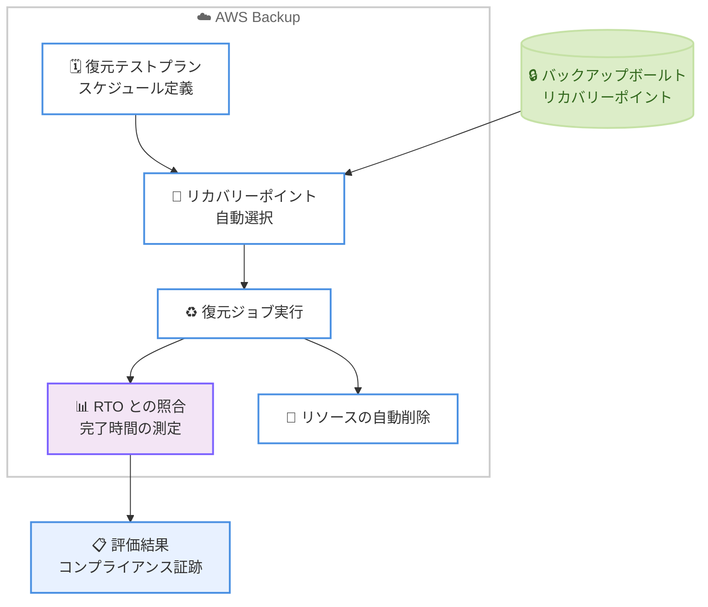

# AWS Backup - 復元テスト (Restore Testing) の対応リージョン拡大

**リリース日**: 2026年7月16日
**サービス**: AWS Backup
**機能**: 復元テスト (Restore Testing)

📊 [このアップデートのインフォグラフィックを見る](https://takech9203.github.io/aws-news-summary/20260716-aws-backup-restore-testing-regions.html)
<!-- INFOGRAPHIC_BASE_URL は環境変数から取得 -->

## 概要

AWS Backup の復元テスト (Restore Testing) 機能が、新たに 7 つの AWS リージョンで利用可能になりました。今回追加されたリージョンは、アジアパシフィック (台北)、アジアパシフィック (マレーシア)、アジアパシフィック (ニュージーランド)、アジアパシフィック (タイ)、イスラエル (テルアビブ)、メキシコ (中部)、カナダ西部 (カルガリー) の 7 リージョンです。

復元テストは、ストレージ、コンピューティング、データベースなど、サポートされている AWS リソースの復元テストを自動化し、スケジュールに沿って定期的に実行する機能です。復元ジョブの完了時間を目標復旧時間 (RTO) と照合して測定することで、実際に障害が発生した際の復旧準備状況を継続的に評価できます。

これにより、災害復旧 (DR) や事業継続 (BCP) に関する規制および法令順守 (コンプライアンス) 要件を満たしやすくなります。今回のリージョン拡大により、これらのリージョンで運用するお客様も、追加のインフラを構築することなく復元テストを実行できるようになりました。

**アップデート前の課題**

- 上記 7 リージョンでは復元テスト機能が利用できず、復旧手順の検証を手動で実施する必要があった
- バックアップからの復元が実際に成功するかどうか、定期的かつ自動的に確認する仕組みがなかった
- RTO を満たせるかどうかを客観的なデータで示すことが難しく、コンプライアンス要件の証跡を残しにくかった

**アップデート後の改善**

- 追加された 7 リージョンでも復元テストプランを作成し、復元テストを自動化できるようになった
- スケジュールに沿って定期的に復元テストを実行し、復旧準備状況を継続的に評価できる
- 復元ジョブの完了時間を RTO と照合して測定し、コンプライアンス要件の証跡として活用できる

## アーキテクチャ図

復元テストプランに基づき、リカバリーポイントの自動選択、復元ジョブの実行、RTO との照合、テスト用リソースの自動削除までを一連の流れで自動化します。

## サービスアップデートの詳細

### 主要機能

1. **復元テストの自動化**
   - サポートされている AWS リソースの復元テストを自動化する
   - ストレージ、コンピューティング、データベースの各サービスにまたがるリソースに対応する
   - リカバリーポイントを自動選択し、復元テストを実施する

2. **スケジュールによる定期実行**
   - 復元テストプランを定義し、スケジュールに沿って定期的に復元テストを実行する
   - 手動作業に依存せず、継続的に復旧準備状況を評価できる

3. **RTO との照合による復旧準備状況の評価**
   - 復元ジョブの完了時間を目標復旧時間 (RTO) と照合して測定する
   - 復旧準備状況を客観的なデータで評価し、災害復旧および事業継続のコンプライアンス要件を満たすための証跡として活用できる

## 技術仕様

### 今回追加されたリージョン

| リージョン名 | リージョンコード |
|------|------|
| アジアパシフィック (台北) | ap-east-2 |
| アジアパシフィック (マレーシア) | ap-southeast-5 |
| アジアパシフィック (ニュージーランド) | ap-southeast-6 |
| アジアパシフィック (タイ) | ap-southeast-7 |
| イスラエル (テルアビブ) | il-central-1 |
| メキシコ (中部) | mx-central-1 |
| カナダ西部 (カルガリー) | ca-west-1 |

<!-- リージョンコードは AWS の一般的な割り当てに基づく参考値です。正確な値は AWS 公式ドキュメントを参照してください -->

### アクセス方法

| 項目 | 詳細 |
|------|------|
| AWS Backup コンソール | ブラウザから復元テストプランを作成・管理 |
| AWS CLI | コマンドラインから復元テストを構成 |
| AWS SDK | プログラムから復元テストを構成 |

## 設定方法

### 前提条件

1. AWS Backup を有効化し、対象リソースのバックアップ (リカバリーポイント) が存在すること
2. 復元テストの対象リソースが、サポートされているサービスに含まれること
3. 復元テストプランおよび復元ジョブを実行するための適切な IAM 権限が付与されていること

### 手順

#### ステップ1: 復元テストプランの作成

AWS Backup コンソールの [復元テスト] メニューから、復元テストプランを作成します。テストの実行頻度 (スケジュール)、対象とするリカバリーポイントの選択条件、開始ウィンドウなどを指定します。

#### ステップ2: 対象リソースの割り当て

作成した復元テストプランに、テスト対象のリソースタイプやリソースの選択条件を割り当てます。これにより、どのリカバリーポイントが復元テストの対象になるかが決まります。

#### ステップ3: 実行結果の確認

スケジュールに沿って復元テストが自動実行された後、復元ジョブのステータスと完了時間を確認します。完了時間を RTO と照合し、復旧準備状況を評価します。テスト用に復元されたリソースは、検証後に自動的に削除できます。

## メリット

### ビジネス面

- **コンプライアンス対応の強化**: 災害復旧および事業継続に関する規制・法令順守要件を満たすための証跡を、自動的かつ定期的に取得できる
- **復旧準備状況の可視化**: RTO を満たせるかどうかを客観的なデータで示せるため、経営層や監査への報告が容易になる
- **対応リージョンの拡大**: 今回追加された 7 リージョンで運用するお客様も、追加コストの高い独自の検証基盤を構築せずに復元テストを実施できる

### 技術面

- **手動検証からの脱却**: 復元手順の検証を自動化し、運用負荷とヒューマンエラーを削減できる
- **継続的な検証**: スケジュール実行により、バックアップが実際に復元可能であることを継続的に確認できる
- **RTO の実測**: 復元ジョブの完了時間を実測することで、机上の RTO と実際の復旧時間のギャップを早期に把握できる

## デメリット・制約事項

### 制限事項

- 復元テストの対象は、AWS Backup がサポートするリソースタイプに限られる
- 復元テストの実行時には、テスト用に復元されたリソースに対して通常の AWS 利用料金が発生する

### 考慮すべき点

- 復元テストの頻度と対象範囲は、コストと検証カバレッジのバランスを考慮して設計する
- テスト用に復元したリソースの自動削除設定を適切に構成し、不要なリソースが残らないようにする

## ユースケース

### ユースケース1: 金融機関におけるコンプライアンス証跡の取得

**シナリオ**: 規制対象の金融システムを運用しており、バックアップからの復旧が RTO 内に完了することを定期的に証明する必要がある。

**効果**: 復元テストを定期実行し、RTO との照合結果を証跡として保管することで、監査対応の負荷を軽減する。

### ユースケース2: 新規リージョンでの DR 体制構築

**シナリオ**: 今回追加されたリージョン (例: メキシコ中部やカナダ西部) で新たにワークロードを展開し、DR 体制を整えたい。

**効果**: 復元テストを利用して、当該リージョンのバックアップが確実に復元可能であることを検証し、DR 計画の信頼性を高める。

### ユースケース3: 定期的な復旧訓練の自動化

**シナリオ**: 従来は担当者が手動でリストア訓練を実施していたが、頻度が低く属人的になっていた。

**効果**: 復元テストプランでスケジュール実行を構成することで、復旧訓練を自動化し、継続的かつ均質な検証を実現する。

## 料金

復元テスト機能自体に追加料金はありませんが、復元テストの実行によって作成される復元ジョブおよび復元されたリソースには、通常の AWS Backup および対象サービスの利用料金が適用されます。詳細は AWS Backup の料金ページを参照してください。

## 利用可能リージョン

今回のアップデートにより、以下の 7 リージョンが新たに追加されました。

- アジアパシフィック (台北)
- アジアパシフィック (マレーシア)
- アジアパシフィック (ニュージーランド)
- アジアパシフィック (タイ)
- イスラエル (テルアビブ)
- メキシコ (中部)
- カナダ西部 (カルガリー)

これらを含む対応リージョンの最新情報は、AWS Backup の公式ドキュメントを参照してください。

## 関連サービス・機能

- **AWS Backup**: バックアップの一元管理を行うサービスで、復元テストはその機能の一部
- **AWS Backup Audit Manager**: バックアップのコンプライアンス状況を監査・レポートする機能で、復元テストと組み合わせてガバナンスを強化できる
- **AWS Resilience Hub**: アプリケーションの回復力を評価・管理するサービスで、DR 戦略全体の中で復元テストを補完する

## 参考リンク

- 📊 [インフォグラフィック](https://takech9203.github.io/aws-news-summary/20260716-aws-backup-restore-testing-regions.html)
- [公式発表 (What's New)](https://aws.amazon.com/about-aws/whats-new/2026/07/aws-backup-restore-testing-regions/)
- [ドキュメント: Restore testing](https://docs.aws.amazon.com/aws-backup/latest/devguide/restore-testing.html)
- [料金ページ](https://aws.amazon.com/backup/pricing/)

## まとめ

今回のアップデートにより、AWS Backup の復元テストが 7 つの新規リージョンで利用可能になり、より多くのお客様が復旧準備状況を自動的かつ継続的に検証できるようになりました。対象リージョンでバックアップを運用している場合は、復元テストプランを作成し、RTO との照合による復旧準備状況の評価とコンプライアンス証跡の自動取得を検討することをおすすめします。
