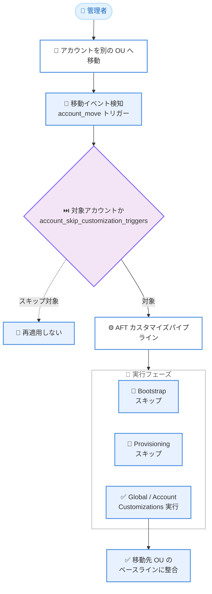

# AWS Control Tower - Account Factory for Terraform が OU 間のアカウント移動時にカスタマイズを再適用

**リリース日**: 2026 年 7 月 16 日
**サービス**: AWS Control Tower
**機能**: Account Factory for Terraform (AFT) のアカウント移動トリガーによるカスタマイズ再適用

📊 [このアップデートのインフォグラフィックを見る](https://takech9203.github.io/aws-news-summary/20260716-aws-control-tower-account.html)
<!-- INFOGRAPHIC_BASE_URL は環境変数から取得 -->

## 概要

AWS Control Tower Account Factory for Terraform (AFT) は、登録済みアカウントが別の組織単位 (OU) へ移動された際に、そのアカウントのカスタマイズを自動的に再適用できるようになりました。これにより、OU のメンバーシップに紐づくコンプライアンスやセキュリティのベースラインを、アカウントの移動後も自動的に維持できます。

AFT は、AWS Control Tower を Terraform ワークフローで運用するためのフレームワークです。アカウントのプロビジョニングとカスタマイズを Infrastructure as Code (IaC) として管理し、GitOps ベースの運用を実現します。今回のアップデートは、この AFT に「アカウント移動」というトリガーを追加するもので、OU 構造の変更に伴う設定管理を自動化します。

この機能は、コンプライアンスやセキュリティのベースラインを OU のメンバーシップに関連付けて管理しているチームにとって特に価値があります。アカウントを移動するだけで、移動先の OU に適した設定へ自動的に整合させることができます。

**アップデート前の課題**

- 登録済みアカウントを別の OU へ移動した後、カスタマイズの再適用を管理者が手動でトリガーする必要があった
- 手動での再適用作業は運用負荷を増大させ、構成ドリフト (configuration drift) が発生するリスクを高めていた
- OU に紐づくベースラインと実際のアカウント設定の整合性を保つための仕組みが不足していた

**アップデート後の改善**

- アカウントを OU 間で移動すると、カスタマイズが自動的に再適用されるようになった
- 手動トリガーが不要となり、運用負荷と構成ドリフトのリスクが低減された
- ブートストラップとプロビジョニングのフェーズをスキップし、グローバルおよびアカウントレベルのカスタマイズのみを実行することで、より迅速に処理が完了する

## アーキテクチャ図



アカウントを OU 間で移動すると `account_move` トリガーが検知され、スキップ対象でないアカウントに対してブートストラップとプロビジョニングを省略したカスタマイズパイプラインが実行されます。

## サービスアップデートの詳細

### 主要機能

1. **アカウント移動トリガーによる自動再適用**
   - AFT 設定で `aft_customization_triggers = ["account_move"]` を指定することで有効化する
   - 登録済みアカウントが別の OU へ移動されると、カスタマイズが自動的に再適用される
   - OU に紐づくコンプライアンスやセキュリティのベースラインとの整合性を維持する

2. **フェーズのスキップによる高速化**
   - 再適用時はブートストラップフェーズとプロビジョニングフェーズをスキップする
   - グローバルカスタマイズとアカウントレベルカスタマイズのみを実行する
   - 実行時間を短縮し、必要な処理のみを効率的に完了する

3. **アカウント単位のオプトアウト**
   - `account_skip_customization_triggers = "true"` を設定することで、特定のアカウントを再適用の対象から除外できる
   - チームが再適用を適用するアカウントを選択できる柔軟性を提供する

4. **その他の改善点**
   - Terraform Cloud および Enterprise のワークスペース命名変数のカスタマイズをサポート
   - AFT ロギングバケットに対するアクセス制御を強化
   - 大規模な AWS Enterprise Support 登録に対するスケーリングを改善

## 技術仕様

### 主要な設定変数

| 項目 | 詳細 |
|------|------|
| `aft_customization_triggers` | カスタマイズを再適用するトリガーを指定する。`["account_move"]` でアカウント移動時の再適用を有効化 |
| `account_skip_customization_triggers` | `"true"` に設定したアカウントをトリガーによる再適用の対象から除外する |
| 実行フェーズ | 再適用時は Bootstrap / Provisioning をスキップし、Global / Account Customizations のみを実行 |

### 設定例

```hcl
# AFT の全体設定でアカウント移動トリガーを有効化
aft_customization_triggers = ["account_move"]
```

## 設定方法

### 前提条件

1. AWS Control Tower がセットアップ済みであること
2. Account Factory for Terraform (AFT) がデプロイ済みであること
3. AFT の管理リポジトリおよびカスタマイズリポジトリを運用していること

### 手順

#### ステップ1: アカウント移動トリガーの有効化

```hcl
aft_customization_triggers = ["account_move"]
```

AFT のフレームワーク設定でこの変数を指定し、アカウントが OU 間で移動された際にカスタマイズが再適用されるようにします。

#### ステップ2: 除外対象アカウントの指定 (任意)

```hcl
account_skip_customization_triggers = "true"
```

再適用を実行したくないアカウントに対してこの設定を行い、トリガーによる自動再適用の対象から除外します。

#### ステップ3: アカウントの移動と確認

対象アカウントを AWS Organizations で別の OU へ移動すると、AFT のパイプラインが自動的に起動し、グローバルおよびアカウントレベルのカスタマイズが再適用されます。実行結果は AFT のパイプライン実行ログで確認します。

## メリット

### ビジネス面

- **コンプライアンス維持の自動化**: OU に紐づくベースラインを、アカウント移動後も自動的に維持できる
- **運用負荷の削減**: 手動での再適用作業が不要となり、管理者の運用コストを低減できる
- **ガバナンス強化**: 組織構造の変更に設定が確実に追従することで、統制環境の一貫性が高まる

### 技術面

- **構成ドリフトの防止**: 移動後のアカウントが移動先 OU の設定に自動的に整合する
- **実行効率の向上**: 不要なブートストラップとプロビジョニングをスキップし、迅速に完了する
- **柔軟な制御**: アカウント単位でオプトアウトでき、対象を細かく選択できる

## デメリット・制約事項

### 制限事項

- 再適用時はブートストラップとプロビジョニングのフェーズがスキップされるため、これらのフェーズで定義される処理はトリガーで再実行されない
- アカウント移動トリガーは設定によって明示的に有効化する必要がある (デフォルトでは無効)

### 考慮すべき点

- OU 移動によって意図しないカスタマイズが適用されないよう、`account_skip_customization_triggers` の設定を適切に管理する
- 大規模な OU 移動を行う場合、複数アカウントで同時にパイプラインが起動する可能性があるため、実行への影響を考慮する

## ユースケース

### ユースケース1: セキュリティベースラインの自動整合

**シナリオ**: 開発用アカウントを、より厳格なセキュリティ要件を持つ本番 OU へ昇格させる際に、本番 OU のベースラインを自動適用したい。

**実装例**:
```hcl
aft_customization_triggers = ["account_move"]
```

**効果**: アカウントを本番 OU へ移動するだけで、本番向けのカスタマイズが自動的に再適用され、手動作業なしでセキュリティ設定が整合する。

### ユースケース2: コンプライアンス OU 間の移設

**シナリオ**: 規制要件の異なるコンプライアンス OU 間でアカウントを移設する際、移設先の要件に沿った設定へ確実に更新したい。

**実装例**:
```hcl
aft_customization_triggers = ["account_move"]
```

**効果**: 移設と同時にカスタマイズが再適用され、構成ドリフトを防ぎながらコンプライアンス要件を満たせる。

### ユースケース3: 特定アカウントの除外運用

**シナリオ**: 一部の特殊なアカウントは OU 移動時に自動再適用を行わず、手動で管理したい。

**実装例**:
```hcl
account_skip_customization_triggers = "true"
```

**効果**: 対象アカウントをトリガーの対象から除外し、自動再適用の影響を受けずに個別管理できる。

## 料金

このアップデートは AWS Control Tower Account Factory for Terraform の機能拡張であり、AFT 自体の利用に追加料金は発生しません。AFT の実行に使用される AWS CodePipeline、AWS Step Functions、AWS Lambda などの基盤サービスの利用料金が発生します。詳細は各サービスの料金ページを参照してください。

## 利用可能リージョン

AWS Control Tower Account Factory for Terraform が提供されているすべての AWS リージョンで利用可能です。

## 関連サービス・機能

- **AWS Control Tower**: マルチアカウント環境のセットアップとガバナンスを提供する基盤サービス
- **AWS Organizations**: OU の管理とアカウント移動を行う組織管理サービス
- **Terraform (HashiCorp)**: AFT が IaC として利用するプロビジョニングツール。Terraform Cloud / Enterprise のワークスペース命名にも対応
- **AWS CodePipeline / AWS Step Functions**: AFT のカスタマイズパイプラインを実行する基盤サービス

## 参考リンク

- 📊 [インフォグラフィック](https://takech9203.github.io/aws-news-summary/20260716-aws-control-tower-account.html)
- [公式発表 (What's New)](https://aws.amazon.com/about-aws/whats-new/2026/07/aws-control-tower-account/)
- [AFT ドキュメント](https://docs.aws.amazon.com/controltower/latest/userguide/aft-overview.html)
- [AFT リリースノート (GitHub)](https://github.com/aws-ia/terraform-aws-control_tower_account_factory/releases)

## まとめ

今回のアップデートにより、AWS Control Tower Account Factory for Terraform は OU 間のアカウント移動時にカスタマイズを自動再適用できるようになり、コンプライアンスやセキュリティのベースライン維持が大幅に効率化されました。マルチアカウント環境で OU ベースのガバナンスを運用しているチームは、`aft_customization_triggers = ["account_move"]` を設定することで、構成ドリフトの防止と運用負荷の削減を実現できます。既存の AFT 環境で、この設定の有効化を検討することを推奨します。
