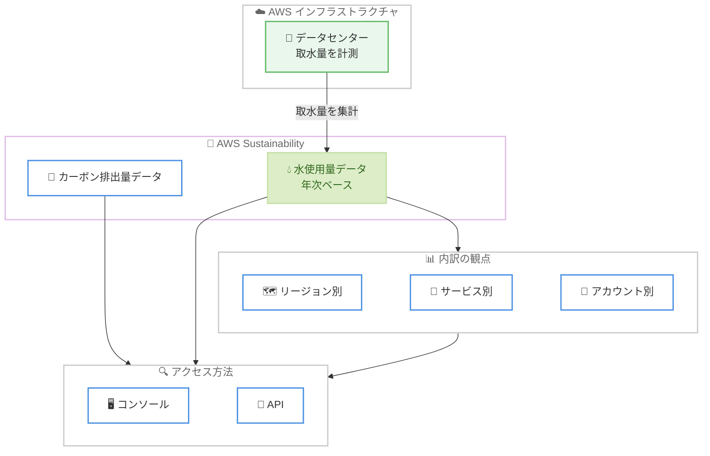

# AWS Sustainability - 水使用量 (water withdrawals) データの提供開始

**リリース日**: 2026年7月16日
**サービス**: AWS Sustainability
**機能**: 水使用量 (water withdrawals) データ

📊 [このアップデートのインフォグラフィックを見る](https://takech9203.github.io/aws-news-summary/20260716-aws-sustainability-water-withdrawals.html)
<!-- INFOGRAPHIC_BASE_URL は環境変数から取得 -->

## 概要

AWS Sustainability が、お客様のワークロードに関連する年間の水使用量 (water withdrawals) データを提供するようになりました。この水使用量データは、既に提供されているカーボン排出量 (carbon emissions) データと並べて表示され、お客様が自社の環境フットプリントをカーボンと水の両面からより広範に把握できるようになります。

水使用量データは、AWS リージョン別、サービス別、AWS アカウント別に内訳を確認できます。データは年次ベースで提供され、AWS Sustainability コンソールと API の両方からアクセスできます。この指標は、データセンターの運用のために取水された水の総量を捉えたものです。AWS が効率化を実現すると取水量の削減として反映されるため、数値が小さいほどパフォーマンスが良好であることを示します。

この水使用量データは追加料金なしで提供され、AWS Sustainability サービスが稼働するすべての AWS リージョンで利用できます。お客様は AWS Sustainability ユーザーガイドを参照するか、AWS Sustainability コンソールにアクセスすることで詳細を確認できます。

**アップデート前の課題**

このアップデート以前は、AWS Sustainability ではカーボン排出量データのみが提供されていました。

- 以前は AWS ワークロードに関連する水使用量を AWS Sustainability から把握できなかった
- 以前は環境フットプリントの評価がカーボン排出量に限定されており、水資源の観点を含めた包括的な把握が難しかった
- 以前は水使用量をリージョンやサービス、アカウント単位で把握する手段が AWS から提供されていなかった

**アップデート後の改善**

今回のアップデートにより、水使用量データを活用した環境フットプリントの把握が可能になりました。

- 今回のアップデートにより、ワークロードに関連する年間の水使用量を AWS Sustainability で確認できるようになった
- 今回のアップデートにより、カーボンと水の両面から環境フットプリントを包括的に把握できるようになった
- 今回のアップデートにより、水使用量をリージョン別、サービス別、アカウント別に内訳で確認できるようになった

## アーキテクチャ図

データセンターで計測された取水量が AWS Sustainability の水使用量データとして集計され、リージョン別、サービス別、アカウント別の内訳とともに、コンソールと API から確認できる流れを示しています。

## サービスアップデートの詳細

### 主要機能

1. **年間水使用量データの提供**
   - お客様の AWS ワークロードに関連する年間の水使用量を確認できる
   - この指標はデータセンターの運用のために取水された水の総量を表す
   - AWS が効率化を実現すると取水量の削減として反映され、数値が小さいほどパフォーマンスが良好であることを示す

2. **多角的な内訳の表示**
   - 水使用量を AWS リージョン別に確認できる
   - 水使用量を AWS サービス別に確認できる
   - 水使用量を AWS アカウント別に確認できる

3. **カーボン排出量データとの統合表示**
   - 既存のカーボン排出量データと並べて水使用量データを表示する
   - カーボンと水の両面から環境フットプリントを包括的に把握できる

4. **コンソールと API からのアクセス**
   - AWS Sustainability コンソールから水使用量データを参照できる
   - API を通じてプログラムから水使用量データを取得できる

## 技術仕様

### 水使用量データの概要

| 項目 | 詳細 |
|------|------|
| 指標の意味 | データセンターの運用のために取水された水の総量 |
| 提供頻度 | 年次ベース |
| 内訳の観点 | リージョン別、サービス別、アカウント別 |
| アクセス方法 | AWS Sustainability コンソールおよび API |
| 数値の解釈 | 効率化により取水量が削減される (数値が小さいほど良好) |
| 料金 | 追加料金なし |
| 提供範囲 | AWS Sustainability が稼働するすべての AWS リージョン |

## 設定方法

### 前提条件

1. AWS Sustainability を利用できる AWS アカウントを保有していること
2. 水使用量データを参照するための適切な IAM 権限を保有していること
3. コンソールまたは API のいずれかからアクセスできる環境が用意されていること

### 手順

#### ステップ1: AWS Sustainability コンソールにアクセスする

AWS Sustainability コンソールを開き、環境フットプリントのダッシュボードを表示します。カーボン排出量データと並んで、水使用量データが表示されます。

#### ステップ2: 内訳の観点を選択する

コンソール上で、水使用量データをリージョン別、サービス別、またはアカウント別に切り替えて表示します。これにより、どのリージョンやサービスが取水量に寄与しているかを把握できます。

#### ステップ3: API からデータを取得する

API を通じて水使用量データをプログラムで取得し、社内のサステナビリティレポートや環境フットプリント管理の仕組みに組み込みます。データは年次ベースで提供されるため、年単位の傾向分析に活用できます。

## メリット

### ビジネス面

- **環境フットプリントの包括的な把握**: カーボンに加えて水の観点を得られるため、より広範な環境負荷の可視化が可能になる
- **サステナビリティレポートの充実**: 水使用量データを社内外のサステナビリティ報告に活用でき、環境情報開示の質を高められる
- **追加コストなし**: 追加料金なしで利用できるため、導入のハードルが低い

### 技術面

- **多角的な分析**: リージョン別、サービス別、アカウント別の内訳により、取水量の要因を特定しやすくなる
- **プログラマティックな取得**: API を通じてデータを取得でき、既存のデータ基盤やダッシュボードに統合できる
- **効率化の可視化**: AWS の効率化が取水量の削減として数値に反映されるため、改善の傾向を追跡できる

## デメリット・制約事項

### 制限事項

- データは年次ベースで提供されるため、月次や日次といった短い粒度での確認はできない
- 水使用量データは AWS Sustainability が稼働するリージョンで提供される
- 指標はデータセンターの運用に伴う取水量を対象としており、お客様が直接制御できる範囲は限定的である

### 考慮すべき点

- 数値が小さいほど良好という指標の性質を理解した上で、レポートや分析に利用する
- カーボン排出量データと水使用量データを併せて参照し、環境フットプリント全体を評価する

## ユースケース

### ユースケース1: サステナビリティレポートへの水使用量の反映

**シナリオ**: 企業のサステナビリティ報告書に、クラウド利用に伴う水資源への影響を記載したい。

**効果**: AWS Sustainability から取得した年間水使用量データを報告書に反映でき、カーボンだけでなく水の観点も含めた環境情報開示が可能になる。

### ユースケース2: リージョン選定時の環境評価

**シナリオ**: 新規ワークロードのデプロイ先リージョンを検討する際に、環境負荷の観点も評価に加えたい。

**効果**: リージョン別の水使用量の内訳を参照することで、カーボン排出量と併せてリージョン選定の判断材料にできる。

### ユースケース3: サービス別の環境フットプリント分析

**シナリオ**: 自社のワークロードのうち、どのサービスが環境負荷に寄与しているかを把握したい。

**効果**: サービス別の水使用量の内訳を確認することで、取水量に寄与するサービスを特定し、改善の優先順位付けに活用できる。

## 料金

この水使用量データは追加料金なしで提供されます。AWS Sustainability の水使用量データの参照に対して追加のコストは発生しません。

## 利用可能リージョン

AWS Sustainability サービスが稼働するすべての AWS リージョンで利用可能です。

## 関連サービス・機能

- **AWS Sustainability (カーボン排出量データ)**: 既存のカーボン排出量データと並べて水使用量データが表示され、環境フットプリントを包括的に把握できる
- **AWS Sustainability コンソール**: 水使用量データをリージョン別、サービス別、アカウント別に確認できる
- **AWS Sustainability API**: 水使用量データをプログラムから取得し、社内のデータ基盤やレポートに統合できる

## 参考リンク

- 📊 [インフォグラフィック](https://takech9203.github.io/aws-news-summary/20260716-aws-sustainability-water-withdrawals.html)
- [公式発表 (What's New)](https://aws.amazon.com/about-aws/whats-new/2026/07/aws-sustainability-water-withdrawals/)
- [AWS Sustainability ユーザーガイド](https://docs.aws.amazon.com/sustainability/latest/userguide/what-is-sustainability.html)
- [AWS Sustainability コンソール](https://aws.amazon.com/sustainability/tools/console/)

## まとめ

このアップデートにより、AWS Sustainability がカーボン排出量に加えて水使用量データを提供するようになり、環境フットプリントをカーボンと水の両面から把握できるようになりました。データはリージョン別、サービス別、アカウント別の内訳で確認でき、追加料金なしでコンソールと API から利用できます。サステナビリティ報告や環境負荷の評価に取り組む組織は、この水使用量データを既存のカーボン排出量データと併せて活用し、より包括的な環境フットプリント管理を検討することをお勧めします。
