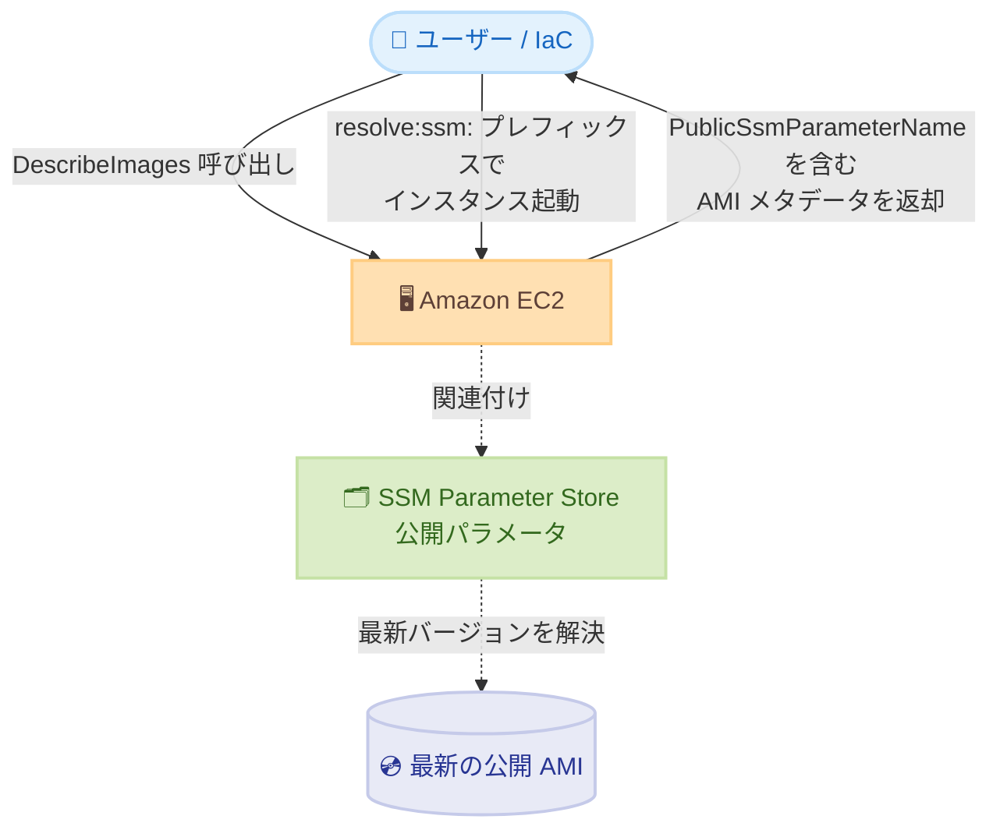

# Amazon EC2 - パブリック AMI に関連付けられたパブリック SSM パラメータの表示

**リリース日**: 2026年7月16日
**サービス**: Amazon EC2
**機能**: パブリック AMI に関連付けられたパブリック SSM パラメータの AMI メタデータへの表示

📊 [このアップデートのインフォグラフィックを見る](https://takech9203.github.io/aws-news-summary/20260716-ec2-public-images-ssm-parameters.html)
<!-- INFOGRAPHIC_BASE_URL は環境変数から取得 -->

## 概要

Amazon EC2 は、パブリック AMI に関連付けられた AWS Systems Manager (SSM) Parameter Store のパラメータを、AMI のメタデータ内で直接表示するようになりました。パブリック AMI を describe すると、レスポンスに関連するパブリック SSM パラメータが `PublicSsmParameterName` フィールドとして含まれます。これにより、対象の AMI の最新バージョンを常に指し示すエイリアスを容易に発見し、参照できます。

AWS は Amazon Linux や Windows などのパブリック AMI に対して、SSM の公開パラメータ (例: `/aws/service/ami-amazon-linux-latest/al2023-ami-kernel-default-x86_64`) を提供しています。これらのパラメータは各リージョンで常に最新バージョンの AMI を指し示すため、インスタンス起動時に利用することで最新の AMI を確実に使用できます。今回のアップデートにより、AMI とパラメータの対応関係を AMI 側から直接確認できるようになりました。

この機能は、追加費用なしで、中国リージョンおよび AWS GovCloud (US) を含むすべての AWS リージョンで利用できます。

**アップデート前の課題**

- 以前は、あるパブリック AMI に対応する SSM パラメータを特定するには、SSM のパラメータ名前空間を手動で検索する必要があった
- どの AMI がどの公開パラメータに対応しているのかを AMI のメタデータから直接確認する手段がなかった
- 最新 AMI を参照するエイリアスの発見に手間がかかっていた

**アップデート後の改善**

- 今回のアップデートにより、`DescribeImages` のレスポンスに関連するパブリック SSM パラメータ (`PublicSsmParameterName`) が自動的に含まれるようになった
- SSM の名前空間を手動で検索する作業が不要になった
- 最新バージョンを常に指し示すエイリアスの発見と参照が容易になり、インフラ全体での AMI 更新が簡素化された

## アーキテクチャ図



ユーザーが `DescribeImages` でパブリック AMI を照会すると、EC2 が関連する SSM 公開パラメータ名を返し、そのパラメータは常に最新バージョンの AMI を解決します。

## サービスアップデートの詳細

### 主要機能

1. **AMI メタデータへの SSM パラメータの表示**
   - パブリック AMI を describe すると、レスポンスに `PublicSsmParameterName` フィールドが含まれる
   - このフィールドは、対象 AMI の最新バージョンを常に指し示す SSM パラメータを示す
   - EC2 コンソールの AMI の [詳細] タブで [Public SSM parameter name] として確認できる

2. **最新 AMI を指すエイリアスの発見**
   - AWS が維持するパブリック AMI 向けの公開パラメータをメタデータから直接発見できる
   - Linux 向け: `/aws/service/ami-amazon-linux-latest`
   - Windows 向け: `/aws/service/ami-windows-latest`

3. **追加費用なしでの全リージョン提供**
   - 中国リージョン (北京、寧夏) および AWS GovCloud (US) を含むすべての AWS リージョンで利用可能
   - すべてのお客様が追加費用なしで利用できる

## 技術仕様

### DescribeImages レスポンス

| 項目 | 詳細 |
|------|------|
| フィールド名 | `PublicSsmParameterName` |
| 対象 | 関連する SSM パラメータを持つパブリック AMI |
| 取得方法 (CLI) | `aws ec2 describe-images` |
| 取得方法 (PowerShell) | `Get-EC2Image` |
| 取得方法 (コンソール) | AMI の [詳細] タブ |

### DescribeImages レスポンス例

```json
{
    "Images": [
        {
            "ImageId": "ami-0abcdef1234567890",
            "Name": "al2023-ami-2023.7.20260601.0-kernel-6.1-x86_64",
            "PublicSsmParameterName": "aws/service/ami-amazon-linux-latest/al2023-ami-kernel-default-x86_64"
        }
    ]
}
```

## 設定方法

### 前提条件

1. EC2 の `DescribeImages` を呼び出す権限を持つ IAM プリンシパル
2. 対象がパブリック AMI であること (関連する SSM 公開パラメータを持つもの)
3. AWS CLI または AWS Tools for PowerShell の利用環境 (コンソールでも確認可能)

### 手順

#### ステップ1: パブリック AMI の SSM パラメータを確認する

```bash
aws ec2 describe-images \
    --image-ids ami-0abcdef1234567890
```

`describe-images` コマンドで対象のパブリック AMI を照会します。レスポンスに含まれる `PublicSsmParameterName` フィールドから、その AMI に関連付けられた SSM 公開パラメータ名を確認できます。

#### ステップ2: リージョン内の公開パラメータ一覧を確認する

```bash
aws ssm get-parameters-by-path \
    --path /aws/service/ami-amazon-linux-latest \
    --query "Parameters[].Name"
```

`get-parameters-by-path` コマンドで、現在のリージョンにおける Amazon Linux 向けの公開パラメータ一覧を取得します。Windows AMI の場合は `--path` に `/aws/service/ami-windows-latest` を指定します。

#### ステップ3: 公開パラメータを使用してインスタンスを起動する

```bash
aws ec2 run-instances \
    --image-id resolve:ssm:/aws/service/ami-amazon-linux-latest/al2023-ami-kernel-default-x86_64
```

`--image-id` に `resolve:ssm:` プレフィックスと公開パラメータのパスを指定すると、常に最新バージョンの AMI を使用してインスタンスを起動できます。特定の AMI ID をハードコードする必要がなくなります。

## メリット

### ビジネス面

- **運用負荷の軽減**: SSM 名前空間を手動で検索する作業が不要になり、AMI 管理の運用コストを削減できる
- **追加費用なし**: すべてのリージョンで追加費用なしに利用でき、コスト増を伴わずに恩恵を受けられる
- **標準化の促進**: 最新 AMI を指すエイリアスを容易に発見できるため、組織全体での AMI 参照方法の標準化が進む

### 技術面

- **最新 AMI の確実な利用**: `resolve:ssm:` を用いることで、常に最新バージョンの AMI を参照できる
- **IaC との親和性**: `PublicSsmParameterName` を IaC テンプレートで参照することで、AMI ID のハードコードを排除できる
- **発見性の向上**: AMI とパラメータの対応関係を AMI メタデータから直接確認できるため、調査時間が短縮される

## デメリット・制約事項

### 制限事項

- `PublicSsmParameterName` フィールドは、関連する SSM パラメータを持つパブリック AMI に対してのみ返される
- 自身で作成したプライベート AMI やカスタム AMI はこの機能の対象外
- パラメータの解決結果は各リージョンごとに異なるため、リージョン間で同一の AMI ID になるわけではない

### 考慮すべき点

- `resolve:ssm:` を利用して最新 AMI で起動する場合、AMI の更新によって起動されるイメージが変わるため、変更管理やテストの観点を考慮する必要がある
- 本番環境では、意図しない AMI 更新を避けるためにパラメータのバージョン指定を検討する

## ユースケース

### ユースケース1: Infrastructure as Code での最新 AMI 参照

**シナリオ**: CloudFormation や Terraform で常に最新の Amazon Linux 2023 を利用したいが、AMI ID のハードコードを避けたい。

**実装例**:
```
resolve:ssm:/aws/service/ami-amazon-linux-latest/al2023-ami-kernel-default-x86_64
```

**効果**: AMI ID を手動更新する必要がなくなり、デプロイのたびに最新の AMI が自動的に利用される。

### ユースケース2: AMI とパラメータの対応関係の調査

**シナリオ**: あるパブリック AMI ID が、どの SSM 公開パラメータに対応しているのかを迅速に把握したい。

**実装例**:
```
aws ec2 describe-images --image-ids ami-0abcdef1234567890 \
    --query "Images[].PublicSsmParameterName"
```

**効果**: SSM 名前空間を手動検索することなく、AMI から対応パラメータを直接特定できる。

### ユースケース3: マルチリージョン展開での標準化

**シナリオ**: 複数リージョンで同一 OS の最新 AMI を利用してインスタンスを起動したい。

**実装例**:
```
--image-id resolve:ssm:/aws/service/ami-windows-latest/Windows_Server-2022-English-Full-Base
```

**効果**: 同じパラメータパスを各リージョンで使用でき、リージョンごとに正しい最新 AMI が解決されるため、展開手順を標準化できる。

## 料金

この機能は追加費用なしで利用できます。パブリック AMI の describe 結果に SSM パラメータ情報が含まれることに対する追加料金は発生しません。

## 利用可能リージョン

中国リージョン (北京、寧夏) および AWS GovCloud (US) を含む、すべての AWS リージョンで利用できます。

## 関連サービス・機能

- **AWS Systems Manager Parameter Store**: パブリック AMI の最新バージョンを指し示す公開パラメータを提供する
- **Amazon EC2 Auto Scaling**: 起動テンプレートで `resolve:ssm:` を利用することで、最新 AMI を用いたスケーリングが可能
- **AWS CloudFormation / Terraform**: SSM パラメータ参照により、AMI ID のハードコードを排除した IaC を実現できる

## 参考リンク

- 📊 [インフォグラフィック](https://takech9203.github.io/aws-news-summary/20260716-ec2-public-images-ssm-parameters.html)
- [公式発表 (What's New)](https://aws.amazon.com/about-aws/whats-new/2026/07/ec2-public-images-ssm-parameters)
- [ドキュメント: Reference the latest AMIs using Systems Manager public parameters](https://docs.aws.amazon.com/AWSEC2/latest/UserGuide/finding-an-ami-parameter-store.html)
- [AWS Blog: Query for the latest Amazon Linux AMI IDs Using AWS Systems Manager Parameter Store](https://aws.amazon.com/blogs/compute/query-for-the-latest-amazon-linux-ami-ids-using-aws-systems-manager-parameter-store/)
- [AWS Systems Manager: Working with public parameters](https://docs.aws.amazon.com/systems-manager/latest/userguide/parameter-store-public-parameters.html)

## まとめ

このアップデートにより、パブリック AMI に関連付けられた SSM 公開パラメータを AMI メタデータから直接発見できるようになりました。最新 AMI を指すエイリアスの発見が容易になり、IaC における AMI ID のハードコード排除や運用負荷の軽減につながります。追加費用なしで全リージョンで利用できるため、パブリック AMI を利用している環境では `PublicSsmParameterName` の活用を検討することを推奨します。
