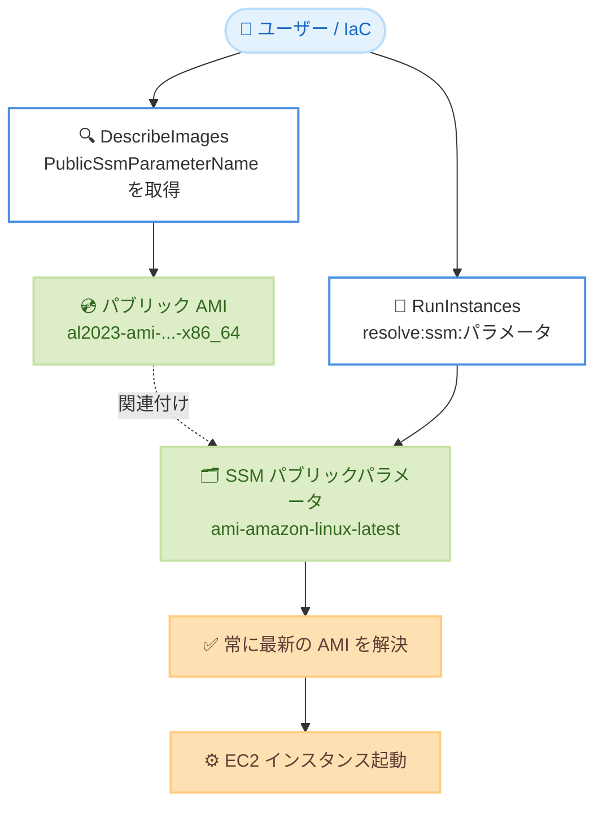

# Amazon EC2 - パブリック AMI に関連付けられたパブリック SSM パラメータの表示

**リリース日**: 2026 年 7 月 16 日
**サービス**: Amazon EC2 (Amazon Elastic Compute Cloud)
**機能**: パブリック AMI に関連付けられたパブリック SSM パラメータの表示

📊 [このアップデートのインフォグラフィックを見る](https://takech9203.github.io/aws-news-summary/20260716-ec2-pulic-images-ssm-parameters.html)
<!-- INFOGRAPHIC_BASE_URL は環境変数から取得 -->

## 概要

Amazon EC2 は、パブリック AMI (Amazon Machine Image) に関連付けられた AWS Systems Manager (SSM) パブリックパラメータを、AMI のメタデータ内に直接表示できるようになりました。パブリック AMI を describe (記述) すると、そのレスポンスに関連するパブリック SSM パラメータ名が `PublicSsmParameterName` フィールドとして含まれます。

AWS Systems Manager は、AWS が管理するパブリック AMI 向けにパブリックパラメータを提供しています。これらのパラメータは、特定のリージョンにおける最新バージョンの AMI を常に指し示すエイリアスとして機能します。今回のアップデートにより、ユーザーは AMI の情報から直接、対応するパブリック SSM パラメータを発見できるようになりました。

この機能はすべてのお客様が、AWS China (Beijing) リージョン (Sinnet 運営)、AWS China (Ningxia) リージョン (NWCD 運営)、AWS GovCloud (US) リージョンを含むすべての AWS リージョンで、追加費用なしで利用できます。

**アップデート前の課題**

- パブリック AMI に関連付けられた SSM パラメータを特定するには、SSM パラメータ名前空間を手動で調べる必要があった
- どの AMI がどのパブリックパラメータに対応しているかを直接確認する手段がなかった
- 最新 AMI を解決するためのエイリアスとなるパラメータを見つける作業が煩雑だった

**アップデート後の改善**

- パブリック AMI を describe するだけで、関連するパブリック SSM パラメータ名が自動的に表示される
- SSM パラメータ名前空間を手動で調べる必要がなくなった
- 発見したパラメータを常に最新バージョンに解決するエイリアスとして利用でき、インフラストラクチャ全体での AMI 更新が簡素化される

## アーキテクチャ図



パブリック AMI を describe するとレスポンスに関連する SSM パラメータ名が含まれ、そのパラメータを `resolve:ssm:` プレフィックス付きで指定することで、常に最新の AMI を解決してインスタンスを起動できます。

## サービスアップデートの詳細

### 主要機能

1. **describe-images レスポンスへの `PublicSsmParameterName` フィールド追加**
   - パブリック AMI を describe すると、関連付けられたパブリック SSM パラメータが `PublicSsmParameterName` フィールドで返される
   - EC2 コンソールの AMI 詳細タブでも「Public SSM parameter name」として確認できる
   - SSM パラメータに関連付けられていないパブリック AMI では、このフィールドは返されない

2. **最新 AMI を指すエイリアスとしての活用**
   - SSM パブリックパラメータは、特定リージョンにおける最新バージョンの AMI を常に指し示す
   - 例: `/aws/service/ami-amazon-linux-latest/al2023-ami-kernel-default-arm64` は、arm64 アーキテクチャの最新 Amazon Linux 2023 AMI を常に指す
   - AMI ID をハードコードする代わりにパラメータを利用することで、インフラ全体での AMI 更新が簡素化される

3. **パラメータのパス体系**
   - Linux: `/aws/service/ami-amazon-linux-latest`
   - Windows: `/aws/service/ami-windows-latest`
   - これらのパスは全リージョンで利用可能

## 技術仕様

### 主要なパラメータパスとフィールド

| 項目 | 詳細 |
|------|------|
| 追加フィールド | `PublicSsmParameterName` (DescribeImages レスポンス) |
| Linux パラメータパス | `/aws/service/ami-amazon-linux-latest` |
| Windows パラメータパス | `/aws/service/ami-windows-latest` |
| 起動時の指定構文 | `resolve:ssm:{public-parameter}` |
| 追加費用 | なし |

### API 変更履歴

今回のアップデートに直接対応する EC2 API の新規追加は awsapichanges.com では確認できませんでした。DescribeImages レスポンスへの `PublicSsmParameterName` フィールド追加として提供されています。

### describe-images のレスポンス例

```json
{
    "Images": [
        {
            "ImageId": "ami-0abcdef1234567890",
            "Name": "al2023-ami-2023.7.20260601.0-kernel-6.1-x86_64",
            "PublicSsmParameterName": "aws/service/ami-amazon-linux-latest/al2023-ami-kernel-default-x86_64"
        }
    ]
}
```

## 設定方法

### 前提条件

1. AWS CLI または AWS Tools for PowerShell がセットアップされていること
2. EC2 の describe-images および SSM の get-parameters-by-path を実行できる IAM 権限があること
3. 対象となる AWS が管理するパブリック AMI が存在すること

### 手順

#### ステップ1: パブリック AMI の SSM パラメータを確認する

```bash
aws ec2 describe-images \
    --image-ids ami-0abcdef1234567890
```

指定したパブリック AMI の情報を取得します。SSM パラメータに関連付けられている場合、レスポンスの `PublicSsmParameterName` フィールドにパラメータ名が含まれます。

#### ステップ2: 利用可能なパブリックパラメータを一覧表示する

```bash
aws ssm get-parameters-by-path \
    --path /aws/service/ami-amazon-linux-latest \
    --query "Parameters[].Name"
```

指定したパス配下のパブリックパラメータ名を一覧表示します。Windows AMI の場合は `--path /aws/service/ami-windows-latest` を指定します。

#### ステップ3: パラメータを利用してインスタンスを起動する

```bash
aws ec2 run-instances \
    --image-id resolve:ssm:/aws/service/ami-amazon-linux-latest/al2023-ami-kernel-default-x86_64 \
    --instance-type t3.micro
```

`resolve:ssm:` プレフィックスとパラメータのパスを指定することで、AMI ID をハードコードせずに常に最新の Amazon Linux 2023 AMI を使用してインスタンスを起動します。

## メリット

### ビジネス面

- **運用の簡素化**: SSM パラメータの手動検索が不要になり、AMI 管理にかかる運用負荷を軽減できる
- **コスト増なし**: 追加費用なしで全リージョンで利用できるため、導入のハードルが低い
- **保守性の向上**: 最新 AMI を指すパラメータをエイリアスとして活用することで、AMI 更新作業を標準化できる

### 技術面

- **発見性の向上**: describe-images のレスポンスから直接、対応するパラメータ名を取得できる
- **IaC との親和性**: CloudFormation や Terraform などで `resolve:ssm:` 構文を用いた最新 AMI の参照が容易になる
- **一貫性の確保**: インフラ全体で同一パラメータを参照することで、AMI バージョンの不整合を防止できる

## デメリット・制約事項

### 制限事項

- `PublicSsmParameterName` フィールドは、SSM パラメータに関連付けられたパブリック AMI に対してのみ返される
- プライベート AMI やカスタム AMI はこの機能の対象外である
- パラメータのパス体系は AWS が管理するパブリック AMI (Amazon Linux、Windows など) に準拠する

### 考慮すべき点

- パラメータは常に最新 AMI を指すため、特定バージョンに固定したい場合は AMI ID を明示的に指定する必要がある
- 最新 AMI への自動追従は、意図しないタイミングでの AMI 更新を招く可能性があるため、変更管理プロセスと組み合わせて運用することが望ましい

## ユースケース

### ユースケース1: IaC での最新 AMI の自動参照

**シナリオ**: CloudFormation テンプレートで、AMI ID をハードコードせずに常に最新の Amazon Linux 2023 を利用したい。

**実装例**:
```yaml
Parameters:
  LatestAmiId:
    Type: 'AWS::SSM::Parameter::Value<AWS::EC2::Image::Id>'
    Default: /aws/service/ami-amazon-linux-latest/al2023-ami-kernel-default-x86_64
```

**効果**: テンプレートを更新することなく、デプロイのたびに最新の AMI が参照される。

### ユースケース2: パブリック AMI からのパラメータ逆引き

**シナリオ**: 現在使用している AMI ID に対応する SSM パラメータを特定し、以降はパラメータ参照へ移行したい。

**実装例**:
```bash
aws ec2 describe-images --image-ids ami-0abcdef1234567890 \
    --query "Images[].PublicSsmParameterName"
```

**効果**: 手動で SSM 名前空間を調べることなく、対応するパラメータ名を即座に取得できる。

### ユースケース3: 起動テンプレートでの最新 AMI 利用

**シナリオ**: Auto Scaling グループの起動テンプレートで、常に最新の Windows Server AMI を使用したい。

**実装例**:
```bash
--image-id resolve:ssm:/aws/service/ami-windows-latest/Windows_Server-2022-English-Full-Base
```

**効果**: 起動テンプレートを都度更新せずに、最新のパッチ適用済み AMI でインスタンスを起動できる。

## 料金

この機能は追加費用なしで利用できます。SSM パブリックパラメータの利用も、標準的な Parameter Store のパブリックパラメータとして追加料金は発生しません。

## 利用可能リージョン

すべての AWS リージョンで利用可能です。以下のリージョンを含みます。

- AWS China (Beijing) リージョン (Sinnet 運営)
- AWS China (Ningxia) リージョン (NWCD 運営)
- AWS GovCloud (US) リージョン

## 関連サービス・機能

- **AWS Systems Manager Parameter Store**: パブリックパラメータを提供し、最新 AMI を指すエイリアスとして機能する
- **Amazon EC2 Auto Scaling**: 起動テンプレートでパラメータを参照し、最新 AMI でのスケーリングを実現する
- **AWS CloudFormation**: `AWS::SSM::Parameter::Value` 型を用いて最新 AMI を動的に参照できる

## 参考リンク

- 📊 [インフォグラフィック](https://takech9203.github.io/aws-news-summary/20260716-ec2-pulic-images-ssm-parameters.html)
- [公式発表 (What's New)](https://aws.amazon.com/about-aws/whats-new/2026/07/ec2-pulic-images-ssm-parameters)
- [ドキュメント: Reference the latest AMIs using Systems Manager public parameters](https://docs.aws.amazon.com/AWSEC2/latest/UserGuide/finding-an-ami-parameter-store.html)
- [AWS Blog: Query for the latest Amazon Linux AMI IDs Using AWS Systems Manager Parameter Store](https://aws.amazon.com/blogs/compute/query-for-the-latest-amazon-linux-ami-ids-using-aws-systems-manager-parameter-store/)
- [AWS Blog: Query for the Latest Windows AMI Using AWS Systems Manager Parameter Store](https://aws.amazon.com/blogs/mt/query-for-the-latest-windows-ami-using-systems-manager-parameter-store/)

## まとめ

今回のアップデートにより、パブリック AMI を describe するだけで関連するパブリック SSM パラメータを直接発見できるようになり、AMI 管理の運用負荷が大きく軽減されます。追加費用なしで全リージョンで利用できるため、AMI ID をハードコードしている既存の IaC やスクリプトを `resolve:ssm:` 構文によるパラメータ参照へ移行し、最新 AMI の自動追従と保守性の向上を検討することを推奨します。
