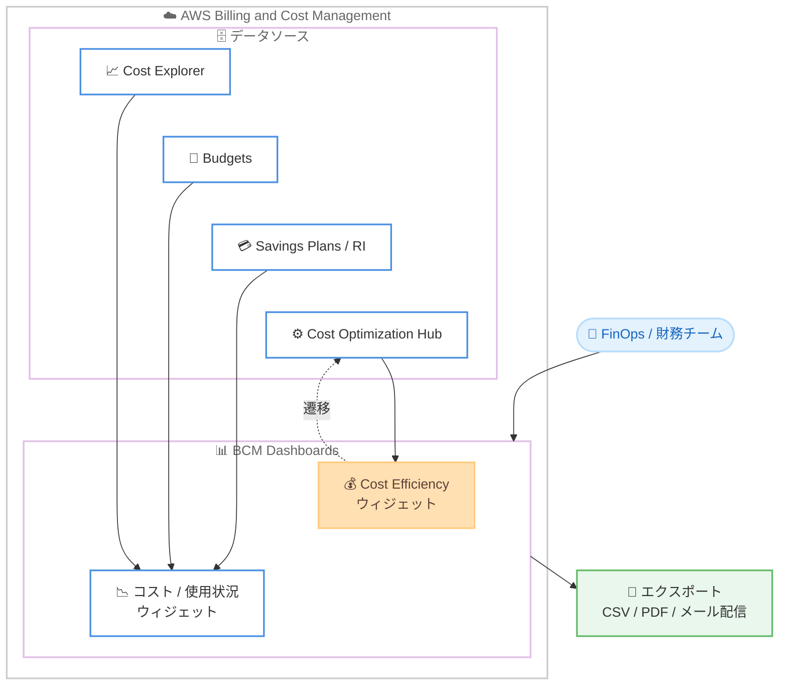

# AWS Billing and Cost Management - Cost Efficiency ウィジェット

**リリース日**: 2026 年 7 月 16 日
**サービス**: AWS Billing and Cost Management (BCM)
**機能**: BCM Dashboards の Cost Efficiency ウィジェット

📊 [このアップデートのインフォグラフィックを見る](https://takech9203.github.io/aws-news-summary/20260716-monitor-cost-efficiency-using-dashboards.html)
<!-- INFOGRAPHIC_BASE_URL は環境変数から取得 -->

## 概要

AWS Billing and Cost Management (BCM) は、BCM Dashboards に新しい Cost Efficiency ウィジェットを追加しました。この機能により、コスト効率のトレンドを、Cost Explorer、Budgets、Savings Plans、リザーブドインスタンス (RI) のカバレッジおよび使用率といった既存の情報と並べて、単一のダッシュボード上で確認できます。支出、コミットメント、最適化のパフォーマンスを統合した一元的なビューを実現します。

Cost Efficiency ウィジェットは、コスト効率スコアの推移を時系列で表示します。AWS アカウント別、リージョン別、または全体の粒度でトレンドを分析でき、組織のコスト最適化の取り組みが時間とともにどのように変化しているかを把握できます。さらに、ウィジェットから Cost Optimization Hub コンソールへ直接遷移し、節約に関する推奨事項に基づいたアクションを実行できます。

この機能は、すべての AWS 商用リージョンで追加料金なしで利用できます。FinOps の実践者、財務チーム、クラウド管理者が、複数のツールを行き来することなく、コスト最適化の進捗を継続的にモニタリングするために役立ちます。

**アップデート前の課題**

このアップデート以前は、コスト効率の状況を把握するために複数のツールを個別に確認する必要がありました。

- コスト効率のトレンドを、コストや使用状況のデータと同じ画面で並べて確認できなかった
- 最適化のパフォーマンスを時系列で追跡するには、Cost Optimization Hub など別のコンソールへ移動する必要があった
- コスト効率の状況をステークホルダー向けのダッシュボードレポートに統合しづらかった

**アップデート後の改善**

今回のアップデートにより、以下が可能になりました。

- コスト効率のトレンドを Cost Explorer や Budgets などと同じダッシュボード上で一元的に確認できるようになった
- コスト効率スコアの推移をアカウント別、リージョン別、全体の粒度で時系列に分析できるようになった
- ウィジェットから Cost Optimization Hub へ直接遷移し、推奨事項に基づくアクションをすぐに実行できるようになった
- コスト効率の情報をダッシュボードのエクスポート、スケジュール配信メール、クロスアカウント共有に含められるようになった

## アーキテクチャ図

Cost Efficiency ウィジェットは Cost Optimization Hub のデータをもとにコスト効率スコアを表示し、他のコスト関連ウィジェットと同じダッシュボード上で一元的に可視化します。

## サービスアップデートの詳細

### 主要機能

1. **コスト効率トレンドの可視化**
   - コスト効率スコアの推移を時系列で表示する
   - 組織全体で最適化のパフォーマンスがどのように変化しているかを把握できる
   - Cost Explorer、Budgets、Savings Plans、RI のカバレッジ / 使用率と同じダッシュボードに並べて表示できる

2. **柔軟な粒度での分析**
   - AWS アカウント別、リージョン別、または全体の粒度でコスト効率を確認できる
   - 分析したいレベルに合わせて粒度を調整できる
   - 1 つのダッシュボードに複数の Cost Efficiency ウィジェットを追加できる

3. **Cost Optimization Hub との連携**
   - ウィジェットから Cost Optimization Hub コンソールへ直接遷移できる
   - 節約に関する推奨事項に基づいてアクションを実行できる

4. **レポートとの統合**
   - ダッシュボードのエクスポート機能に統合されている
   - スケジュール配信メールレポートに含められる
   - オフライン分析用に CSV または PDF としてダウンロードできる
   - クロスアカウントのダッシュボード共有に含められる

## 技術仕様

### 機能概要

| 項目 | 詳細 |
|------|------|
| 対象サービス | AWS Billing and Cost Management (BCM) Dashboards |
| ウィジェット種別 | Cost Efficiency ウィジェット |
| 表示内容 | コスト効率スコアの時系列トレンド |
| 分析軸 | AWS アカウント別 / リージョン別 / 全体 |
| データソース | Cost Optimization Hub |
| 連携先 | Cost Optimization Hub コンソール |
| ダッシュボードあたりのウィジェット上限 | 20 個 |
| エクスポート形式 | CSV / PDF / スケジュール配信メール |
| 追加料金 | なし |

## 設定方法

### 前提条件

1. AWS Billing and Cost Management コンソールへのアクセス権限を持っていること
2. コスト効率スコアを算出するために Cost Optimization Hub が有効化されていること
3. BCM Dashboards を利用できる権限が付与されていること

### 手順

#### ステップ1: ダッシュボードを開く

AWS Billing and Cost Management コンソール (https://console.aws.amazon.com/costmanagement/) を開き、ナビゲーションペインで [Dashboards] を選択します。新しいダッシュボードを作成するか、既存のダッシュボードを選択します。

#### ステップ2: Cost Efficiency ウィジェットを追加する

[Add widget] を選択し、事前定義済みウィジェット (Predefined widget) から Cost Efficiency ウィジェットを選択してダッシュボード上にドラッグします。追加後、パラメーターの編集パネルで期間、粒度、グループ化のディメンションを設定します。

#### ステップ3: 表示を調整する

アカウント別、リージョン別、または全体の粒度を選択し、時系列トレンドを分析します。必要に応じてウィジェットのサイズや配置を調整し、ステークホルダー向けにダッシュボードをレイアウトします。変更は自動保存されます。

## メリット

### ビジネス面

- **一元的な可視性**: 支出、コミットメント、最適化パフォーマンスを 1 つの画面で確認でき、意思決定が迅速になる
- **FinOps の推進**: コスト効率のトレンドを継続的にモニタリングすることで、組織全体の最適化文化を醸成できる
- **レポートの効率化**: エクスポートやスケジュール配信によってステークホルダーへの報告を自動化できる

### 技術面

- **追加コストなし**: すべての AWS 商用リージョンで追加料金なしで利用できる
- **柔軟な分析軸**: アカウント別、リージョン別、全体の粒度で最適化状況を分析できる
- **既存ツールとの統合**: Cost Explorer や Budgets などと同じダッシュボードに統合できる

## デメリット・制約事項

### 制限事項

- 1 つのダッシュボードに追加できるウィジェットは最大 20 個までである
- ダッシュボードに表示される当月の料金は見積もりであり、実際の請求額と異なる場合がある

### 考慮すべき点

- コスト効率スコアの算出には Cost Optimization Hub のデータが利用されるため、事前に有効化しておく必要がある
- 表示される日付は協定世界時 (UTC) を基準とする

## ユースケース

### ユースケース1: 組織全体の最適化パフォーマンスのモニタリング

**シナリオ**: FinOps チームが、複数の AWS アカウントを持つ組織全体のコスト効率を継続的に把握したい。

**効果**: 全体の粒度でコスト効率スコアの推移を可視化することで、最適化施策の効果を時系列で追跡でき、改善が必要な領域を特定できる。

### ユースケース2: アカウント別・リージョン別のコスト効率比較

**シナリオ**: クラウド管理者が、事業部門ごとに割り当てられた AWS アカウントや利用リージョンごとにコスト効率のばらつきを比較したい。

**効果**: アカウント別・リージョン別の粒度でトレンドを確認することで、最適化の余地が大きいアカウントやリージョンを優先的に特定し、Cost Optimization Hub の推奨事項に基づいて対処できる。

### ユースケース3: 経営層向けのコストレポート自動配信

**シナリオ**: 財務チームが、経営層に対して定期的にクラウドコストと最適化状況を報告する必要がある。

**効果**: Cost Efficiency ウィジェットを含むダッシュボードを PDF でエクスポートし、スケジュール配信メールで自動的に届けることで、報告作業の手間を削減しながら継続的な可視性を提供できる。

## 料金

Cost Efficiency ウィジェットは、すべての AWS 商用リージョンで追加料金なしで利用できます。

## 利用可能リージョン

すべての AWS 商用リージョンで利用可能です。

## 関連サービス・機能

- **Cost Optimization Hub**: コスト効率スコアの算出元となり、ウィジェットから直接遷移して節約の推奨事項を確認できる
- **Cost Explorer**: コストと使用状況のデータをダッシュボード上に並べて表示する
- **AWS Budgets**: 予算に対する実績や予測を同じダッシュボードでモニタリングできる
- **Savings Plans / リザーブドインスタンス**: カバレッジと使用率をコスト効率と併せて確認できる

## 参考リンク

- 📊 [インフォグラフィック](https://takech9203.github.io/aws-news-summary/20260716-monitor-cost-efficiency-using-dashboards.html)
- [公式発表 (What's New)](https://aws.amazon.com/about-aws/whats-new/2026/07/monitor-cost-efficiency-using-dashboards/)
- [ドキュメント (BCM Dashboards)](https://docs.aws.amazon.com/cost-management/latest/userguide/dashboards.html)
- [ドキュメント (ウィジェットの追加)](https://docs.aws.amazon.com/cost-management/latest/userguide/add-widgets-to-dashboards.html)

## まとめ

Cost Efficiency ウィジェットは、コスト効率のトレンドを Cost Explorer や Budgets などと同じダッシュボード上で一元的に可視化する機能です。すべての AWS 商用リージョンで追加料金なしで利用できるため、FinOps を実践する組織はまず Cost Optimization Hub を有効化し、BCM Dashboards に本ウィジェットを追加して最適化パフォーマンスの継続的なモニタリングを始めることを推奨します。
