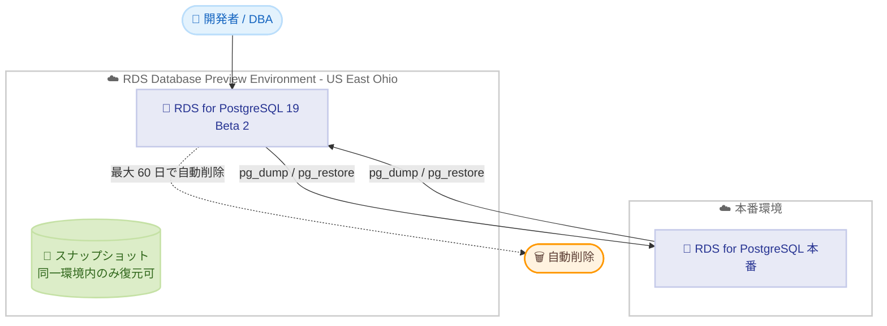

# Amazon RDS for PostgreSQL - PostgreSQL 19 Beta 2 が RDS Database Preview Environment で利用可能に

**リリース日**: 2026 年 7 月 16 日
**サービス**: Amazon Relational Database Service (Amazon RDS) for PostgreSQL
**機能**: RDS Database Preview Environment における PostgreSQL 19 Beta 2 サポート

📊 [このアップデートのインフォグラフィックを見る](https://takech9203.github.io/aws-news-summary/20260716-postgresql-19-beta-2-amazon-rds-database-preview-environment.html)
<!-- INFOGRAPHIC_BASE_URL は環境変数から取得 -->

## 概要

Amazon RDS for PostgreSQL 19 Beta 2 が RDS Database Preview Environment で利用可能になりました。これにより、フルマネージドデータベースサービスの利点を享受しながら、PostgreSQL のプレリリース版をいち早く検証できるようになります。

PostgreSQL 19 では、ワーカー数を設定可能な並列 autovacuum、サードパーティ拡張機能を必要とせずオンラインでテーブルを再構築してストレージを回収する REPACK CONCURRENTLY コマンド、標準 SQL で関係の走査を記述できるネイティブな SQL Property Graph Queries (SQL/PGQ)、シーケンス値を自動同期しサーバー再起動なしで動的に有効化できる論理レプリケーションの改善など、多数の新機能が導入されています。Beta 2 では、Beta 1 のテスト期間で得られたバグ修正と安定性の改善が加えられ、特に並列 autovacuum のワーカー協調処理と REPACK CONCURRENTLY のロック処理が改良されています。

RDS Database Preview Environment は本番環境とは分離されたテスト用の環境であり、正式リリース前の PostgreSQL メジャーバージョンを Amazon RDS の運用性のもとで評価する目的で提供されます。データベース管理者や開発者は、既存のアプリケーションやワークロードが新バージョンで期待どおりに動作するかを、正式リリースを待たずに検証できます。

**アップデート前の課題**

- 以前は PostgreSQL 19 のプレリリース版を Amazon RDS のマネージド環境で検証できなかった
- 以前は新しいメジャーバージョンの検証に、自前でセルフマネージドの PostgreSQL 環境を構築する必要があった
- 以前は正式リリースを待たなければ、アプリケーションの互換性や新機能の影響を評価しづらかった

**アップデート後の改善**

- 今回のアップデートにより PostgreSQL 19 Beta 2 を RDS Database Preview Environment で試せるようになった
- 今回のアップデートにより並列 autovacuum や REPACK CONCURRENTLY などの新機能を早期に検証できるようになった
- 今回のアップデートにより自前環境の構築が不要になり、マネージドサービスの利点を活かして検証できるようになった

## アーキテクチャ図



RDS Database Preview Environment は本番環境と分離されており、インスタンスは最大 60 日で自動削除されます。本番環境とのデータ移動には PostgreSQL の dump / load 機能を使用します。

## サービスアップデートの詳細

### 主要機能

1. **並列 autovacuum (Parallel autovacuum)**
   - ワーカー数の上限を設定可能にした並列 autovacuum を導入
   - 大規模データベースにおいて定型的なメンテナンスがボトルネックになりにくくなる
   - vacuum 処理を並列化することで保守作業の所要時間を短縮できる

2. **REPACK CONCURRENTLY コマンド**
   - オンラインでテーブルを再構築し、ストレージを回収する
   - サードパーティの拡張機能を必要とせずにネイティブで実行できる
   - Beta 2 ではロック処理が改良されている

3. **ネイティブ SQL Property Graph Queries (SQL/PGQ)**
   - 関係の走査を標準 SQL で直接記述できる
   - グラフ的なクエリを外部ツールに依存せずに表現できる

4. **論理レプリケーションの改善**
   - シーケンス値を自動的に同期する
   - サーバーの再起動なしで動的に有効化できる

5. **Beta 2 の安定性改善**
   - Beta 1 のテスト期間で得られたバグ修正と安定性の改善を反映
   - 特に並列 autovacuum のワーカー協調処理と REPACK CONCURRENTLY のロック処理を改良

## 技術仕様

### RDS Database Preview Environment の主な仕様

| 項目 | 詳細 |
|------|------|
| 対象バージョン | PostgreSQL 19 Beta 2 |
| インスタンス保持期間 | 最大 60 日 (期間経過後に自動削除) |
| スナップショットの復元範囲 | 同一の Preview Environment 内のみ復元可能 |
| データのインポート / エクスポート | PostgreSQL の dump / load 機能を使用 |
| 料金の基準リージョン | 米国東部 (オハイオ) リージョンの料金が適用 |

### 位置付けと注意点

RDS Database Preview Environment は正式リリース前のバージョンを評価するための環境であり、本番ワークロードでの利用を目的としたものではありません。Beta 版は機能や挙動が正式リリースまでに変更される可能性があります。

## 設定方法

### 前提条件

1. RDS Database Preview Environment を利用できる AWS アカウントと IAM 権限を持つこと
2. Preview Environment が提供される米国東部 (オハイオ) リージョンを利用すること
3. 検証対象のアプリケーションやスキーマ、テストデータを準備していること

### 手順

#### ステップ1: Preview Environment でインスタンスを作成する

```bash
aws rds create-db-instance \
  --db-instance-identifier pg19-beta2-preview \
  --engine postgres \
  --engine-version 19.beta2 \
  --db-instance-class db.r6g.large \
  --allocated-storage 100 \
  --master-username postgres \
  --master-user-password '<password>' \
  --region us-east-2
```

RDS Database Preview Environment 上で PostgreSQL 19 Beta 2 のインスタンスを作成します。エンジンバージョンには対象の Beta 版を指定します。Preview Environment はマネジメントコンソールの専用ページからも操作できます。

#### ステップ2: 既存データベースをインポートする

```bash
pg_dump -h <source-endpoint> -U postgres -d <dbname> -Fc -f dump.bak
pg_restore -h <preview-endpoint> -U postgres -d <dbname> dump.bak
```

本番環境や検証用データベースから `pg_dump` でデータを取得し、Preview Environment のインスタンスへ `pg_restore` で読み込みます。Preview Environment のスナップショットは同一環境内でしか復元できないため、環境間のデータ移動には dump / load 機能を使用します。

#### ステップ3: 新機能を検証する

並列 autovacuum のワーカー数設定、REPACK CONCURRENTLY によるオンラインでのテーブル再構築、SQL/PGQ を用いたグラフクエリ、論理レプリケーションの動的な有効化などを、実際のワークロードで検証します。検証結果をもとに、正式リリース後の移行計画を立てます。

## メリット

### ビジネス面

- **早期評価によるリスク低減**: 正式リリースを待たずに新バージョンの互換性を検証でき、本番移行時のリスクを軽減できる
- **検証コストの削減**: 自前の検証環境を構築せずに、マネージドサービス上で PostgreSQL 19 を評価できる
- **移行計画の前倒し**: 新機能の影響を早期に把握でき、アップグレード計画を余裕を持って策定できる

### 技術面

- **メンテナンス性能の検証**: 並列 autovacuum や REPACK CONCURRENTLY による保守作業の改善効果を実データで確認できる
- **新機能の実地検証**: SQL/PGQ や論理レプリケーションの改善を実際のスキーマやワークロードで試せる
- **運用性の担保**: Amazon RDS の運用機能のもとで Beta 版を扱えるため、インフラ構築の手間を省ける

## デメリット・制約事項

### 制限事項

- インスタンスは最大 60 日で自動削除されるため、長期的な検証には向かない
- Preview Environment のスナップショットは同一環境内でのみ復元でき、本番環境へは直接復元できない
- Beta 版であるため、機能や挙動が正式リリースまでに変更される可能性がある
- 料金は米国東部 (オハイオ) リージョンの料金が適用され、他リージョンでの利用はできない

### 考慮すべき点

- 本番ワークロードでの利用は想定されていないため、検証目的に限定する
- 環境間のデータ移動には dump / load 機能を使用する前提で運用を設計する
- 自動削除の期限を踏まえ、検証スケジュールと成果物の退避を計画する

## ユースケース

### ユースケース1: メジャーバージョンアップグレード前の互換性検証

**シナリオ**: PostgreSQL 19 への移行を予定しており、既存アプリケーションのクエリや拡張機能が新バージョンで問題なく動作するかを事前に確認したい。

**効果**: 本番相当のデータを dump / load でインポートして検証でき、正式リリース後の移行をスムーズに進められる。

### ユースケース2: 大規模テーブルのメンテナンス改善の評価

**シナリオ**: 大規模テーブルの vacuum やテーブル肥大化への対処に時間がかかっており、並列 autovacuum や REPACK CONCURRENTLY の効果を測定したい。

**効果**: 新しいメンテナンス機能を実データで検証し、保守運用の改善見込みを定量的に把握できる。

### ユースケース3: 新機能を活用したアプリケーション設計の先行検討

**シナリオ**: SQL/PGQ によるグラフクエリや、論理レプリケーションのシーケンス自動同期を活用した新しいアーキテクチャを検討したい。

**効果**: 正式リリースを待たずに新機能を試作でき、設計の実現性を早期に評価できる。

## 料金

RDS Database Preview Environment のインスタンスは、米国東部 (オハイオ) リージョンの料金に基づいて課金されます。通常の Amazon RDS for PostgreSQL と同様に、インスタンスの稼働時間、ストレージ、データ転送などに応じた料金が発生します。詳細は Amazon RDS for PostgreSQL の料金ページを参照してください。

## 利用可能リージョン

RDS Database Preview Environment は米国東部 (オハイオ) リージョンで提供され、インスタンスは同リージョンの料金で課金されます。

## 関連サービス・機能

- **Amazon RDS for PostgreSQL**: 本アップデートの対象となるフルマネージドの PostgreSQL サービス
- **RDS Database Preview Environment**: 正式リリース前のメジャーバージョンを検証するための専用環境
- **PostgreSQL の dump / load 機能**: Preview Environment と他環境の間でデータを移動する際に使用する仕組み

## 参考リンク

- 📊 [インフォグラフィック](https://takech9203.github.io/aws-news-summary/20260716-postgresql-19-beta-2-amazon-rds-database-preview-environment.html)
- [公式発表 (What's New)](https://aws.amazon.com/about-aws/whats-new/2026/07/postgresql-19-beta-2-amazon-rds-database-preview-environment/)
- [RDS Database Preview Environment ドキュメント](https://docs.aws.amazon.com/AmazonRDS/latest/UserGuide/create-db-instance-in-preview-environment.html)
- [Amazon RDS for PostgreSQL](https://aws.amazon.com/rds/postgresql/)
- [Amazon RDS for PostgreSQL 料金ページ](https://aws.amazon.com/rds/postgresql/pricing/)
- [PostgreSQL 19 Beta 2 コミュニティ発表](https://www.postgresql.org/about/news/postgresql-19-beta-2-released-3350/)

## まとめ

PostgreSQL 19 Beta 2 が RDS Database Preview Environment で利用可能になり、並列 autovacuum、REPACK CONCURRENTLY、SQL/PGQ、論理レプリケーションの改善といった新機能を、マネージド環境で正式リリース前に検証できるようになりました。インスタンスは最大 60 日で自動削除される検証専用環境であるため、本番移行を見据えた互換性確認や新機能評価の場として、米国東部 (オハイオ) リージョンで早めに試すことをおすすめします。
