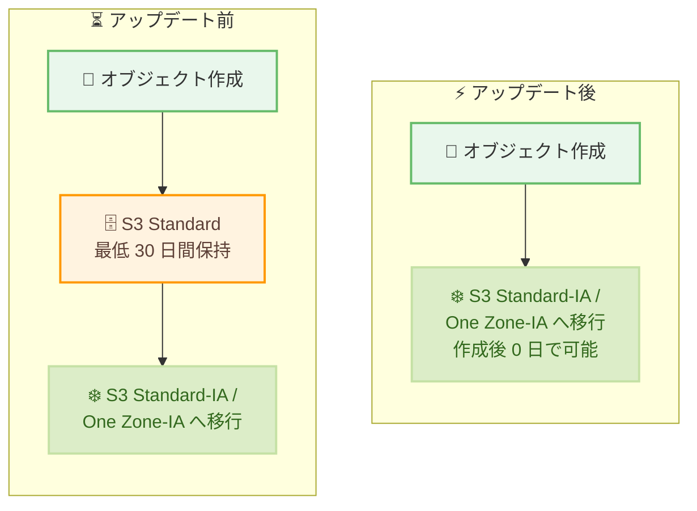

# Amazon S3 - S3 Standard-IA および S3 One Zone-IA への 30 日間最小移行期間の撤廃

**リリース日**: 2026 年 7 月 16 日
**サービス**: Amazon S3
**機能**: S3 Lifecycle による S3 Standard-IA / S3 One Zone-IA への移行における最小保持期間の撤廃

📊 [このアップデートのインフォグラフィックを見る](https://takech9203.github.io/aws-news-summary/20260716-s3-removes-30-day-transitions-standard-ia-one-zone-ia.html)
<!-- INFOGRAPHIC_BASE_URL は環境変数から取得 -->

## 概要

Amazon S3 は、S3 Standard-IA および S3 One Zone-IA へオブジェクトを移行する際に、これまで必要だった S3 Standard での 30 日間の最小保持期間を撤廃しました。これにより、オブジェクトを作成したその日から、これらの Infrequent Access (IA) ストレージクラスへ移行できるようになりました。

S3 Standard-IA および S3 One Zone-IA は、S3 Standard と比較して最大 40% 低いストレージコストを実現しながら、必要なときにミリ秒単位のアクセスを提供します。今回のアップデートにより、バックアップ、ログ分析、コンプライアンスワークロードなど、データが数時間から数日でコールドになるユースケースにおいて、より早期にコスト最適化を図ることが可能になります。

S3 Lifecycle ルールで作成後 0 日を指定するだけで、オブジェクトを即座に IA クラスへ移行できます。設定は S3 コンソール、AWS CLI、または各種 SDK から実施できます。

**アップデート前の課題**

- IA クラスへの移行前に、オブジェクトを S3 Standard に最低 30 日間保持する必要があった
- データが作成直後にコールドになるワークロードでも、30 日間は S3 Standard の料金を支払う必要があった
- 短期間で参照されなくなるデータのコスト最適化タイミングが遅れていた

**アップデート後の改善**

- オブジェクトを作成した当日 (作成後 0 日) から IA クラスへ移行できるようになった
- 早期のストレージクラス移行により、最大 40% のコスト削減をより早く享受できるようになった
- ライフサイクルルールの設定変更のみで即座に適用でき、アプリケーションの変更は不要

## アーキテクチャ図



作成後 0 日を指定したライフサイクルルールにより、S3 Standard での 30 日間の待機を経ずに IA クラスへ直接移行できるようになったことを示しています。

## サービスアップデートの詳細

### 主要機能

1. **30 日間最小保持期間の撤廃**
   - これまで S3 Standard-IA および S3 One Zone-IA への移行には、S3 Standard での 30 日間の最小保持が必要だった
   - この制約が撤廃され、オブジェクト作成当日からの移行が可能になった

2. **作成後 0 日でのライフサイクル移行**
   - S3 Lifecycle ルールで「作成後 0 日 (0 days after creation)」を指定して移行を構成できる
   - S3 コンソール、AWS CLI、SDK のいずれからも設定可能

3. **最大 40% のコスト削減とミリ秒アクセスの両立**
   - S3 Standard-IA および S3 One Zone-IA は S3 Standard より最大 40% 低いストレージコストを提供
   - IA クラスでありながら、必要時にはミリ秒単位でのアクセスを維持

## 技術仕様

### 対象ストレージクラス

| 項目 | 詳細 |
|------|------|
| 対象クラス | S3 Standard-IA、S3 One Zone-IA |
| 移行元 | S3 Standard |
| 最小保持期間 | 撤廃 (以前は 30 日間) |
| ライフサイクル指定 | 作成後 0 日 (0 days after creation) から移行可能 |
| アクセス性能 | ミリ秒単位のアクセス |
| コスト | S3 Standard 比で最大 40% 低いストレージコスト |

### ライフサイクル設定例

```json
{
  "Rules": [
    {
      "ID": "TransitionToStandardIAImmediately",
      "Filter": {
        "Prefix": "logs/"
      },
      "Status": "Enabled",
      "Transitions": [
        {
          "Days": 0,
          "StorageClass": "STANDARD_IA"
        }
      ]
    }
  ]
}
```

## 設定方法

### 前提条件

1. 対象の S3 バケットが存在すること
2. ライフサイクル設定を行う IAM 権限 (`s3:PutLifecycleConfiguration`) を持つこと
3. 対象リージョンで S3 Standard-IA または S3 One Zone-IA が利用可能であること

### 手順

#### ステップ1: ライフサイクルポリシーの定義

上記のような JSON ファイル (例: `lifecycle.json`) を作成し、`Days` に `0` を指定して移行先ストレージクラスを設定します。これにより、対象オブジェクトが作成当日から IA クラスへ移行されます。

#### ステップ2: ライフサイクルルールの適用

```bash
aws s3api put-bucket-lifecycle-configuration \
  --bucket my-example-bucket \
  --lifecycle-configuration file://lifecycle.json
```

このコマンドは、指定したバケットに対して定義済みのライフサイクル設定を適用します。適用後、`logs/` プレフィックスのオブジェクトは作成後 0 日で S3 Standard-IA へ移行されます。

#### ステップ3: 設定内容の確認

```bash
aws s3api get-bucket-lifecycle-configuration \
  --bucket my-example-bucket
```

このコマンドは、バケットに現在適用されているライフサイクル設定を取得し、移行ルールが正しく設定されているかを確認します。

## メリット

### ビジネス面

- **コスト最適化の早期化**: 作成当日から最大 40% 低コストの IA クラスへ移行でき、ストレージ費用を早期に削減できる
- **設定変更のみで適用可能**: アプリケーションの改修なしにライフサイクルルールの変更だけで恩恵を受けられる
- **予測可能なコスト構造**: 短期間でコールドになるデータの移行タイミングを明確に制御できる

### 技術面

- **ミリ秒アクセスの維持**: IA クラスに移行してもアクセス性能を維持できるため、必要時の読み取りに影響しない
- **柔軟なライフサイクル制御**: プレフィックスやタグでフィルタリングし、対象オブジェクトを細かく制御できる
- **既存の仕組みの活用**: 既存の S3 Lifecycle 機能をそのまま利用できる

## デメリット・制約事項

### 制限事項

- S3 Standard-IA および S3 One Zone-IA には最小課金対象オブジェクトサイズ (128 KB) が適用される
- これらのクラスには最小ストレージ期間 (30 日間の課金) が設定されているため、短期間で削除されるデータには適さない場合がある
- S3 One Zone-IA は単一のアベイラビリティーゾーンにデータを保存するため、可用性・耐障害性の要件を確認する必要がある

### 考慮すべき点

- 頻繁にアクセスされるデータを IA クラスへ移行すると、データ取得料金が発生しコストが増加する可能性がある
- 移行対象のオブジェクトサイズとアクセスパターンを分析し、IA クラスが適切かどうかを判断する
- ライフサイクル移行にはリクエスト料金が発生する点に留意する

## ユースケース

### ユースケース1: ログ分析基盤の即時コスト最適化

**シナリオ**: アプリケーションログを S3 に集約しているが、ログは作成後まもなく参照頻度が低下する。

**実装例**:
```json
{
  "ID": "LogsToIA",
  "Filter": { "Prefix": "app-logs/" },
  "Status": "Enabled",
  "Transitions": [
    { "Days": 0, "StorageClass": "STANDARD_IA" }
  ]
}
```

**効果**: 作成当日から IA クラスへ移行することで、30 日間 S3 Standard で保持する場合に比べてストレージコストを早期に削減できる。

### ユースケース2: バックアップデータのコスト削減

**シナリオ**: 日次バックアップを S3 に保存しているが、直近のバックアップ以外はほとんどアクセスされない。

**実装例**:
```json
{
  "ID": "BackupsToOneZoneIA",
  "Filter": { "Prefix": "backups/" },
  "Status": "Enabled",
  "Transitions": [
    { "Days": 0, "StorageClass": "ONEZONE_IA" }
  ]
}
```

**効果**: 再作成可能なバックアップを S3 One Zone-IA に即時移行し、耐障害性要件を満たしつつストレージコストを最小化できる。

### ユースケース3: コンプライアンスワークロードのアーカイブ

**シナリオ**: 規制対応のために保管するデータで、作成後数時間から数日でコールドになる。

**実装例**:
```json
{
  "ID": "ComplianceToIA",
  "Filter": { "Prefix": "compliance/" },
  "Status": "Enabled",
  "Transitions": [
    { "Days": 0, "StorageClass": "STANDARD_IA" }
  ]
}
```

**効果**: 保持要件を満たしながら、コールドになったデータを早期に低コストの IA クラスへ移行できる。

## 料金

今回のアップデート自体に追加料金は発生しません。ストレージ料金は移行先の S3 Standard-IA または S3 One Zone-IA のクラス料金が適用され、S3 Standard と比較して最大 40% 低いストレージコストとなります。なお、ライフサイクルによる移行にはリクエスト料金が発生し、IA クラスにはデータ取得料金および最小課金対象オブジェクトサイズ (128 KB)、最小ストレージ期間 (30 日間) が適用されます。詳細は Amazon S3 の料金ページを参照してください。

## 利用可能リージョン

S3 Standard-IA および S3 One Zone-IA が利用可能なすべての AWS リージョンで利用できます。

## 関連サービス・機能

- **S3 Lifecycle**: オブジェクトのストレージクラス移行や有効期限切れを自動化する機能。今回のアップデートはこのルールで設定する
- **S3 Intelligent-Tiering**: アクセスパターンに応じて自動的にストレージクラスを最適化する機能。移行タイミングを自動化したい場合の選択肢となる
- **S3 Storage Lens**: ストレージの使用状況やアクセスパターンを可視化し、IA クラスへの移行判断に役立つ

## 参考リンク

- 📊 [インフォグラフィック](https://takech9203.github.io/aws-news-summary/20260716-s3-removes-30-day-transitions-standard-ia-one-zone-ia.html)
- [公式発表 (What's New)](https://aws.amazon.com/about-aws/whats-new/2026/07/s3-removes-30-day-transitions-standard-ia-one-zone-ia)
- [ドキュメント (ライフサイクル移行の考慮事項)](https://docs.aws.amazon.com/AmazonS3/latest/userguide/lifecycle-transition-general-considerations.html)
- [料金ページ](https://aws.amazon.com/s3/pricing/)

## まとめ

今回のアップデートにより、S3 Standard-IA および S3 One Zone-IA への移行における 30 日間の最小保持期間が撤廃され、オブジェクト作成当日からのコスト最適化が可能になりました。データが短期間でコールドになるバックアップ、ログ分析、コンプライアンスワークロードでは、ライフサイクルルールを作成後 0 日に設定することで早期にコスト削減効果を得られます。既存のワークロードのアクセスパターンを見直し、IA クラスへの即時移行が有効なデータを特定することを推奨します。
