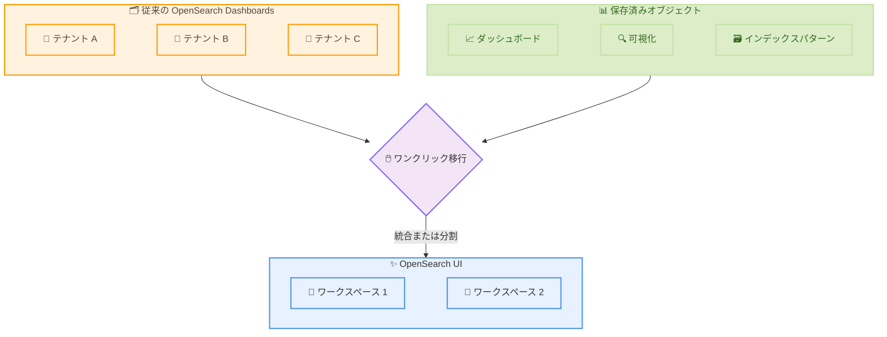

# Amazon OpenSearch Service - OpenSearch UI ワンクリックダッシュボード移行

**リリース日**: 2026 年 7 月 17 日
**サービス**: Amazon OpenSearch Service
**機能**: OpenSearch UI ワンクリックダッシュボード移行 (One-Click Dashboard Migration)

📊 [このアップデートのインフォグラフィックを見る](https://takech9203.github.io/aws-news-summary/20260717-amazon-opensearch-ui-one-click-dashboard-migration.html)
<!-- INFOGRAPHIC_BASE_URL は環境変数から取得 -->

## 概要

Amazon OpenSearch Service は、従来の OpenSearch Dashboards から新しい OpenSearch UI へのワンクリック移行機能を発表しました。OpenSearch UI は、複数のデータソースにまたがる検索と統合オブザーバビリティを実現する、ゼロダウンタイムかつサーバーレスの新しいインターフェースです。この移行機能は、OpenSearch Service のマネージドドメインとサーバーレスコレクションの両方に対応しています。

この機能により、従来の OpenSearch Dashboards で作成した複数のテナントや数千に及ぶ保存済みオブジェクト (saved objects) を、手作業で再作成することなく OpenSearch UI のワークスペースへ移行できます。移行先は、新規に作成するワークスペースと既存のワークスペースのどちらも選択可能です。複数のテナントを保有している場合は、それらを 1 つのワークスペースに統合することも、チームごとに分割したまま個別のワークスペースへ移行することもできます。

本機能は、OpenSearch UI が利用可能なすべての AWS リージョンで提供されます。これにより、既存の可視化資産を維持しながら、新しいインターフェースへ円滑に移行できるようになります。

**アップデート前の課題**

従来、OpenSearch Dashboards から OpenSearch UI へ移行する際には、次のような課題が存在していました。

- 従来はテナントや保存済みオブジェクトを OpenSearch UI ワークスペースへ手作業で再作成する必要があった
- 従来は数千に及ぶダッシュボードや可視化を移行する際に多大な工数と時間がかかっていた
- 従来はテナント構造を新しいワークスペースモデルにどうマッピングするかを手動で設計する必要があった

**アップデート後の改善**

今回のアップデートにより、次のことが可能になりました。

- 今回のアップデートによりテナントと保存済みオブジェクトをワンクリックで OpenSearch UI ワークスペースへ移行できるようになった
- 今回のアップデートにより手作業でのダッシュボード再作成が不要になった
- 今回のアップデートによりマネージドドメインとサーバーレスコレクションの両方で同じ移行体験が提供されるようになった

## アーキテクチャ図

従来の OpenSearch Dashboards に存在するテナントと保存済みオブジェクトを、ワンクリック移行によって OpenSearch UI のワークスペースへ統合または分割して移行する流れを示しています。

## サービスアップデートの詳細

### 主要機能

1. **ワンクリックによるダッシュボード移行**
   - 従来の OpenSearch Dashboards から OpenSearch UI への移行を単一の操作で実行
   - テナントと保存済みオブジェクトを自動的に OpenSearch UI ワークスペースへ移行
   - 手作業での再作成が不要

2. **ドメインとサーバーレスの両対応**
   - OpenSearch Service のマネージドドメインに対応
   - OpenSearch Serverless コレクションに対応
   - 双方で同一の移行体験を提供

3. **柔軟な移行先の選択**
   - 新規ワークスペースまたは既存ワークスペースへの移行を選択可能
   - 複数テナントを 1 つのワークスペースへ統合可能
   - チームごとにテナントを分割したまま個別のワークスペースへ移行可能

## 技術仕様

### 移行対象と移行先

| 項目 | 詳細 |
|------|------|
| 移行元 | 従来の OpenSearch Dashboards |
| 移行先 | OpenSearch UI ワークスペース |
| 移行対象 | テナント、保存済みオブジェクト (ダッシュボード、可視化、インデックスパターンなど) |
| 対応リソース | OpenSearch Service ドメイン、OpenSearch Serverless コレクション |
| 移行方式 | ワンクリック (自動移行) |
| テナント統合 | 単一ワークスペースへの統合、またはチームごとの分割が選択可能 |

### OpenSearch UI の特徴

| 項目 | 詳細 |
|------|------|
| インターフェース | サーバーレスの新しい検索・オブザーバビリティ UI |
| ダウンタイム | ゼロダウンタイム |
| データソース | 複数のデータソースにまたがる統合オブザーバビリティ |
| 管理単位 | ワークスペース (従来のテナントに相当する概念) |

## 設定方法

### 前提条件

1. Amazon OpenSearch Service のドメインまたは OpenSearch Serverless コレクションを利用していること
2. 従来の OpenSearch Dashboards にテナントや保存済みオブジェクトが存在すること
3. OpenSearch UI が利用可能なリージョンでリソースを運用していること

### 手順

#### ステップ 1: OpenSearch UI にアクセス

OpenSearch Service コンソールから OpenSearch UI を開きます。OpenSearch UI は、複数のデータソースにまたがる検索とオブザーバビリティを提供する新しいインターフェースです。

#### ステップ 2: 移行の実行

OpenSearch UI 上の移行機能から、移行元となる従来の OpenSearch Dashboards のテナントと保存済みオブジェクトを選択し、ワンクリックで移行を開始します。移行先として新規ワークスペースまたは既存ワークスペースを指定します。

#### ステップ 3: ワークスペース構成の選択

複数のテナントがある場合は、1 つのワークスペースへ統合するか、チームごとに分割して個別のワークスペースへ移行するかを選択します。詳細な手順については、開発者ガイドの「Using OpenSearch UI」セクションおよび OpenSearch UI ヘルプページのチュートリアルを参照してください。

## メリット

### ビジネス面

- **移行コストの削減**: 手作業でのダッシュボード再作成が不要となり、移行にかかる工数と時間を大幅に削減
- **既存資産の継続活用**: 従来作成した数千の保存済みオブジェクトをそのまま OpenSearch UI で再利用可能
- **円滑な移行**: ゼロダウンタイムの新しいインターフェースへスムーズに移行できる

### 技術面

- **一貫した移行体験**: マネージドドメインとサーバーレスコレクションの両方で同じ移行フローを利用可能
- **柔軟な構成**: テナントの統合と分割を用途やチーム構成に合わせて選択可能
- **統合オブザーバビリティ**: 移行後は複数データソースにまたがる統合された検索・可視化基盤を活用可能

## デメリット・制約事項

### 制限事項

- OpenSearch UI が利用可能なリージョンでのみ本移行機能を利用可能
- 移行対象は従来の OpenSearch Dashboards のテナントおよび保存済みオブジェクトに限定される

### 考慮すべき点

- 移行前に既存のテナント構造とワークスペースへのマッピング方針を検討することが望ましい
- 複数チームで運用している場合は、統合と分割のいずれが運用に適しているかを事前に評価する

## ユースケース

### ユースケース 1: 大規模ダッシュボード資産の移行

**シナリオ**: 長期間 OpenSearch Dashboards を運用し、数千の可視化やダッシュボードを保有する組織が、新しい OpenSearch UI へ移行したい。

**効果**: ワンクリック移行により、膨大な保存済みオブジェクトを手作業で再作成することなく OpenSearch UI ワークスペースへ移行でき、移行工数を大幅に削減できます。

### ユースケース 2: マルチテナント環境のチーム別移行

**シナリオ**: 複数チームが個別のテナントで可視化を管理しており、チームごとの独立性を維持したまま OpenSearch UI へ移行したい。

**効果**: テナントを分割したまま個別のワークスペースへ移行することで、チームごとのアクセス境界を維持しながら新しいインターフェースへ移行できます。

### ユースケース 3: サーバーレスコレクションの UI 刷新

**シナリオ**: OpenSearch Serverless コレクションで可視化を運用しているチームが、サーバーレスの新しい UI へ移行したい。

**効果**: サーバーレスコレクションでもドメインと同じ移行体験が提供されるため、統一された手順でゼロダウンタイムの OpenSearch UI へ移行できます。

## 料金

本移行機能自体の追加料金に関する情報は、公式発表では明示されていません。OpenSearch Service および OpenSearch Serverless の利用料金については、公式の料金ページを参照してください。

## 利用可能リージョン

OpenSearch UI が利用可能なすべての AWS リージョンで提供されます。

## 関連サービス・機能

- **Amazon OpenSearch Service**: 移行対象となるマネージドドメインを提供する検索・分析サービス
- **Amazon OpenSearch Serverless**: 移行対象となるサーバーレスコレクションを提供するサーバーレス版 OpenSearch
- **OpenSearch UI**: 複数データソースにまたがる検索と統合オブザーバビリティを提供する新しいインターフェース

## 参考リンク

- 📊 [インフォグラフィック](https://takech9203.github.io/aws-news-summary/20260717-amazon-opensearch-ui-one-click-dashboard-migration.html)
- [公式発表 (What's New)](https://aws.amazon.com/about-aws/whats-new/2026/07/amazon-opensearch-ui-one-click-dashboard-migration)
- [Amazon OpenSearch Service ドキュメント](https://docs.aws.amazon.com/opensearch-service/latest/developerguide/opensearch-ui.html)
- [Amazon OpenSearch Service 料金ページ](https://aws.amazon.com/opensearch-service/pricing/)

## まとめ

今回のアップデートは、従来の OpenSearch Dashboards から新しい OpenSearch UI への移行障壁を大きく引き下げる重要な機能です。テナントと保存済みオブジェクトをワンクリックで移行できるため、既存の可視化資産を維持したまま円滑にインターフェースを刷新できます。OpenSearch Dashboards を運用している組織は、テナント構造とワークスペースへのマッピング方針を検討したうえで、移行の実施を計画することを推奨します。
