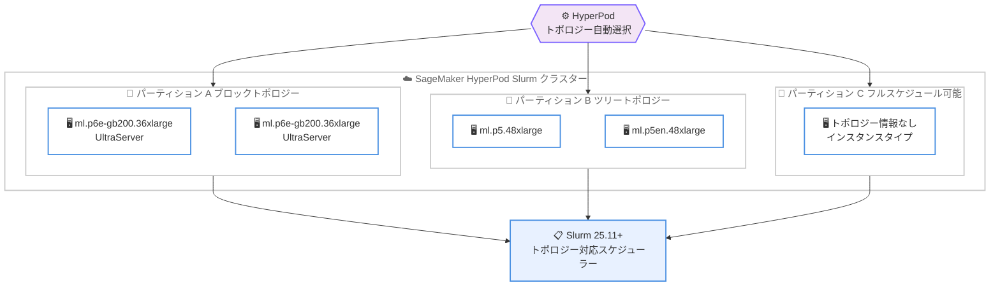

# Amazon SageMaker HyperPod - Slurm クラスター向けパーティションレベルトポロジー

**リリース日**: 2026 年 7 月 17 日
**サービス**: Amazon SageMaker HyperPod
**機能**: Slurm オーケストレーションクラスター向けパーティションレベルのネットワークトポロジー

📊 [このアップデートのインフォグラフィックを見る](https://takech9203.github.io/aws-news-summary/20260717-hyperpod-partition-topology-slurm.html)
<!-- INFOGRAPHIC_BASE_URL は環境変数から取得 -->

## 概要

Amazon SageMaker HyperPod が、Slurm でオーケストレーションされるクラスターに対して、パーティションレベルでのネットワークトポロジー設定のサポートを開始しました。これにより、単一のクラスター内でパーティションごとに異なるトポロジーを運用できるようになります。たとえば、あるパーティションではツリートポロジー、別のパーティションではブロックトポロジーというように、各パーティションをそのインスタンスタイプに最も適したトポロジーに一致させることができます。

大規模な分散トレーニングでは、ジョブの配置をインスタンスタイプごとのインターコネクト特性に合わせることが、通信効率とスループットに直接影響します。今回のアップデートにより、HyperPod はコンピュートインスタンスグループ内のインスタンスタイプに基づいてパーティションのトポロジーを自動的に選択します。その結果、より高速な GPU 間通信、より効率的な NCCL 集合通信 (collective operations)、分散ワークロードのトレーニングスループット向上が期待できます。

トポロジーを意識したスケジューリング (topology-aware scheduling) はデフォルトで有効になっており、構成は不要です。異なる GPU インスタンスタイプを混在させて大規模な分散トレーニングを実行する機械学習チームが主な対象ユーザーです。

**アップデート前の課題**

このアップデート以前、Slurm クラスターのネットワークトポロジー設定はクラスター単位で扱われ、混在するインスタンスタイプそれぞれの特性を最大限に活かすことが困難でした。

- 以前はクラスター内で異なるインスタンスタイプに対して個別に最適なトポロジーを割り当てることができなかった
- 以前はインターコネクト特性の異なるインスタンスタイプが混在すると、ジョブ配置が最適化されず通信効率が低下する可能性があった
- 以前はスケールアップ・スケールダウンやノード置換のたびにトポロジー情報を手動で整合させる必要があった

**アップデート後の改善**

今回のアップデートにより、パーティション単位でトポロジーを自動的に最適化できるようになりました。

- 今回のアップデートにより、単一クラスター内でパーティションごとに異なるトポロジー (ツリー、ブロックなど) を運用できるようになった
- 今回のアップデートにより、インスタンスタイプに基づいてパーティションのトポロジーが自動選択され、追加構成が不要になった
- 今回のアップデートにより、スケールアップ・スケールダウン・ノード置換のイベントを通じてトポロジー構成が自動的に維持されるようになった

## アーキテクチャ図



HyperPod がインスタンスタイプに基づいて各パーティションのトポロジーを自動選択し、Slurm のトポロジー対応スケジューラーがジョブ配置を最適化する流れを示しています。

## サービスアップデートの詳細

### 主要機能

1. **パーティションレベルのトポロジー設定**
   - 単一のクラスター内でパーティションごとに異なるトポロジーを運用可能
   - たとえば、あるパーティションではツリートポロジー、別のパーティションではブロックトポロジーを使用
   - 各パーティションをそのインスタンスタイプに最も適したトポロジーに一致させる

2. **インスタンスタイプに基づく自動トポロジー選択**
   - コンピュートインスタンスグループ内のインスタンスタイプに基づいて HyperPod がトポロジーを自動選択
   - ブロックトポロジー: `ml.p6e-gb200.36xlarge` などの EC2 UltraServer インスタンスタイプを使用するパーティション
   - ツリートポロジー: `ml.p5.48xlarge`、`ml.p5e.48xlarge`、`ml.p5en.48xlarge` などの階層型インターコネクトを持つインスタンスタイプを使用するパーティション
   - フルスケジュール可能: トポロジー情報を持たないインスタンスタイプのパーティション

3. **クラスター状態の変化に追従する自動維持**
   - スケールアップ、スケールダウン、ノード置換のイベントを通じてトポロジー構成を自動的に維持
   - 各パーティションが常にクラスターの現在の状態を反映
   - デフォルトで有効化されており、追加の構成は不要

## 技術仕様

### トポロジーとインスタンスタイプの対応

| トポロジー | 対象インスタンスタイプの例 | 特性 |
|------|------|------|
| ブロックトポロジー | ml.p6e-gb200.36xlarge (EC2 UltraServer) | UltraServer の緊密なインターコネクトに最適化 |
| ツリートポロジー | ml.p5.48xlarge、ml.p5e.48xlarge、ml.p5en.48xlarge | 階層型インターコネクトに最適化 |
| フルスケジュール可能 | トポロジー情報を持たないインスタンスタイプ | トポロジー制約なしでスケジュール |

### 前提条件と動作

| 項目 | 詳細 |
|------|------|
| Slurm バージョン | Slurm 25.11 以降を実行する HyperPod Slurm クラスター |
| 対応インスタンス | サポートされる GPU インスタンスタイプ |
| 有効化 | デフォルトで有効。構成は不要 |
| トポロジー選択 | コンピュートインスタンスグループ内のインスタンスタイプに基づき自動 |

### API 変更履歴

今回のトポロジー機能はデフォルトで有効化され、追加の API 構成を必要としないため、本機能に直接対応する API 変更は確認できませんでした。参考として、同時期の SageMaker 関連の API 変更を以下に示します。

| 日付 | サービス | 変更内容 |
|------|----------|----------|
| 2026/07/10 | [Amazon SageMaker Service](https://awsapichanges.com/archive/changes/4249fc-api.sagemaker.html) | 10 updated methods - SageMaker HyperPod 向けの g4d、c6g、c7g、c8g インスタンスタイプのサポートに関連する更新 |

## 設定方法

### 前提条件

1. Amazon SageMaker HyperPod の Slurm クラスターを利用できること
2. クラスターが Slurm 25.11 以降を実行していること
3. サポートされる GPU インスタンスタイプを使用していること

### 手順

#### ステップ1: 対応バージョンの Slurm クラスターを準備

トポロジーを意識したスケジューリングを利用するには、HyperPod の Slurm クラスターが Slurm 25.11 以降で稼働している必要があります。既存クラスターの場合は、対応バージョンへの更新状況を確認します。

#### ステップ2: インスタンスタイプに応じたパーティションを構成

コンピュートインスタンスグループで使用するインスタンスタイプを選択します。HyperPod は各パーティションのインスタンスタイプに基づいてトポロジー (ブロック、ツリー、フルスケジュール可能) を自動的に選択するため、トポロジー自体の明示的な設定は不要です。

#### ステップ3: 分散トレーニングジョブを実行

トポロジーを意識したスケジューリングはデフォルトで有効なため、通常どおり Slurm 経由で分散トレーニングジョブを投入すると、HyperPod がインターコネクト特性に合わせてジョブを配置します。詳細は公式ドキュメント「Using topology-aware scheduling in Amazon SageMaker HyperPod」を参照してください。

## メリット

### ビジネス面

- **トレーニングコストの最適化**: 通信効率とスループットの向上により、大規模トレーニングにかかる時間とコストを削減
- **運用負荷の軽減**: デフォルトで有効かつ自動選択のため、トポロジー設定のための追加運用が不要
- **混在環境の活用**: 異なるインスタンスタイプを混在させたクラスターでも、それぞれの特性を最大限に活用可能

### 技術面

- **高速な GPU 間通信**: ジョブ配置をインターコネクト特性に合わせることで GPU 間通信を高速化
- **効率的な NCCL 集合通信**: NCCL の集合通信操作の効率が向上し、分散トレーニングのボトルネックを軽減
- **自動的な整合性維持**: スケールアップ・スケールダウン・ノード置換の際もトポロジー構成が自動的に維持される

## デメリット・制約事項

### 制限事項

- Slurm 25.11 以降を実行する HyperPod Slurm クラスターが必要
- サポートされる GPU インスタンスタイプが対象
- トポロジー情報を持たないインスタンスタイプのパーティションは「フルスケジュール可能」として扱われ、トポロジー最適化の恩恵を受けない

### 考慮すべき点

- 既存クラスターで恩恵を受けるには Slurm バージョンの要件を満たす必要がある
- トポロジーはインスタンスタイプに基づき自動選択されるため、意図したトポロジーになるかはインスタンスタイプの選定に依存する
- 効果はワークロードの通信パターン (集合通信の頻度や規模) によって異なる

## ユースケース

### ユースケース1: UltraServer を用いた大規模モデル学習

**シナリオ**: 大規模言語モデルの学習で ml.p6e-gb200.36xlarge (EC2 UltraServer) を使用し、GPU 間の緊密な通信を最大化したい。

**実装例**:
```
ml.p6e-gb200.36xlarge のパーティション
→ HyperPod がブロックトポロジーを自動選択
→ UltraServer のインターコネクトに最適化されたジョブ配置
```

**効果**: UltraServer の高帯域インターコネクトを活かし、集合通信の効率とトレーニングスループットが向上する。

### ユースケース2: 異種インスタンスタイプの混在クラスター

**シナリオ**: 単一クラスター内で ml.p5.48xlarge と UltraServer 系インスタンスを混在させ、それぞれに最適なトポロジーで運用したい。

**実装例**:
```
パーティション A: ml.p5.48xlarge → ツリートポロジー
パーティション B: ml.p6e-gb200.36xlarge → ブロックトポロジー
→ 単一クラスターで両方を並行運用
```

**効果**: インスタンスタイプごとに最適なトポロジーが自動適用され、混在環境でも通信効率を最大化できる。

### ユースケース3: 動的にスケールするトレーニングクラスター

**シナリオ**: ワークロードに応じてノードを追加・削除する運用で、トポロジー整合性を手動管理せずに維持したい。

**実装例**:
```
スケールアップ / スケールダウン / ノード置換
→ HyperPod が各パーティションのトポロジーを自動的に再整合
```

**効果**: クラスター状態の変化にかかわらずトポロジー構成が自動維持され、運用の手間なく最適なジョブ配置を継続できる。

## 料金

パーティションレベルトポロジー機能自体に対する追加料金の記載はありません。SageMaker HyperPod のクラスターで使用するコンピューティングリソース (インスタンス) やストレージなどに対して通常どおり課金されます。最新かつ正確な料金は公式の料金ページを確認してください。

## 利用可能リージョン

Amazon SageMaker HyperPod がサポートされているすべての AWS リージョンで利用可能です。

## 関連サービス・機能

- **AWS Slurm オーケストレーション**: HyperPod クラスターのジョブスケジューリングを担うオーケストレーター。本機能の対象 (Slurm 25.11 以降が必要)
- **Amazon EC2 UltraServer**: ブロックトポロジーが適用される高帯域インターコネクトのインスタンス基盤
- **NCCL (NVIDIA Collective Communications Library)**: 分散トレーニングの GPU 間集合通信を担うライブラリ。トポロジー最適化により効率が向上
- **Amazon SageMaker HyperPod**: 大規模な分散トレーニング向けのマネージドクラスター基盤

## 参考リンク

- 📊 [インフォグラフィック](https://takech9203.github.io/aws-news-summary/20260717-hyperpod-partition-topology-slurm.html)
- [公式発表 (What's New)](https://aws.amazon.com/about-aws/whats-new/2026/07/hyperpod-partition-topology-slurm/)
- [Amazon SageMaker HyperPod ドキュメント](https://docs.aws.amazon.com/sagemaker/latest/dg/sagemaker-hyperpod.html)
- [Amazon SageMaker 料金ページ](https://aws.amazon.com/sagemaker/pricing/)

## まとめ

今回のアップデートにより、SageMaker HyperPod の Slurm クラスターで、パーティション単位のネットワークトポロジーが自動的に最適化されるようになりました。インスタンスタイプに応じてブロック・ツリー・フルスケジュール可能のトポロジーが自動選択され、GPU 間通信と NCCL 集合通信の効率向上によりトレーニングスループットが改善されます。デフォルトで有効かつ構成不要のため、異種インスタンスを混在させる大規模分散トレーニングを運用するチームは、クラスターの Slurm バージョンが 25.11 以降であることを確認し、この最適化を活用することを推奨します。
