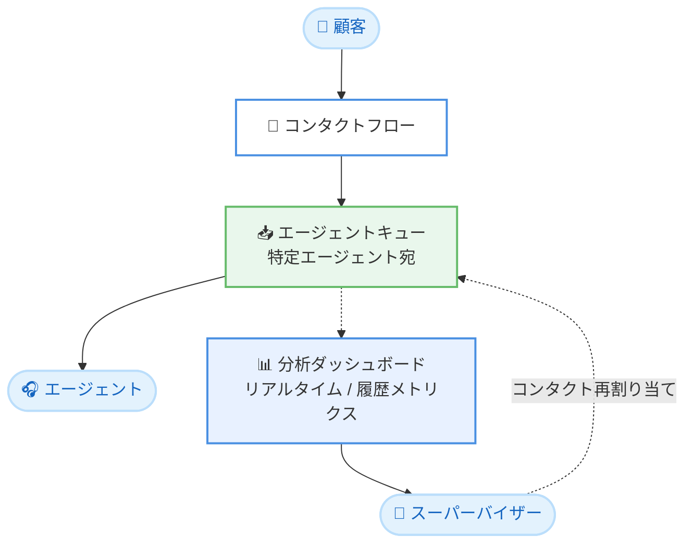

# Amazon Connect Customer - エージェントキューのメトリクス表示

**リリース日**: 2026 年 7 月 20 日
**サービス**: Amazon Connect Customer
**機能**: 分析ダッシュボードでのエージェントキューメトリクス

📊 [このアップデートのインフォグラフィックを見る](https://takech9203.github.io/aws-news-summary/20260720-amazon-connect-agent-queue-metrics.html)
<!-- INFOGRAPHIC_BASE_URL は環境変数から取得 -->

## 概要

Amazon Connect Customer の分析ダッシュボードで、エージェントキュー (agent queue) のリアルタイムメトリクスと履歴メトリクスが表示できるようになりました。エージェントキューは、コンタクトを特定のエージェントに直接ルーティングするために使用されるキューです。今回のアップデートにより、スーパーバイザーは各エージェントが自身のキューでどのように稼働しているかを追跡できるようになります。

Amazon Connect には 2 種類のキューがあります。1 つは複数のエージェントで共有される標準キュー (standard queue)、もう 1 つは各エージェントに対して自動的に作成されるエージェントキューです。エージェントキューは、以前会話したエージェントへの再接続、特定エージェントからのコールバック、指名によるマネージャーへのルーティングなど、スキルベースルーティングをバイパスして特定のエージェントへコンタクトを直接届ける用途で使われます。

これまでの分析ダッシュボードでは標準キューのメトリクスが中心でしたが、今回のアップデートによりエージェントキューにもメトリクス表示が拡大しました。たとえば、スーパーバイザーは一連のスケジュール済みコールバックの後に特定のエージェントキューへのコンタクトが急増していることに気づき、待ち時間が長くなる前にコンタクトを再割り当てするといった運用が可能になります。この機能は、Amazon Connect Customer が提供されるすべての AWS 商用リージョンおよび AWS GovCloud (US-West) リージョンで利用できます。

**アップデート前の課題**

- 分析ダッシュボードでは、エージェントキューのリアルタイム・履歴メトリクスを直接確認できなかった
- 特定エージェントへ直接ルーティングされたコンタクトの滞留状況を把握しづらかった
- スーパーバイザーがエージェント個別のキューのパフォーマンスを追跡する手段が限られていた

**アップデート後の改善**

- 分析ダッシュボードでエージェントキューのリアルタイムメトリクスと履歴メトリクスを確認できるようになった
- 特定エージェントのキューへのコンタクト急増を早期に検知できるようになった
- スーパーバイザーがコンタクトを別のキューへ再割り当てし、長い待ち時間を回避できるようになった

## アーキテクチャ図

顧客のコンタクトがコンタクトフローを経てエージェントキューに入り、特定のエージェントへ直接ルーティングされます。スーパーバイザーは分析ダッシュボード上でエージェントキューのメトリクスを確認し、必要に応じてコンタクトを再割り当てできます。

## サービスアップデートの詳細

### 主要機能

1. **エージェントキューのリアルタイムメトリクス**
   - 分析ダッシュボードで、エージェントキューに現在滞留しているコンタクトの状況をリアルタイムに把握できる
   - スケジュール済みコールバックなどによるコンタクトの急増を即座に検知できる
   - スーパーバイザーは現状に基づいて素早く運用判断を行える

2. **エージェントキューの履歴メトリクス**
   - 過去のエージェントキューのパフォーマンス推移を確認できる
   - エージェントごとの稼働傾向の分析やキャパシティプランニングに活用できる

3. **スーパーバイザーによるコンタクト再割り当て**
   - メトリクスで検知したコンタクトの偏りに対し、別のキューへコンタクトを再割り当てできる
   - 特定エージェントへの負荷集中を緩和し、長い待ち時間を回避できる

## 技術仕様

### キューの種類

| 項目 | 標準キュー | エージェントキュー |
|------|-----------|-------------------|
| 作成方法 | 管理者が手動で作成 | ユーザー作成時に自動作成 |
| ルーティング対象 | 割り当てられた任意のエージェント | 特定の 1 エージェント |
| 主な用途 | スキルベースルーティング | 特定エージェントへの直接ルーティング |
| 分析ダッシュボードのメトリクス | 対応済み | 今回のアップデートで対応 |

### 主なユースケースとなるルーティング

- 以前対応したエージェントへの再接続
- 特定エージェントからのコールバック
- 指名によるマネージャーやスペシャリストへのルーティング

## 設定方法

### 前提条件

1. Amazon Connect Customer のインスタンスを利用していること
2. 分析ダッシュボードへのアクセス権限を持つスーパーバイザーまたは管理者アカウントがあること
3. コンタクトフローでエージェントキューへのルーティングが構成されていること

### 手順

#### ステップ1: エージェントキューへのルーティングを構成する

コンタクトフローの [作業キューの設定 (Set working queue)] ブロックで、[エージェントに設定 (Set to agent)] を選択し、コンタクト属性を用いて対象エージェントを動的に指定します。これにより、コンタクトが特定のエージェントキューへルーティングされます。

#### ステップ2: 分析ダッシュボードでメトリクスを確認する

Amazon Connect Customer の分析ダッシュボードを開き、エージェントキューのリアルタイムメトリクスおよび履歴メトリクスを確認します。特定のエージェントキューへのコンタクト滞留や急増を監視します。

#### ステップ3: 必要に応じてコンタクトを再割り当てする

メトリクスでコンタクトの偏りを検知した場合、スーパーバイザーはコンタクトを別のキューへ再割り当てし、待ち時間の長期化を防ぎます。

## メリット

### ビジネス面

- **顧客体験の向上**: コンタクトの偏りを早期に検知して待ち時間を短縮できる
- **運用の可視化**: エージェント個別のキューのパフォーマンスを把握できる
- **迅速な意思決定**: リアルタイムメトリクスに基づいてスーパーバイザーが即座に対応できる

### 技術面

- **既存ダッシュボードの拡張**: 追加のツールを導入せず既存の分析ダッシュボードでメトリクスを確認できる
- **リアルタイムと履歴の両対応**: 現状監視と傾向分析の両方に対応する
- **直接ルーティングの可観測性**: 特定エージェントへの直接ルーティングの状況を追跡できる

## デメリット・制約事項

### 制限事項

- 利用可能リージョンは Amazon Connect Customer が提供される AWS 商用リージョンおよび AWS GovCloud (US-West) に限定される
- エージェントキューはエージェントごとに 1 つ自動生成されるものであり、手動での作成・削除はできない

### 考慮すべき点

- エージェントキューへ直接ルーティングする場合、対象エージェントが不在だとコンタクトが待機状態になるため、コンタクトフローにタイムアウトやフォールバック (標準キューへの再ルーティング) を組み込むことが推奨される
- 特定エージェントへの負荷集中を避けるため、メトリクスを継続的に監視する運用が望ましい

## ユースケース

### ユースケース1: スケジュール済みコールバック後の負荷分散

**シナリオ**: 一連のスケジュール済みコールバックの後、特定のエージェントキューへのコンタクトが急増する。

**効果**: スーパーバイザーがリアルタイムメトリクスで急増を検知し、コンタクトを別のキューへ再割り当てすることで、長い待ち時間を回避できる。

### ユースケース2: 継続対応が必要な顧客の直接ルーティング監視

**シナリオ**: 以前対応したエージェントへ顧客を再接続する直接ルーティングを運用している。

**効果**: エージェントキューのメトリクスにより、指名対応が集中しているエージェントを把握し、対応品質と待ち時間のバランスを管理できる。

### ユースケース3: エージェント稼働傾向の分析

**シナリオ**: 期間ごとのエージェント別パフォーマンスを分析したい。

**効果**: 履歴メトリクスを用いてエージェントキューの稼働傾向を分析し、要員配置やキャパシティプランニングに役立てられる。

## 料金

エージェントキューのメトリクス表示は Amazon Connect Customer の分析ダッシュボード機能の一部として提供されます。料金の詳細は Amazon Connect の料金ページを参照してください。

## 利用可能リージョン

Amazon Connect Customer が提供されるすべての AWS 商用リージョンおよび AWS GovCloud (US-West) リージョンで利用できます。

## 関連サービス・機能

- **Amazon Connect (標準キュー)**: スキルベースルーティングで使用される共有キュー。エージェントキューと併用してフォールバックを構成できる
- **Amazon Connect コンタクトフロー**: エージェントキューへの直接ルーティングを構成する仕組み
- **Amazon Connect 分析ダッシュボード**: 今回メトリクス表示が拡張された監視・分析基盤

## 参考リンク

- 📊 [インフォグラフィック](https://takech9203.github.io/aws-news-summary/20260720-amazon-connect-agent-queue-metrics.html)
- [公式発表 (What's New)](https://aws.amazon.com/about-aws/whats-new/2026/07/amazon-connect/)
- [Amazon Connect ドキュメント](https://docs.aws.amazon.com/connect/)
- [Amazon Connect 料金ページ](https://aws.amazon.com/connect/pricing/)

## まとめ

今回のアップデートにより、Amazon Connect Customer の分析ダッシュボードでエージェントキューのリアルタイムメトリクスと履歴メトリクスを確認できるようになりました。特定エージェントへの直接ルーティングを運用しているコンタクトセンターでは、コンタクトの偏りを早期に検知して待ち時間を抑えることができます。エージェントキューを利用している場合は、ダッシュボードでの監視運用を取り入れ、必要に応じてコンタクトフローにフォールバックを組み込むことを推奨します。
