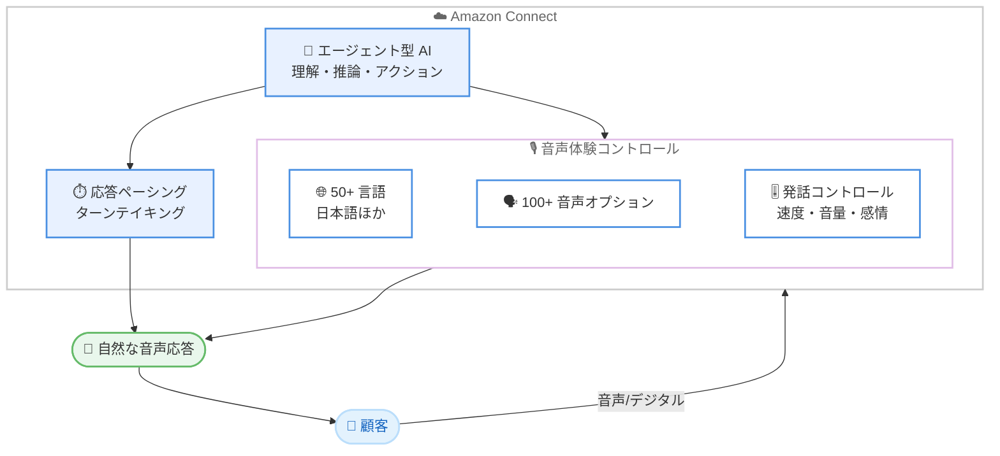

# Amazon Connect - エージェント型音声体験の言語拡大と発話コントロール

**リリース日**: 2026 年 7 月 20 日
**サービス**: Amazon Connect
**機能**: Agentic Voice (エージェント型音声体験) の言語サポート拡大と発話コントロール

📊 [このアップデートのインフォグラフィックを見る](https://takech9203.github.io/aws-news-summary/20260720-amazon-connect-agentic-voice.html)
<!-- INFOGRAPHIC_BASE_URL は環境変数から取得 -->

## 概要

Amazon Connect のエージェント型音声体験 (agentic voice) が大幅に強化され、より自然で人間らしい会話体験を提供できるようになりました。今回のアップデートにより、50 以上の言語 (スペイン語、フランス語、イタリア語、日本語、韓国語、ポルトガル語、タイ語など) に対応し、100 種類を超える新しい音声オプションが追加されました。

Amazon Connect のエージェント型 AI は、音声チャネルとデジタルチャネルの両方にわたって、顧客の発話を理解し、推論し、アクションを実行します。今回の機能拡張では、会話の間 (ま) を自然に埋める応答ペーシング、発話者同士が話をかぶせないためのターンテイキング (発話交代) の精度向上、そしてブランドのトーンに合わせて話す速度、音量、感情を調整できる発話コントロールが導入されました。

これらの改善により、企業は顧客対応の自動化を進めながらも、地域や言語、ブランドに応じた自然で一貫性のある音声体験を、グローバル規模で提供できるようになります。

**アップデート前の課題**

- 対応言語が限定的で、多言語を扱うグローバルなコンタクトセンターでは、地域ごとの言語ニーズに十分応えられなかった
- 音声オプションの選択肢が限られており、ブランドイメージに合った音声を選びにくかった
- 会話の間や発話交代が不自然で、AI との対話がぎこちなく感じられることがあった

**アップデート後の改善**

- 50 以上の言語に対応し、日本語を含む幅広い言語で自然な音声対話が可能になった
- 100 種類を超える新しい音声オプションから、ブランドに合った音声を選択できるようになった
- 応答ペーシングとターンテイキングの改善により、間を自然に埋め、発話のかぶりを防ぐ対話が実現した
- 話す速度、音量、感情を調整できる発話コントロールにより、ブランドのトーンに合わせた音声表現が可能になった

## アーキテクチャ図

エージェント型 AI が顧客の発話を理解・推論し、言語、音声、発話コントロール、応答ペーシングを組み合わせて自然な音声応答を返す流れを示しています。

## サービスアップデートの詳細

### 主要機能

1. **言語サポートの拡大**
   - 50 以上の言語に対応
   - スペイン語、フランス語、イタリア語、日本語、韓国語、ポルトガル語、タイ語などをサポート
   - グローバルなコンタクトセンターで、地域ごとの言語ニーズに対応可能

2. **音声オプションの追加**
   - 100 種類を超える新しい音声オプションを提供
   - ブランドイメージやトーンに合った音声を選択可能

3. **会話体験の改善**
   - 応答ペーシング: 会話の自然な間を埋め、対話が待たされる感覚ではなく即応的に感じられる
   - ターンテイキング (発話交代) の精度向上: 参加者同士が話をかぶせないように改善

4. **発話コントロール**
   - 話す速度 (speed) の調整
   - 音量 (volume) の調整
   - 感情 (emotion) の調整
   - ブランドのトーンに合わせた音声表現が可能

## 技術仕様

### 主な仕様

| 項目 | 詳細 |
|------|------|
| 対応言語数 | 50 以上 (日本語、スペイン語、フランス語、イタリア語、韓国語、ポルトガル語、タイ語など) |
| 音声オプション数 | 100 種類以上 (新規追加) |
| 発話コントロール | 速度、音量、感情の調整 |
| 会話体験 | 応答ペーシング、ターンテイキングの精度向上 |
| 対応チャネル | 音声チャネルおよびデジタルチャネル |

## メリット

### ビジネス面

- **グローバル対応の強化**: 50 以上の言語に対応することで、多言語を扱うグローバル企業が単一のプラットフォームで顧客対応を自動化できます。
- **ブランド体験の一貫性**: 100 種類以上の音声オプションと発話コントロールにより、ブランドのトーンに合わせた音声体験を提供できます。
- **顧客満足度の向上**: 自然な会話体験により、AI との対話に対する顧客の心理的な抵抗を軽減できます。

### 技術面

- **自然な対話の実現**: 応答ペーシングとターンテイキングの改善により、間の埋め方や発話のかぶり防止が自動で処理されます。
- **柔軟な音声調整**: 速度、音量、感情を調整できるため、シナリオや対象顧客に応じた細やかな音声チューニングが可能です。
- **統合されたエージェント型 AI**: 音声とデジタルの両チャネルで、理解・推論・アクションを一貫して実行できます。

## デメリット・制約事項

### 制限事項

- 利用可能なリージョンおよび言語ごとの提供状況は、「Amazon Connect Customer features by Region」ドキュメントで確認が必要です。
- 音声オプションや発話コントロールの詳細な対応範囲は、言語やリージョンによって異なる可能性があります。

### 考慮すべき点

- ブランドに合った音声や発話設定を選定するには、事前の検証とチューニングが推奨されます。
- 多言語対応を導入する際は、各言語での応答品質を事前にテストすることが望まれます。

## ユースケース

### ユースケース1: グローバル企業の多言語カスタマーサポート

**シナリオ**: 複数の国と地域で事業を展開する企業が、各地域の顧客に対して母国語で自動応答を提供したい。

**効果**: 50 以上の言語に対応することで、地域ごとに異なるシステムを構築することなく、単一の Amazon Connect インスタンスで多言語のセルフサービス対応を実現できます。

### ユースケース2: ブランドトーンに合わせた音声体験

**シナリオ**: 高級ブランドが、落ち着いた丁寧なトーンで顧客対応を行い、ブランドイメージを一貫して伝えたい。

**効果**: 100 種類以上の音声オプションから最適な音声を選び、速度、音量、感情を調整することで、ブランドの世界観に沿った音声体験を提供できます。

### ユースケース3: 自然な会話による自己解決の促進

**シナリオ**: コールセンターの問い合わせ量を削減するため、自然な会話で顧客の自己解決を促したい。

**効果**: 応答ペーシングとターンテイキングの改善により、間や発話交代が自然になり、顧客が違和感なく AI と対話しながら問題を解決できます。

## 料金

今回の発表では、具体的な料金体系は明示されていません。Amazon Connect の料金は従量課金制であり、詳細は Amazon Connect の料金ページを参照してください。

## 利用可能リージョン

利用可能なリージョンおよび言語ごとの提供状況については、「Amazon Connect Customer features by Region」ドキュメントを参照してください。

## 関連サービス・機能

- **Amazon Connect Contact Lens**: 会話分析やリアルタイムの感情分析と組み合わせることで、より高度な顧客体験を実現できます。
- **Amazon Lex**: 自然言語理解を活用した対話フローの構築に利用されます。
- **Amazon Polly**: テキスト読み上げ (Text-to-Speech) の基盤技術として、多様な音声オプションを支えています。

## 参考リンク

- 📊 [インフォグラフィック](https://takech9203.github.io/aws-news-summary/20260720-amazon-connect-agentic-voice.html)
- [公式発表 (What's New)](https://aws.amazon.com/about-aws/whats-new/2026/07/amazon-connect-agentic-voice/)
- [Amazon Connect 管理者ガイド](https://docs.aws.amazon.com/connect/latest/adminguide/)
- [Amazon Connect 製品ページ](https://aws.amazon.com/connect/)

## まとめ

今回のアップデートにより、Amazon Connect のエージェント型音声体験は 50 以上の言語と 100 種類以上の音声オプションに対応し、応答ペーシングやターンテイキング、発話コントロールによって、より自然で人間らしい対話を実現しました。グローバルに顧客対応を展開する企業は、自社のブランドと言語ニーズに合わせて、各言語での応答品質を検証しながら段階的に導入を進めることをおすすめします。
