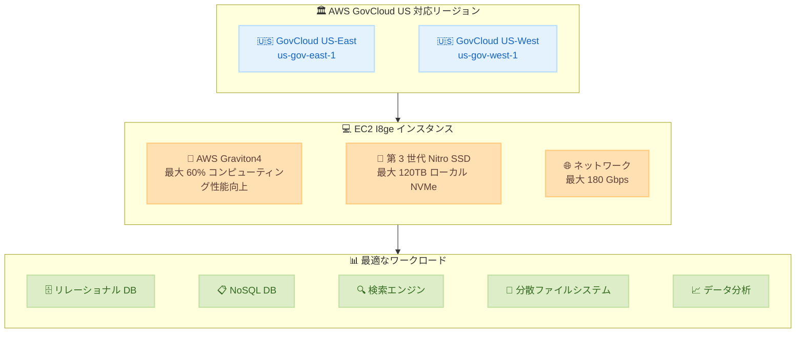

# Amazon EC2 - I8ge インスタンスが AWS GovCloud (US) リージョンで利用可能に

**リリース日**: 2026年07月20日
**サービス**: Amazon EC2
**機能**: I8ge ストレージ最適化インスタンス

📊 [このアップデートのインフォグラフィックを見る](https://takech9203.github.io/aws-news-summary/20260720-amazon-ec2-i8ge-instances-aws-govcloud-us-regions.html)

## 概要

AWS は 2026 年 7 月 20 日、Amazon EC2 I8ge インスタンスが AWS GovCloud (US-East)、AWS GovCloud (US-West) の各リージョンで利用可能になったことを発表しました。I8ge は AWS Graviton4 プロセッサーを搭載したストレージ最適化インスタンスで、前世代の Graviton2 ベースのストレージ最適化インスタンスと比較して最大 60% 優れたコンピューティング性能を提供します。今回の提供開始により、米国連邦政府機関やその関連組織など、規制要件の厳しいワークロードを AWS GovCloud (US) 上で運用するお客様も、最新世代のストレージ最適化インスタンスを活用できるようになりました。

I8ge インスタンスは第 3 世代 AWS Nitro SSD によるローカル NVMe ストレージを使用し、1 インスタンスあたり最大 120TB のローカル NVMe ストレージ、最大 180 Gbps のネットワーク帯域幅を提供します。ストレージ最適化設計により、高いランダム読み取り/書き込み性能を伴う高速なローカルストレージを必要とするワークロードに最適です。2 つのメタルサイズを含む 11 種類のサイズが用意されており、幅広いワークロード要件に対応します。

**アップデート前の課題**

- AWS GovCloud (US) リージョンでは I8ge インスタンスが利用できず、Graviton4 ベースのストレージ最適化インスタンスの性能を活用できなかった
- 規制対象ワークロードでは、前世代のストレージ最適化インスタンスを利用せざるを得ず、コンピューティングおよびストレージ性能に制約があった
- 大容量ローカル NVMe ストレージや高帯域ネットワークを必要とする GovCloud 上のワークロードで、最新世代インスタンスの選択肢が限られていた

**アップデート後の改善**

- AWS GovCloud (US-East、US-West) の両リージョンで I8ge インスタンスが利用可能になり、規制要件を満たしながら Graviton4 の高性能を活用できるようになった
- 第 3 世代 AWS Nitro SSD により、1 インスタンスあたり最大 120TB のローカル NVMe ストレージを利用可能
- 最大 180 Gbps のネットワーク帯域幅により、データ集約型ワークロードのスループットが向上
- 2 つのメタルサイズを含む 11 種類のサイズから、ワークロードに応じた最適なサイズを選択可能

## アーキテクチャ図



この図は、I8ge インスタンスが新たに利用可能になった AWS GovCloud (US) の 2 リージョンと、Graviton4 プロセッサー・第 3 世代 Nitro SSD・高帯域ネットワークの 3 つの主要コンポーネント、および最適なワークロードの関係を示しています。

## サービスアップデートの詳細

### 主要機能

1. **AWS Graviton4 プロセッサー搭載**
   - Arm ベースの最新世代プロセッサーにより、高い電力効率と優れたコンピューティング性能を実現
   - 前世代の Graviton2 ベースのストレージ最適化インスタンスと比較して最大 60% 優れたコンピューティング性能
   - ストレージ集約型ワークロードに最適化されたプロセッサー構成

2. **第 3 世代 AWS Nitro SSD と大容量ローカルストレージ**
   - 最新世代のローカル NVMe ストレージにより、高いランダム読み取り/書き込み性能を実現
   - 1 インスタンスあたり最大 120TB のローカル NVMe ストレージを提供
   - 高ランダム I/O アクセスパターンに最適化

3. **高帯域ネットワークと EBS 帯域**
   - 最大 180 Gbps のネットワーク帯域幅を提供
   - Amazon EBS 向けに最大 60 Gbps の専用帯域幅を確保
   - データ集約型ワークロードのスループットを向上

4. **豊富なサイズラインナップ**
   - 2 つのメタルサイズを含む 11 種類のサイズを提供
   - 小規模から大規模まで幅広いワークロード要件に対応
   - ベアメタル要件を持つワークロード向けにメタルサイズを選択可能

## 技術仕様

### I8ge インスタンスの主要スペック

| 項目 | 詳細 |
|------|------|
| プロセッサー | AWS Graviton4 (Arm ベース) |
| ストレージ | 第 3 世代 AWS Nitro SSD (ローカル NVMe) |
| 最大ローカルストレージ | 最大 120TB |
| 最大ネットワーク帯域幅 | 最大 180 Gbps |
| 最大 EBS 帯域幅 | 最大 60 Gbps |
| サイズ数 | 11 種類 (メタルサイズ 2 つを含む) |
| インスタンスファミリー | ストレージ最適化 (I ファミリー) |
| 前世代 | Im4gn (Graviton2 ベース) |

### I8ge と前世代インスタンスの性能比較

| 指標 | I8ge vs Graviton2 ストレージ最適化 | I8ge vs Im4gn |
|------|-----------------------------------|---------------|
| コンピューティング性能 | 最大 60% 向上 | - |
| リアルタイムストレージ性能 (TB あたり) | - | 最大 55% 向上 |
| ストレージ I/O レイテンシー | - | 最大 60% 低減 |
| I/O レイテンシーばらつき | - | 最大 75% 低減 |

### I ファミリーインスタンスの世代比較

| 世代 | プロセッサー | ストレージ世代 | 特徴 |
|------|-------------|--------------|------|
| I3 | Intel Xeon | 第 1 世代 NVMe SSD | 初代 NVMe ストレージ最適化 |
| Im4gn | AWS Graviton2 | 第 2 世代 AWS Nitro SSD | Graviton ベース初のストレージ最適化 |
| I8ge | AWS Graviton4 | 第 3 世代 AWS Nitro SSD | 最新世代、最高性能 |

## 設定方法

### 前提条件

1. AWS GovCloud (US) アカウントと適切な IAM 権限
2. 対象リージョンへのアクセス (us-gov-east-1 または us-gov-west-1)
3. Graviton (Arm) アーキテクチャ対応の AMI
4. 必要な VPC およびサブネット設定

### 手順

#### ステップ1: Arm 対応 AMI の確認

```bash
# GovCloud US-West リージョンで Arm 対応の Amazon Linux 2023 AMI を検索
aws ec2 describe-images \
  --region us-gov-west-1 \
  --filters "Name=name,Values=al2023-ami-*-arm64*" \
            "Name=state,Values=available" \
  --owners amazon \
  --query "Images | sort_by(@, &CreationDate) | [-1].ImageId" \
  --output text
```

I8ge インスタンスは Graviton4 (Arm) プロセッサーを搭載しているため、Arm アーキテクチャ対応の AMI を使用する必要があります。

#### ステップ2: I8ge インスタンスの起動

```bash
# I8ge インスタンスを GovCloud US-West リージョンで起動
aws ec2 run-instances \
  --image-id ami-xxxxxxxxxxxxxxxxx \
  --instance-type i8ge.xlarge \
  --region us-gov-west-1 \
  --subnet-id subnet-xxxxxxxxxxxxxxxxx \
  --security-group-ids sg-xxxxxxxxxxxxxxxxx \
  --key-name my-key-pair
```

このコマンドは、AWS GovCloud (US-West) リージョンで I8ge インスタンスを起動します。ローカル NVMe ストレージはインスタンスに自動的にアタッチされます。

#### ステップ3: ローカル NVMe ストレージの確認とマウント

```bash
# インスタンスに接続後、NVMe デバイスを確認
lsblk

# NVMe ストレージをフォーマットしてマウント
sudo mkfs -t xfs /dev/nvme1n1
sudo mkdir /data
sudo mount /dev/nvme1n1 /data
```

I8ge インスタンスのローカル NVMe ストレージは一時ストレージ (エフェメラルストレージ) です。インスタンスの停止や終了時にデータが失われるため、永続化が必要なデータは EBS や S3 にバックアップしてください。

## メリット

### ビジネス面

- **規制対象ワークロードへの対応**: AWS GovCloud (US) での提供開始により、米国連邦政府機関やその関連組織など、厳格なコンプライアンス要件を満たしながら最新のストレージ最適化インスタンスを利用可能
- **コスト効率の向上**: 同じワークロードをより少ないインスタンスで処理でき、TB あたりの性能向上によりストレージコストを最適化
- **大規模データワークロードの集約**: 最大 120TB のローカルストレージにより、少数のインスタンスに大規模データセットを集約できる

### 技術面

- **大容量ローカルストレージ**: 第 3 世代 Nitro SSD により、1 インスタンスあたり最大 120TB のローカル NVMe ストレージを利用可能
- **高帯域ネットワーク**: 最大 180 Gbps のネットワーク帯域幅により、データ転送やレプリケーションが高速化
- **Graviton4 によるコンピューティング強化**: 前世代比最大 60% のコンピューティング性能向上により、データ処理やクエリ実行が高速化
- **柔軟なサイズ選択**: メタルサイズを含む 11 種類から、ワークロードに応じた最適なサイズを選択可能

## デメリット・制約事項

### 制限事項

- Arm (Graviton) アーキテクチャのため、x86 専用のソフトウェアやバイナリは動作しない (Arm 対応版が必要)
- ローカル NVMe ストレージはエフェメラル (一時的) であり、インスタンス停止・終了時にデータが失われる
- 現時点では AWS GovCloud (US-East、US-West) での提供であり、他のリージョンとのマルチリージョン構成では可用性を確認する必要がある

### 考慮すべき点

- Im4gn からの移行時には、アプリケーションの Graviton4 互換性テストを実施することを推奨
- ローカル NVMe ストレージの容量はインスタンスサイズに依存するため、ワークロードに適したサイズの選択が重要
- データの永続化には EBS ボリュームや S3 への定期的なバックアップ戦略が必要
- Graviton2 から Graviton4 への移行では、一部のパフォーマンス特性が異なる可能性があるため、ベンチマークテストを推奨

## ユースケース

### ユースケース1: 政府機関向け高性能リレーショナルデータベース

**シナリオ**: 米国連邦政府機関が、大規模な行政データを管理するセルフマネージド PostgreSQL データベースを AWS GovCloud (US) で運用したい

**実装例**:
```bash
# I8ge インスタンスで PostgreSQL データベースサーバーを起動
aws ec2 run-instances \
  --image-id ami-xxxxxxxxxxxxxxxxx \
  --instance-type i8ge.4xlarge \
  --region us-gov-west-1 \
  --block-device-mappings '[{"DeviceName":"/dev/xvda","Ebs":{"VolumeSize":50}}]' \
  --user-data file://postgres-setup.sh
```

**効果**: 高性能なローカル NVMe ストレージにより、トランザクション処理のレスポンスタイムが改善され、コンプライアンス要件を満たしながらピーク時のクエリ性能が向上

### ユースケース2: 大規模データ分析基盤

**シナリオ**: 規制対象の組織が、最大 120TB の大規模データセットに対する分散処理基盤を GovCloud 上に構築したい

**実装例**:
```bash
# データ分析ノード用に複数の I8ge インスタンスを起動
aws ec2 run-instances \
  --image-id ami-xxxxxxxxxxxxxxxxx \
  --instance-type i8ge.12xlarge \
  --count 3 \
  --region us-gov-east-1 \
  --placement "GroupName=analytics-cluster"
```

**効果**: 最大 120TB のローカルストレージと最大 180 Gbps のネットワーク帯域により、大規模データセットの高速分散処理を実現

### ユースケース3: 検索エンジン/分散ファイルシステム

**シナリオ**: 政府関連の組織が、数百万件のドキュメントに対するリアルタイム全文検索を提供するセルフマネージド OpenSearch クラスターを構築したい

**実装例**:
```bash
# OpenSearch データノード用 I8ge インスタンスを起動
aws ec2 run-instances \
  --image-id ami-xxxxxxxxxxxxxxxxx \
  --instance-type i8ge.2xlarge \
  --count 5 \
  --region us-gov-west-1 \
  --user-data file://opensearch-node-setup.sh
```

**効果**: 高ランダム I/O 性能により、インデックス検索の応答時間が改善され、ユーザーへの検索結果返却が高速化

## 料金

I8ge インスタンスの料金は、選択したインスタンスサイズ、リージョン、購入オプションによって異なります。ストレージ最適化インスタンスには、ローカル NVMe ストレージのコストがインスタンス料金に含まれています。詳細な料金については、[Amazon EC2 料金ページ](https://aws.amazon.com/ec2/pricing/) をご確認ください。

### 購入オプション

| 購入オプション | 説明 |
|--------------|------|
| オンデマンド | 使用した時間に応じて支払い、長期コミットメント不要 |
| Savings Plans | 1 年または 3 年のコミットメントで割引料金を適用 |
| リザーブドインスタンス | 特定のインスタンスタイプに対する長期コミットメントで割引 |

## 利用可能リージョン

今回のアップデートにより、I8ge インスタンスは以下の AWS GovCloud (US) リージョンで利用可能になりました。

**新規対応リージョン (2026年7月20日)**:
- AWS GovCloud (US-East) - us-gov-east-1
- AWS GovCloud (US-West) - us-gov-west-1

**注**: AWS GovCloud (US) は、米国政府の規制要件やコンプライアンス要件に対応するために設計された分離されたリージョンです。今回の提供開始により、規制対象ワークロードでも最新のストレージ最適化インスタンスを活用できるようになりました。

## 関連サービス・機能

- **Amazon EBS**: I8ge のローカル NVMe ストレージと組み合わせて、永続データ用に EBS ボリュームを使用
- **Amazon S3**: ローカルストレージのデータバックアップ先として活用
- **Amazon EC2 Auto Scaling**: ワークロードに応じた I8ge インスタンスの自動スケーリング
- **AWS Graviton**: I8ge が搭載する Graviton4 プロセッサーのエコシステムと Arm 対応ソフトウェア
- **AWS Nitro System**: I8ge の基盤となるセキュリティとパフォーマンスの最適化インフラストラクチャ

## 参考リンク

- 📊 [インフォグラフィック](https://takech9203.github.io/aws-news-summary/20260720-amazon-ec2-i8ge-instances-aws-govcloud-us-regions.html)
- [公式発表 (What's New)](https://aws.amazon.com/about-aws/whats-new/2026/07/amazon-ec2-i8ge-instances-aws-govcloud-us-regions/)
- [Amazon EC2 I8ge インスタンス製品ページ](https://aws.amazon.com/ec2/instance-types/i8ge/)
- [AWS GovCloud (US)](https://aws.amazon.com/govcloud-us/)
- [Amazon EC2 料金ページ](https://aws.amazon.com/ec2/pricing/)
- [AWS Graviton プロセッサー](https://aws.amazon.com/ec2/graviton/)

## まとめ

Amazon EC2 I8ge インスタンスが AWS GovCloud (US-East、US-West) リージョンで利用可能になったことにより、規制要件の厳しいワークロードを運用するお客様も、AWS Graviton4 プロセッサーと第 3 世代 Nitro SSD を活用した最新のストレージ最適化インスタンスを利用できるようになりました。1 インスタンスあたり最大 120TB のローカル NVMe ストレージ、最大 180 Gbps のネットワーク帯域幅、前世代比最大 60% のコンピューティング性能向上を提供します。GovCloud 上でリレーショナルデータベース、NoSQL データベース、検索エンジン、大規模データ分析など、ローカルストレージへの高ランダム I/O アクセスを必要とするワークロードを運用している場合は、I8ge インスタンスへの移行を検討し、パフォーマンスとコスト効率の向上を実現してください。
