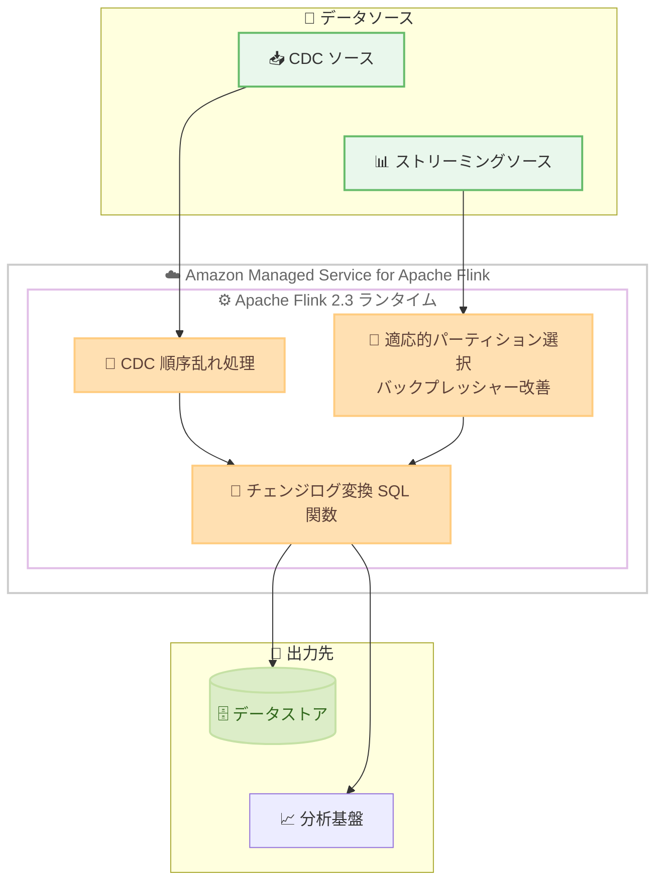

# Amazon Managed Service for Apache Flink - Apache Flink 2.3 サポート

**リリース日**: 2026 年 7 月 20 日
**サービス**: Amazon Managed Service for Apache Flink
**機能**: Apache Flink 2.3 ランタイムのサポート

📊 [このアップデートのインフォグラフィックを見る](https://takech9203.github.io/aws-news-summary/20260720-amazon-managed-service-flink-2-3.html)
<!-- INFOGRAPHIC_BASE_URL は環境変数から取得 -->

## 概要

Amazon Managed Service for Apache Flink が Apache Flink 2.3 のサポートを開始しました。これにより、ストリーミングデータアプリケーションの開発者は、最新の Flink ランタイムが提供する複数の機能強化を利用できるようになります。

今回のリリースでは、負荷が偏った状況でもアプリケーションをより安定して稼働させる適応的パーティション選択 (adaptive partition selection) による改善されたバックプレッシャー処理、変更データキャプチャ (CDC) パイプラインにおける順序が乱れた更新のより適切な処理、そしてチェンジログストリームと標準ストリームの相互変換を容易にする新しい SQL 関数が導入されました。

Amazon Managed Service for Apache Flink は、Flink アプリケーションのセットアップ、運用、スケーリングを簡素化し、ストリーミングデータをリアルタイムで変換および分析することを支援するフルマネージドサービスです。開発者やデータエンジニアは、インフラストラクチャの管理ではなく、ストリーミングアプリケーションの構築に集中できます。

**アップデート前の課題**

- 負荷が不均一な状況では、バックプレッシャーの処理が最適化されず、アプリケーションの稼働が不安定になる場合がありました
- CDC パイプラインにおいて、順序が乱れた更新の処理が難しく、データの正確性を担保するために追加の対応が必要でした
- チェンジログストリームと標準ストリームの相互変換を行うための標準的な SQL 関数が限られていました

**アップデート後の改善**

- 適応的パーティション選択により、負荷が偏った状況でもバックプレッシャーが改善され、アプリケーションがより安定して稼働するようになりました
- CDC パイプラインで順序が乱れた更新をより適切に処理できるようになり、データの正確性が向上しました
- 新しい SQL 関数により、チェンジログストリームと標準ストリームの変換が容易になりました
- インプレースバージョンアップグレードを利用して、互換性のある既存アプリケーションを Flink 2.3 ランタイムへシンプルかつ迅速に移行できるようになりました

## アーキテクチャ図



Apache Flink 2.3 ランタイム上で、適応的パーティション選択、CDC の順序乱れ処理、チェンジログ変換 SQL 関数が連携し、多様なソースから取り込んだストリーミングデータを処理して出力先へ届けます。

## サービスアップデートの詳細

### 主要機能

1. **適応的パーティション選択 (adaptive partition selection)**
   - 負荷が偏った状況でのバックプレッシャー処理を改善します
   - データの分散状況に応じてパーティションの選択を最適化します
   - アプリケーションが不均一な負荷の下でもより安定して稼働します

2. **CDC パイプラインにおける順序乱れ更新の処理改善**
   - 変更データキャプチャ (CDC) パイプラインで、順序が乱れた更新をより適切に処理します
   - データの正確性が向上し、CDC ベースのデータ連携の信頼性が高まります

3. **チェンジログ変換のための新しい SQL 関数**
   - チェンジログストリームと標準ストリームの相互変換を容易にする SQL 関数が追加されました
   - ストリーム処理のロジックを SQL でより簡潔に記述できます

4. **インプレースバージョンアップグレードのサポート**
   - 互換性のある既存アプリケーションを Flink 2.3 ランタイムへシンプルかつ迅速に移行できます
   - 新規アプリケーションを Apache Flink 2.3 で作成することも可能です

## 技術仕様

### 対応バージョンと移行方法

| 項目 | 詳細 |
|------|------|
| ランタイムバージョン | Apache Flink 2.3 |
| 新規アプリケーション | Apache Flink 2.3 を選択して作成可能 |
| 既存アプリケーションの移行 | インプレースバージョンアップグレードに対応 |
| 主な機能強化 | 適応的パーティション選択、CDC 順序乱れ処理、チェンジログ変換 SQL 関数 |

### API 変更履歴

Apache Flink 2.3 サポートに関連する Amazon Managed Service for Apache Flink の API 変更は確認されていません。既存の API を通じてランタイムバージョンとして Apache Flink 2.3 を指定できます。

## 設定方法

### 前提条件

1. Amazon Managed Service for Apache Flink を利用可能な AWS アカウント
2. 適切な IAM 権限 (アプリケーションの作成・更新権限)
3. インプレースアップグレードを行う場合は、対象アプリケーションが Flink 2.3 と互換性を持つこと

### 手順

#### ステップ 1: 新規アプリケーションを Apache Flink 2.3 で作成する

```bash
aws kinesisanalyticsv2 create-application \
  --application-name my-flink-2-3-app \
  --runtime-environment FLINK-2_3 \
  --service-execution-role arn:aws:iam::123456789012:role/MSFRole
```

新規アプリケーションを作成する際に、ランタイム環境として Apache Flink 2.3 を指定します。ランタイム環境の指定子は AWS 公式ドキュメントで最新の値を確認してください。

#### ステップ 2: 既存アプリケーションをインプレースアップグレードする

```bash
aws kinesisanalyticsv2 update-application \
  --application-name my-existing-app \
  --current-application-version-id 5 \
  --runtime-environment-update FLINK-2_3
```

互換性のある既存アプリケーションのランタイム環境を Apache Flink 2.3 に更新し、シンプルかつ迅速に移行します。アップグレード前にアプリケーションのスナップショット取得を推奨します。

#### ステップ 3: 動作確認

アップグレード後は、アプリケーションの状態、チェックポイントとスナップショットの整合性、処理レイテンシーやバックプレッシャーのメトリクスを Amazon CloudWatch で確認し、期待どおりに稼働していることを検証します。

## メリット

### ビジネス面

- **信頼性の向上**: CDC パイプラインでのデータ正確性が向上し、下流の分析やレポートの信頼性が高まります
- **運用効率の向上**: インプレースアップグレードにより、最新ランタイムへの移行を短時間かつ低リスクで実施できます
- **安定した処理**: 負荷が偏る状況でも安定して稼働し、リアルタイム処理の予測可能性が高まります

### 技術面

- **バックプレッシャー処理の改善**: 適応的パーティション選択により、不均一な負荷下でのスループットが向上します
- **開発の簡素化**: 新しい SQL 関数により、チェンジログと標準ストリームの変換ロジックを簡潔に記述できます
- **最新機能の活用**: Apache Flink 2.3 のコミュニティ機能をマネージド環境で利用できます

## デメリット・制約事項

### 制限事項

- インプレースアップグレードは互換性のあるアプリケーションに限られます
- バージョンアップに伴い、Flink API やコネクタの非互換な変更が影響する場合があります

### 考慮すべき点

- アップグレード前に、アプリケーションコードと依存ライブラリが Flink 2.3 に対応しているか確認する必要があります
- スナップショットからの復元互換性を事前に検証することが推奨されます
- 詳細な機能一覧は Apache Flink 2.3 のリリースノートで確認してください

## ユースケース

### ユースケース 1: CDC を用いたリアルタイムデータ同期

**シナリオ**: リレーショナルデータベースの変更を CDC で取り込み、分析基盤へリアルタイムに同期するパイプラインを運用しています。

**効果**: 順序が乱れた更新の処理改善により、データの正確性が向上し、同期先の整合性が高まります。

### ユースケース 2: 負荷が変動するストリーミング処理

**シナリオ**: イベントの発生量が時間帯によって大きく変動するストリーミングアプリケーションを稼働しています。

**効果**: 適応的パーティション選択によりバックプレッシャーが改善され、ピーク時でも安定した処理を維持できます。

### ユースケース 3: SQL ベースのストリーム変換

**シナリオ**: SQL でストリーム処理を記述し、チェンジログと標準ストリームを組み合わせた集計を行っています。

**効果**: 新しい SQL 関数により、ストリーム間の変換ロジックを簡潔に記述でき、開発と保守の負荷が軽減されます。

## 料金

本アップデートに伴う追加料金はありません。Amazon Managed Service for Apache Flink の既存の料金体系が適用され、アプリケーションが使用する Kinesis Processing Unit (KPU) と実行中のアプリケーションストレージなどに基づいて課金されます。詳細は料金ページを確認してください。

## 利用可能リージョン

Apache Flink 2.3 のサポートは、Amazon Managed Service for Apache Flink が提供されているすべての AWS リージョンで利用可能です。

## 関連サービス・機能

- **Amazon Kinesis Data Streams**: ストリーミングデータのソースとして Flink アプリケーションと連携します
- **Amazon Managed Streaming for Apache Kafka (Amazon MSK)**: Kafka ベースのストリーミングデータソース / シンクとして利用できます
- **Amazon CloudWatch**: アプリケーションのメトリクス監視やバックプレッシャーの確認に利用します

## 参考リンク

- 📊 [インフォグラフィック](https://takech9203.github.io/aws-news-summary/20260720-amazon-managed-service-flink-2-3.html)
- [公式発表 (What's New)](https://aws.amazon.com/about-aws/whats-new/2026/07/amazon-managed-service-flink-2-3/)
- [Amazon Managed Service for Apache Flink Developer Guide](https://docs.aws.amazon.com/managed-flink/latest/java/what-is.html)
- [Amazon Managed Service for Apache Flink 料金ページ](https://aws.amazon.com/managed-service-apache-flink/pricing/)

## まとめ

Apache Flink 2.3 のサポートにより、Amazon Managed Service for Apache Flink はバックプレッシャー処理、CDC パイプラインの正確性、SQL によるストリーム変換の各面で強化されました。インプレースアップグレードで移行が容易なため、既存アプリケーションを運用しているユーザーは互換性を確認のうえ、リリースノートを参照しながら Flink 2.3 への移行を検討することを推奨します。
