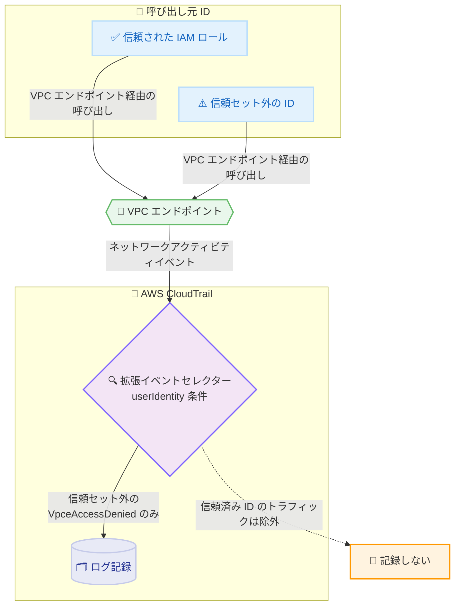

# AWS CloudTrail - ネットワークアクティビティイベントを ID 単位で選択的にログ記録

**リリース日**: 2026年7月20日
**サービス**: AWS CloudTrail
**機能**: ネットワークアクティビティイベントの userIdentity 拡張イベントセレクター

📊 [このアップデートのインフォグラフィックを見る](https://takech9203.github.io/aws-news-summary/20260720-aws-cloudtrail-filter-useridentity-advance-selectors.html)
<!-- INFOGRAPHIC_BASE_URL は環境変数から取得 -->

## 概要

AWS CloudTrail が、VPC エンドポイント (Virtual Private Cloud Endpoint) を経由するネットワークアクティビティイベント (network activity events) に対して、拡張イベントフィルタリング機能を追加しました。ネットワークアクティビティイベントは、VPC エンドポイントを通過するアクションを記録するイベントタイプです。今回のアップデートにより、API 呼び出しを行った IAM ユーザー ID (userIdentity) に基づいて、どのイベントをログに記録するかを制御できるようになりました。

これまでネットワークアクティビティイベントは、イベント名 (eventName) や VPC エンドポイント ID (vpcEndpointId) などのフィールドでフィルタリングできましたが、呼び出し元の ID そのものを条件にすることはできませんでした。今回追加された userIdentity 条件を使うと、たとえば「信頼された IAM ロールのセット以外の ID から発生した VpceAccessDenied イベントのみをログに記録する」といった設定が可能になります。これにより、信頼済みのプリンシパルからの通常のトラフィックを除外しつつ、不正なアクセス試行だけを分離して記録できます。

この機能は、データパーミッション境界 (data perimeter) 戦略を支援し、セキュリティ上重要なシナリオにログ記録を集中させます。信頼された ID からのトラフィックをログ対象から除外することで、ログのノイズと記録コストを削減できます。AWS マネジメントコンソール、AWS CLI、AWS SDK から設定でき、CloudTrail ネットワークアクティビティイベントがサポートされているすべての AWS リージョンで利用可能です。

**アップデート前の課題**

このアップデート以前は、ネットワークアクティビティイベントを呼び出し元 ID に基づいてフィルタリングできませんでした。

- 以前は eventName や vpcEndpointId でしかフィルタリングできず、特定の ID からのイベントだけを選別できなかった
- 以前は信頼済みプリンシパルからの成功呼び出しも含めてすべてのイベントが記録され、ログにノイズが混ざっていた
- 以前は不要なイベントも記録されるため、CloudTrail のログ記録コストが増加していた

**アップデート後の改善**

今回のアップデートにより、userIdentity に基づく選択的なログ記録が可能になりました。

- 今回のアップデートにより、信頼された ID のセット外からの VpceAccessDenied イベントのみを記録できるようになった
- 今回のアップデートにより、信頼済み ID からの通常トラフィックを除外し、ログのノイズを削減できるようになった
- 今回のアップデートにより、記録対象を絞り込むことで CloudTrail のログ記録コストを削減できるようになった

## アーキテクチャ図

VPC エンドポイントを経由する呼び出しから発生するネットワークアクティビティイベントを、CloudTrail が userIdentity 条件で評価し、信頼セット外の ID による VpceAccessDenied イベントのみを記録します。

## サービスアップデートの詳細

### 主要機能

1. **userIdentity に基づく選択的ログ記録**
   - API 呼び出しを行った IAM ユーザー ID を条件にして、記録するイベントを絞り込める
   - 呼び出し元 ID が既知の安全なリストに含まれない場合にのみ、アクセス拒否イベントを記録するといった設定が可能
   - 信頼済みプリンシパルからの通常トラフィックをログ対象から除外できる

2. **既存フィールドとの組み合わせ**
   - userIdentity 条件を eventName や vpcEndpointId などの既存フィールドと組み合わせられる
   - 記録対象を細かく制御 (fine-grained control) できる
   - 特定の VPC エンドポイントと特定の ID の組み合わせに限定するといった柔軟な条件設定が可能

3. **データパーミッション境界戦略の支援**
   - VPC エンドポイントを通じたデータ持ち出し (data exfiltration) の兆候を検出できる
   - 承認済みプリンシパルからのすべての成功呼び出しを記録することなく、セキュリティ上重要なシナリオに集中できる
   - ログのノイズと記録コストの両方を削減できる

## 技術仕様

### フィルタリング対象

| 項目 | 詳細 |
|------|------|
| イベントタイプ | ネットワークアクティビティイベント (network activity events) |
| 対象 | VPC エンドポイントを経由するアクション |
| 新規フィルター条件 | userIdentity (呼び出し元 IAM ユーザー ID) |
| 組み合わせ可能なフィールド | eventName、vpcEndpointId など |
| 代表的なイベント名 | VpceAccessDenied など |
| 設定手段 | AWS マネジメントコンソール、AWS CLI、AWS SDK |

## 設定方法

### 前提条件

1. CloudTrail のネットワークアクティビティイベントがサポートされているリージョンで利用する
2. VPC エンドポイントのログ記録を対象とする CloudTrail 証跡またはイベントデータストアを準備する
3. 拡張イベントセレクター (advanced event selectors) を設定する権限を持つ IAM プリンシパルを用意する

### 手順

#### ステップ1: 拡張イベントセレクターを定義する

ネットワークアクティビティイベントを対象に、userIdentity 条件を含む拡張イベントセレクターを定義します。信頼された ID のセット外からの VpceAccessDenied イベントのみを記録する設定を検討します。

#### ステップ2: 証跡またはイベントデータストアに適用する

AWS CLI や AWS SDK でセレクターを対象の証跡やイベントデータストアに適用します。既存フィールドと組み合わせることで、記録対象を必要なイベントだけに絞り込みます。

#### ステップ3: 記録内容を検証する

信頼済み ID からのトラフィックが除外され、信頼セット外の ID によるアクセス拒否イベントのみが記録されていることを確認します。データパーミッション境界の監視要件に沿った記録になっているかを検証します。

## メリット

### ビジネス面

- **コスト削減**: 不要なイベントを記録対象から除外することで、CloudTrail のログ記録コストを削減できる
- **監査効率の向上**: ノイズを減らし、セキュリティ上重要なイベントに集中できるため、調査や監査の効率が高まる
- **ガバナンス強化**: データパーミッション境界戦略を支援し、組織のデータ保護方針への準拠を後押しする

### 技術面

- **細かな制御**: userIdentity を既存フィールドと組み合わせて、記録対象を柔軟に制御できる
- **脅威検出の高度化**: VPC エンドポイントを通じたデータ持ち出しの兆候を効率的に検出できる
- **運用負荷の軽減**: ログのノイズが減ることで、下流の分析やアラート処理の負荷が下がる

## デメリット・制約事項

### 制限事項

- ネットワークアクティビティイベントおよびこのフィルタリング機能がサポートされているリージョンでのみ利用可能
- VPC エンドポイントを経由するネットワークアクティビティイベントが対象であり、その他のイベントタイプには適用されない

### 考慮すべき点

- 信頼された ID のセットを適切に定義しないと、記録すべきイベントを取りこぼす恐れがある
- フィルター条件の設計にあたっては、監査・コンプライアンス要件で記録が必須となるイベントを除外しないよう注意する

## ユースケース

### ユースケース1: 不正アクセス試行の分離記録

**シナリオ**: VPC エンドポイントに対して、社内で管理する信頼済み IAM ロール以外からのアクセス拒否だけを監視したい。

**効果**: 信頼セット外の ID からの VpceAccessDenied イベントのみを記録し、通常トラフィックを除外することで、不正アクセス試行を効率的に検出できます。

### ユースケース2: データ持ち出しの検出

**シナリオ**: VPC エンドポイントを通じた想定外のデータアクセスを検知したいが、承認済みプリンシパルからのすべての成功呼び出しまで記録するとログ量が膨大になる。

**効果**: 承認済み ID を除外して記録対象を絞ることで、ログ量とコストを抑えつつ、データ持ち出しの兆候を検出できます。

### ユースケース3: ログ記録コストとノイズの最適化

**シナリオ**: ネットワークアクティビティイベントの記録量が多く、CloudTrail のコストと分析時のノイズが課題になっている。

**効果**: 信頼済み ID からのトラフィックを除外することで、記録コストとノイズの双方を削減し、監視対象を重要なイベントに集中できます。

## 料金

CloudTrail のネットワークアクティビティイベントの料金体系に従います。記録対象を絞り込むことで、記録されるイベント数が減り、結果としてログ記録コストの削減につながります。詳細は AWS CloudTrail の料金ページを参照してください。

## 利用可能リージョン

CloudTrail のネットワークアクティビティイベントがサポートされているすべての AWS リージョンで利用可能です。

## 関連サービス・機能

- **Amazon VPC エンドポイント**: このフィルタリングの対象となるネットワークアクティビティイベントの発生源
- **AWS IAM**: フィルタリング条件となる userIdentity (呼び出し元 ID) を提供
- **データパーミッション境界 (data perimeter)**: 信頼された ID からのアクセスに制限するデータ保護戦略を支援

## 参考リンク

- 📊 [インフォグラフィック](https://takech9203.github.io/aws-news-summary/20260720-aws-cloudtrail-filter-useridentity-advance-selectors.html)
- [公式発表 (What's New)](https://aws.amazon.com/about-aws/whats-new/2026/07/aws-cloudtrail-filter-useridentity-advance-selectors/)
- [AWS CloudTrail ユーザーガイド](https://docs.aws.amazon.com/awscloudtrail/latest/userguide/)
- [AWS CloudTrail 料金ページ](https://aws.amazon.com/cloudtrail/pricing/)

## まとめ

このアップデートにより、CloudTrail のネットワークアクティビティイベントを呼び出し元 ID に基づいて選択的にログ記録できるようになり、データパーミッション境界戦略の監視精度が高まります。ログのノイズと記録コストを削減しながら不正アクセスやデータ持ち出しの兆候を検出できるため、VPC エンドポイントを利用している環境では、信頼された ID のセットを定義したうえで userIdentity 条件を用いたセレクターの導入を検討することを推奨します。
