# AWS Data Exports - Amazon Bedrock 標準化製品メタデータ

**リリース日**: 2026年7月20日
**サービス**: AWS Data Exports (Cost and Usage Report)
**機能**: Amazon Bedrock 向け標準化製品メタデータ

📊 [このアップデートのインフォグラフィックを見る](https://takech9203.github.io/aws-news-summary/20260720-aws-data-exports-amazon-bedrock-product-metadata.html)
<!-- INFOGRAPHIC_BASE_URL は環境変数から取得 -->

## 概要

AWS は、AWS Data Exports (Cost and Usage Report) において Amazon Bedrock 向けの標準化された製品メタデータの提供を開始しました。これにより、FinOps チームやクラウド管理者は、一貫性のある構造化された属性を使って Amazon Bedrock のコストを理解できるようになります。AWS Data Exports は、AWS のコストと使用状況データのカスタマイズされたエクスポートを作成し、Amazon S3 に配信する機能です。配信されたデータは Amazon Athena でのクエリや、データウェアハウスへのロードに利用できます。

今回追加された標準化属性には、モデルプロバイダー、モデル名、料金単位 (pricing unit)、推論タイプ (input tokens や output tokens など)、機能 (On-Demand や Batch などの推論サービングモード) が含まれます。さらに、すべての Amazon Bedrock コストを統合する統一された「Amazon Bedrock」という製品ファミリー名も導入されました。これらの属性は、CUR 2.0 において product map 列と専用列で提供されます。

この機能は、AWS Data Exports を利用する Amazon Bedrock のお客様に対して、追加費用なしでデフォルトで利用可能です。生成 AI のワークロードが拡大する中で、モデルやプロバイダーごと、あるいはトークンタイプごとにコストを正確に配賦する必要性が高まっており、この標準化されたメタデータはその要求に直接応えるものです。

**アップデート前の課題**

このアップデート以前は、Amazon Bedrock のコストを詳細に分析するために、明細行の説明フィールド (description) を解析する独自のロジックを構築する必要がありました。

- 以前はモデルプロバイダーやモデル名を特定するために、自由記述形式の説明テキストをパースする必要があった
- 以前は入力トークンと出力トークンのコストを分離して分析することが難しかった
- 以前は On-Demand と Batch などの推論サービングモード別にコストを比較する統一された手段がなかった
- 以前は Amazon Bedrock のコストが単一の製品ファミリーとして一貫して識別されていなかった

**アップデート後の改善**

今回のアップデートにより、構造化された属性を使って Amazon Bedrock のコストを容易に分析できるようになりました。

- 今回のアップデートにより、モデルプロバイダー、モデル名、推論タイプ、機能を標準化された属性として直接利用できるようになった
- 今回のアップデートにより、自由記述フィールドのパースが不要になった
- 今回のアップデートにより、`product_pricing_unit` 列や product map 列のキーを使ったフィルタリング、グループ化、比較が可能になった
- 今回のアップデートにより、統一された「Amazon Bedrock」製品ファミリー名ですべての Bedrock コストを単一のカテゴリーとして識別できるようになった

## アーキテクチャ図

```mermaid
flowchart LR
    subgraph Bedrock["🤖 Amazon Bedrock"]
        direction LR
        M1["📥 On-Demand<br/>推論"]
        M2["📦 Batch<br/>推論"]
        M1 ~~~ M2
    end

    subgraph Billing["💰 課金・データ層"]
        direction LR
        DE["📊 AWS Data Exports<br/>CUR 2.0"]
        S3[("🪣 Amazon S3")]
        DE ~~~ S3
    end

    subgraph Analysis["🔍 分析層"]
        direction LR
        Athena["⚡ Amazon Athena"]
        DW[("🗄️ データウェアハウス")]
        Athena ~~~ DW
    end

    Bedrock -->|使用状況・コスト| DE
    DE -->|標準化メタデータ<br/>付き明細| S3
    S3 --> Athena
    S3 --> DW
    Athena --> FinOps(["👤 FinOps チーム"])
    DW --> FinOps

    classDef cloud fill:none,stroke:#CCCCCC,stroke-width:2px,color:#666666
    classDef process fill:#FFFFFF,stroke:#4A90E2,stroke-width:2px,color:#333333
    classDef storage fill:#DCEDC8,stroke:#C5E1A5,stroke-width:2px,color:#33691E
    classDef database fill:#E8EAF6,stroke:#C5CAE9,stroke-width:2px,color:#283593
    classDef user fill:#E3F2FD,stroke:#BBDEFB,stroke-width:2px,color:#1565C0
    classDef input fill:#E9F7EC,stroke:#66BB6A,stroke-width:2px,color:#333333

    class Bedrock,Billing,Analysis cloud
    class M1,M2,DE,Athena input
    class S3 storage
    class DW database
    class FinOps user
```



Amazon Bedrock の使用状況が標準化メタデータ付きで CUR 2.0 にエクスポートされ、S3 経由で Athena やデータウェアハウスに取り込まれて FinOps チームが分析する流れを示しています。

## サービスアップデートの詳細

### 主要機能

1. **標準化された製品属性の追加**
   - モデルプロバイダー、モデル名、料金単位、推論タイプ、機能の 5 つの標準化属性を提供
   - 各属性は Amazon Bedrock のコストドライバーを表現し、明細行に値が存在する場合にのみ付与される
   - 自由記述の説明フィールドを解析することなく、コストを次元別に分析可能

2. **統一された製品ファミリー名**
   - `product_product_family` 列に対して、すべての Amazon Bedrock 明細行に統一値「Amazon Bedrock」が設定される
   - これにより、すべての Amazon Bedrock 使用量を単一の製品ファミリーで識別できる

3. **CUR 2.0 での提供方式**
   - モデルプロバイダー、モデル名、推論タイプ、機能の各属性は product map 列内のキーとして提供される
   - 料金単位 (`product_pricing_unit`) は独立した列として提供される
   - map 列のキーはドット演算子 (例: `product.provider`) を使って個別列としてクエリ可能

## 技術仕様

### CUR 2.0 における属性の格納場所

| 属性 | 格納場所 | map キー / 列名 | 例 |
|------|----------|----------------|-----|
| モデルプロバイダー | product map 列 | `product.provider` | Amazon, Anthropic, Meta, Cohere |
| モデル名 | product map 列 | `product.model` | Claude 3.5 Sonnet, Nova Pro, Llama 3 |
| 推論タイプ | product map 列 | `product.inference_type` | input tokens, output tokens, image generation |
| 機能 (サービングモード) | product map 列 | `product.feature` | On-Demand, Batch |
| 料金単位 | 独立列 | `product_pricing_unit` | (サービスの最小課金単位) |
| 製品ファミリー | 独立列 | `product_product_family` | Amazon Bedrock |

### product map 列の仕組み

CUR 2.0 の `product` 列は、複数の製品属性とその値をキーバリューのペアとして保持する map 型 (`map<string, string>`) の列です。特定のサービス向けに、サービス固有の追加属性が map 内のキーとして格納されます。これらのキーはドット演算子でクエリできます。

```sql
-- Athena で Amazon Bedrock のコストをモデルプロバイダー別に集計する例
SELECT
    product.provider          AS model_provider,
    product.model             AS model_name,
    product.inference_type    AS inference_type,
    product.feature           AS serving_mode,
    product_pricing_unit      AS pricing_unit,
    SUM(line_item_unblended_cost) AS total_cost
FROM
    cur2_table
WHERE
    product_product_family = 'Amazon Bedrock'
GROUP BY
    1, 2, 3, 4, 5
ORDER BY
    total_cost DESC;
```

このクエリは、統一された製品ファミリー名で Amazon Bedrock の明細行を絞り込み、標準化属性ごとにコストを集計します。

## 設定方法

### 前提条件

1. AWS Data Exports で CUR 2.0 のエクスポートを作成していること
2. エクスポート先の Amazon S3 バケットが設定されていること
3. Amazon Athena またはデータウェアハウスでクエリする環境が用意されていること

### 手順

#### ステップ1: CUR 2.0 エクスポートの作成

AWS Billing and Cost Management コンソールの「Data Exports」から、CUR 2.0 形式の標準データエクスポートを作成し、配信先の S3 バケットを指定します。標準化された Amazon Bedrock 属性は追加設定なしでエクスポートに含まれます。

#### ステップ2: Amazon Athena でのテーブル作成とクエリ

```bash
# S3 に配信された CUR 2.0 データに対して Athena のテーブルを作成し、
# product.provider や product.inference_type などのキーでクエリを実行する
```

配信された CUR 2.0 データに対して Athena のテーブルを定義し、product map 列のキーや `product_pricing_unit` 列を使ってコストを分析します。map キーはドット演算子でアクセスします。

#### ステップ3: コスト配賦とレポーティング

モデルプロバイダー別、モデル名別、推論タイプ別、サービングモード別にコストを集計し、FinOps のダッシュボードやチャージバックのレポートに反映します。

## メリット

### ビジネス面

- **コスト可視化の向上**: モデルやプロバイダーごとの支出を正確に把握でき、生成 AI 投資の意思決定を支援する
- **チャージバックの容易化**: 統一された製品ファミリーと標準化属性により、部門やプロジェクトへのコスト配賦が容易になる
- **追加費用なし**: AWS Data Exports を利用する Amazon Bedrock のお客様にデフォルトで提供され、追加コストが発生しない

### 技術面

- **カスタムパース不要**: 説明フィールドを解析する独自ロジックの構築・保守が不要になる
- **構造化クエリ**: ドット演算子を使って map キーを個別列のようにクエリでき、SQL による分析が容易
- **一貫性のあるスキーマ**: 標準化された属性により、時系列やアカウント間で一貫した分析が可能

## デメリット・制約事項

### 制限事項

- 標準化属性は明細行に該当する値が存在する場合にのみ product map 列に出現する
- モデルプロバイダー、モデル名、推論タイプ、機能は静的なトップレベル列ではなく map 列内のキーとして格納されるため、クエリ時にドット演算子の指定が必要
- この機能は CUR 2.0 を対象としており、レガシー CUR とは列構成が異なる

### 考慮すべき点

- 既存の分析クエリやダッシュボードが説明フィールドのパースに依存している場合は、標準化属性を使うようクエリを更新することが望ましい
- map キーの値 (例: モデル名) は Amazon Bedrock コンソールのモデルカタログに表示される名称に対応する

## ユースケース

### ユースケース1: モデルプロバイダー別のコスト比較

**シナリオ**: 複数のモデルプロバイダー (Amazon, Anthropic, Meta など) を併用している組織が、プロバイダーごとの支出を比較したい。

**実装例**:
```sql
SELECT product.provider AS provider,
       SUM(line_item_unblended_cost) AS cost
FROM cur2_table
WHERE product_product_family = 'Amazon Bedrock'
GROUP BY 1 ORDER BY cost DESC;
```

**効果**: プロバイダーごとの支出割合を可視化し、コスト最適化やモデル選定の判断に活用できる。

### ユースケース2: 入力・出力トークンコストの分離分析

**シナリオ**: プロンプトの設計改善のために、入力トークンと出力トークンのコスト内訳を把握したい。

**実装例**:
```sql
SELECT product.inference_type AS token_type,
       SUM(line_item_unblended_cost) AS cost
FROM cur2_table
WHERE product_product_family = 'Amazon Bedrock'
GROUP BY 1;
```

**効果**: トークンタイプ別のコスト構造が明確になり、プロンプトエンジニアリングによるコスト削減効果を測定できる。

### ユースケース3: On-Demand と Batch のコスト比較

**シナリオ**: 推論サービングモードの選択がコストに与える影響を評価したい。

**実装例**:
```sql
SELECT product.feature AS serving_mode,
       SUM(line_item_unblended_cost) AS cost
FROM cur2_table
WHERE product_product_family = 'Amazon Bedrock'
GROUP BY 1;
```

**効果**: On-Demand と Batch のコスト差を定量的に把握し、バッチ処理への移行によるコスト最適化を検討できる。

## 料金

この機能は、AWS Data Exports を利用する Amazon Bedrock のお客様に対して、追加費用なしでデフォルトで提供されます。標準化された製品メタデータの利用自体に追加料金は発生しません。

なお、AWS Data Exports で作成したデータの S3 への保存や、Amazon Athena でのクエリ実行には、それぞれの通常のサービス料金が適用されます。

## 利用可能リージョン

AWS Data Exports (Cost and Usage Report) はアカウントレベルの課金機能として提供されます。今回の発表では特定のリージョン情報は示されていません。Amazon Bedrock を利用しているお客様は、AWS Data Exports を通じて標準化メタデータをデフォルトで利用できます。

## 関連サービス・機能

- **Amazon Bedrock**: 今回標準化されたメタデータの対象となる基盤モデルサービス。モデルプロバイダーやモデル名などがコスト属性として提供される
- **Amazon Athena**: S3 に配信された CUR 2.0 データに対して SQL クエリを実行し、標準化属性を使ったコスト分析を行う
- **Amazon S3**: AWS Data Exports の配信先ストレージ。エクスポートされたコストデータを保管する
- **AWS Cost and Usage Report (CUR 2.0)**: 標準化製品メタデータが提供されるデータ形式

## 参考リンク

- 📊 [インフォグラフィック](https://takech9203.github.io/aws-news-summary/20260720-aws-data-exports-amazon-bedrock-product-metadata.html)
- [公式発表 (What's New)](https://aws.amazon.com/about-aws/whats-new/2026/07/aws-data-exports-amazon-bedrock-product-metadata/)
- [AWS Blog: Optimize LLM Costs on Amazon Bedrock: From Billing Attribution to Operational Telemetry](https://aws.amazon.com/blogs/aws-cloud-financial-management/optimize-llm-costs-on-amazon-bedrock-from-billing-attribution-to-operational-telemetry/)
- [ドキュメント: Product columns (AWS Data Exports User Guide)](https://docs.aws.amazon.com/cur/latest/userguide/table-dictionary-cur2-product.html)
- [Amazon Bedrock 製品ページ](https://aws.amazon.com/bedrock/)

## まとめ

このアップデートにより、Amazon Bedrock のコストをモデルプロバイダー、モデル名、推論タイプ、サービングモードといった標準化された属性で分析できるようになり、FinOps チームは独自のパースロジックを構築することなく正確なコスト配賦を実現できます。追加費用なしでデフォルトで利用可能なため、生成 AI ワークロードを運用しているお客様は、CUR 2.0 エクスポートのクエリを標準化属性を使う形に更新し、コスト可視化とチャージバックの高度化を進めることを推奨します。
