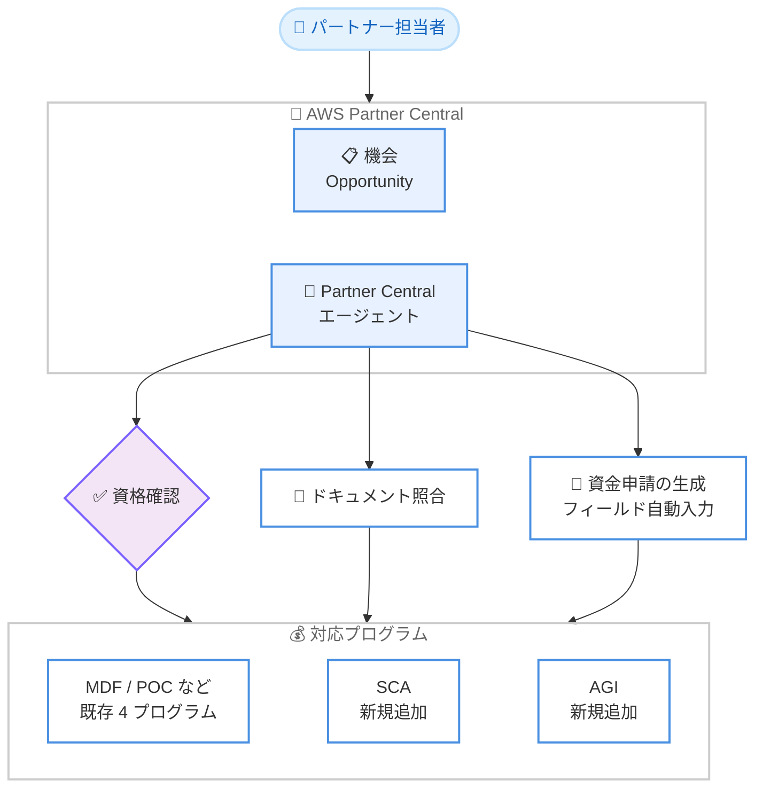

# AWS Partner Central - 資金支援ガイダンスの全プログラム対応

**リリース日**: 2026 年 7 月 20 日
**サービス**: AWS Partner Central
**機能**: AWS Partner Central エージェントによる資金支援ガイダンスの全プログラム拡張

📊 [このアップデートのインフォグラフィックを見る](https://takech9203.github.io/aws-news-summary/20260720-aws-partner-central.html)
<!-- INFOGRAPHIC_BASE_URL は環境変数から取得 -->

## 概要

AWS は、AWS Partner Central のエージェント (AWS Partner Central agents) が、すべての AWS パートナー資金支援プログラム (funding program) に対応したことを発表しました。これにより、パートナーは資格要件、申請手順、各プログラム固有の情報について、ドキュメントに裏付けられた回答を数秒で得られるようになります。

これまでエージェントは、2026 年 3 月の提供開始以降、4 つのプログラムについて資金支援ライフサイクル全体をカバーしていました。今回のアップデートでは、新たに Strategic Collaboration Agreement (SCA) と AWS Growth Initiative (AGI) の 2 つが追加され、すべてのプログラムが対象となりました。

エージェントは、機会 (opportunity) データとパートナーデータを用いた資格確認、アップロードされたドキュメントとプログラム要件との照合、フィールドが自動入力された資金申請 (fund request) の生成という機能を提供します。これにより、手動でのデータ入力が不要になり、資格判定の誤りが削減されます。対象はパートナー企業のビジネス開発担当者やアライアンス担当者であり、資金支援プログラムの活用を効率化することを目的としています。

**アップデート前の課題**

- 一部の資金支援プログラム (SCA、AGI) についてはエージェントの対象外であり、パートナーは自力でドキュメントを参照し、資格要件や申請手順を確認する必要がありました
- 資金申請にあたって手動でのデータ入力が必要であり、入力ミスや資格判定の誤りが発生しやすい状況でした
- プログラムごとに情報の確認方法が統一されておらず、回答を得るまでに時間がかかっていました

**アップデート後の改善**

- SCA と AGI を含むすべての資金支援プログラムに対して、エージェントによるガイダンスを受けられるようになりました
- 機会データとパートナーデータを活用した資格確認や、フィールドの自動入力により、手動でのデータ入力が不要になりました
- アップロードされたドキュメントとプログラム要件の自動照合により、資格判定の誤りが削減されました

## アーキテクチャ図

パートナーは AWS Partner Central 上で機会を開くと、エージェントが資格確認、ドキュメント照合、資金申請の生成を実行し、すべての資金支援プログラムに対するガイダンスを提供します。

## サービスアップデートの詳細

### 主要機能

1. **全資金支援プログラムへの対応**
   - 2026 年 3 月の提供開始時点で対象だった 4 つのプログラムに加え、Strategic Collaboration Agreement (SCA) と AWS Growth Initiative (AGI) が追加されました
   - これにより、すべての AWS パートナー資金支援プログラムがエージェントのガイダンス対象となりました
   - パートナーは資格要件、申請手順、各プログラム固有の情報について、ドキュメントに裏付けられた回答を数秒で取得できます

2. **資格確認の自動化**
   - 機会 (opportunity) データとパートナーデータを用いて、資金支援プログラムの資格要件を自動的に確認します
   - 手動での確認作業を削減し、資格判定の誤りを減らします

3. **ドキュメント照合と資金申請の生成**
   - アップロードされたドキュメントを、各プログラムの要件と照合します
   - フィールドが自動入力された資金申請 (fund request) を生成し、手動でのデータ入力を不要にします

## 技術仕様

### 対応プログラムの概要

| 項目 | 詳細 |
|------|------|
| 提供開始 (初回) | 2026 年 3 月 (4 プログラム対応) |
| 今回追加されたプログラム | Strategic Collaboration Agreement (SCA)、AWS Growth Initiative (AGI) |
| エージェントの主な機能 | 資格確認、ドキュメント照合、資金申請の自動生成 |
| データソース | 機会 (opportunity) データ、パートナーデータ、アップロード済みドキュメント |
| 提供形態 | AWS Partner Central 内の対話型エージェント |

## 設定方法

### 前提条件

1. AWS Partner Network (APN) のメンバーであり、AWS Partner Central にアクセスできること
2. 対象となる機会 (opportunity) が AWS Partner Central 上に登録されていること
3. 各資金支援プログラムに必要なドキュメントを準備できること

### 手順

#### ステップ1: AWS Partner Central で機会を開く

AWS Partner Central にサインインし、資金支援を受けたい機会 (opportunity) を開きます。機会を開くことで、エージェントが資金支援の推奨事項を提示します。

#### ステップ2: エージェントのガイダンスを受ける

エージェントに対して、資格要件、申請手順、プログラム固有の情報を問い合わせます。エージェントは機会データとパートナーデータを参照し、ドキュメントに裏付けられた回答を提示します。

#### ステップ3: 資金申請を生成する

必要なドキュメントをアップロードすると、エージェントがプログラム要件との照合を行い、フィールドが自動入力された資金申請を生成します。詳細については、AWS Partner Central のエージェントガイドを参照してください。

## メリット

### ビジネス面

- **申請プロセスの効率化**: 資格要件や申請手順を数秒で確認でき、資金支援プログラムの活用にかかる時間を短縮できます
- **対象プログラムの網羅**: SCA と AGI を含むすべての資金支援プログラムに対応したことで、パートナーはプログラムを問わず一貫した支援を受けられます
- **申請精度の向上**: 資格判定の誤りが削減され、申請の差し戻しや手戻りのリスクが低減します

### 技術面

- **データ活用による自動化**: 機会データとパートナーデータを用いた資格確認により、手動確認の負担を削減します
- **ドキュメント照合の自動化**: アップロードされたドキュメントとプログラム要件の照合を自動化し、要件充足の確認を効率化します
- **フィールドの自動入力**: 資金申請のフィールドが自動入力されることで、手動でのデータ入力に伴うミスを防ぎます

## デメリット・制約事項

### 制限事項

- 本機能は AWS Partner Central 内の機能であり、AWS Partner Network のメンバーであることが前提となります
- エージェントの回答はドキュメントに基づくガイダンスであり、最終的な資金支援の可否は AWS の審査に依存します

### 考慮すべき点

- エージェントによる資格確認や資金申請の生成は、機会データやパートナーデータ、アップロードされたドキュメントの正確性に依存します
- 各資金支援プログラムの詳細な要件については、公式のプログラムドキュメントもあわせて確認することが推奨されます

## ユースケース

### ユースケース1: 新規プログラム (SCA / AGI) の資格確認

**シナリオ**: パートナーが Strategic Collaboration Agreement (SCA) または AWS Growth Initiative (AGI) の活用を検討しているが、資格要件を把握していない。

**効果**: エージェントに問い合わせることで、機会データとパートナーデータに基づいた資格確認を数秒で受けられ、プログラム活用の可否を素早く判断できます。

### ユースケース2: 資金申請の効率的な作成

**シナリオ**: パートナーが特定の機会に対して資金申請を作成する必要があるが、手動でのデータ入力に時間がかかっている。

**効果**: エージェントがフィールドを自動入力した資金申請を生成することで、入力作業の時間を短縮し、入力ミスを削減できます。

### ユースケース3: ドキュメント要件の充足確認

**シナリオ**: パートナーが資金申請にあたり、提出書類がプログラム要件を満たしているか確認したい。

**効果**: アップロードされたドキュメントをエージェントがプログラム要件と自動照合するため、提出前に不足や不備を把握でき、差し戻しのリスクを低減できます。

## 料金

本アップデートは AWS Partner Central のエージェント機能の拡張であり、AWS Partner Central は AWS Partner Network のメンバー向けに提供されるプログラムの一部です。エージェント機能の利用に関する追加料金については、公式のドキュメントおよびプログラム情報を確認してください。

## 利用可能リージョン

エージェントは、すべての商用 AWS リージョン (all commercial AWS Regions) で提供されます。

## 関連サービス・機能

- **AWS Partner Network (APN)**: AWS のパートナープログラム全体を提供する枠組みであり、本機能はこの中の資金支援プログラムを対象としています
- **AWS Partner Central**: パートナーが機会管理や資金支援申請などを行うポータルであり、エージェントはこのポータル内で提供されます
- **AWS Marketing Development Funds (MDF) などの資金支援プログラム**: 今回の拡張により、SCA と AGI を含むすべての資金支援プログラムがエージェントの対象となりました

## 参考リンク

- 📊 [インフォグラフィック](https://takech9203.github.io/aws-news-summary/20260720-aws-partner-central.html)
- [公式発表 (What's New)](https://aws.amazon.com/about-aws/whats-new/2026/07/aws-partner-central/)
- [AWS Partner Central](https://partnercentral.awspartner.com/)

## まとめ

今回のアップデートにより、AWS Partner Central のエージェントが SCA と AGI を含むすべての資金支援プログラムに対応し、資格確認から資金申請の生成までを一貫して支援できるようになりました。手動作業の削減と資格判定の誤りの低減により、パートナーは資金支援プログラムをより効率的に活用できます。資金支援を検討しているパートナーは、AWS Partner Central で機会を開き、エージェントのガイダンスを活用することを推奨します。
