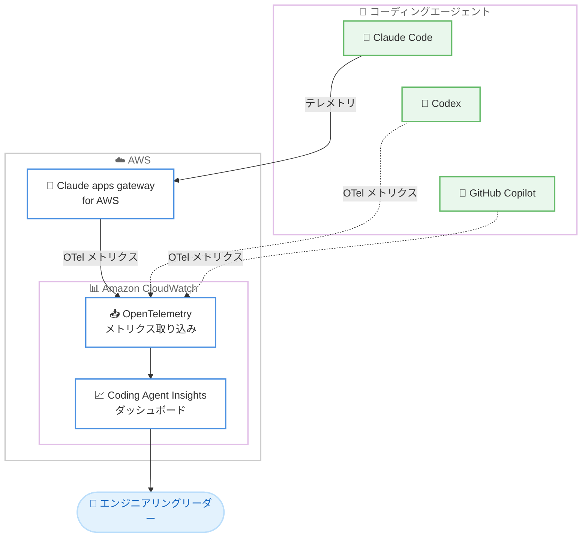

# Amazon CloudWatch - Coding Agent Insights

**リリース日**: 2026 年 7 月 20 日
**サービス**: Amazon CloudWatch
**機能**: Coding Agent Insights (コーディングエージェントインサイト)

📊 [このアップデートのインフォグラフィックを見る](https://takech9203.github.io/aws-news-summary/20260720-cloudwatch-coding-agent-insights.html)
<!-- INFOGRAPHIC_BASE_URL は環境変数から取得 -->

## 概要

Amazon CloudWatch は、AI コーディングツールが組織にどのような価値をもたらしているかをエンジニアリングリーダーが可視化できる新機能 Coding Agent Insights を発表しました。企業が AI コーディングエージェントの導入を拡大するなかで、その投資対効果 (ROI) を測定することを目的とした機能です。

この機能は、コーディングエージェントが出力する OpenTelemetry メトリクスを基盤としており、既存の CloudWatch 運用データと並べて表示できます。特に Claude apps gateway for AWS と統合することで、追加の計装 (instrumentation) を行うことなく Claude Code からテレメトリを収集できます。また Codex や GitHub Copilot にも対応しています。

エンジニアリングリーダーは、どのチームがアクセス拡大の恩恵を受けるか、どこでエージェントが開発を加速しているか、部門横断でトークン予算をどのように最適化すべきかといった問いに対する答えを得られます。支出トレンドの追跡、プロアクティブなトークン課金アラートの設定、エージェント導入とコミットスループットやプルリクエスト速度の相関分析が可能です。

**アップデート前の課題**

これまで AI コーディングエージェントの導入効果を定量的に把握することは困難でした。

- 以前は AI コーディングツールの利用状況やコストを一元的に可視化する仕組みがなく、ROI の測定が難しかった
- 以前は各コーディングエージェントからのテレメトリを収集するために個別の計装や実装が必要だった
- 以前はエージェント導入と開発生産性 (コミット数やプルリクエスト速度) の相関を把握する手段が限られていた

**アップデート後の改善**

今回のアップデートにより、AI コーディングエージェントの価値を運用データと同じ基盤で可視化できるようになりました。

- 今回のアップデートにより、CloudWatch 上で AI コーディングツールの支出トレンドや利用状況を可視化できるようになった
- Claude apps gateway for AWS との統合により、追加の計装なしで Claude Code のテレメトリを収集できるようになった
- エージェント導入とコミットスループットやプルリクエスト速度を相関分析し、投資対効果を把握できるようになった

## アーキテクチャ図

Claude Code は Claude apps gateway for AWS 経由で、Codex や GitHub Copilot は OpenTelemetry メトリクスとして CloudWatch にテレメトリを送信し、Coding Agent Insights ダッシュボードで可視化されます。

## サービスアップデートの詳細

### 主要機能

1. **AI コーディングエージェントの可視化**
   - AI コーディングツールが組織全体でどのように価値を生み出しているかをエンジニアリングリーダーが把握できる
   - どのチームがアクセス拡大の恩恵を受けるか、どこでエージェントが開発を加速しているかを判断できる
   - ワークロードに対して最良のコスト対出力比を提供するモデルを特定できる

2. **Claude apps gateway for AWS との統合**
   - Claude apps gateway for AWS と統合し、追加の計装なしで Claude Code からテレメトリを収集
   - Codex および GitHub Copilot にも対応
   - OpenTelemetry メトリクスを基盤とし、既存の CloudWatch 運用データと並べて表示

3. **コストと生産性の分析**
   - 支出トレンドを追跡
   - プロアクティブなトークン課金アラートを設定
   - エージェント導入とコミットスループットやプルリクエスト速度の相関を分析
   - 部門横断でトークン予算を適正化 (right-size)

## 技術仕様

### 主な技術要素

| 項目 | 詳細 |
|------|------|
| 基盤技術 | OpenTelemetry メトリクス |
| テレメトリ収集 | Claude apps gateway for AWS (Claude Code は計装不要) |
| 対応エージェント | Claude Code、Codex、GitHub Copilot |
| データ表示 | 既存の CloudWatch 運用データと統合して表示 |
| アラート | トークン課金アラート (プロアクティブ通知) |

## 設定方法

### 前提条件

1. Amazon CloudWatch を利用可能な AWS アカウント
2. 対応するコーディングエージェント (Claude Code、Codex、GitHub Copilot)
3. Claude Code を利用する場合は Claude apps gateway for AWS の構成

### 手順

#### ステップ 1: テレメトリの送信設定

Claude apps gateway for AWS を構成し、テレメトリを CloudWatch に出力するよう設定します。Claude Code の場合は追加の計装は不要です。Codex や GitHub Copilot の場合は OpenTelemetry メトリクスを CloudWatch に送信するよう構成します。

#### ステップ 2: ダッシュボードの確認

CloudWatch コンソールで Coding Agent Insights のダッシュボードを開き、支出トレンドやエージェント利用状況を確認します。

#### ステップ 3: アラートの設定

トークン課金アラートを設定し、予算超過を事前に検知できるようにします。エージェント導入とコミットスループットやプルリクエスト速度の相関を分析し、投資対効果を評価します。

## メリット

### ビジネス面

- **ROI の可視化**: AI コーディングエージェント導入の投資対効果を定量的に測定できる
- **コスト最適化**: 支出トレンドの追跡とトークン予算の適正化により、部門横断でコストを最適化できる
- **意思決定の支援**: どのチームにアクセスを拡大すべきか、どのモデルが最良のコスト対出力比かをデータに基づいて判断できる

### 技術面

- **計装不要の収集**: Claude apps gateway for AWS との統合により、Claude Code のテレメトリを追加実装なしで収集できる
- **標準規格ベース**: OpenTelemetry メトリクスを基盤とするため、標準的な仕組みで統合できる
- **運用データとの統合**: 既存の CloudWatch 運用データと並べて表示でき、一元的に分析できる

## デメリット・制約事項

### 制限事項

- 中東 (UAE)、中東 (バーレーン)、イスラエル (テルアビブ) の各リージョンでは利用できない
- テレメトリ収集には対応エージェントと (Claude Code の場合) Claude apps gateway for AWS の構成が必要

### 考慮すべき点

- OpenTelemetry メトリクスの取り込みには標準の CloudWatch 料金が適用されるため、取り込み量に応じたコストを考慮する必要がある
- Codex や GitHub Copilot については OpenTelemetry メトリクスの出力設定が別途必要となる

## ユースケース

### ユースケース 1: AI コーディング投資の ROI 評価

**シナリオ**: 全社的に AI コーディングエージェントを導入した企業が、その投資対効果を経営層に報告する必要がある。

**効果**: エージェント導入とコミットスループットやプルリクエスト速度の相関を可視化し、生産性向上を定量的に示すことができる。

### ユースケース 2: トークン予算の管理

**シナリオ**: 複数部門でコーディングエージェントを利用しており、トークンコストが予算を超過しないよう管理したい。

**効果**: 支出トレンドを追跡し、プロアクティブなトークン課金アラートを設定することで、予算超過を事前に検知できる。

### ユースケース 3: モデル選定の最適化

**シナリオ**: 複数の AI モデルを利用しており、ワークロードに最適なモデルを選定したい。

**効果**: 各モデルのコスト対出力比を比較し、最良のパフォーマンスを提供するモデルを特定できる。

## 料金

標準の CloudWatch OpenTelemetry メトリクス取り込み料金が適用されます。追加の料金は発生せず、取り込むメトリクス量に応じて課金されます。

## 利用可能リージョン

中東 (UAE)、中東 (バーレーン)、イスラエル (テルアビブ) を除く、すべての AWS 商用リージョンで利用可能です。

## 関連サービス・機能

- **Amazon CloudWatch**: 本機能の基盤となる監視サービス。OpenTelemetry メトリクスの取り込みとダッシュボード表示を提供
- **Claude apps gateway for AWS**: Claude Code のテレメトリを計装なしで収集するための統合ポイント
- **OpenTelemetry**: メトリクス出力の標準規格。Codex や GitHub Copilot からのデータ収集にも利用

## 参考リンク

- 📊 [インフォグラフィック](https://takech9203.github.io/aws-news-summary/20260720-cloudwatch-coding-agent-insights.html)
- [公式発表 (What's New)](https://aws.amazon.com/about-aws/whats-new/2026/07/cloudwatch-coding-agent-insights/)
- [Amazon CloudWatch ドキュメント](https://docs.aws.amazon.com/cloudwatch/)
- [Amazon CloudWatch 料金ページ](https://aws.amazon.com/cloudwatch/pricing/)

## まとめ

Amazon CloudWatch Coding Agent Insights は、AI コーディングエージェントの導入効果を運用データと同じ基盤で可視化できる機能です。ROI の測定やトークン予算の最適化に課題を抱えるエンジニアリングリーダーにとって有用な機能であり、まずは対応エージェントのテレメトリ送信を構成し、ダッシュボードで支出トレンドと生産性指標を確認することを推奨します。
