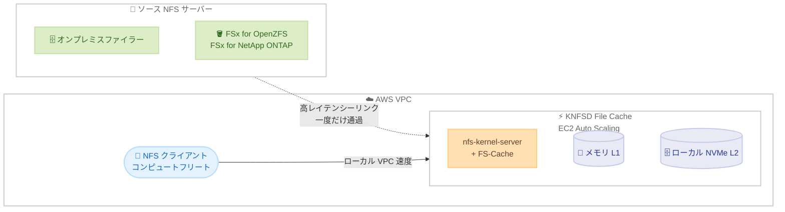

# KNFSD File Cache - プレビュー提供開始

**リリース日**: 2026 年 7 月 20 日
**サービス**: KNFSD File Cache (AWS Solutions Guidance)
**機能**: スケーラブルな高速 NFS キャッシュソリューション

📊 [このアップデートのインフォグラフィックを見る](https://takech9203.github.io/aws-news-summary/20260720-knfsd-file-cache.html)
<!-- INFOGRAPHIC_BASE_URL は環境変数から取得 -->

## 概要

AWS は、スケーラブルで高速な NFS (Network File System) キャッシュを AWS 上に展開するためのオープンソースソリューション「KNFSD File Cache」のプレビュー提供を開始しました。KNFSD は kernel NFS daemon の略称で、Apache-2.0 ライセンスのもとで GitHub 上に公開されています。

KNFSD File Cache は、1 つ以上のソース NFS サーバーからエクスポートをマウントし、それを AWS 内の NFS クライアントに対して再エクスポート (re-export) するキャッシングプロキシとして動作します。ソースとなる NFS サーバーは、オンプレミス、別の AWS アベイラビリティーゾーンやリージョン、あるいは AWS Interconnect 経由で接続された別のクラウド (マルチクラウド) に配置できます。フロントに立てられる対象は、オンプレミスの複数のファイラー、Amazon FSx for OpenZFS や Amazon FSx for NetApp ONTAP といったクラウド上のファイルシステム、および NFS v3、v4.1、v4.2 に準拠したあらゆるファイラーです。

頻繁に読み取られるデータをメモリとローカル NVMe ストレージにキャッシュすることで、ファイルは高レイテンシーのリンクをソースまで一度だけ通過し、その後はローカル VPC のスピードでコンピュートフリートに提供されます。これにより、VFX レンダリング、シミュレーション、金融サービス、ヘルスケア/ライフサイエンス、半導体設計 (EDA)、気象予測、エネルギーといった読み取り負荷の高いバースト型コンピュートワークロードのパフォーマンスを大幅に向上できます。

**アップデート前の課題**

- オンプレミスや別リージョンの NFS ストレージに対して AWS 上のコンピュートからアクセスする場合、高レイテンシーのリンクを介した繰り返しの読み取りがボトルネックとなっていた
- 大量の読み取りが発生するバーストワークロードでは、ソースファイラーへの負荷や WAN 帯域の消費が課題となっていた
- 高速なキャッシュ層を独自に構築する場合、設計、デプロイ、監視の仕組みをゼロから整備する必要があった

**アップデート後の改善**

- 頻繁に読み取られるデータをメモリとローカル NVMe にキャッシュし、コンピュートフリートにローカル VPC 速度でデータを提供できるようになった
- Packer による AMI ビルドと Terraform モジュールにより、キャッシュクラスターを迅速にデプロイできるようになった
- 70 以上のメトリクスを備えた CloudWatch ダッシュボードにより、キャッシュのパフォーマンスを詳細に監視できるようになった

## アーキテクチャ図



KNFSD File Cache がソース NFS サーバーとコンピュートフリートの間に立ち、頻繁に読み取られるデータをメモリ (L1) とローカル NVMe (L2) の 2 層でキャッシュすることで、高レイテンシーリンクの通過を最小化する構成を示しています。

## サービスアップデートの詳細

### 主要機能

1. **標準 Linux カーネル技術による NFS 再エクスポート**
   - `nfs-kernel-server` が NFS の再エクスポートを担当し、ソースのエクスポートをマウントして元のファイラーであるかのように提供する
   - `FS-Cache` (cachefilesd) が永続的なディスクキャッシュを提供する
   - ネイティブの NFS スタックを利用するため、バイト範囲の読み書き、同期/非同期書き込み、write-through および write-around モードを含むクライアント/サーバープロトコルを完全にサポートする

2. **2 層キャッシュアーキテクチャ**
   - L1: Linux ブロックキャッシュ (RAM) による超低レイテンシーのアクセス
   - L2: FS-Cache (ローカル NVMe) による高スループットかつ再起動をまたいで永続化するテラバイト級のキャッシュ
   - リクエストはまず L1 を確認し、次に L2 を確認する。完全なミスの場合のみソースファイラーからデータを取得する

3. **柔軟なデプロイと自動スケーリング**
   - Packer でキャッシュ AMI をビルドし、付属の Terraform モジュールでクラスターをデプロイする
   - キャッシュノードは AMD、Intel、AWS Graviton インスタンス上の Amazon EC2 Auto Scaling グループで稼働する
   - クライアントトラフィックは DNS ラウンドロビンまたは Network Load Balancer で分散する

4. **豊富な監視機能**
   - Amazon CloudWatch ダッシュボードが OpenTelemetry ベースのエージェントを通じて 70 以上のメトリクスを公開する
   - Prometheus や Grafana といったサードパーティツールへのメトリクス発行にも対応する

## 技術仕様

### 2 層キャッシュの構成

| レイヤー | 技術 | メディア | 特性 |
|------|------|------|------|
| L1 | Linux ブロックキャッシュ | RAM | 超低レイテンシー、インスタンスメモリで上限が決まる |
| L2 | FS-Cache (cachefilesd) | ローカル NVMe | 高スループット、再起動をまたいで永続化、テラバイト級の容量 |

### ファンアウトアーキテクチャ (オプション)

高レイテンシー/低帯域リンク向けに、2 段構成のファンアウトアーキテクチャを利用できます。

| ティア | 役割 |
|------|------|
| ティア 1 | ソースファイラーとの通信をすべて担当する高メモリプロキシ。各ファイルが WAN を一度だけ通過することを保証する |
| ティア 2 | ローカル VPC で多数のクライアントに提供する小型プロキシのクラスター。キャッシュのハイドレーションを維持しながらスケールする |

### インスタンスタイプの例 (US-East-1、参考値)

| インスタンス | アーキテクチャ | ネットワーク | NVMe | 用途 |
|------|------|------|------|------|
| im4gn.16xlarge | ARM | 100 Gbps | 30 TB | 高スループット、GB/s あたりの最良コスト |
| i8g.16xlarge | ARM | 50 Gbps | 15 TB | 最新世代 NVMe、小さいファイルの IOPS |
| i3en.24xlarge | x86 | 100 Gbps | 60 TB | 大容量キャッシュ |
| i7ie.48xlarge | x86 | 100 Gbps | 120 TB | レイテンシーに敏感な読み取り |

### 自動スケーリングの考え方

自動スケーリングは、CPU ではなくインスタンスあたりのアクティブな NFS 接続数というカスタム CloudWatch メトリクスに基づいて行われます。CPU はプロキシの負荷を十分に反映しないためです。スケールダウンはウォームキャッシュの破棄やアクティブな NFS マウントの切断につながるため、意図的にスケールアップのみとし、スケールダウンは利用者独自のスケジュールで手動実行します。

## 設定方法

### 前提条件

1. VPC のサブネットが用意されていること
2. ソース NFS サーバー (オンプレミス、FSx、他クラウドなど) のエクスポートにアクセスできること
3. オンプレミスや別クラウドをソースとする場合は、AWS Site-to-Site VPN、AWS Direct Connect、または AWS Interconnect による接続が確立されていること

### 手順

#### ステップ 1: AMI のビルド

```bash
# Packer でキャッシュ AMI をビルド
packer build knfsd.pkr.hcl
```

Packer ビルドスクリプトは、NFS 再エクスポートと FS-Cache を有効化したチューニング済みカーネル、メトリクスエージェント、HTTP ヘルスチェックエージェント、スモークテストを含む Ubuntu AMI を x86 (Intel/AMD) と ARM64 (AWS Graviton) 向けに生成します。

#### ステップ 2: Terraform によるクラスターのデプロイ

```bash
# Terraform モジュールでキャッシュクラスターをデプロイ
terraform init
terraform apply
```

Terraform のルートモジュールは、Auto Scaling グループ、セキュリティグループ、ヘルスチェック、DNS レコード、オプションのロードバランサー、FSID データベースを含むクラスターをデプロイします。必要な入力は VPC サブネット、ビルド済み AMI、ソース NFS エクスポートのみです。

#### ステップ 3: クライアントからのマウント

クライアントは特別なドライバーを必要とせず、通常の NFS 共有と同様にキャッシュをマウントします。トラフィックは DNS ラウンドロビンまたは Network Load Balancer 経由で各キャッシュノードに分散されます。

## メリット

### ビジネス面

- **ライセンスコスト不要**: オープンソース (Apache-2.0) で提供され、消費した AWS リソースの料金のみを支払う
- **データ移行の回避**: データを移行または複製することなく、既存の NFS ストレージを AWS に拡張できる
- **コスト効率**: キャッシュが KNFSD 層に永続化されるため、下流のコンピュートを EC2 スポットインスタンスで実行できる。再取得/置き換えされたインスタンスもウォームキャッシュの恩恵をすぐに受けられる

### 技術面

- **標準技術ベース**: 独自エージェントやベンダー固有のプロトコルを使わず、あらゆる NFSv3/NFSv4 クライアントを変更なしで利用できる
- **高いスループット**: 頻繁に読み取られるデータをローカル VPC 速度で提供し、高レイテンシーリンクの通過を最小化する
- **詳細な可観測性**: 70 以上のカスタムメトリクスと事前構築済みの CloudWatch ダッシュボードにより、キャッシュヒット率などの重要指標を監視できる

## デメリット・制約事項

### 制限事項

- 現時点ではプレビュー提供であり、本番利用にあたっては十分な検証が必要
- 読み取り負荷の高いワークロードを主な対象としており、書き込み中心のワークロードには最適化されていない
- スケールダウンはウォームキャッシュの破棄を伴うため自動化されておらず、手動での実施が必要

### 考慮すべき点

- キャッシュ容量はインスタンスのメモリと NVMe サイズに依存するため、ワークロードに応じたインスタンスタイプの選定が重要
- 最新のインスタンスタイプと料金については、EC2 インスタンスタイプの公式ドキュメントを確認すること
- AWS のマネージドサービスではなく、利用者が運用管理を行うソリューションである点に留意する

## ユースケース

### ユースケース 1: メディア/エンターテインメントのレンダーファーム

**シナリオ**: オンプレミスのファイラーに保存された大量のアセットを、AWS 上の VFX レンダリングフリートから読み取る。

**効果**: アセットが WAN を一度だけ通過し、以降はローカル VPC 速度で多数のレンダリングノードに提供されるため、レンダリング時間を短縮できる。

### ユースケース 2: HPC シミュレーションと EDA

**シナリオ**: 金融サービスのシミュレーションや半導体設計 (EDA) で、共通の入力データセットを多数のコンピュートインスタンスが繰り返し読み取る。

**効果**: キャッシュヒットにより読み取りレイテンシーを削減し、EC2 スポットインスタンスと組み合わせてコスト効率よく大規模な並列処理を実行できる。

### ユースケース 3: マルチリージョン/マルチクラウドのデータアクセス

**シナリオ**: 別リージョンや別クラウドに配置された中央 NFS ソースに対し、AWS 上のコンピュートからアクセスする。

**効果**: データをローカルにキャッシュすることで中央ソースへのレイテンシーを排除し、データの複製なしにマルチリージョン/マルチクラウド構成を実現できる。

## 料金

KNFSD File Cache はオープンソースソリューションであり、ライセンスコストはかかりません。消費した AWS リソース (EC2 インスタンス、EBS/NVMe ストレージ、データ転送、CloudWatch など) の料金のみを支払います。

参考値として、im4gn.16xlarge は 10〜12 GB/s のスループットを提供し、i3en.24xlarge と同等の性能をオンデマンド料金でおよそ半分のコストで実現できるとされています。集約スループットのコストは 100 Gb/s あたり 1 時間 6 ドル未満と示されています。

## 利用可能リージョン

プレビューとして、すべての AWS リージョンで利用可能です。

## 関連サービス・機能

- **Amazon FSx for OpenZFS / FSx for NetApp ONTAP**: KNFSD File Cache のソース NFS サーバーとして利用でき、これらの前段に高速キャッシュ層を配置できる
- **Amazon EC2 Auto Scaling**: キャッシュノードのクラスター管理と、アクティブ NFS 接続数に基づくスケールアップに使用される
- **Amazon CloudWatch**: 70 以上のメトリクスの収集と事前構築済みダッシュボードによる監視を提供する
- **AWS Direct Connect / Site-to-Site VPN / AWS Interconnect**: オンプレミスや別クラウドのソース NFS サーバーへの接続に利用される

## 参考リンク

- 📊 [インフォグラフィック](https://takech9203.github.io/aws-news-summary/20260720-knfsd-file-cache.html)
- [公式発表 (What's New)](https://aws.amazon.com/about-aws/whats-new/2026/07/knfsd-file-cache/)
- [AWS Blog](https://aws.amazon.com/blogs/media/introducing-knfsd-file-cache-extending-your-nfs-storage-into-the-cloud/)
- [GitHub リポジトリ](https://github.com/awslabs/knfsd-file-cache)

## まとめ

KNFSD File Cache は、既存の NFS ストレージを AWS に拡張し、読み取り負荷の高いバースト型コンピュートワークロードを高速化するオープンソースソリューションです。標準の Linux カーネル技術をベースにライセンスコストなしで導入でき、Packer と Terraform による自動デプロイと 70 以上のメトリクスによる監視を備えています。VFX レンダリング、HPC、EDA、金融シミュレーションなどでオンプレミスや別クラウドのファイラーへのアクセスに課題を抱えている場合は、まずプレビュー環境でキャッシュヒット率などの効果を検証することを推奨します。
