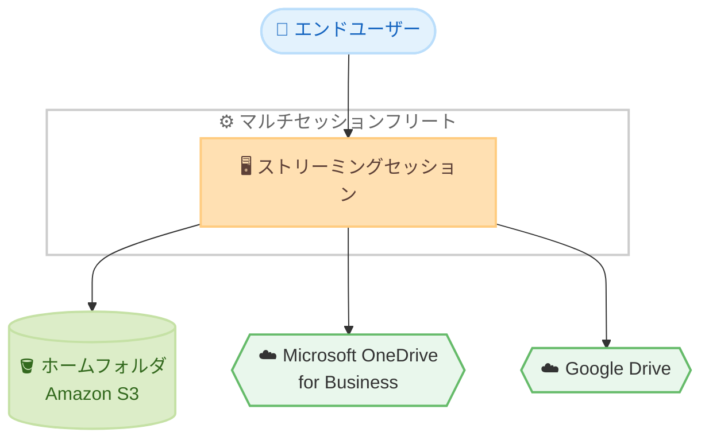

# Amazon WorkSpaces Applications - マルチセッションフリートでの OneDrive / Google Drive サポート

**リリース日**: 2026 年 7 月 20 日
**サービス**: Amazon WorkSpaces Applications
**機能**: マルチセッションフリートにおける Microsoft OneDrive および Google Drive の永続ストレージサポート

📊 [このアップデートのインフォグラフィックを見る](https://takech9203.github.io/aws-news-summary/20260720-storage-multi-session-fleets.html)
<!-- INFOGRAPHIC_BASE_URL は環境変数から取得 -->

## 概要

Amazon WorkSpaces Applications は、マルチセッションフリート上で Microsoft OneDrive for Business および Google Drive を永続ストレージオプションとしてサポートするようになりました。これまで提供されていた Amazon S3 をバックエンドとするホームフォルダに加えて、ユーザーは自身の OneDrive または Google Drive アカウントを連携し、ストリーミングセッション内から直接クラウド上のファイルにアクセス、保存、同期できるようになります。

マルチセッションフリートは、複数のユーザーが 1 つのフリートインスタンスを共有できる仕組みです。セッション密度を高めることでインスタンスあたりのユーザー数を増やし、コスト効率を向上させることができます。今回のアップデートにより、コスト効率に優れたマルチセッション環境においても、ユーザーは使い慣れたクラウドストレージを利用でき、ストリーミングセッションをまたいだ一貫した作業とコラボレーションが可能になります。

OneDrive または Google Drive のストレージコネクタを有効化しても追加料金は発生しません。ストリーミングセッションに対する通常の使用料金のみが適用されます。

**アップデート前の課題**

- マルチセッションフリートでは、永続ストレージとして S3 をバックエンドとするホームフォルダのみが利用可能だった
- ユーザーが日常的に利用している OneDrive や Google Drive 上のファイルへ、セッション内から直接アクセスする手段が限られていた
- コスト効率の高いマルチセッション構成と、使い慣れたクラウドストレージの利用を両立しにくかった

**アップデート後の改善**

- マルチセッションフリートで OneDrive for Business および Google Drive を永続ストレージとして利用できるようになった
- ユーザーは連携したアカウントのファイルを、ストリーミングセッション内から中断なくブラウズ、アップロード、ダウンロードできる
- 追加料金なしでストレージコネクタを有効化でき、セッションをまたいだシームレスなコラボレーションと作業の継続性が実現された

## アーキテクチャ図

1 つのマルチセッションフリートインスタンスを複数ユーザーで共有しつつ、各ユーザーがセッション内から S3 ベースのホームフォルダに加えて OneDrive や Google Drive にアクセスできる構成を示しています。

## サービスアップデートの詳細

### 主要機能

1. **マルチセッションフリートでの外部クラウドストレージ対応**
   - Microsoft OneDrive for Business および Google Drive を永続ストレージオプションとして選択可能
   - 従来の S3 バックエンドのホームフォルダと併用できる
   - 複数ユーザーがフリートインスタンスを共有するマルチセッション環境で利用できる

2. **セッション内からの直接ファイル操作**
   - 連携したアカウントのファイルをストリーミングセッション内からブラウズ、アップロード、ダウンロード可能
   - 作業を中断することなくクラウドファイルへアクセスできる
   - セッションをまたいだ作業の継続性とコラボレーションを実現

3. **追加料金なしのストレージコネクタ**
   - OneDrive / Google Drive コネクタの有効化に追加料金は発生しない
   - ストリーミングセッションの通常使用料金のみが適用される

## 技術仕様

### エージェントバージョン要件

| 項目 | 詳細 |
|------|------|
| 対応ストレージ | Microsoft OneDrive for Business、Google Drive |
| フリートタイプ | マルチセッションフリート |
| エージェント要件 | 2026 年 6 月 29 日以降にリリースされた WorkSpaces Applications エージェント |
| マネージドイメージ要件 | 2026 年 6 月 29 日以降にリリースされた Managed WorkSpaces Applications イメージ更新 |
| 追加料金 | なし (ストリーミングセッションの通常料金のみ) |

## 設定方法

### 前提条件

1. Amazon WorkSpaces Applications のマルチセッションフリートを利用していること
2. イメージが 2026 年 6 月 29 日以降にリリースされた WorkSpaces Applications エージェント、または同日以降にリリースされた Managed WorkSpaces Applications イメージ更新を使用していること
3. 連携する Microsoft OneDrive for Business または Google Drive のアカウントを保有していること

### 手順

#### ステップ 1: エージェント / イメージの確認と更新

利用中のイメージが 2026 年 6 月 29 日以降のエージェントまたはマネージドイメージ更新を使用しているかを確認します。要件を満たしていない場合は、対応するエージェントバージョンでイメージを更新します。

#### ステップ 2: ストレージコネクタの有効化

フリートまたはイメージの設定で、OneDrive for Business および Google Drive のストレージコネクタを有効化します。この操作により、マルチセッションフリート上のセッションで外部クラウドストレージが利用可能になります。

#### ステップ 3: ユーザーによるアカウント連携

エンドユーザーがストリーミングセッション内から自身の OneDrive または Google Drive アカウントを連携します。連携後、セッション内からクラウドファイルへアクセスできるようになります。

## メリット

### ビジネス面

- **コスト効率と利便性の両立**: マルチセッションによる高いコスト効率を維持しながら、ユーザーが使い慣れたクラウドストレージを利用できる
- **追加コストなし**: ストレージコネクタの有効化に追加料金がかからないため、導入コストを抑えられる
- **生産性の向上**: セッションをまたいだ作業の継続性により、ユーザーの生産性とコラボレーションが向上する

### 技術面

- **柔軟なストレージ選択肢**: S3 ホームフォルダに加えて OneDrive / Google Drive を選択できる
- **既存ワークフローとの統合**: ユーザーが日常的に利用するクラウドストレージをそのまま活用できる
- **シームレスな操作性**: セッション内から中断なくファイルのブラウズ、アップロード、ダウンロードが可能

## デメリット・制約事項

### 制限事項

- 2026 年 6 月 29 日以降にリリースされたエージェントまたはマネージドイメージ更新が必須
- 対応する外部ストレージは Microsoft OneDrive for Business と Google Drive に限定される

### 考慮すべき点

- 既存のイメージが要件を満たしていない場合、エージェントまたはイメージの更新作業が必要になる
- 外部クラウドストレージの利用にあたっては、組織のデータガバナンスやセキュリティポリシーとの整合性を確認する

## ユースケース

### ユースケース 1: コスト効率の高い共有デスクトップ環境

**シナリオ**: 多数のナレッジワーカーにストリーミングアプリケーションを提供する企業が、マルチセッションフリートでコストを抑えつつ、各ユーザーが自身の OneDrive のファイルに直接アクセスしたい。

**効果**: セッション密度を高めてコストを削減しながら、ユーザーは普段のクラウドストレージをそのまま利用でき、利便性を損なわない。

### ユースケース 2: Google Workspace を利用する組織

**シナリオ**: Google Drive を全社的に利用している組織が、マルチセッションフリート上のストリーミングセッションから Google Drive のファイルを扱いたい。

**効果**: 追加料金なしで Google Drive コネクタを有効化し、既存のファイル共有ワークフローをストリーミング環境に統合できる。

### ユースケース 3: セッションをまたいだ作業の継続

**シナリオ**: 教育機関や研修環境で、受講者が異なるセッション間で作業ファイルを引き継ぎたい。

**効果**: OneDrive / Google Drive を永続ストレージとして利用することで、セッションをまたいでファイルにアクセスでき、作業の継続性が確保される。

## 料金

OneDrive または Google Drive のストレージコネクタの有効化に追加料金は発生しません。ストリーミングセッションに対する通常の使用料金のみが適用されます。詳細は WorkSpaces Applications の料金ページを参照してください。

## 利用可能リージョン

Amazon WorkSpaces Applications が提供されているすべての AWS リージョンで利用可能です。

## 関連サービス・機能

- **Amazon S3**: マルチセッションフリートの既存のホームフォルダのバックエンドストレージとして利用される
- **Microsoft OneDrive for Business**: 今回サポートされた外部永続ストレージオプションの 1 つ
- **Google Drive**: 今回サポートされた外部永続ストレージオプションの 1 つ

## 参考リンク

- 📊 [インフォグラフィック](https://takech9203.github.io/aws-news-summary/20260720-storage-multi-session-fleets.html)
- [公式発表 (What's New)](https://aws.amazon.com/about-aws/whats-new/2026/07/storage-multi-session-fleets/)

## まとめ

今回のアップデートにより、Amazon WorkSpaces Applications のマルチセッションフリートでも Microsoft OneDrive for Business と Google Drive を永続ストレージとして利用できるようになりました。コスト効率とユーザーの利便性を両立できる点が大きな価値です。マルチセッションフリートを利用中の場合は、イメージのエージェントバージョンが 2026 年 6 月 29 日以降の要件を満たしているかを確認し、ストレージコネクタの有効化を検討してください。
