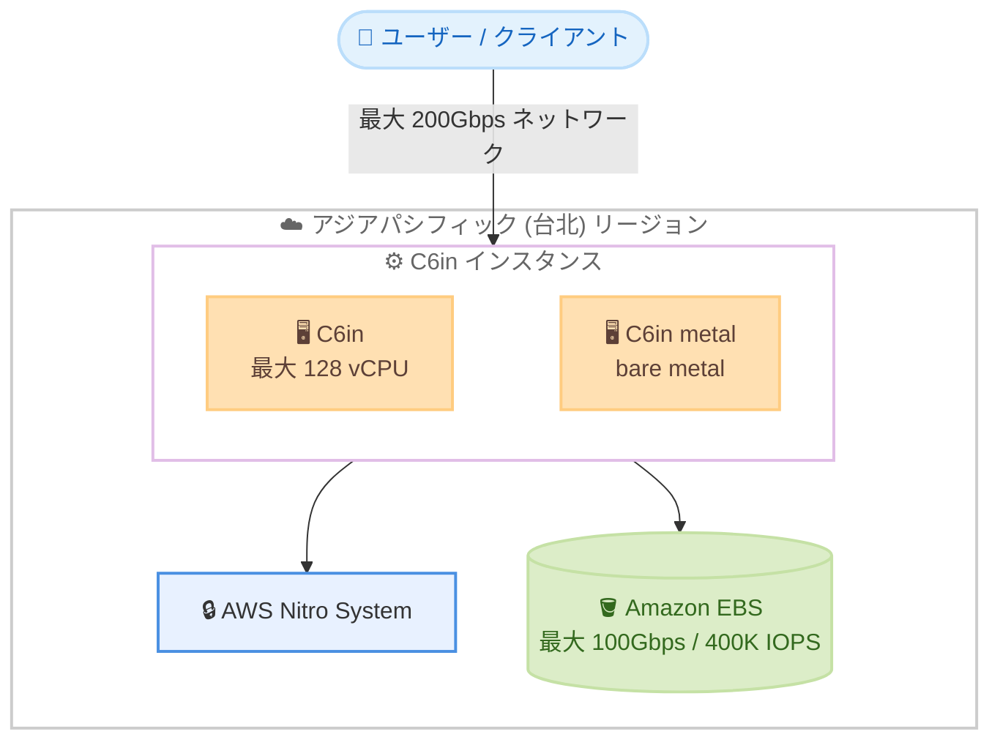

# Amazon EC2 - C6in インスタンス (アジアパシフィック (台北) リージョン提供開始)

**リリース日**: 2026 年 7 月 21 日
**サービス**: Amazon EC2
**機能**: C6in ネットワーク最適化インスタンス

📊 [このアップデートのインフォグラフィックを見る](https://takech9203.github.io/aws-news-summary/20260721-amazon-ec2-c6in.html)
<!-- INFOGRAPHIC_BASE_URL は環境変数から取得 -->

## 概要

Amazon EC2 C6in インスタンスが、アジアパシフィック (台北) リージョンで利用可能になりました。C6in は第 6 世代のネットワーク最適化インスタンスであり、第 3 世代 Intel Xeon Scalable プロセッサと AWS Nitro System を基盤としています。ネットワークを多用するワークロードに対して、最大 200Gbps という高いネットワーク帯域幅を提供します。

C6in は、ネットワーク仮想アプライアンス (ファイアウォール、仮想ルーター、ロードバランサー)、通信事業者向けの 5G ユーザープレーン機能 (UPF)、データ分析、ハイパフォーマンスコンピューティング (HPC)、CPU ベースの AI/ML アプリケーションなど、ネットワークとコンピューティングの両方を必要とするワークロードに適しています。今回の台北リージョンへの展開により、台湾およびその周辺地域のユーザーが低レイテンシーで C6in を利用できるようになりました。

第 5 世代の同等インスタンスと比較して 2 倍のネットワーク帯域幅を提供し、bare metal を含む 10 種類のサイズが選択できます。最大 128 vCPU に対応し、大規模なネットワーク集約型ワークロードにも対応可能です。

**アップデート前の課題**

- アジアパシフィック (台北) リージョンでは C6in インスタンスが利用できず、ネットワーク最適化ワークロードに別リージョンの利用が必要だった
- 台湾およびその周辺地域のユーザーは、高帯域幅のネットワーク最適化インスタンスを利用する際にレイテンシーやデータ主権の制約に直面していた
- 200Gbps クラスのネットワーク帯域幅を必要とするワークロードを台北リージョンで実行できなかった

**アップデート後の改善**

- アジアパシフィック (台北) リージョンで C6in インスタンスを直接利用できるようになった
- 台湾国内でのデータ処理により、低レイテンシーとデータローカリティの要件を満たせるようになった
- ネットワーク仮想アプライアンスや 5G UPF、HPC などのワークロードを台北リージョンで展開できるようになった

## アーキテクチャ図

台北リージョン内で C6in インスタンスが最大 200Gbps のネットワーク帯域幅と最大 100Gbps の EBS 帯域幅を提供する構成を示しています。

## サービスアップデートの詳細

### 主要機能

1. **高いネットワーク帯域幅**
   - 最大 200Gbps のネットワーク帯域幅を提供
   - 第 5 世代の同等インスタンスと比較して 2 倍のネットワーク帯域幅
   - ネットワーク集約型ワークロードのスループットとパケット処理性能を向上

2. **第 3 世代 Intel Xeon Scalable プロセッサと Nitro System**
   - 第 3 世代 Intel Xeon Scalable プロセッサを搭載
   - AWS Nitro System を基盤とし、セキュリティとパフォーマンスを両立
   - 最大 128 vCPU に対応

3. **豊富なインスタンスサイズと高い EBS 性能**
   - bare metal を含む 10 種類のサイズを提供
   - 最大 100Gbps の Amazon EBS 帯域幅、最大 400K IOPS
   - 32xlarge および metal サイズで Elastic Fabric Adapter (EFA) をサポート

## 技術仕様

### C6in インスタンスの主な仕様

| 項目 | 詳細 |
|------|------|
| プロセッサ | 第 3 世代 Intel Xeon Scalable |
| 基盤 | AWS Nitro System |
| 最大 vCPU | 128 |
| ネットワーク帯域幅 | 最大 200Gbps |
| EBS 帯域幅 | 最大 100Gbps |
| EBS IOPS | 最大 400K |
| インスタンスサイズ | bare metal を含む 10 種類 |
| EFA サポート | 32xlarge、metal サイズ |

## メリット

### ビジネス面

- **地域内での処理**: 台北リージョンでの実行により、台湾およびその周辺地域でのレイテンシー削減とデータローカリティ要件への対応が可能
- **コスト効率**: ネットワーク性能あたりのコストを最適化し、ネットワーク集約型ワークロードの効率的な運用を実現
- **ワークロード集約**: 高帯域幅により、より少ないインスタンス数でネットワーク処理を集約できる可能性

### 技術面

- **高スループット**: 最大 200Gbps のネットワーク帯域幅により、大量のトラフィックを処理可能
- **低レイテンシー通信**: EFA サポートにより、HPC や分散処理のノード間通信を高速化
- **高い I/O 性能**: 最大 100Gbps の EBS 帯域幅と 400K IOPS でストレージ集約型処理にも対応

## デメリット・制約事項

### 制限事項

- EFA は 32xlarge および metal サイズでのみサポート
- 高帯域幅の性能を最大限に活用するには、対応するインスタンスサイズの選択が必要
- リージョンによって利用可能なインスタンスサイズや料金が異なる場合がある

### 考慮すべき点

- ワークロードがネットワーク帯域幅を実際に必要とするか評価し、適切なインスタンスファミリー (C6i、C6g など) と比較検討する
- 200Gbps の帯域幅を活かすには、アプリケーション側の並列度やドライバー設定の最適化が必要になる場合がある

## ユースケース

### ユースケース1: ネットワーク仮想アプライアンス

**シナリオ**: ファイアウォール、仮想ルーター、ロードバランサーなどのネットワーク仮想アプライアンスを台北リージョンで運用する。

**効果**: 最大 200Gbps の帯域幅により、大量のトラフィックを単一インスタンスで処理し、アプライアンスの集約と可用性向上を実現。

### ユースケース2: 通信事業者向け 5G UPF

**シナリオ**: 通信事業者が 5G ネットワークのユーザープレーン機能 (UPF) を台北リージョンで展開する。

**効果**: 高いネットワーク帯域幅と低レイテンシーにより、5G のデータプレーン処理を効率的に実行し、地域内のエンドユーザーへのサービス品質を向上。

### ユースケース3: HPC および CPU ベースの AI/ML

**シナリオ**: ハイパフォーマンスコンピューティングや CPU ベースの機械学習ワークロードを、EFA を活用したクラスター構成で実行する。

**効果**: EFA によるノード間の低レイテンシー通信と高帯域幅により、分散処理の性能を最大化。

## 料金

C6in インスタンスの料金は、選択したインスタンスサイズおよび購入オプション (オンデマンド、Savings Plans、リザーブドインスタンス、スポットインスタンス) によって異なります。最新の料金は Amazon EC2 の料金ページで確認してください。

## 利用可能リージョン

今回のアップデートにより、アジアパシフィック (台北) リージョンで C6in インスタンスが利用可能になりました。C6in は、米国東部/西部、欧州の複数リージョン、中東、イスラエル、複数のアジアパシフィックリージョン (今回追加された台北を含む)、アフリカ、南米、カナダ、AWS GovCloud (US)、メキシコなど、多数のリージョンで提供されています。

## 関連サービス・機能

- **AWS Nitro System**: C6in の基盤となる技術で、セキュリティとパフォーマンスを提供
- **Elastic Fabric Adapter (EFA)**: 32xlarge および metal サイズで利用可能な高速ネットワークインターフェイス
- **Amazon EBS**: C6in と組み合わせて最大 100Gbps の帯域幅と 400K IOPS を提供するブロックストレージ

## 参考リンク

- 📊 [インフォグラフィック](https://takech9203.github.io/aws-news-summary/20260721-amazon-ec2-c6in.html)
- [公式発表 (What's New)](https://aws.amazon.com/about-aws/whats-new/2026/07/amazon-ec2-c6in/)
- [Amazon EC2 C6in インスタンス](https://aws.amazon.com/ec2/instance-types/c6i/)
- [Amazon EC2 料金ページ](https://aws.amazon.com/ec2/pricing/)

## まとめ

Amazon EC2 C6in インスタンスの台北リージョンへの展開により、台湾およびその周辺地域のユーザーが最大 200Gbps の高帯域幅ネットワーク最適化インスタンスを低レイテンシーで利用できるようになりました。ネットワーク仮想アプライアンスや 5G UPF、HPC などのネットワーク集約型ワークロードを運用しているユーザーは、このリージョンでの C6in 利用を検討することを推奨します。
