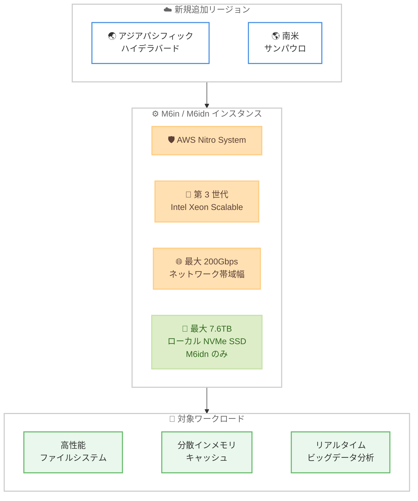

# Amazon EC2 - M6in および M6idn インスタンスの提供リージョン拡大

**リリース日**: 2026 年 7 月 21 日
**サービス**: Amazon EC2
**機能**: M6in および M6idn インスタンス (ネットワーク最適化)

📊 [このアップデートのインフォグラフィックを見る](https://takech9203.github.io/aws-news-summary/20260721-amazon-ec2-m6in-m6idn.html)
<!-- INFOGRAPHIC_BASE_URL は環境変数から取得 -->

## 概要

AWS は、ネットワーク最適化された第 6 世代インスタンスである Amazon EC2 M6in および M6idn インスタンスを、新たに 2 つのリージョンで提供開始しました。今回追加されたリージョンは、アジアパシフィック (ハイデラバード) と南米 (サンパウロ) です。

M6in および M6idn インスタンスは、第 3 世代 Intel Xeon Scalable プロセッサと AWS Nitro System 上に構築されており、最大 200Gbps のネットワーク帯域幅を提供します。これは、同等の第 5 世代インスタンスと比較して 2 倍のネットワーク帯域幅にあたります。高性能ファイルシステム、分散インメモリキャッシュ、リアルタイムビッグデータ分析、5G User Plane Function などの通信事業者向けアプリケーションといった、ネットワーク負荷の高いワークロードを対象としています。

M6idn インスタンスは、これらに加えて最大 7.6 TB の高速かつ低レイテンシーなインスタンスストレージ (ローカル NVMe SSD) を備えており、ストレージ性能も重視するワークロードに適しています。

**アップデート前の課題**

- アジアパシフィック (ハイデラバード) および南米 (サンパウロ) のユーザーは、ネットワーク最適化された M6in / M6idn インスタンスをこれらのリージョンで直接利用できなかった
- ネットワーク負荷の高いワークロードを上記リージョンで実行する場合、他のインスタンスファミリーで代替するか、他リージョンにデプロイする必要があった
- データレジデンシーやレイテンシーの要件により、特定リージョンでの実行が求められるワークロードでは選択肢が限られていた

**アップデート後の改善**

- アジアパシフィック (ハイデラバード) と南米 (サンパウロ) でも M6in / M6idn インスタンスを直接利用できるようになった
- 最大 200Gbps のネットワーク帯域幅を活用したワークロードを、対象リージョン内で低レイテンシーに実行できるようになった
- データレジデンシー要件を満たしつつ、ネットワーク最適化インスタンスの性能を活用できるようになった

## アーキテクチャ図

ネットワーク最適化された M6in / M6idn インスタンスが新規 2 リージョンで利用可能となり、ネットワーク負荷の高いワークロードを対象リージョン内で実行できることを示しています。

## サービスアップデートの詳細

### 主要機能

1. **提供リージョンの拡大**
   - アジアパシフィック (ハイデラバード) で新たに利用可能
   - 南米 (サンパウロ) で新たに利用可能
   - これにより、対象ワークロードをより多くのリージョンでネイティブに実行できるようになった

2. **高いネットワーク性能**
   - 最大 200Gbps のネットワーク帯域幅を提供
   - 同等の第 5 世代インスタンスと比較して 2 倍のネットワーク帯域幅
   - 32xlarge および metal サイズでは Elastic Fabric Adapter (EFA) をサポート

3. **M6idn の高速ローカルストレージ**
   - 最大 7.6 TB の高速かつ低レイテンシーなインスタンスストレージ (ローカル NVMe SSD) を搭載
   - 一時データやキャッシュ、スクラッチ領域を必要とするワークロードに適している

## 技術仕様

### インスタンススペック

| 項目 | 詳細 |
|------|------|
| プロセッサ | 第 3 世代 Intel Xeon Scalable プロセッサ |
| 基盤 | AWS Nitro System |
| インスタンスサイズ | metal を含む 10 サイズ |
| vCPU | 最大 128 |
| メモリ | 最大 512 GiB |
| ネットワーク帯域幅 | 最大 200Gbps |
| EBS 帯域幅 | 最大 100Gbps、最大 400K IOPS |
| EFA サポート | 32xlarge および metal サイズ |
| ローカルストレージ (M6idn) | 最大 7.6 TB (ローカル NVMe SSD) |
| 購入オプション | Savings Plans、オンデマンド、スポットインスタンス |

### M6in と M6idn の違い

| 項目 | M6in | M6idn |
|------|------|-------|
| ネットワーク最適化 | あり | あり |
| ローカル NVMe SSD ストレージ | なし | あり (最大 7.6 TB) |
| 主な用途 | ネットワーク負荷の高い汎用ワークロード | 高速ローカルストレージも必要なワークロード |

## メリット

### ビジネス面

- **データレジデンシー対応**: ハイデラバードおよびサンパウロのリージョン内でワークロードを実行できるため、データ所在地に関する要件を満たしやすくなる
- **柔軟なコスト最適化**: Savings Plans、オンデマンド、スポットインスタンスの各購入オプションを利用でき、ワークロードに応じたコスト最適化が可能
- **地域ユーザーへの近接**: 対象地域のエンドユーザーに近いリージョンでサービスを提供でき、レイテンシー低減とユーザー体験の向上が期待できる

### 技術面

- **高いネットワークスループット**: 最大 200Gbps の帯域幅により、ネットワーク負荷の高いワークロードの性能が向上
- **高速ストレージ (M6idn)**: 最大 7.6 TB のローカル NVMe SSD により、低レイテンシーなストレージアクセスが可能
- **HPC 向けネットワーキング**: 32xlarge および metal サイズでの EFA サポートにより、密結合な HPC ワークロードにも対応

## デメリット・制約事項

### 制限事項

- 今回の提供対象はアジアパシフィック (ハイデラバード) と南米 (サンパウロ) の 2 リージョンであり、その他のリージョンについては全リージョン一覧を確認する必要がある
- M6idn のローカル NVMe SSD ストレージは一時ストレージであり、インスタンスの停止・終了時にデータが失われる点に注意が必要
- EFA のサポートは 32xlarge および metal サイズに限定される

### 考慮すべき点

- 永続化が必要なデータは Amazon EBS や Amazon S3 など別途の永続ストレージに保存する必要がある
- ワークロードのネットワークおよびストレージ要件を評価し、M6in と M6idn のいずれが適切かを検討する
- リージョンごとに料金やインスタンスサイズの可用性が異なる場合があるため、料金ページで最新情報を確認する

## ユースケース

### ユースケース1: 高性能ファイルシステム

**シナリオ**: 大量の並列 I/O が発生する高性能ファイルシステム (Lustre など) を、南米のユーザーに近いサンパウロリージョンで運用したい。

**効果**: 最大 200Gbps のネットワーク帯域幅により、ノード間の高速なデータ転送を実現し、ファイルシステム全体のスループットを向上できます。

### ユースケース2: 分散インメモリキャッシュ

**シナリオ**: ハイデラバードリージョンで、低レイテンシーが求められる分散インメモリキャッシュ (Redis / Memcached クラスターなど) を構築したい。

**効果**: 高いネットワーク帯域幅と M6idn の高速ローカルストレージにより、キャッシュノード間の通信とデータアクセスを高速化できます。

### ユースケース3: 通信事業者向けアプリケーション

**シナリオ**: 5G User Plane Function (UPF) など、パケット処理性能とネットワークスループットが重要な通信事業者向けワークロードを実行したい。

**効果**: 最大 200Gbps のネットワーク帯域幅と EFA サポートにより、高いパケット処理性能を必要とする Telco ワークロードを効率的に実行できます。

## 料金

M6in および M6idn インスタンスは、Savings Plans、オンデマンド、スポットインスタンスの各購入オプションで利用できます。料金はインスタンスサイズおよびリージョンによって異なります。最新かつ正確な料金は、Amazon EC2 の料金ページで確認してください。

## 利用可能リージョン

今回のアップデートにより、以下の 2 リージョンが新たに追加されました。

- アジアパシフィック (ハイデラバード)
- 南米 (サンパウロ)

これらを含む全体の提供リージョンは以下の通りです。

- 米国東部 (オハイオ、バージニア北部)
- 米国西部 (北カリフォルニア、オレゴン)
- 欧州 (アイルランド、フランクフルト、スペイン、ストックホルム、チューリッヒ、ロンドン)
- アジアパシフィック (ハイデラバード、ムンバイ、シンガポール、東京、シドニー、ソウル)
- 南米 (サンパウロ)
- カナダ (中部)
- AWS GovCloud (US-West)

## 関連サービス・機能

- **AWS Nitro System**: M6in / M6idn インスタンスの基盤となる技術。高いネットワークおよびストレージ性能とセキュリティを実現
- **Elastic Fabric Adapter (EFA)**: 32xlarge および metal サイズでサポートされる HPC 向けの高性能ネットワークインターフェイス
- **Amazon EBS**: 最大 100Gbps、最大 400K IOPS の EBS 帯域幅により、永続ブロックストレージへの高速アクセスを提供
- **EC2 Savings Plans**: オンデマンドと比較してコストを削減できる柔軟な料金モデル

## 参考リンク

- 📊 [インフォグラフィック](https://takech9203.github.io/aws-news-summary/20260721-amazon-ec2-m6in-m6idn.html)
- [公式発表 (What's New)](https://aws.amazon.com/about-aws/whats-new/2026/07/amazon-ec2-m6in-m6idn/)
- [Amazon EC2 M6i インスタンス (M6in ファミリー)](https://aws.amazon.com/ec2/instance-types/m6i/)
- [Amazon EC2 料金](https://aws.amazon.com/ec2/pricing/)

## まとめ

今回のアップデートにより、ネットワーク最適化された Amazon EC2 M6in / M6idn インスタンスがアジアパシフィック (ハイデラバード) と南米 (サンパウロ) で利用可能になりました。これらのリージョンでネットワーク負荷の高いワークロードを運用しているユーザーは、データレジデンシー要件を満たしつつ最大 200Gbps のネットワーク性能を活用できます。対象リージョンでのワークロードについて、M6in / M6idn インスタンスへの移行や新規デプロイを検討することをおすすめします。
