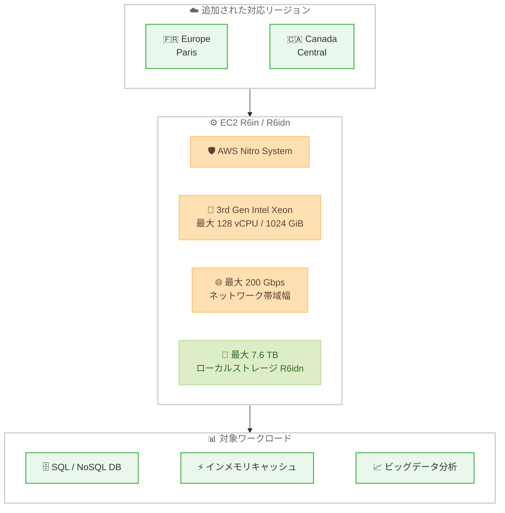

# Amazon EC2 - R6in および R6idn インスタンスの追加リージョン提供開始

**リリース日**: 2026 年 7 月 21 日
**サービス**: Amazon EC2 (Elastic Compute Cloud)
**機能**: R6in / R6idn インスタンスの追加リージョン提供

📊 [このアップデートのインフォグラフィックを見る](https://takech9203.github.io/aws-news-summary/20260721-amazon-ec2-r6in-r6idn.html)
<!-- INFOGRAPHIC_BASE_URL は環境変数から取得 -->

## 概要

Amazon EC2 R6in および R6idn インスタンスが、新たに Europe (Paris) および Canada (Central) リージョンで利用可能になりました。R6in / R6idn は、第 3 世代 Intel Xeon Scalable プロセッサ (Ice Lake) と AWS Nitro System を基盤とする、ネットワーク最適化されたメモリ最適化インスタンスです。

これらのインスタンスは、最大 200 Gbps のネットワーク帯域幅と、第 5 世代インスタンスと比較して最大 2 倍のパケット処理性能を提供します。メモリ集約型の SQL / NoSQL データベース、インメモリキャッシュ、SAP HANA などのインメモリデータベース、大規模データ分析といったネットワーク集約型ワークロードに適しています。

今回のリージョン拡大により、パリおよびカナダ (中部) のユーザーは、データレジデンシー要件やレイテンシー要件を満たしながら、高いネットワーク性能を必要とするワークロードを構築できるようになります。

**アップデート前の課題**

- Europe (Paris) や Canada (Central) リージョンでは R6in / R6idn インスタンスを起動できなかった
- 高ネットワーク性能を求めるワークロードのために、他リージョンへのデプロイやレイテンシーの妥協が必要な場合があった
- データレジデンシー要件があるフランスやカナダのユーザーは、対象リージョン内で最適なネットワーク最適化インスタンスを選択しづらかった

**アップデート後の改善**

- Europe (Paris) と Canada (Central) で R6in / R6idn インスタンスを直接起動できるようになった
- 対象リージョン内で最大 200 Gbps のネットワーク帯域幅を活用できるようになった
- データレジデンシーとレイテンシーの両立が容易になった

## アーキテクチャ図

追加されたリージョンで R6in / R6idn インスタンスを起動し、ネットワーク集約型ワークロードを実行する構成を示しています。

## サービスアップデートの詳細

### 主要機能

1. **追加リージョンでの提供開始**
   - Europe (Paris) リージョンで新たに利用可能
   - Canada (Central) リージョンで新たに利用可能
   - 既存の提供リージョンに加えての拡大

2. **高いネットワーク性能**
   - 最大 200 Gbps のネットワーク帯域幅を提供 (第 5 世代の 2 倍)
   - 第 5 世代インスタンスと比較して最大 2 倍のパケット処理性能
   - 32xlarge および metal サイズで Elastic Fabric Adapter (EFA) をサポート

3. **メモリとストレージの構成**
   - 最大 128 vCPU、最大 1024 GiB メモリ
   - EBS 帯域幅は最大 100 Gbps、最大 400K IOPS
   - R6idn は最大 7.6 TB の高速・低レイテンシーローカルインスタンスストレージを搭載

## 技術仕様

### インスタンス仕様

| 項目 | 詳細 |
|------|------|
| プロセッサ | 第 3 世代 Intel Xeon Scalable (Ice Lake) |
| 基盤 | AWS Nitro System |
| インスタンスサイズ | ベアメタルを含む 10 サイズ |
| vCPU | 最大 128 vCPU |
| メモリ | 最大 1024 GiB |
| ネットワーク帯域幅 | 最大 200 Gbps |
| EBS 帯域幅 | 最大 100 Gbps / 最大 400K IOPS |
| EFA サポート | 32xlarge および metal サイズ |
| ローカルストレージ | 最大 7.6 TB (R6idn のみ) |

### R6in と R6idn の違い

| 項目 | R6in | R6idn |
|------|------|-------|
| ネットワーク最適化 | 対応 | 対応 |
| ローカル NVMe SSD ストレージ | なし | あり (最大 7.6 TB) |
| 主な用途 | EBS ベースのワークロード | 低レイテンシーローカルストレージが必要なワークロード |

## メリット

### ビジネス面

- **データレジデンシーの充足**: フランスおよびカナダ国内で処理を完結でき、地域要件を満たしやすくなります
- **レイテンシー低減**: 対象地域のユーザーに近いリージョンで高性能インスタンスを実行できます
- **柔軟な購入オプション**: Savings Plans、リザーブド、オンデマンド、スポットの各購入オプションを利用できます

### 技術面

- **高スループット処理**: 最大 200 Gbps のネットワーク帯域幅により、ネットワーク集約型ワークロードを効率的に処理できます
- **HPC 対応**: EFA サポートにより、大規模並列処理や HPC ワークロードに対応します
- **高速ローカルストレージ**: R6idn では低レイテンシーの NVMe SSD ストレージを活用できます

## デメリット・制約事項

### 制限事項

- EFA のサポートは 32xlarge および metal サイズに限定されます
- ローカルインスタンスストレージは R6idn のみで提供されます
- ネットワーク最適化インスタンスであるため、汎用用途では他のインスタンスファミリーがコスト効率に優れる場合があります

### 考慮すべき点

- ワークロードのネットワーク要件を評価し、標準のメモリ最適化インスタンス (R6i など) との比較検討が必要です
- ローカルストレージ上のデータはインスタンス停止・終了時に失われるため、永続化が必要なデータは EBS や S3 を利用します

## ユースケース

### ユースケース1: メモリ集約型データベース

**シナリオ**: フランス国内でデータを保持する必要があるメモリ集約型の SQL / NoSQL データベースを運用したい。

**効果**: Europe (Paris) リージョンで R6idn を利用し、高いネットワーク帯域幅と低レイテンシーローカルストレージを活用しつつ、データレジデンシー要件を満たせます。

### ユースケース2: インメモリキャッシュ / データベース

**シナリオ**: Memcached や Redis によるインメモリキャッシュ、SAP HANA などのインメモリデータベースを高スループットで運用したい。

**効果**: 最大 1024 GiB のメモリと最大 200 Gbps のネットワーク帯域幅により、大規模なインメモリワークロードを安定的に処理できます。

### ユースケース3: ビッグデータ分析

**シナリオ**: Canada (Central) リージョンで Apache Hadoop や Apache Spark を用いた大規模データ分析を実行したい。

**効果**: ネットワーク最適化されたインスタンスにより、ノード間の大量データ転送を効率化し、分析ジョブの処理時間を短縮できます。

## 料金

R6in / R6idn インスタンスは、Savings Plans、リザーブドインスタンス、オンデマンド、スポットインスタンスの各購入オプションで利用できます。料金はリージョンごとに異なるため、最新の料金は公式の料金ページを確認してください。

## 利用可能リージョン

今回追加されたリージョン。

- Europe (Paris)
- Canada (Central)

既存の提供リージョンを含めた対応リージョン。

- US East (N. Virginia, Ohio)
- US West (Oregon)
- Europe (Ireland, Frankfurt, Paris, Stockholm)
- Asia Pacific (Singapore, Sydney, Tokyo)
- Canada (Central)
- AWS GovCloud (US-West)

## 関連サービス・機能

- **Amazon EBS**: R6in / R6idn は最大 100 Gbps の EBS 帯域幅と最大 400K IOPS を提供します
- **Elastic Fabric Adapter (EFA)**: 32xlarge および metal サイズで HPC ワークロード向けの低レイテンシー通信を実現します
- **AWS Nitro System**: セキュリティとパフォーマンスを支える基盤技術です

## 参考リンク

- 📊 [インフォグラフィック](https://takech9203.github.io/aws-news-summary/20260721-amazon-ec2-r6in-r6idn.html)
- [公式発表 (What's New)](https://aws.amazon.com/about-aws/whats-new/2026/07/amazon-ec2-r6in-r6idn/)
- [Amazon EC2 R6i インスタンス](https://aws.amazon.com/ec2/instance-types/r6i/)
- [Amazon EC2 料金](https://aws.amazon.com/ec2/pricing/)

## まとめ

R6in / R6idn インスタンスの Europe (Paris) および Canada (Central) への拡大により、これらの地域でもネットワーク集約型のメモリ最適化ワークロードを高性能に実行できるようになりました。データレジデンシー要件がある場合や高いネットワーク帯域幅が必要な場合は、対象リージョンでの R6in / R6idn の採用を検討してください。
