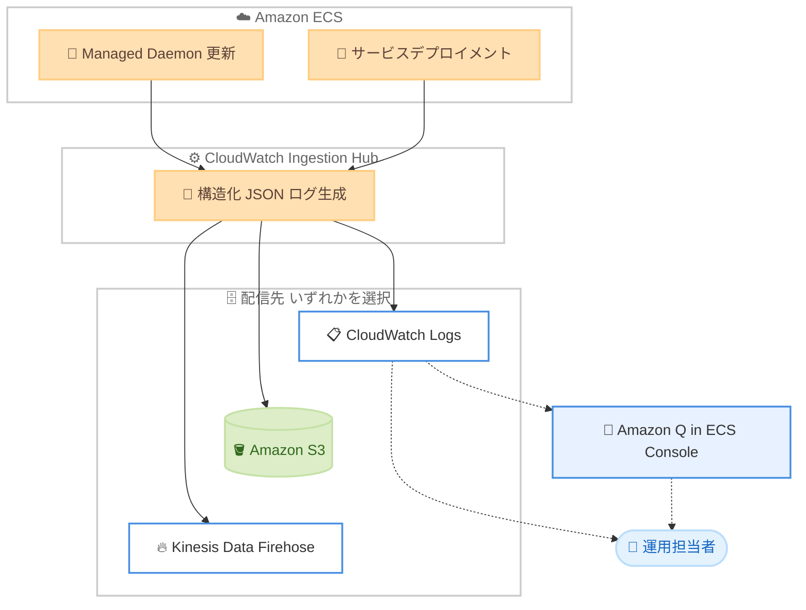

# Amazon ECS - Action Logs

**リリース日**: 2026 年 7 月 21 日
**サービス**: Amazon ECS (AWS Fargate)
**機能**: Amazon ECS Action Logs

📊 [このアップデートのインフォグラフィックを見る](https://takech9203.github.io/aws-news-summary/20260721-amazon-ecs-action-logs.html)
<!-- INFOGRAPHIC_BASE_URL は環境変数から取得 -->

## 概要

Amazon ECS は、サービスデプロイメントと ECS Managed Daemon の更新中に Amazon ECS がお客様に代わって実行するアクションを、タイムスタンプ付きで詳細に記録する新しいオブザーバビリティ機能「Action Logs」を発表しました。各ログエントリには、イベント名、ログレベル (INFO、WARN、ERROR)、関連するリソース ARN、ステータス理由が含まれ、問題発生時の平均解決時間 (MTTR) の短縮を支援します。

従来、Amazon ECS がリソースに対して実行する操作の多くはサーバー側で処理され、お客様はリソースの開始状態と終了状態しか観察できませんでした。Action Logs は、コンテナイメージのダウンロード、ロードバランサーへの登録、セキュリティグループの設定といった、これまで見えなかった中間ステップを可視化します。これにより、AWS Support に問い合わせることなく、デプロイメントの失敗やデーモンの問題を自己解決できるようになります。

Action Logs はクラスターレベルでオプトインでき、Amazon ECS コンソールまたは Amazon CloudWatch の vended logs API を使用して有効化します。ログの配信先として Amazon CloudWatch Logs、Amazon S3、Amazon Kinesis Data Firehose を選択できます。さらに提供開始時点で、ECS コンソールの Amazon Q が Action Logs と統合され、サーキットブレーカーによるロールバックや不安定なサービスリビジョンといったデプロイメントの問題を自動的に検出します。

**アップデート前の課題**

- 以前は Amazon ECS がサーバー側で実行する操作の中間ステップが見えず、リソースの開始状態と終了状態しか観察できなかった
- 以前はデプロイメントの失敗やインフラストラクチャの問題の原因究明のために AWS Support への問い合わせが必要になる場合があった
- 以前は失敗したタスクのメタデータが標準で 1 時間しか保持されず、詳細な分析を後から行うことが難しかった

**アップデート後の改善**

- 今回のアップデートにより、状態遷移の間に Amazon ECS が実行するアクション (インフラのプロビジョニング、ネットワーク設定、リソース登録など) を可視化できるようになった
- 今回のアップデートにより、AWS Support に問い合わせることなくデプロイメントの失敗やインフラの問題を自己解決できるようになった
- 今回のアップデートにより、失敗タスクのメタデータを標準の 1 時間の保持期間を超えて保持し、自分のペースで詳細な失敗情報を確認できるようになった

## アーキテクチャ図



Amazon ECS がデプロイメントとデーモン更新中に実行するアクションを CloudWatch Ingestion Hub 経由で構造化 JSON ログとして生成し、選択した配信先に fire-and-forget 方式で配信します。CloudWatch Logs に配信されたログには Amazon Q がアクセスし、デプロイメント問題の自動検出を行います。

## サービスアップデートの詳細

### 主要機能

1. **サービスアクションの可視化**
   - 状態遷移の間に Amazon ECS が実行する、これまで見えなかったアクションを表示
   - インフラストラクチャのプロビジョニング、ネットワーク設定、リソース登録を含む
   - コンテナイメージのダウンロード、ロードバランサーへの登録、セキュリティグループの設定などを記録

2. **記録対象の操作**
   - サービスデプロイメント: 状態遷移、ロールバック、ライフサイクルフックの実行
   - Managed Daemon のライフサイクル: 作成、更新、削除、インスタンスのドレイン操作

3. **Amazon Q との統合**
   - 提供開始時点で ECS コンソールの Amazon Q が Action Logs と統合
   - サーキットブレーカーによるロールバックや不安定なサービスリビジョンなどのデプロイメント問題を自動検出
   - コンソール内で根本原因分析、リソースレベルの比較、修復手順を提供

4. **拡張された失敗メタデータ**
   - 失敗タスクのメタデータを標準の 1 時間の保持期間を超えて保持
   - 詳細な失敗情報を任意のタイミングで確認可能

## 技術仕様

### ログスキーマ

各 Action Log エントリには以下のフィールドが含まれます。

| フィールド | 詳細 |
|------|------|
| `timestamp` | イベント発生時刻 (Unix ミリ秒) |
| `logLevel` | 重要度レベル: `INFO`、`WARN`、`ERROR` |
| `account` | AWS アカウント ID |
| `region` | イベントが発生した AWS リージョン |
| `resourceArn` | オプトインスコープを表すクラスター ARN |
| `actionSourceId` | サブリソース識別子 (サービス ARN やデーモン ARN など) |
| `eventName` | アクション識別子 (例: `DAEMON_DEPLOYMENT_IN_PROGRESS`) |
| `detail` | アクションに関する追加コンテキストを含むイベント固有の JSON ペイロード |

### 配信先の構成

| 配信先 | 詳細 |
|------|------|
| CloudWatch Logs | ロググループ `/aws/vendedlogs/ecs/action-logs/{resourceId}` に保存。サブリソースごとに `{actionSourceId}` をログストリーム名とする個別のログストリームを作成 |
| Amazon S3 | アカウント、リージョン、5 分間の時間ウィンドウでパーティション分割。gzip で圧縮して保存 |
| Amazon Data Firehose | 改行区切りの JSON レコードとしてニアリアルタイムで配信 |

### 配信方式

Action Logs は fire-and-forget 方式で発行されます。ログの発行が Amazon ECS のリソース操作をブロックしたり劣化させたりすることはありません。一時的な配信障害が発生しても、Amazon ECS はワークロードの処理を中断せずに継続します。

### 必要な IAM 権限

Action Logs を有効化および管理するには、IAM アイデンティティに以下の権限が必要です。

```json
{
    "Effect": "Allow",
    "Action": [
        "logs:PutDeliverySource",
        "logs:PutDeliveryDestination",
        "logs:CreateDelivery",
        "logs:GetDelivery",
        "ecs:AllowVendedLogDeliveryForResource"
    ],
    "Resource": "*"
}
```

## 設定方法

### 前提条件

1. IAM アイデンティティに Action Logs の有効化に必要な権限があること
2. 配信先の CloudWatch Logs ロググループに `delivery.logs.amazonaws.com` サービスの書き込みを許可するリソースポリシーが設定されていること
3. Amazon Q との統合を利用する場合は ECS コンソールへのアクセス権があること

### 手順

#### ステップ1: 配信ソースの登録

```bash
aws logs put-delivery-source \
    --name my-ecs-action-logs \
    --resource-arn arn:aws:ecs:{{region}}:{{account-id}}:cluster/{{cluster-name}} \
    --log-type EcsActionLogs
```

対象の ECS クラスターを配信ソースとして登録し、ログタイプに `EcsActionLogs` を指定します。

#### ステップ2: 配信先の構成

```bash
aws logs put-delivery-destination \
    --name my-ecs-logs-destination \
    --output-format json \
    --delivery-destination-configuration '{"destinationResourceArn": "arn:aws:logs:{{region}}:{{account-id}}:log-group:/aws/vendedlogs/ecs/action-logs/{{cluster-name}}"}'
```

ログの配信先 (この例では CloudWatch Logs のロググループ) を構成します。

#### ステップ3: 配信の作成

```bash
aws logs create-delivery \
    --delivery-source-name my-ecs-action-logs \
    --delivery-destination-arn arn:aws:logs:{{region}}:{{account-id}}:delivery-destination:my-ecs-logs-destination
```

配信ソースと配信先を関連付ける配信を作成し、Action Logs を有効化します。コンソールから有効化する場合は、クラスター詳細ページの [設定] タブにある [Action logs] セクションで [追加] を選択します。この場合、CloudWatch Logs はデフォルトで 7 日間の保持期間が設定されます。

## メリット

### ビジネス面

- **平均解決時間 (MTTR) の短縮**: デプロイメント失敗の原因を迅速に特定でき、サービス復旧までの時間を削減
- **サポートコストの削減**: AWS Support に問い合わせることなく問題を自己解決できるため、運用の自律性が向上
- **信頼性の向上**: Amazon Q による自動問題検出で、デプロイメントの安定性を継続的に監視

### 技術面

- **完全な操作の可視化**: 状態遷移の間の中間ステップまで含めて Amazon ECS の動作を追跡可能
- **柔軟な配信先**: CloudWatch Logs、S3、Data Firehose から用途に応じて選択可能
- **ワークロードへの無影響**: fire-and-forget 方式によりログ配信がリソース操作を妨げない

## デメリット・制約事項

### 制限事項

- Action Logs は有料機能であり、CloudWatch の標準 vended logs 料金が適用される
- 記録対象はサービスデプロイメントと Managed Daemon のライフサイクル操作に限定される
- オプトインはクラスターレベルで行う必要がある

### 考慮すべき点

- ログ量に応じて取り込みおよびストレージのコストが発生するため、保持期間の設定を検討する
- コンソールから有効化した場合のデフォルト保持期間は 7 日間であり、必要に応じて配信先の設定で調整する
- 一時的な配信障害時にはログが失われる可能性がある (fire-and-forget 方式のため)

## ユースケース

### ユースケース1: デプロイメント失敗の根本原因分析

**シナリオ**: 新しいサービスリビジョンのデプロイ中にサーキットブレーカーが作動しロールバックが発生した。従来は開始状態と終了状態しか確認できず原因特定が困難だった。

**実装例**:
```
1. クラスターで Action Logs を有効化
2. ECS コンソールの Amazon Q がロールバックを自動検出
3. Action Logs の eventName とステータス理由から失敗ステップを特定
```

**効果**: コンソール内で根本原因分析と修復手順を確認でき、迅速に問題を解決

### ユースケース2: 失敗タスクの事後分析

**シナリオ**: 断続的に発生するタスク起動失敗を調査したいが、標準のタスクメタデータは 1 時間で消えてしまう。

**実装例**:
```
Action Logs を S3 に配信し、拡張された失敗メタデータを長期保持
Amazon Athena や CloudWatch Logs Insights で失敗パターンを分析
```

**効果**: 保持期間の制約を受けずに、失敗情報を任意のタイミングで詳細に分析可能

### ユースケース3: マルチアカウント環境での集中監視

**シナリオ**: 複数の ECS クラスターを運用しており、デプロイメントのアクションを一元的に監視したい。

**実装例**:
```
各クラスターの Action Logs を Kinesis Data Firehose 経由で
中央の分析基盤にニアリアルタイムで集約
```

**効果**: 複数クラスターのデプロイメント状況をニアリアルタイムで横断的に可視化

## 料金

Action Logs は有料機能であり、CloudWatch の標準 vended logs 料金が適用されます。クラスターが生成するログの量に基づいて、ログの取り込みとストレージに対して課金されます。配信先 (CloudWatch Logs、S3、Data Firehose) それぞれの標準料金が適用されます。保持期間は配信先の設定で構成でき、Amazon ECS コンソールから有効化した場合、CloudWatch Logs はデフォルトで 7 日間の保持期間を使用します。

### 料金例

| 使用量 | 月額料金 (概算) |
|--------|------------------|
| 配信先の標準料金 | CloudWatch Logs、S3、Data Firehose の各標準料金に準拠 |
| ログ保持 | 配信先で構成した保持期間とストレージ量に応じて発生 |

正確な料金は [Amazon CloudWatch 料金ページ](https://aws.amazon.com/cloudwatch/pricing/) を参照してください。

## 利用可能リージョン

AWS GovCloud (US) リージョンを含む、すべての AWS リージョンで利用可能です。

## 関連サービス・機能

- **Amazon CloudWatch Logs**: vended log delivery メカニズムを通じて Action Logs を配信する主要な配信先
- **Amazon Q**: ECS コンソールで Action Logs を分析し、デプロイメント問題を自動検出
- **Amazon S3 / Amazon Kinesis Data Firehose**: Action Logs の代替配信先として長期保存やニアリアルタイム連携に対応

## 参考リンク

- 📊 [インフォグラフィック](https://takech9203.github.io/aws-news-summary/20260721-amazon-ecs-action-logs.html)
- [公式発表 (What's New)](https://aws.amazon.com/about-aws/whats-new/2026/07/amazon-ecs-action-logs/)
- [ドキュメント: Monitor Amazon ECS operations with Action Logs](https://docs.aws.amazon.com/AmazonECS/latest/developerguide/action-logs.html)
- [ドキュメント: Getting started with Amazon ECS Action Logs](https://docs.aws.amazon.com/AmazonECS/latest/developerguide/action-logs-getting-started.html)
- [料金ページ (Amazon CloudWatch)](https://aws.amazon.com/cloudwatch/pricing/)

## まとめ

Amazon ECS Action Logs は、これまで見えなかったデプロイメントとデーモン操作の中間ステップを可視化し、AWS Support への問い合わせなしに自己解決を可能にする重要なオブザーバビリティ機能です。Amazon Q との統合により、デプロイメント問題の自動検出と修復手順の提示が受けられます。ECS ワークロードを運用しているお客様は、まず開発環境のクラスターで Action Logs を有効化し、デプロイメントの可視性とトラブルシューティング体験の向上を確認することを推奨します。
