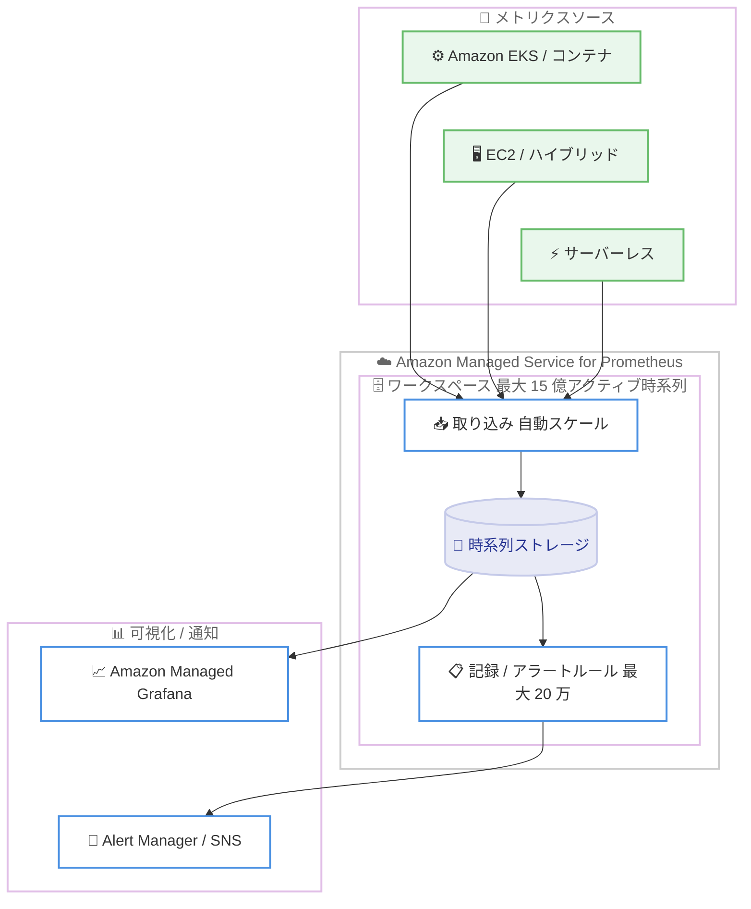

# Amazon Managed Service for Prometheus - ワークスペースあたり 15 億アクティブメトリクスと 20 万ルールをサポート

**リリース日**: 2026 年 7 月 21 日
**サービス**: Amazon Managed Service for Prometheus
**機能**: ワークスペースあたりのアクティブメトリクス上限とルール上限の拡張

📊 [このアップデートのインフォグラフィックを見る](https://takech9203.github.io/aws-news-summary/20260721-amazon-managed-service-prometheus-1500m-metrics-workspace.html)
<!-- INFOGRAPHIC_BASE_URL は環境変数から取得 -->

## 概要

Amazon Managed Service for Prometheus は、1 つのワークスペースあたり最大 15 億のアクティブメトリクス時系列 (active metric time series) と、最大 20 万件の記録ルールおよびアラートルールの合計をサポートするようになりました。これにより、大規模かつ高カーディナリティなモニタリングワークロードを、単一のワークスペースで集約して扱えるようになります。

Amazon Managed Service for Prometheus は、フルマネージドで Prometheus 互換のモニタリングサービスです。コンテナ化された環境、サーバーレス環境、ハイブリッド環境にまたがる高カーディナリティなワークロードに対して、取り込み (ingestion) とストレージを自動的にスケールします。加えて、1 つのアカウント内に複数のワークスペースを作成できるため、組織全体で数十億規模の Prometheus メトリクスを保存および分析できます。

このアップデートの主対象は、大規模な Kubernetes クラスタや多数のマイクロサービスを運用し、メトリクスのカーディナリティが継続的に増加している SRE チームやプラットフォームチームです。ワークスペースの上限拡張は自動的に適用されるものではなく、必要に応じて AWS Support Center または AWS Service Quotas からサービス制限緩和 (service limit increase) をリクエストします。

**アップデート前の課題**

- 単一ワークスペースのアクティブ時系列やルール数の上限に達すると、メトリクスを複数ワークスペースへ分割する必要があり、横断的なクエリやアラート設計が複雑になっていた
- 高カーディナリティなワークロードの成長に伴い、ワークスペースを分割するための運用オーバーヘッドが発生していた
- 大量の記録ルールとアラートルールを 1 つのワークスペースに集約できず、ルール管理が分散していた

**アップデート後の改善**

- 1 つのワークスペースで最大 15 億アクティブメトリクス時系列まで扱えるようになり、ワークスペース分割の必要性が低減した
- 1 つのワークスペースで最大 20 万件の記録ルールおよびアラートルールを集約管理できるようになった
- 複数ワークスペースと組み合わせることで、組織全体で数十億規模のメトリクスを保存および分析できるようになった

## アーキテクチャ図



上図は、複数のメトリクスソースから取り込まれたデータが、単一ワークスペース内で最大 15 億アクティブ時系列まで自動スケールして保存され、最大 20 万件のルールで評価される構成を示しています。

## サービスアップデートの詳細

### 主要機能

1. **アクティブメトリクス時系列の上限拡張**
   - ワークスペースあたりのアクティブ時系列の最大値が 15 億 (1.5 billion) に拡張された
   - アクティブ時系列とは、過去 2 時間以内にサンプルが報告された系列を指す
   - デフォルトの上限 (5,000 万) から最大値まで、サービス制限緩和リクエストで引き上げ可能

2. **ルール数の上限拡張**
   - ワークスペースあたりの記録ルールおよびアラートルールの合計を最大 20 万件 (200,000) までサポート
   - デフォルトの上限 (2,000) から、サービス制限緩和リクエストで引き上げ可能
   - 大量のルールを 1 つのワークスペースに集約して管理できる

3. **アカウントあたりの複数ワークスペース**
   - 1 つのアカウント内に複数のワークスペースを作成可能 (デフォルトはリージョンあたり 25、緩和可能)
   - 組織全体で数十億規模のメトリクスを保存および分析できる

## 技術仕様

### 主要なサービスクォータ (ワークスペースあたり)

| 項目 | デフォルト | 最大値 / 調整 | 説明 |
|------|-----------|--------------|------|
| Active series per workspace | 50,000,000 | 最大 15 億 (調整可) | 過去 2 時間以内にサンプルが報告されたユニークな時系列数 |
| Rules per workspace | 2,000 | 最大 20 万 (調整可) | 記録ルールとアラートルールの合計 |
| Ingestion rate per workspace | 1,666,666 サンプル / 秒 | 調整可 (アクティブ時系列上限の 1/30 に自動調整) | ワークスペースへのメトリクスサンプル取り込みレート |
| Workspaces per region per account | 25 | 調整可 | リージョンあたりのワークスペース数 |

### アクティブ時系列の自動スケーリング

Amazon Managed Service for Prometheus のワークスペースは、取り込み使用量に応じてクォータ上限まで自動的に容量を拡張します。

- 30 分間の平均使用量が 500 万系列未満の場合、容量は 2 倍に拡張される (例: 350 万使用時は 700 万容量)
- 使用量が 500 万系列を超える場合、1,000 万のバッファを追加する (例: 2,500 万使用時は 3,500 万容量)
- アクティブ時系列の最小容量は 200 万で、200 万未満ではスロットリングは発生しない
- デフォルトクォータを超える場合は、サービス制限緩和リクエストが必要

### API 変更履歴

今回のアップデートはサービスクォータの上限拡張であり、API の追加や変更は伴いません。ワークスペースの操作は既存の Amazon Managed Service for Prometheus API (CreateWorkspace、PutRuleGroupsNamespace など) を引き続き使用します。

## 設定方法

### 前提条件

1. AWS アカウントと、Amazon Managed Service for Prometheus が利用可能なリージョンへのアクセス
2. ワークスペースの作成および Service Quotas 操作に必要な IAM 権限
3. 上限緩和をリクエストする場合、AWS Support Center または AWS Service Quotas へのアクセス権限

### 手順

#### ステップ 1: ワークスペースの作成

```bash
aws amp create-workspace --alias my-large-workspace
```

Amazon Managed Service for Prometheus のワークスペースを新規作成します。作成後に返される workspaceId を使用して、後続の取り込み設定やルール設定を行います。

#### ステップ 2: 現在のクォータ確認

```bash
aws service-quotas get-service-quota \
  --service-code aps \
  --quota-code L-5A151448
```

`aps` サービスの Active series per workspace クォータ (コード `L-5A151448`) の現在値を確認します。ルール数の上限は別のクォータコード (`L-3D15CDB4`) で確認します。

#### ステップ 3: 上限緩和のリクエスト

```bash
aws service-quotas request-service-quota-increase \
  --service-code aps \
  --quota-code L-5A151448 \
  --desired-value 1500000000
```

アクティブ時系列の上限を最大値の 15 億へ引き上げるようリクエストします。AWS Support Center からケースを作成する方法でも同様のリクエストが可能です。緩和が承認されると、ワークスペースの容量は使用量に応じて新しい上限まで自動的にスケールします。

## メリット

### ビジネス面

- **運用の簡素化**: ワークスペース分割の必要性が減り、横断的なクエリやアラート設計の複雑さを軽減できる
- **組織全体のスケール**: 複数ワークスペースと組み合わせて、数十億規模のメトリクスを保存および分析できる
- **成長への対応**: メトリクスカーディナリティの増加に対して、ワークスペースを再設計せずに対応できる

### 技術面

- **自動スケーリング**: 取り込み量に応じて容量が自動拡張されるため、事前のキャパシティプランニング負荷が下がる
- **ルールの集約管理**: 最大 20 万件のルールを 1 ワークスペースに集約し、記録ルールとアラートルールを一元管理できる
- **高カーディナリティ対応**: コンテナ、サーバーレス、ハイブリッド環境の高カーディナリティワークロードを単一ワークスペースで扱える

## デメリット・制約事項

### 制限事項

- 上限の引き上げは自動ではなく、AWS Support Center または AWS Service Quotas からのリクエストと承認が必要
- デフォルトのアクティブ時系列上限は 5,000 万、ルール上限は 2,000 件であり、最大値まで到達するには緩和が必要
- 取り込みレート上限はアクティブ時系列上限の 1/30 (最大 1,666,666 サンプル / 秒) に自動調整される

### 考慮すべき点

- 直前 2 時間のベースラインから 2 倍超、または 5,000 万系列を超えて急増するとスロットリングが発生する可能性があるため、取り込みは段階的に増やすことが推奨される
- アクティブ時系列やメトリクスサンプルの増加は、取り込みとストレージの料金増加に直結するため、コスト影響を事前に見積もる
- CloudWatch 使用量メトリクスでリソース使用状況を監視し、上限到達前にアラームを設定することが望ましい

## ユースケース

### ユースケース 1: 大規模マルチクラスタ Kubernetes モニタリング

**シナリオ**: 数百のノードと多数のマイクロサービスを持つ複数の Amazon EKS クラスタを運用し、Pod やコンテナ単位の高カーディナリティメトリクスが数億系列に達している。

**実装例**:
```
各クラスタの Prometheus / ADOT コレクタ → remote_write → 単一 AMP ワークスペース (15 億上限)
```

**効果**: クラスタごとにワークスペースを分割せずに集約でき、横断的なダッシュボードとアラートを単一ワークスペースで実現できる。

### ユースケース 2: 大量のアラートルールを持つ SRE 運用

**シナリオ**: サービスごとに詳細な SLO / SLI ルールを定義しており、記録ルールとアラートルールの合計がデフォルトの 2,000 件を大きく超える。

**実装例**:
```
aws amp put-rule-groups-namespace \
  --workspace-id <id> --name slo-rules \
  --data file://rules.yaml   # 多数のルールグループを集約
```

**効果**: 最大 20 万件までルールを 1 ワークスペースに集約し、ルール管理を一元化できる。

### ユースケース 3: 組織全体のメトリクス基盤

**シナリオ**: 複数の事業部門やアカウントのメトリクスを、部門ごとのワークスペースに分けて保存しつつ、組織全体で数十億規模のメトリクスを扱いたい。

**実装例**:
```
部門 A ワークスペース + 部門 B ワークスペース + ... (アカウントあたり複数)
→ Amazon Managed Grafana で横断可視化
```

**効果**: 部門単位の分離とガバナンスを維持しながら、組織全体で大規模なメトリクス分析基盤を構築できる。

## 料金

Amazon Managed Service for Prometheus は、従量課金制で前払い料金や契約の縛りはありません。料金は取り込み、ストレージ、クエリ、コレクタの各次元で発生します。今回の上限拡張自体に追加料金はなく、実際に取り込む・保存するメトリクス量に応じて課金されます。

### 料金例

| 使用量 | 月額料金（概算） |
|--------|------------------|
| メトリクスサンプル取り込み (最初の 20 億サンプル / 月) | 1,000 万サンプルあたり $0.90 |
| ストレージ | $0.03 / GB |
| クエリ (Query Samples Processed) | 10 億サンプルあたり $0.10 |
| エージェントレスコレクタ | $0.04 / コレクタ時間 + 収集 1,000 万サンプルあたり $0.03 |

無料利用枠として、月あたり 4,000 万サンプルの取り込み、2,000 億クエリサンプルの処理、10 GB のストレージが含まれます。アクティブ時系列を大幅に増やす場合は、取り込みおよびストレージ料金への影響を事前に見積もることが重要です。

## 利用可能リージョン

Amazon Managed Service for Prometheus が提供されているリージョンで利用できます。今回の上限拡張は特定のリージョンに限定されるものではありません。詳細は AWS リージョン別サービス一覧を参照してください。

## 関連サービス・機能

- **Amazon Managed Grafana**: AMP に保存したメトリクスを可視化するダッシュボードとして利用できる
- **Amazon EKS / Amazon ECS**: コンテナ環境からのメトリクス取り込み元として連携する
- **AWS Distro for OpenTelemetry (ADOT)**: メトリクス収集エージェントとして remote_write で AMP へ送信できる
- **Amazon CloudWatch**: AMP の使用量メトリクスを監視し、上限到達前のアラームを設定できる
- **AWS Service Quotas**: アクティブ時系列やルールなどの上限確認および緩和リクエストに使用する

## 参考リンク

- 📊 [インフォグラフィック](https://takech9203.github.io/aws-news-summary/20260721-amazon-managed-service-prometheus-1500m-metrics-workspace.html)
- [公式発表 (What's New)](https://aws.amazon.com/about-aws/whats-new/2026/07/amazon-managed-service-prometheus-1500m-metrics-workspace/)
- [ドキュメント: サービスクォータ](https://docs.aws.amazon.com/prometheus/latest/userguide/AMP_quotas.html)
- [料金ページ](https://aws.amazon.com/prometheus/pricing/)

## まとめ

今回のアップデートにより、Amazon Managed Service for Prometheus はワークスペースあたり最大 15 億アクティブメトリクス時系列と 20 万ルールをサポートし、大規模かつ高カーディナリティなモニタリングを単一ワークスペースで扱えるようになりました。ワークスペース分割による運用オーバーヘッドの削減が期待できます。上限は自動適用ではないため、大規模ワークロードを運用するチームは、CloudWatch 使用量メトリクスで現状を把握したうえで、AWS Service Quotas から必要な緩和リクエストを計画することを推奨します。
