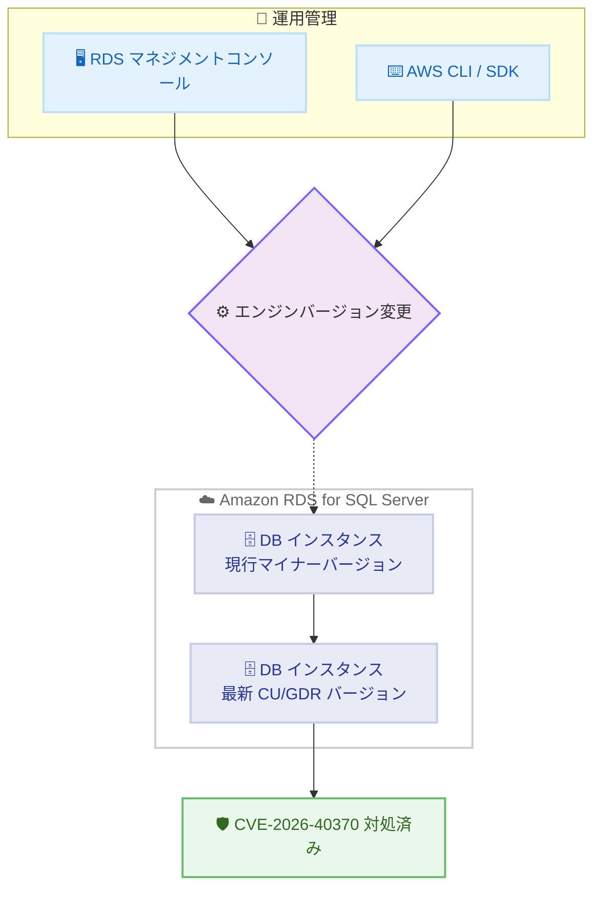

# Amazon RDS for SQL Server - 最新 CU および GDR アップデートのサポート

**リリース日**: 2026 年 7 月 21 日
**サービス**: Amazon RDS for SQL Server
**機能**: Microsoft SQL Server 向け最新の累積的な更新プログラム (CU) および一般配布リリース (GDR) のサポート

📊 [このアップデートのインフォグラフィックを見る](https://takech9203.github.io/aws-news-summary/20260721-amazon-rds-supports-latest-cu-gdr-microsoft-sql-server.html)
<!-- INFOGRAPHIC_BASE_URL は環境変数から取得 -->

## 概要

Amazon RDS for SQL Server が、Microsoft SQL Server 向けの最新の累積的な更新プログラム (Cumulative Updates, CU) および一般配布リリース (General Distribution Release, GDR) のサポートを開始しました。今回のリリースにより、お客様はマネージドデータベースサービスである Amazon RDS 上で、Microsoft が提供する最新のセキュリティ修正およびバグ修正を適用できるようになります。

今回のリリースでは、SQL Server 2016 SP3+GDR、SQL Server 2017 CU31+GDR、SQL Server 2019 CU32+GDR、SQL Server 2022 CU25 の各バージョンに対応する RDS エンジンバージョンが追加されています。特に GDR アップデートは、CVE-2026-40370 で説明されている脆弱性に対処するものであり、セキュリティ観点から重要な更新となります。

AWS は、RDS for SQL Server インスタンスを対象のエンジンバージョンにアップグレードし、これらの更新を適用することを推奨しています。アップグレードは RDS マネジメントコンソール、AWS SDK、または AWS CLI から実行できます。本アップデートは AWS GovCloud (US) リージョンを含む形で提供されています。

**アップデート前の課題**

- 最新の CU および GDR で提供される Microsoft SQL Server のセキュリティ修正やバグ修正を、RDS 上のマネージド環境で適用できなかった
- CVE-2026-40370 で報告された脆弱性に対する修正が、RDS でサポートされるエンジンバージョンに未反映であった
- 古いマイナーバージョンのまま運用する場合、既知の脆弱性が残存するリスクがあった

**アップデート後の改善**

- 各メジャーバージョン (2016 / 2017 / 2019 / 2022) に対応する最新のマイナーバージョンへアップグレードできるようになった
- GDR アップデートの適用により、CVE-2026-40370 の脆弱性に対処できるようになった
- マネジメントコンソール、AWS SDK、AWS CLI のいずれからも手動でアップグレードを実行できる

## アーキテクチャ図



運用管理者がコンソールまたは CLI/SDK からエンジンバージョンの変更操作を行い、DB インスタンスを最新の CU/GDR バージョンへマイナーバージョンアップグレードすることで、CVE-2026-40370 の脆弱性に対処する流れを示しています。

## サービスアップデートの詳細

### 主要機能

1. **対応する SQL Server バージョンと RDS エンジンバージョン**
   - SQL Server 2016 SP3+GDR KB5089271 : RDS バージョン `13.00.6490.1.v1`
   - SQL Server 2017 CU31+GDR KB5090354 : RDS バージョン `14.00.3530.2.v1`
   - SQL Server 2019 CU32+GDR KB5090407 : RDS バージョン `15.00.4470.1.v1`
   - SQL Server 2022 CU25 KB5081477 : RDS バージョン `16.00.4255.1.v1`

2. **セキュリティ脆弱性への対処**
   - GDR アップデートは CVE-2026-40370 で説明されている脆弱性に対処する
   - GDR (一般配布リリース) はセキュリティ修正と重要な修正のみを含むため、機能変更の影響を最小限に抑えたい環境に適している
   - CU (累積的な更新プログラム) は、これまでにリリースされた累積的な修正 (バグ修正・機能改善を含む) をまとめて提供する

3. **複数のアップグレード手段**
   - RDS マネジメントコンソールからの手動アップグレード
   - AWS CLI (`modify-db-instance`) によるアップグレード
   - AWS SDK を用いたプログラムからのアップグレード

## 技術仕様

### 対応バージョン一覧

| SQL Server メジャーバージョン | 更新種別 | KB 番号 | RDS エンジンバージョン |
|------|------|------|------|
| SQL Server 2016 | SP3+GDR | KB5089271 | 13.00.6490.1.v1 |
| SQL Server 2017 | CU31+GDR | KB5090354 | 14.00.3530.2.v1 |
| SQL Server 2019 | CU32+GDR | KB5090407 | 15.00.4470.1.v1 |
| SQL Server 2022 | CU25 | KB5081477 | 16.00.4255.1.v1 |

### CU と GDR の違い

| 項目 | CU (累積的な更新プログラム) | GDR (一般配布リリース) |
|------|------|------|
| 含まれる内容 | セキュリティ修正、バグ修正、機能改善を累積的に含む | セキュリティ修正と重要な修正のみ |
| 適用の目的 | 最新の修正をまとめて適用したい場合 | 機能変更の影響を避け、セキュリティ修正のみを適用したい場合 |
| 対象環境 | 幅広い修正を取り込みたい環境 | 変更を最小限にしたい安定運用環境 |

### エンジンバージョンのアップグレード種別

今回追加されたバージョンは、各メジャーバージョン内でのマイナーバージョンアップグレードに該当します。マイナーバージョンアップグレードは既存アプリケーションとの後方互換性が保たれた変更のみを含むため、手動または自動 (自動マイナーバージョンアップグレードを有効化している場合) のいずれでも適用できます。

## 設定方法

### 前提条件

1. 対象の RDS for SQL Server DB インスタンスが稼働していること
2. アップグレード操作を実行する IAM 権限 (`rds:ModifyDBInstance` など) を保有していること
3. アップグレード前に手動スナップショットを取得し、テスト環境で動作確認を行うことが推奨される

### 手順

#### ステップ1: 現在のエンジンバージョンとアップグレード可能なターゲットを確認

```bash
aws rds describe-db-engine-versions \
  --engine sqlserver-se \
  --engine-version 15.00.4430.1.v1 \
  --query "DBEngineVersions[].ValidUpgradeTarget[].EngineVersion"
```

現在のエンジンバージョンからアップグレード可能なターゲットバージョンの一覧を取得します。`--engine` にはエディション (例: `sqlserver-se`、`sqlserver-ee`、`sqlserver-web`、`sqlserver-ex`) を指定します。

#### ステップ2: DB インスタンスを最新バージョンへアップグレード

```bash
aws rds modify-db-instance \
  --db-instance-identifier my-sqlserver-instance \
  --engine-version 15.00.4470.1.v1 \
  --apply-immediately
```

`modify-db-instance` により、指定した DB インスタンスを目的のエンジンバージョン (この例では SQL Server 2019 CU32+GDR に対応する `15.00.4470.1.v1`) へアップグレードします。`--apply-immediately` を付与すると即時に適用され、省略した場合は次回のメンテナンスウィンドウで適用されます。

#### ステップ3: アップグレード結果の確認

アップグレード完了後、`describe-db-instances` で `EngineVersion` が目的のバージョンに更新されていること、インスタンスのステータスが `available` に戻っていることを確認します。Multi-AZ 構成の場合はスタンバイ側から順にアップグレードが行われるため、ダウンタイムを最小限に抑えられます。

## メリット

### ビジネス面

- **セキュリティコンプライアンスの維持**: CVE-2026-40370 への対処により、既知の脆弱性リスクを低減し、監査要件への適合を維持できる
- **運用負荷の軽減**: パッチの入手・適用作業を AWS のマネージド機能に委ねられるため、自社での SQL Server パッチ管理工数を削減できる
- **政府系ワークロードへの対応**: AWS GovCloud (US) を含む形で提供され、規制が厳しい環境でも最新更新を適用できる

### 技術面

- **後方互換性のある更新**: マイナーバージョンアップグレードのため、既存アプリケーションへの影響を抑えて適用できる
- **柔軟な適用タイミング**: 即時適用と次回メンテナンスウィンドウでの適用を選択できる
- **複数の操作手段**: コンソール、CLI、SDK から適用でき、Infrastructure as Code や自動化パイプラインへ組み込みやすい

## デメリット・制約事項

### 制限事項

- アップグレードの適用中は短時間のダウンタイムが発生する可能性がある (Multi-AZ 構成で影響を最小化可能)
- 一部の古いエンジンバージョンから最新バージョンへは、複数段階のアップグレードが必要になる場合がある
- 特定のマイナーバージョン以降では TLS 1.0/1.1、RC4、Triple DES などのセキュリティプロトコルがデフォルトで無効化されるため、古いクライアントとの互換性に注意が必要

### 考慮すべき点

- アップグレード前に必ずスナップショットを取得し、テスト環境で検証することが推奨される
- 自動マイナーバージョンアップグレードを有効化している場合、メンテナンスウィンドウ中に自動的に更新が適用される点を把握しておく
- CU と GDR のどちらを適用するかは、機能変更の許容度とセキュリティ要件に応じて選択する

## ユースケース

### ユースケース1: セキュリティ脆弱性への迅速な対応

**シナリオ**: CVE-2026-40370 の公表を受け、本番環境の RDS for SQL Server を早急にパッチ適用する必要がある。

**実装例**:
```bash
aws rds modify-db-instance \
  --db-instance-identifier prod-sqlserver-2022 \
  --engine-version 16.00.4255.1.v1 \
  --apply-immediately
```

**効果**: マネージド環境で最新の GDR/CU を即時適用し、脆弱性への露出期間を最小化できる。

### ユースケース2: 変更を最小限にしたい安定運用環境での GDR 適用

**シナリオ**: 機能変更を極力避けたい業務システムで、セキュリティ修正のみを適用したい。

**実装例**:
```
GDR を含むエンジンバージョン (例: 14.00.3530.2.v1, SQL Server 2017 CU31+GDR)
を選択してアップグレードする
```

**効果**: 累積的な機能変更の影響を抑えつつ、必要なセキュリティ修正のみを適用できる。

### ユースケース3: 自動化パイプラインによる複数インスタンスの一括更新

**シナリオ**: 複数の RDS for SQL Server インスタンスを保有しており、統一されたバージョンへ計画的にアップグレードしたい。

**実装例**:
```bash
for id in db-01 db-02 db-03; do
  aws rds modify-db-instance \
    --db-instance-identifier "$id" \
    --engine-version 15.00.4470.1.v1
done
```

**効果**: メンテナンスウィンドウでの適用と組み合わせ、複数インスタンスを計画的かつ一貫した手順でアップグレードできる。

## 料金

本アップデート自体に追加料金は発生しません。CU および GDR の適用は Amazon RDS for SQL Server の通常のマイナーバージョンアップグレードとして扱われ、DB インスタンスの稼働時間、ストレージ、I/O などの通常の RDS 料金の範囲内で利用できます。SQL Server のライセンス費用については、ライセンス込み (License Included) モデルまたは BYOL (Bring Your Own License) モデルの選択に応じた料金が適用されます。

詳細は Amazon RDS for SQL Server の料金ページを参照してください。

## 利用可能リージョン

本アップデートは Amazon RDS for SQL Server が提供されているリージョンで利用できます。今回のリリースには AWS GovCloud (US) が含まれています。具体的な提供リージョンは、対象エンジンバージョンのサポート状況によって異なる場合があるため、`describe-db-engine-versions` API または RDS マネジメントコンソールで確認してください。

## 関連サービス・機能

- **AWS KMS**: RDS のストレージ暗号化やスナップショット暗号化に利用。暗号化されたスナップショットがある場合はサポート終了前のアップグレードが推奨される
- **Amazon CloudWatch**: アップグレード前後のパフォーマンスやイベント監視に活用できる
- **AWS Organizations**: 自動マイナーバージョンアップグレードのロールアウトポリシーにより、複数アカウント横断でのアップグレード管理が可能

## 参考リンク

- 📊 [インフォグラフィック](https://takech9203.github.io/aws-news-summary/20260721-amazon-rds-supports-latest-cu-gdr-microsoft-sql-server.html)
- [公式発表 (What's New)](https://aws.amazon.com/about-aws/whats-new/2026/07/amazon-rds-supports-latest-cu-gdr-microsoft-sql-server)
- [Upgrades of the Microsoft SQL Server DB engine (ドキュメント)](https://docs.aws.amazon.com/AmazonRDS/latest/UserGuide/USER_UpgradeDBInstance.SQLServer.html)
- [Amazon RDS for SQL Server 料金ページ](https://aws.amazon.com/rds/sqlserver/pricing/)
- [Latest updates and version history for SQL Server (Microsoft Learn)](https://learn.microsoft.com/en-us/troubleshoot/sql/releases/download-and-install-latest-updates)

## まとめ

本アップデートにより、Amazon RDS for SQL Server で最新の CU および GDR を適用できるようになり、CVE-2026-40370 を含むセキュリティ脆弱性へ対処できます。運用中の RDS for SQL Server インスタンスについては、事前にスナップショット取得とテスト環境での検証を行ったうえで、コンソール・CLI・SDK のいずれかを用いて対象バージョンへのアップグレードを計画することを推奨します。
