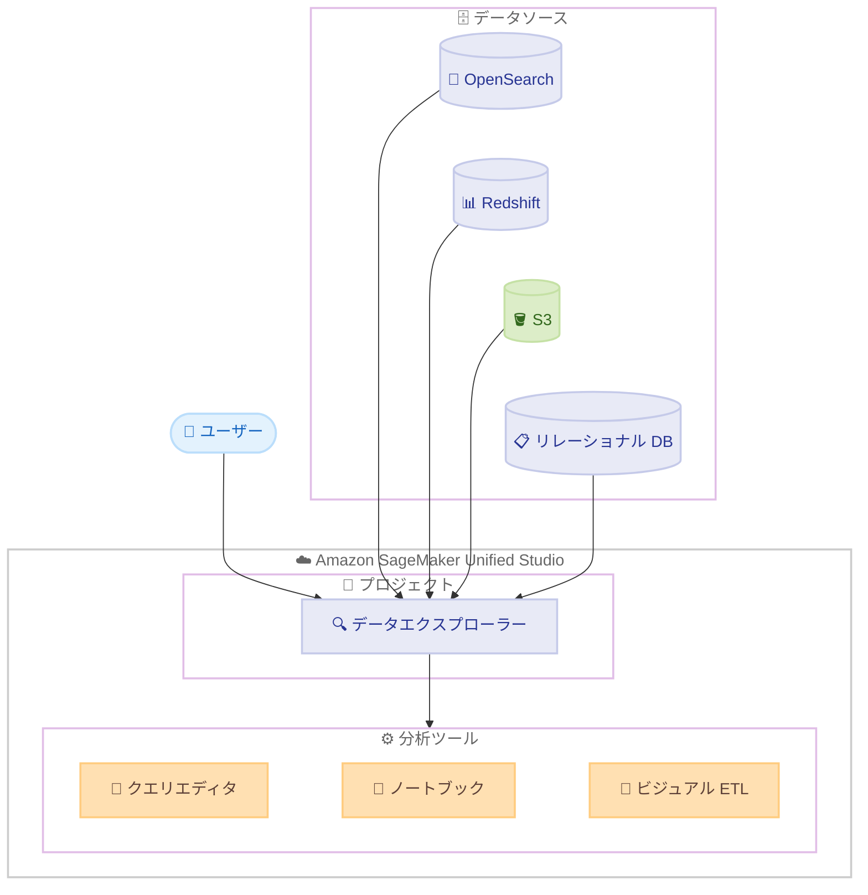

# Amazon SageMaker Unified Studio - Amazon OpenSearch サポート

**リリース日**: 2026 年 7 月 21 日
**サービス**: Amazon SageMaker Unified Studio
**機能**: Amazon OpenSearch データソースサポート

📊 [このアップデートのインフォグラフィックを見る](https://takech9203.github.io/aws-news-summary/20260721-amazon-sagemaker-unified.html)
<!-- INFOGRAPHIC_BASE_URL は環境変数から取得 -->

## 概要

Amazon SageMaker Unified Studio が、データソースとして Amazon OpenSearch をサポートするようになりました。これにより、ユーザーは検索データやログ分析データを、その他のデータ資産と並べてクエリおよび分析できるようになります。

この統合によって、OpenSearch に保存された運用系の検索データを、Amazon Redshift、Amazon S3、リレーショナルデータベースといった他のソースと組み合わせて、単一のガバナンスされた環境内で扱えます。分析ワークロードと運用ワークロードにまたがるデータを相関分析する必要がある場合に特に有効です。たとえば、OpenSearch に格納されたアプリケーションログやメトリクスを、トランザクションデータと結合することで、システムパフォーマンスやユーザー行動に関するインサイトを得られます。

対象ユーザーは、データエンジニア、データアナリスト、データサイエンティストなど、複数のデータソースを横断してデータの探索や ETL、分析を行うすべてのユーザーです。

**アップデート前の課題**

このアップデート以前は、OpenSearch の検索データや分析データを他のデータソースと組み合わせて扱う際に、以下の課題がありました。

- OpenSearch の運用データと、Redshift や S3 などの分析データを相関分析するには、複数のツールを行き来する必要があった
- 検索・ログ分析データと構造化データを統合するパイプラインを、統一された環境内で構築できなかった
- OpenSearch データに対するガバナンスを、他のデータ資産と同じ枠組みで一元管理しにくかった

**アップデート後の改善**

今回のアップデートにより、以下が可能になりました。

- OpenSearch をプロジェクトのデータソースとして追加し、データエクスプローラー上で他のデータと並べて扱えるようになった
- クエリエディタ、ノートブック、ビジュアル ETL ジョブのいずれからも、SageMaker Unified Studio を離れることなく OpenSearch データを利用できるようになった
- リアルタイムの検索・分析データと構造化データセットを統合したパイプラインを、単一のガバナンス環境内で構築できるようになった

## アーキテクチャ図

OpenSearch を含む複数のデータソースがデータエクスプローラーに統合され、クエリエディタ、ノートブック、ビジュアル ETL の各ツールから横断的に利用できる構成を示しています。

## サービスアップデートの詳細

### 主要機能

1. **OpenSearch データソースの追加**
   - プロジェクトのデータセクションから Amazon OpenSearch 接続を追加できる
   - 追加した OpenSearch データは、データエクスプローラー上で他のプロジェクトデータと並べて表示される
   - 検索データやログ分析データを、他のデータ資産と同じガバナンス環境で管理できる

2. **複数ツールからの利用**
   - クエリエディタから OpenSearch データを直接クエリできる
   - ノートブックを使ってデータを探索できる
   - ビジュアル ETL ジョブに OpenSearch データを組み込める
   - いずれのツールも SageMaker Unified Studio を離れることなく利用できる

3. **クロスソースのパイプライン構築**
   - リアルタイムの検索・分析データと構造化データセットを統合したパイプラインを構築できる
   - 分析ワークロードと運用ワークロードにまたがるデータを相関分析できる
   - アプリケーションログやメトリクスとトランザクションデータを結合してインサイトを得られる

## 技術仕様

### 組み合わせ可能なデータソース

| データソース | 用途 |
|------|------|
| Amazon OpenSearch | 検索データ、ログ分析データ、運用メトリクス |
| Amazon Redshift | データウェアハウスの分析データ |
| Amazon S3 | データレイク上の構造化・非構造化データ |
| リレーショナルデータベース | トランザクションデータ |

### 利用可能なツール

| ツール | 主な用途 |
|------|------|
| クエリエディタ | OpenSearch データへの直接クエリ |
| ノートブック | インタラクティブなデータ探索 |
| ビジュアル ETL ジョブ | データパイプラインへの組み込み |

## 設定方法

### 前提条件

1. Amazon SageMaker Unified Studio が利用可能なリージョンで環境が構成されていること
2. 接続対象となる Amazon OpenSearch のドメインまたはコレクションが存在すること
3. OpenSearch への接続に必要なアクセス権限が付与されていること

### 手順

#### ステップ1: OpenSearch 接続の追加

プロジェクトのデータセクションから、新しいデータソースとして Amazon OpenSearch 接続を追加します。接続情報を設定することで、OpenSearch がプロジェクトのデータソースとして登録されます。

#### ステップ2: データエクスプローラーでの確認

接続が完了すると、OpenSearch データがデータエクスプローラー上に他のプロジェクトデータと並べて表示されます。ここで対象のインデックスやデータを確認します。

#### ステップ3: ツールでのデータ利用

クエリエディタで直接クエリを実行する、ノートブックで探索する、またはビジュアル ETL ジョブに組み込むなど、目的に応じたツールで OpenSearch データを利用します。すべての操作は SageMaker Unified Studio 内で完結します。

## メリット

### ビジネス面

- **意思決定の高速化**: 運用データと分析データを単一環境で相関分析でき、システムパフォーマンスやユーザー行動に関するインサイトを迅速に得られる
- **運用効率の向上**: ツールを切り替えることなくクロスソースのワークフローを実行でき、作業の手戻りを削減できる
- **ガバナンスの一元化**: OpenSearch データを他のデータ資産と同じガバナンス環境で管理でき、統制を効かせやすい

### 技術面

- **統合されたデータアクセス**: データエクスプローラー上で複数のデータソースを横断して扱える
- **柔軟な分析手段**: クエリエディタ、ノートブック、ビジュアル ETL の各ツールを用途に応じて選択できる
- **パイプラインの一元管理**: リアルタイムの検索・分析データと構造化データを統合したパイプラインを構築できる

## デメリット・制約事項

### 制限事項

- 利用可能なリージョンは Amazon SageMaker Unified Studio が提供されているリージョンに限定される
- OpenSearch への接続には、対象ドメインまたはコレクションへのアクセス権限が必要となる

### 考慮すべき点

- OpenSearch のインデックス構成やデータ量によっては、クエリのパフォーマンスに影響が出る可能性があるため、事前の確認が推奨される
- クロスソースの結合分析を行う際は、各データソースのスキーマやデータ型の整合性を考慮する必要がある

## ユースケース

### ユースケース1: システムパフォーマンスの相関分析

**シナリオ**: OpenSearch に蓄積したアプリケーションログとメトリクスを、Redshift のトランザクションデータと結合し、システムパフォーマンスの傾向を分析する。

**効果**: 運用データと分析データを単一環境で相関分析でき、パフォーマンス低下の要因を迅速に特定できる。

### ユースケース2: ユーザー行動分析

**シナリオ**: OpenSearch の検索ログと、S3 のデータレイクに保存された利用履歴を組み合わせ、ユーザーの行動パターンを可視化する。

**効果**: 検索行動と実際の利用データを横断的に分析でき、サービス改善のための示唆を得られる。

### ユースケース3: 統合データパイプラインの構築

**シナリオ**: ビジュアル ETL ジョブで、OpenSearch のリアルタイム分析データと、リレーショナルデータベースの構造化データを統合するパイプラインを構築する。

**効果**: リアルタイムデータと構造化データを統合した分析基盤を、SageMaker Unified Studio 内で一元的に構築・運用できる。

## 料金

今回のアップデートに関する追加料金の詳細は、公式発表では言及されていません。Amazon SageMaker Unified Studio および Amazon OpenSearch Service のそれぞれの利用料金が適用されます。最新の料金は各サービスの料金ページを確認してください。

## 利用可能リージョン

Amazon SageMaker Unified Studio が利用可能なすべての AWS リージョンで提供されます。

## 関連サービス・機能

- **Amazon OpenSearch Service**: 検索・ログ分析データを提供するデータソース
- **Amazon Redshift**: データウェアハウスの分析データを提供する連携先
- **Amazon S3**: データレイク上のデータを提供する連携先
- **Amazon SageMaker Unified Studio**: 各データソースを統合し、分析・ETL を実行する基盤

## 参考リンク

- 📊 [インフォグラフィック](https://takech9203.github.io/aws-news-summary/20260721-amazon-sagemaker-unified.html)
- [公式発表 (What's New)](https://aws.amazon.com/about-aws/whats-new/2026/07/amazon-sagemaker-unified/)
- [Amazon SageMaker Unified Studio ドキュメント](https://docs.aws.amazon.com/sagemaker-unified-studio/)
- [Amazon OpenSearch Service 料金ページ](https://aws.amazon.com/opensearch-service/pricing/)

## まとめ

このアップデートにより、Amazon SageMaker Unified Studio 上で OpenSearch の検索・ログ分析データを他のデータソースと統合して扱えるようになり、分析ワークロードと運用ワークロードを横断した相関分析が単一のガバナンス環境で実現できます。ログとトランザクションデータを組み合わせた分析を検討しているチームは、まずプロジェクトに OpenSearch 接続を追加し、データエクスプローラーからの探索を試すことをおすすめします。
