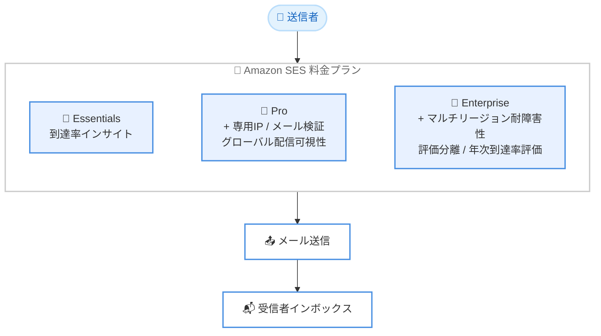

# Amazon SES - 料金プラン (Pricing Plans)

**リリース日**: 2026年7月21日
**サービス**: Amazon Simple Email Service (SES)
**機能**: 料金プラン (Essentials / Pro / Enterprise)

📊 [このアップデートのインフォグラフィックを見る](https://takech9203.github.io/aws-news-summary/20260721-amazon-ses-pricing-plans.html)
<!-- INFOGRAPHIC_BASE_URL は環境変数から取得 -->

## 概要

Amazon Simple Email Service (SES) は、SES の各種機能を個別に評価することなく、簡単に購入して利用開始できる料金プランを発表しました。従来、到達率向上や検証などの機能はそれぞれ個別のアドオンとして提供されており、お客様は必要な機能を 1 つずつ評価して契約する必要がありました。今回の料金プランでは、成長ステージに応じた 1 つのプランを選択するだけで、適切な機能群がまとめて利用可能になります。

料金プランは Essentials、Pro、Enterprise の 3 段階の階層構造で提供されます。各プランは下位のプランを内包する形で構成されており、上位プランほど多くの機能が段階的に追加されます。さらに、機能を個別に購入する à-la-carte (アラカルト) 方式と比較して、最大 22% の割引価格で利用できます。

対象ユーザーは、トランザクションメールやマーケティングメールを送信するすべての規模の企業です。特に、メールの到達率やインボックスへの配信可視性を重視する事業者にとって、必要な機能をまとめて導入できる点が大きな価値となります。

**アップデート前の課題**

- 到達率向上、専用 IP、メール検証などの機能がそれぞれ個別のアドオンとして販売されており、必要な機能を 1 つずつ評価・契約する必要があった
- どの機能を組み合わせればよいか判断が難しく、導入までの検討コストが高かった
- 機能を個別に購入するため、コスト最適化が難しかった

**アップデート後の改善**

- 成長ステージに応じた 1 つのプランを選ぶだけで、適切な機能群がまとめて利用可能になった
- 個別購入 (アラカルト) と比較して、最大 22% の割引価格で機能を利用できるようになった
- 上位プランで到達率保証やマルチリージョン耐障害性などの高度な機能に段階的にアクセスできるようになった

## アーキテクチャ図

Essentials を起点に、Pro、Enterprise と上位プランほど機能が段階的に積み上がる階層構造を示しています。

## サービスアップデートの詳細

### 主要機能

1. **Essentials プラン (エントリーレベル)**
   - 到達率インサイト (deliverability insights) を提供
   - Virtual Deliverability Manager (VDM) によるメール到達率の可視化が利用可能
   - アウトバウンドメール送信、メール処理、認証付きイングレスエンドポイントなどの基本機能を含む

2. **Pro プラン (中位)**
   - Essentials の全機能に加えて、マネージド専用 IP (Managed Dedicated IPs) を追加
   - メール検証 (email validation) 機能を追加
   - グローバルなインボックス配置可視性 (global inbox placement visibility) により、問題を事前に予防
   - アカウント / リージョンあたり月額の固定料金が発生

3. **Enterprise プラン (上位)**
   - Pro の全機能に加えて、マルチリージョン耐障害性 (multi-region resilience) を追加
   - ワークロードレベルでのレピュテーション分離 (workload-level reputation isolation) を提供
   - 年 1 回の専門家による到達率評価 (annual deliverability assessment) を提供
   - テナント機能やグローバルエンドポイントなど、ほぼすべての機能を包含

## 技術仕様

### プラン別の機能比較

| 機能 | Essentials | Pro | Enterprise |
|------|:----------:|:---:|:----------:|
| アウトバウンドメール送信 | ✓ | ✓ | ✓ |
| 到達率インサイト (VDM) | ✓ | ✓ | ✓ |
| メール処理 | ✓ | ✓ | ✓ |
| マネージド専用 IP | アドオン | ✓ | ✓ (拡張) |
| メール検証 | アドオン | ✓ | ✓ (拡張) |
| グローバル配信可視性 | アドオン | ✓ | ✓ |
| マルチリージョン耐障害性 | - | - | ✓ |
| ワークロードレベルのレピュテーション分離 | - | - | ✓ |
| 年次到達率評価 | - | - | ✓ |

<!-- 具体的な機能内訳は公式料金ページに基づく概要。詳細は公式ページで確認のこと -->

### API変更履歴

<!-- 該当する API 変更は確認できなかったため、本セクションは参考情報として省略 -->

今回のアップデートに直接対応する SES API の変更は、公開情報からは確認できませんでした。料金プランはコンソールから選択・管理します。

## 設定方法

### 前提条件

1. AWS アカウントを保有していること
2. Amazon SES が利用可能なリージョンを使用していること (中東 (UAE)、中東 (バーレーン) を除く)
3. SES コンソールへのアクセス権限を持つ IAM ユーザーまたはロール

### 手順

#### ステップ1: SES コンソールにアクセス

AWS マネジメントコンソールにサインインし、Amazon SES コンソールを開きます。ナビゲーションから料金プラン (pricing plan) のセクションに移動します。

#### ステップ2: プランを選択

Essentials、Pro、Enterprise の中から、自社のメール送信要件と成長ステージに合ったプランを選択します。各プランに含まれる機能と料金を確認したうえで選択してください。

#### ステップ3: プランを有効化

選択したプランを有効化すると、該当する機能がまとめて利用可能になります。新規アカウントおよび休眠アカウントは、2026年7月21日より Essentials プランから開始されます。

## メリット

### ビジネス面

- **導入コストの削減**: 必要な機能を 1 つずつ評価・契約する手間がなくなり、意思決定が迅速化される
- **コスト最適化**: 機能を個別に購入するアラカルト方式と比較して、最大 22% の割引価格で利用できる
- **成長への対応**: 事業の成長ステージに応じて、上位プランへ段階的に移行できる

### 技術面

- **到達率の向上**: Pro 以上でグローバルなインボックス配置可視性を活用し、配信問題を事前に予防できる
- **耐障害性**: Enterprise のマルチリージョン耐障害性により、リージョン障害時にもメール送信を継続できる
- **レピュテーション分離**: Enterprise ではワークロード単位で送信レピュテーションを分離し、他ワークロードの影響を回避できる

## デメリット・制約事項

### 制限事項

- 中東 (UAE) および中東 (バーレーン) リージョンでは料金プランを利用できない
- Pro および Enterprise では、送信量に応じた従量料金に加えてアカウント / リージョンあたりの固定料金が発生する
- 年次到達率評価などの一部特典は、長期利用や一定の送信実績などの条件を満たす顧客が対象となる場合がある

### 考慮すべき点

- 従来のアラカルト (個別購入) 方式も引き続き利用可能なため、自社の利用パターンに応じてプランとの比較検討が必要
- プラン選択時には、現在および将来のメール送信量と必要機能を見積もったうえで判断することが望ましい

## ユースケース

### ユースケース1: スタートアップのトランザクションメール

**シナリオ**: 立ち上げ間もないサービスで、パスワードリセットや通知などのトランザクションメールを送信する。まずは基本的な到達率の可視化があれば十分。

**効果**: Essentials プランで到達率インサイトを活用しながら、低コストでメール送信基盤を構築できる。

### ユースケース2: 成長中の EC 事業者のマーケティングメール

**シナリオ**: 送信量が増加し、インボックスへの確実な配信が売上に直結する。専用 IP やメール検証でレピュテーションを管理したい。

**効果**: Pro プランでマネージド専用 IP、メール検証、グローバル配信可視性をまとめて利用し、到達率を能動的に改善できる。

### ユースケース3: 大規模エンタープライズの基幹メール基盤

**シナリオ**: 複数のワークロードから大量のメールを送信し、リージョン障害時にも送信を止められない。ワークロードごとにレピュテーションを分離したい。

**効果**: Enterprise プランでマルチリージョン耐障害性とワークロードレベルのレピュテーション分離を実現し、年次の専門家評価で継続的に到達率を最適化できる。

## 料金

料金プランは、送信量に応じた従量課金と、Pro / Enterprise の固定料金の組み合わせで構成されます。従量料金は段階的なティア方式で、各レートはそのティア内のメールにのみ適用されます (ボリューム全体に一律適用されるわけではありません)。

### 料金例 (概算)

| 月間送信量 | Essentials | Pro | Enterprise |
|-----------|-----------|-----|-----------|
| 0〜1,000 万通 | 1,000 通あたり $0.16 | 1,000 通あたり $0.22 | 1,000 通あたり $0.23 |
| 1,000 万〜1 億通 | 1,000 通あたり $0.14 | 1,000 通あたり $0.17 | 1,000 通あたり $0.18 |
| 1 億通超 | 1,000 通あたり $0.11 | 1,000 通あたり $0.12 | 1,000 通あたり $0.13 |
| 固定料金 (アカウント / リージョン / 月) | なし | $105 | $500 |

<!-- 料金は変更される可能性があるため、必ず公式料金ページで最新情報を確認すること -->

新規のお客様には最大 $200 の AWS 無料利用枠クレジットが提供され、6 か月間の無料プランも用意されています。正確な料金は公式の料金ページで確認してください。

## 利用可能リージョン

Amazon SES が利用可能なすべての AWS リージョンで提供されます。ただし、中東 (UAE) および中東 (バーレーン) リージョンは対象外です。

## 関連サービス・機能

- **Amazon SES Virtual Deliverability Manager (VDM)**: 全プランに含まれる到達率の可視化・改善機能
- **マネージド専用 IP (Managed Dedicated IPs)**: Pro 以上で利用可能な、送信レピュテーションを制御するための専用 IP
- **Amazon CloudWatch**: SES のメトリクスやイベントを監視し、送信状況を可視化

## 参考リンク

- 📊 [インフォグラフィック](https://takech9203.github.io/aws-news-summary/20260721-amazon-ses-pricing-plans.html)
- [公式発表 (What's New)](https://aws.amazon.com/about-aws/whats-new/2026/07/amazon-ses-pricing-plans/)
- [AWS Blog: Introducing Amazon Simple Email Service (SES) pricing plans](https://aws.amazon.com/blogs/messaging-and-targeting/introducing-amazon-simple-email-service-ses-pricing-plans/)
- [Amazon SES 料金ページ](https://aws.amazon.com/ses/pricing/)
- [Amazon SES デベロッパーガイド](https://docs.aws.amazon.com/ses/latest/dg/Welcome.html)

## まとめ

Amazon SES の料金プランは、これまで個別のアドオンとして提供されていた到達率向上機能を、成長ステージに応じた 3 つの階層プランにまとめることで、導入の意思決定を簡素化し、最大 22% のコスト削減を可能にします。まずは自社のメール送信量と必要機能を見積もり、Essentials / Pro / Enterprise のいずれが最適かを SES コンソールで比較検討することを推奨します。
