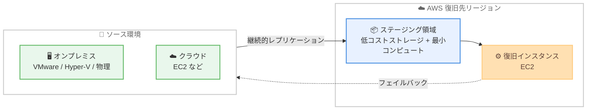

# AWS Elastic Disaster Recovery - 6 つの新規リージョンでの提供開始

**リリース日**: 2026 年 7 月 21 日
**サービス**: AWS Elastic Disaster Recovery (AWS DRS)
**機能**: 6 つの追加 AWS リージョンでの提供開始

📊 [このアップデートのインフォグラフィックを見る](https://takech9203.github.io/aws-news-summary/20260721-aws-drs-additional-regions.html)
<!-- INFOGRAPHIC_BASE_URL は環境変数から取得 -->

## 概要

AWS Elastic Disaster Recovery (AWS DRS) が、新たに 6 つの AWS リージョンで利用可能になりました。これにより、AWS DRS が利用できるリージョンは合計 36 リージョンに拡大しました。

AWS DRS は、AWS への災害復旧 (DR) に推奨されるサービスです。オンプレミスおよびクラウド上のアプリケーションを AWS へ迅速かつ確実に復旧させることで、ダウンタイムとデータ損失を最小限に抑えます。物理インフラストラクチャ、VMware vSphere、Microsoft Hyper-V、クラウドインフラストラクチャなど、幅広いソースからの復旧に対応し、Amazon EC2 インスタンスを別のリージョンへ復旧することも可能です。

今回のリージョン拡大により、これまで近隣リージョンを DR サイトとして利用していたお客様が、より地理的に近いリージョンでデータレジデンシー要件やレイテンシー要件を満たしながら災害復旧環境を構築できるようになります。特にアジアパシフィック、カナダ、メキシコの各地域のお客様にとって、規制対応や事業継続計画 (BCP) の選択肢が広がります。

**アップデート前の課題**

これまで、以下のような制約がありました。

- 新規対応リージョンの利用者は、DR サイトとして地理的に離れた既存対応リージョンを選択する必要があった
- データレジデンシー要件が厳しい国や地域では、国内リージョンで AWS DRS を利用できないケースがあった
- ソースとリカバリー先の距離が離れることで、フェイルバック時のデータ転送量やレイテンシーに影響が生じる可能性があった

**アップデート後の改善**

今回のアップデートにより、以下が可能になりました。

- Asia Pacific (Bangkok)、Asia Pacific (Malaysia) など、より地理的に近いリージョンで AWS DRS を構成できるようになった
- 各国のデータレジデンシー要件を満たしながら災害復旧環境を構築しやすくなった
- 合計 36 リージョンへ拡大したことで、リージョン選択の柔軟性が向上した

## アーキテクチャ図

AWS DRS はソース環境から復旧先リージョンへ継続的にデータをレプリケーションし、低コストのステージング領域で待機させます。災害発生時にはリカバリーインスタンスを起動し、復旧後はフェイルバックを行います。今回のアップデートで、この復旧先として選択できるリージョンが拡大しました。

## サービスアップデートの詳細

### 主要機能

1. **幅広いソースからの復旧に対応**
   - 物理インフラストラクチャ、VMware vSphere、Microsoft Hyper-V、クラウドインフラストラクチャからの復旧をサポート
   - Amazon EC2 インスタンスを別のリージョンへ復旧することも可能
   - Oracle、MySQL、SQL Server などのデータベースや、SAP などのエンタープライズアプリケーションを含む幅広いアプリケーションをレプリケーション

2. **コスト効率の高い災害復旧**
   - 低コストのストレージと最小限のコンピュートリソースを利用
   - ポイントインタイムリカバリー (特定時点への復旧) に対応
   - 復旧時にのみフルスケールのコンピュートリソースを起動する仕組みで、待機コストを抑制

3. **統一された運用プロセス**
   - ドリル (訓練)、復旧、フェイルバックを統一されたプロセスで実行
   - アプリケーション固有の専門スキルを必要とせずに運用可能
   - 複数のアプリケーションを一貫した手順で保護

## 技術仕様

### 今回追加された 6 リージョン

| リージョン名 | リージョンコード |
|------|------|
| Asia Pacific (Bangkok) | ap-southeast-7 |
| Asia Pacific (Malaysia) | ap-southeast-5 |
| Asia Pacific (New Zealand) | ap-southeast-6 |
| Asia Pacific (Taipei) | ap-east-2 |
| Canada West (Calgary) | ca-west-1 |
| Mexico (Central) | mx-central-1 |

<!-- リージョンコードは AWS の一般的な命名に基づく参考値。正確なコードは公式ドキュメントで確認 -->

### API 変更履歴

今回のアップデートはリージョン拡大のみであり、API の追加・変更は確認されていません。

## メリット

### ビジネス面

- **データレジデンシー対応の強化**: 各国のデータ主権や規制要件を満たしながら、国内または近隣リージョンで DR 環境を構成できます。
- **事業継続計画の選択肢拡大**: アジアパシフィック、カナダ、メキシコの各地域で BCP/DR 戦略の柔軟性が向上します。
- **コスト最適化**: 低コストストレージと最小コンピュートによる待機構成で、災害復旧のコストを抑えられます。

### 技術面

- **レイテンシーの低減**: ソースにより近いリージョンを復旧先に選択でき、レプリケーションやフェイルバックの効率が向上します。
- **統一運用**: アプリケーションごとの専用ツールを用意せず、単一のプロセスでドリルと復旧を実施できます。
- **クロスリージョン復旧**: 既存の AWS ワークロードを別リージョンへ復旧する構成が組みやすくなります。

## デメリット・制約事項

### 制限事項

- 各リージョンでのサポート対象や機能の詳細は、AWS の公式ドキュメント (サポートされているリージョン一覧) で確認する必要があります。
- レプリケーションには継続的なネットワーク帯域とステージング領域のストレージが必要です。

### 考慮すべき点

- 復旧先リージョンの選定にあたっては、データレジデンシー要件、レイテンシー、料金体系を総合的に検討してください。
- リージョン間レプリケーションを行う場合、リージョン間のデータ転送料金が発生する点に注意が必要です。

## ユースケース

### ユースケース1: アジアパシフィック地域のデータレジデンシー対応 DR

**シナリオ**: タイやマレーシアなどでデータを国内に保持する必要がある企業が、国内リージョンを復旧先として災害復旧環境を構築する。

**効果**: 規制要件を満たしながら、地理的に近いリージョンで低レイテンシーの DR を実現できます。

### ユースケース2: クロスリージョンの EC2 復旧

**シナリオ**: 既存の AWS ワークロードを、地理的に離れたリスクを分散するために新規対応リージョンへ復旧できるように構成する。

**効果**: リージョン障害に備えた冗長性を確保し、事業継続性を高められます。

### ユースケース3: オンプレミスからクラウドへの DR 移行

**シナリオ**: VMware や Hyper-V 上で稼働するオンプレミス環境を、近隣の AWS リージョンへ継続的にレプリケーションする。

**効果**: 物理データセンターの災害リスクに備えつつ、将来的なクラウド移行の足がかりとします。

## 料金

AWS DRS の料金は、レプリケーション中のソースサーバー数に基づく従量課金が基本です。加えて、ステージング領域のストレージ、EBS スナップショット、復旧時に起動する EC2 インスタンスなどの AWS リソース利用料が発生します。詳細は公式の料金ページを確認してください。

今回のリージョン拡大に伴う料金体系の変更に関する記載は、発表内では確認されていません。

## 利用可能リージョン

今回のアップデートで、以下の 6 リージョンが追加されました。

- Asia Pacific (Bangkok)
- Asia Pacific (Malaysia)
- Asia Pacific (New Zealand)
- Asia Pacific (Taipei)
- Canada West (Calgary)
- Mexico (Central)

これにより、AWS DRS が利用可能なリージョンは合計 36 リージョンとなりました。最新の対応状況は AWS リージョン別サービス一覧および公式ドキュメントで確認してください。

## 関連サービス・機能

- **AWS Application Migration Service (MGN)**: AWS DRS と同じレプリケーション技術を基盤とする移行サービスで、DR と移行を組み合わせた戦略に活用できます。
- **Amazon EC2**: 復旧インスタンスの起動先となるコンピュートサービスです。
- **Amazon EBS**: レプリケーションデータの保存とスナップショットに利用されます。

## 参考リンク

- 📊 [インフォグラフィック](https://takech9203.github.io/aws-news-summary/20260721-aws-drs-additional-regions.html)
- [公式発表 (What's New)](https://aws.amazon.com/about-aws/whats-new/2026/07/aws-drs-additional-regions/)
- [AWS Elastic Disaster Recovery 製品ページ](https://aws.amazon.com/disaster-recovery/)
- [ドキュメント (サポートされているリージョン)](https://docs.aws.amazon.com/drs/latest/userguide/supported-regions.html)

## まとめ

AWS Elastic Disaster Recovery の 6 リージョン拡大により、アジアパシフィック、カナダ、メキシコの各地域でデータレジデンシー要件を満たした災害復旧環境を構築しやすくなりました。国内または近隣リージョンでの DR を検討していたお客様は、対応リージョン一覧を確認し、BCP/DR 戦略の見直しを検討することをおすすめします。
</content>
</invoke>
