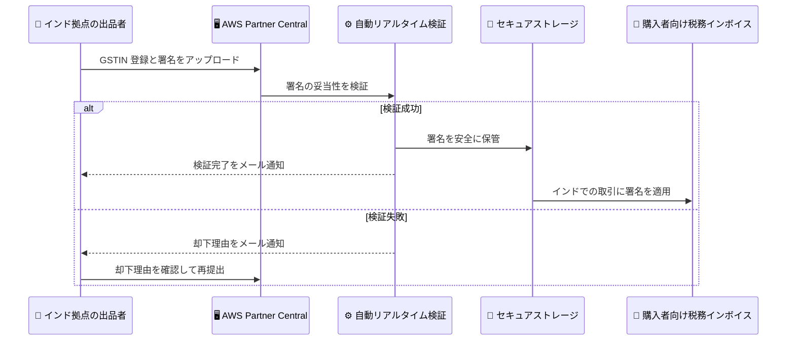

# AWS Marketplace - インド拠点の出品者向けセルフサービス署名管理

**リリース日**: 2026年7月21日
**サービス**: AWS Marketplace
**機能**: インド拠点の出品者向けセルフサービス署名管理 (Self-Service Seller Signature Management)

📊 [このアップデートのインフォグラフィックを見る](https://takech9203.github.io/aws-news-summary/20260721-aws-marketplace-india.html)
<!-- INFOGRAPHIC_BASE_URL は環境変数から取得 -->

## 概要

AWS Marketplace は、インド拠点の出品者が AWS Partner Central を通じて出品者署名 (seller signature) を直接アップロードおよび管理できる機能を追加しました。この機能により、GSTIN (Goods and Services Tax Identification Number、物品サービス税登録番号) の登録と署名管理が、インド拠点の出品者向けに構築された 1 つの集約された場所に統合されます。

インドの出品者は、税務インボイスの発行および規制遵守のために有効な出品者署名を提供する必要があります。今回のアップデートでは、この署名の登録と検証状況の確認を AWS Partner Central のコンソール上で完結できるようになり、これまで手作業で行っていたワークフローが大幅に効率化されます。

提出された署名は安全に保管され、インドでの取引に対して生成される購入者向け税務インボイスに適用されます。あわせて、自動リアルタイム検証と新しい税務サマリーコンテナが導入され、GSTIN 登録状況と署名検証状況を一目で確認できるようになりました。

**アップデート前の課題**

- 出品者署名の提出は、手動のメールベースの提出プロセスに依存していた
- GSTIN 登録と署名管理が一元化されておらず、状況の把握が難しかった
- 署名が却下された場合の理由の把握や再提出に手間がかかっていた

**アップデート後の改善**

- AWS Partner Central のコンソールから署名を直接アップロード、管理できるようになった
- 自動リアルタイム検証により、提出時に署名の妥当性が即座に確認されるようになった
- GSTIN 登録状況と署名検証状況を税務サマリーコンテナで一目で確認できるようになった
- 却下時にはメール通知と却下理由が表示され、出品者自身がコンソール上で再提出して解決できるようになった

## アーキテクチャ図

インド拠点の出品者が AWS Partner Central 上で署名をアップロードしてから、検証、保管、税務インボイスへの適用に至るまでの一連の流れを示しています。

## サービスアップデートの詳細

### 主要機能

1. **セルフサービスによる署名管理**
   - AWS Partner Central を通じて出品者署名を直接アップロード、管理可能
   - 従来のメールベースの手動提出プロセスが不要
   - GSTIN 登録と署名管理を 1 つの場所に集約

2. **自動リアルタイム検証**
   - 署名の提出時に自動でリアルタイム検証を実施
   - 検証結果に応じて、承認または却下を即座に判定
   - 検証または却下の際に出品者へメール通知を送信

3. **税務サマリーコンテナ**
   - GSTIN 登録状況と署名検証状況を一目で表示
   - 出品者が現在のコンプライアンス状態を容易に把握可能

4. **却下時の自己解決**
   - 却下理由がコンソール上に表示される
   - 出品者は表示された却下理由をもとに、自身で再提出して解決可能

## 技術仕様

### 機能の位置付け

| 項目 | 詳細 |
|------|------|
| 対象者 | AWS Marketplace で取引を行うインド拠点の出品者 |
| 管理場所 | AWS Partner Central |
| 統合対象 | GSTIN 登録と出品者署名管理 |
| 署名の用途 | インドでの取引に対する購入者向け税務インボイスへの適用 |
| 検証方式 | 自動リアルタイム検証 |
| 通知方法 | メール通知 (検証完了 / 却下) |

## 設定方法

### 前提条件

1. AWS Marketplace の出品者として登録済みであること
2. インド拠点の出品者であること
3. AWS Partner Central へのアクセス権限を持っていること
4. 有効な GSTIN (物品サービス税登録番号) を保有していること

### 手順

#### ステップ1: AWS Partner Central にアクセス

AWS Partner Central にサインインし、AWS Marketplace の税務設定に関するセクションに移動します。ここで GSTIN 登録と署名管理を一元的に行えます。

#### ステップ2: 署名のアップロード

出品者署名をアップロードします。提出後、自動リアルタイム検証が実行され、署名の妥当性が確認されます。検証が完了すると、税務サマリーコンテナに検証状況が表示されます。

#### ステップ3: 検証状況の確認と対応

税務サマリーコンテナで GSTIN 登録状況と署名検証状況を確認します。署名が却下された場合は、メール通知および画面に表示される却下理由を確認し、修正した署名を再提出します。検証が成功すると、署名はインドでの取引に対する購入者向け税務インボイスに適用されます。

## メリット

### ビジネス面

- **コンプライアンスの効率化**: 税務インボイス発行と規制遵守に必要な署名管理を集約し、対応工数を削減
- **可視性の向上**: 税務サマリーコンテナにより GSTIN 登録状況と署名検証状況を常に把握可能
- **迅速な問題解決**: 却下理由の表示と自己再提出により、問題解決までの時間を短縮

### 技術面

- **プロセスの自動化**: 手動のメールベース提出から、コンソール上でのセルフサービス管理へ移行
- **リアルタイム検証**: 提出時に即座に検証結果を得られ、フィードバックループが短縮
- **セキュアな保管**: 提出された署名は安全に保管され、該当する取引の税務インボイスに自動適用

## デメリット・制約事項

### 制限事項

- 本機能はインド拠点の出品者を対象としている
- 署名はインドでの取引に対する購入者向け税務インボイスに適用される

### 考慮すべき点

- 有効な GSTIN の保有が前提となる
- 署名が却下された場合、却下理由を確認して再提出する運用フローを整備しておくとよい

## ユースケース

### ユースケース1: 新規のインド拠点出品者のオンボーディング

**シナリオ**: インドで AWS Marketplace への出品を開始する企業が、税務インボイス発行に必要な署名を登録する。

**効果**: AWS Partner Central 上で GSTIN 登録と署名アップロードを一度に完了でき、メールベースのやり取りを待つことなく迅速にオンボーディングを進められる。

### ユースケース2: 署名却下時の再提出

**シナリオ**: アップロードした署名が検証で却下されたが、理由が不明で対応に時間がかかっていた。

**効果**: コンソールに表示される却下理由をもとに、出品者自身が修正した署名を再提出でき、サポートへの問い合わせを介さずに自己解決できる。

### ユースケース3: コンプライアンス状況の定期確認

**シナリオ**: 複数の取引を継続的に行うインドの出品者が、税務コンプライアンス状況を定期的に確認したい。

**効果**: 税務サマリーコンテナで GSTIN 登録状況と署名検証状況を一目で確認でき、コンプライアンス維持の負担を軽減できる。

## 料金

本機能自体の追加料金に関する情報は、AWS Marketplace の出品者向けドキュメントおよび料金ページを参照してください。AWS Marketplace の出品者手数料の体系に従います。

## 利用可能リージョン

本機能は、AWS Marketplace で取引を行うインド拠点の出品者を対象としています。

## 関連サービス・機能

- **AWS Partner Central**: 出品者署名と GSTIN 登録を管理する場所
- **AWS Marketplace**: ソフトウェアやサービスを出品、販売するためのマーケットプレイス
- **税務インボイス発行**: 提出された署名はインドでの取引の購入者向け税務インボイスに適用される

## 参考リンク

- 📊 [インフォグラフィック](https://takech9203.github.io/aws-news-summary/20260721-aws-marketplace-india.html)
- [公式発表 (What's New)](https://aws.amazon.com/about-aws/whats-new/2026/07/aws-marketplace-india/)
- [ドキュメント (AWS Marketplace Seller Guide - India)](https://docs.aws.amazon.com/marketplace/latest/userguide/getting-started-seller-india.html)

## まとめ

このアップデートにより、インド拠点の AWS Marketplace 出品者は、手動のメールベース提出に代わり、AWS Partner Central 上で出品者署名と GSTIN 登録をセルフサービスで管理できるようになりました。自動リアルタイム検証、税務サマリーコンテナ、却下理由の表示により、税務コンプライアンス対応が大幅に効率化されます。インドで出品を行う場合は、本機能を活用して署名登録と検証状況の管理を一元化することを推奨します。
</content>
</invoke>
