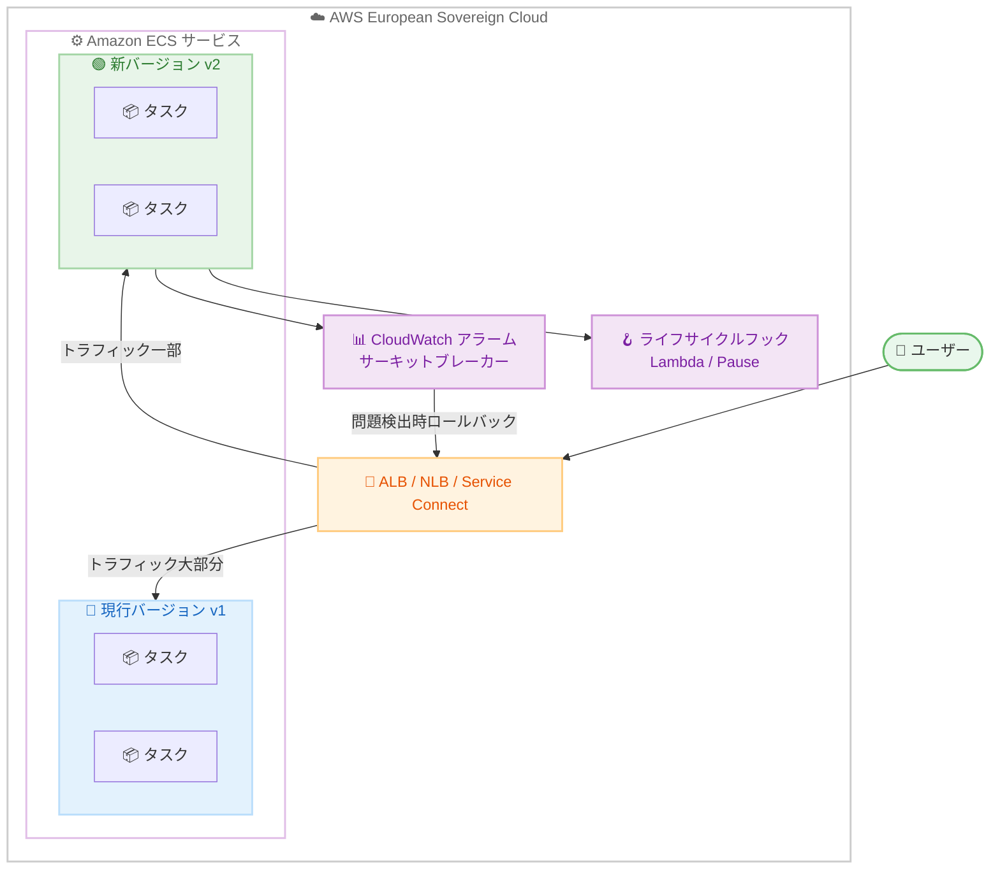

# Amazon ECS - AWS European Sovereign Cloud での高度なデプロイメント戦略

**リリース日**: 2026 年 7 月 21 日
**サービス**: Amazon ECS
**機能**: 高度なデプロイメント戦略 (Blue/Green、Linear、Canary)

📊 [このアップデートのインフォグラフィックを見る](https://takech9203.github.io/aws-news-summary/20260721-ecs-adv-deployments-eu-sovereign-cloud.html)
<!-- INFOGRAPHIC_BASE_URL は環境変数から取得 -->

## 概要

Amazon Elastic Container Service (ECS) の高度なデプロイメント戦略が、AWS European Sovereign Cloud で利用可能になりました。これにより、Blue/Green、Linear、Canary の 3 つのデプロイメント戦略を、追加のカスタムツールなしで ECS のネイティブ機能として利用できます。

これらのネイティブ機能は、コンテナ化されたアプリケーションの更新をより安全かつ迅速にすることを目的としています。デプロイメントライフサイクルフック、ベイクタイム (bake time)、迅速なロールバックといった本番運用に対応した制御機能を提供します。ECS は現行バージョンの隣に新しいアプリケーションバージョンを起動し、本番トラフィックをシフトする前に検証を行います。

AWS European Sovereign Cloud は、欧州のデータ主権要件を持つお客様向けに、EU 内で運用される独立したクラウドです。今回のアップデートにより、データ主権の要件を満たしながら、安全で制御されたコンテナデプロイメントを実現できるようになりました。

**アップデート前の課題**

- AWS European Sovereign Cloud では、段階的なトラフィックシフトを伴う高度なデプロイメント戦略をネイティブに利用できなかった
- 安全なデプロイメントを実現するにはカスタムツールや追加サービスが必要だった
- データ主権要件を満たしつつ、本番対応のデプロイメント制御を行うことが困難だった

**アップデート後の改善**

- AWS European Sovereign Cloud で Blue/Green、Linear、Canary の 3 つの戦略をネイティブサポート
- デプロイメントライフサイクルフック、ベイクタイム、迅速なロールバックを標準機能として利用可能
- 新規サービスと既存サービスの両方で、コンソール、CLI、SDK、IaC ツールから設定可能

## アーキテクチャ図



ECS は新しいバージョンを現行バージョンの隣に起動し、ロードバランサー経由でトラフィックを段階的にシフトします。ライフサイクルフックと CloudWatch アラームによって検証とロールバックを自動化します。

## サービスアップデートの詳細

### 主要機能

1. **Blue/Green デプロイメント**
   - トラフィックを 1 ステップで一括シフト
   - 新旧バージョンを並行稼働させ、検証後に切り替え
   - シンプルで明確な切り替え制御

2. **Linear デプロイメント**
   - 指定した期間にわたって均等な増分でトラフィックをシフト
   - 例: 一定間隔で 10% ずつシフト
   - 予測可能で制御された段階移行

3. **Canary デプロイメント**
   - 最初に少量のトラフィックを新バージョンにシフトし、その後残りをシフト
   - 初期段階でリスクを最小化した検証が可能

4. **デプロイメントライフサイクルフック**
   - Lambda フックおよび Pause フックをサポート
   - カスタム検証や承認ワークフローを組み込み可能

5. **ベイクタイムと自動ロールバック**
   - トラフィックシフト後に新バージョンを評価する期間 (ベイクタイム) を設定
   - 問題検出時はゼロダウンタイムでロールバック
   - CloudWatch アラームまたは ECS デプロイメントサーキットブレーカーによる自動障害検出

## 技術仕様

### デプロイメント戦略の比較

| 戦略 | トラフィックシフト | ユースケース |
|------|-------------------|--------------|
| Blue/Green | 1 ステップで一括シフト | 明確な切り替え、検証後の即時移行 |
| Linear | 指定期間にわたる均等増分 | 予測可能な段階移行 |
| Canary | 少量 → 残り全部 | 初期検証重視、リスク最小化 |

### サポートされる構成

| 項目 | 詳細 |
|------|------|
| ロードバランサー | Application Load Balancer (ALB)、Network Load Balancer (NLB) |
| サービス検出 | Amazon ECS Service Connect |
| 対象サービス | 新規サービスおよび既存サービス |
| 設定手段 | AWS Management Console、AWS CLI、AWS SDK、IaC ツール |
| ロールバック | 自動 (CloudWatch アラーム/サーキットブレーカー)、手動 (StopServiceDeployment API) |

### API変更履歴

今回のアップデートは AWS European Sovereign Cloud におけるリージョン提供拡大であり、新規の API メソッド追加は確認されていません。関連する API (`CreateService`、`UpdateService`、`StopServiceDeployment` など) は既存のものを使用します。

## 設定方法

### 前提条件

1. AWS European Sovereign Cloud の ECS クラスター
2. ALB、NLB、または ECS Service Connect の設定
3. 自動ロールバック用の CloudWatch アラーム (任意)

### 手順

#### ステップ 1: Canary デプロイメントの設定

```bash
aws ecs update-service \
    --cluster my-cluster \
    --service my-service \
    --deployment-configuration '{
        "strategy": "CANARY",
        "bakeTimeInMinutes": 15
    }'
```

Canary デプロイメントを設定し、トラフィックシフト後に 15 分間のベイクタイムで新バージョンを評価します。

#### ステップ 2: ライフサイクルフックの追加

```json
{
  "deploymentConfiguration": {
    "strategy": "BLUE_GREEN",
    "lifecycleHooks": [
      {
        "hookTargetArn": "arn:aws:lambda:eu-central-2:123456789012:function:pre-traffic-validation",
        "roleArn": "arn:aws:iam::123456789012:role/ecs-hook-role",
        "lifecycleStages": ["PRE_SCALE_UP", "POST_TEST_TRAFFIC_SHIFT"]
      }
    ]
  }
}
```

Lambda フックを登録し、トラフィックシフトの各段階でカスタム検証を実行します。検証に失敗した場合はデプロイメントを停止できます。

#### ステップ 3: 手動ロールバック

```bash
aws ecs stop-service-deployment \
    --service-deployment-arn arn:aws:ecs:eu-central-2:123456789012:service-deployment/my-cluster/my-service/xxxx \
    --stop-type ROLLBACK
```

問題が発生した場合、StopServiceDeployment API を使用して手動でロールバックを実行し、現行バージョンにトラフィックを戻します。

## メリット

### ビジネス面

- **データ主権の遵守**: AWS European Sovereign Cloud 内で高度なデプロイメントを実現し、欧州のデータ主権要件を満たす
- **リスク軽減**: 段階的なトラフィックシフトと迅速なロールバックで本番環境への影響を最小化
- **市場投入の迅速化**: カスタムツール不要で安全なデプロイメントを高速に実施

### 技術面

- **ネイティブ統合**: 追加サービス不要で ECS から直接利用
- **柔軟な検証**: Lambda フックと Pause フックによるカスタム検証・承認ワークフロー
- **自動化**: CloudWatch アラームとサーキットブレーカーによる自動障害検出とロールバック

## デメリット・制約事項

### 制限事項

- ALB、NLB、または ECS Service Connect を使用するサービスが対象
- 段階的デプロイメントは通常のローリングアップデートより完了までの時間が長くなる
- 新旧バージョンが並行稼働するため、一時的にリソース使用量が増加する

### 考慮すべき点

- ベイクタイムの設定はワークロード特性に応じて調整が必要
- ライフサイクルフックの Lambda 関数の設計と権限管理
- CloudWatch アラームのしきい値設定によるロールバック精度

## ユースケース

### ユースケース 1: 欧州の規制対象ワークロードの安全な更新

**シナリオ**: データ主権要件を持つ金融サービスが ECS 上のアプリケーションを更新

**実装例**:
```json
{
  "strategy": "CANARY",
  "bakeTimeInMinutes": 30,
  "alarms": {
    "alarmNames": ["error-rate-alarm"],
    "rollback": true
  }
}
```

**効果**: 少量のトラフィックで 30 分間検証し、異常検出時は自動ロールバック

### ユースケース 2: 承認ワークフローを組み込んだ本番デプロイ

**シナリオ**: リリース前に手動承認が必要な業務システムの更新

**実装例**:
```json
{
  "strategy": "BLUE_GREEN",
  "lifecycleHooks": [
    {
      "hookTargetArn": "arn:aws:lambda:eu-central-2:...:function:approval-gate",
      "lifecycleStages": ["POST_TEST_TRAFFIC_SHIFT"]
    }
  ]
}
```

**効果**: テストトラフィックシフト後に承認ゲートを実行し、承認されるまで本番トラフィックをシフトしない

### ユースケース 3: 段階的移行によるレイテンシー監視

**シナリオ**: 低レイテンシーが重要なサービスを段階的に更新

**実装例**:
```json
{
  "strategy": "LINEAR",
  "bakeTimeInMinutes": 10
}
```

**効果**: 均等な増分でトラフィックをシフトし、各段階でレイテンシーを監視しながら移行

## 料金

高度なデプロイメント戦略機能自体に追加料金はありません。ECS の標準料金、ロードバランサー (ALB/NLB) の料金、およびライフサイクルフックで使用する Lambda 関数の実行料金が適用されます。デプロイメント中は新旧バージョンのタスクが並行稼働するため、その間のコンピューティングリソース分の料金が発生します。

## 利用可能リージョン

AWS European Sovereign Cloud で利用可能になりました。この機能は既に AWS 商用リージョンおよび AWS GovCloud (US) リージョンでも提供されています。

## 関連サービス・機能

- **Amazon CloudWatch**: アラームベースの監視と自動ロールバック
- **AWS Lambda**: デプロイメントライフサイクルフックによるカスタム検証
- **Elastic Load Balancing**: ALB/NLB を介したトラフィックシフト
- **Amazon ECS Service Connect**: サービス間通信を利用したデプロイメント

## 参考リンク

- 📊 [インフォグラフィック](https://takech9203.github.io/aws-news-summary/20260721-ecs-adv-deployments-eu-sovereign-cloud.html)
- [公式発表 (What's New)](https://aws.amazon.com/about-aws/whats-new/2026/07/ecs-adv-deployments-eu-sovereign-cloud/)
- [Blue/Green デプロイメント ドキュメント](https://docs.aws.amazon.com/AmazonECS/latest/developerguide/deployment-type-blue-green.html)
- [Linear デプロイメント ドキュメント](https://docs.aws.amazon.com/AmazonECS/latest/developerguide/deployment-type-linear.html)
- [Canary デプロイメント ドキュメント](https://docs.aws.amazon.com/AmazonECS/latest/developerguide/canary-deployment.html)
- [デプロイメントライフサイクルフック ドキュメント](https://docs.aws.amazon.com/AmazonECS/latest/developerguide/deployment-lifecycle-hooks.html)

## まとめ

Amazon ECS の高度なデプロイメント戦略が AWS European Sovereign Cloud で利用可能になったことで、欧州のデータ主権要件を持つお客様も、Blue/Green、Linear、Canary によるネイティブな安全デプロイメントを実現できるようになりました。データ主権を重視しながらコンテナワークロードを運用している組織は、この機能を活用してデプロイリスクを軽減し、リリースの信頼性を高めてください。
