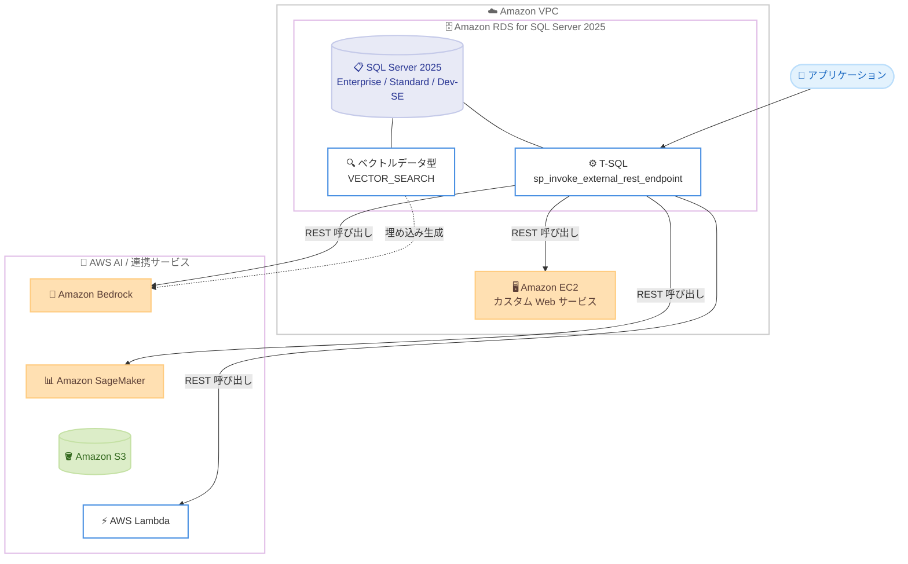

# Amazon RDS for SQL Server - Microsoft SQL Server 2025 のサポート

**リリース日**: 2026 年 7 月 21 日
**サービス**: Amazon RDS for SQL Server
**機能**: Microsoft SQL Server 2025 のサポート

📊 [このアップデートのインフォグラフィックを見る](https://takech9203.github.io/aws-news-summary/20260721-rds-sqlserver-supports-sqlserver-2025.html)
<!-- INFOGRAPHIC_BASE_URL は環境変数から取得 -->

## 概要

Amazon RDS for SQL Server が、Microsoft SQL Server 2025 の Enterprise、Standard、Developer の各エディションをサポートしました。SQL Server 2025 は、AI 統合をデータベースエンジンに直接組み込んだ点が最大の特徴です。追加のミドルウェアを介さずに、T-SQL から外部 REST エンドポイントを呼び出せるようになりました。

これにより、お客様はアプリケーションを再設計することなく、データベースワークロードを Amazon Bedrock、Amazon SageMaker、Amazon S3、AWS Lambda といった AWS サービスとセキュアに統合できます。AI を活用したクエリアドバイザー、パフォーマンスの自動分析、イベント駆動型ワークフロー、Amazon EC2 上のカスタム Web サービス呼び出しといったシナリオが実現します。

さらに SQL Server 2025 では、開発およびテスト向けの新しい無償エディション (Standard Developer Edition、通称 Dev-SE)、Standard Edition の大幅な容量拡張 (最大 32 コア、256 GB のバッファプールメモリ)、Standard Edition での Resource Governor 対応、ベクトル埋め込みをデータベース内で直接格納・クエリできるネイティブなベクトルデータ型が導入されました。既存のお客様は、DB エンジンバージョンを変更することでアップグレードできます。

**アップデート前の課題**

- 以前は、データベースワークロードから AI や機械学習の推論を呼び出すには、Lambda やアプリケーション層などの追加ミドルウェアを構築する必要があった
- 以前は、Standard Edition の計算能力は上限が低く、Resource Governor は Enterprise Edition 限定であったため、ワークロード分離のためにコストの高い Enterprise Edition を選択する必要があった
- 以前は、ベクトル埋め込みを扱う類似検索や生成 AI ワークロードでは、専用のベクトルデータベースを別途用意する必要があった

**アップデート後の改善**

- 今回のアップデートにより、T-SQL から直接外部 REST エンドポイントを呼び出し、AWS サービスと連携できるようになった
- 今回のアップデートにより、Standard Edition が最大 32 コア、256 GB バッファプールメモリまで拡張され、Resource Governor も利用可能になった
- 今回のアップデートにより、ネイティブなベクトルデータ型でベクトル埋め込みをデータベース内に格納・クエリできるようになった
- 今回のアップデートにより、無償の Standard Developer Edition でライセンスコストなしに開発・テスト環境を構築できるようになった

## アーキテクチャ図



RDS for SQL Server 2025 の T-SQL から外部 REST エンドポイント呼び出しを通じて、Amazon Bedrock や SageMaker、Lambda などの AWS サービスと連携する構成を示しています。

## サービスアップデートの詳細

### 主要機能

1. **データベースエンジンへの AI 統合**
   - システムストアドプロシージャ `sp_invoke_external_rest_endpoint` を利用して、T-SQL から外部 REST エンドポイントを直接呼び出せる
   - 追加のミドルウェアを構築することなく、Amazon Bedrock、Amazon SageMaker、Amazon S3、AWS Lambda などの AWS サービスとセキュアに統合できる
   - `CREATE EXTERNAL MODEL` により、埋め込み生成などの AI 推論エンドポイントを外部モデルオブジェクトとして管理し、`AI_GENERATE_EMBEDDINGS` や `AI_GENERATE_CHUNKS` などの関数から利用できる

2. **ネイティブなベクトルデータ型**
   - ベクトル埋め込みをデータベース内に直接格納・クエリできる `vector` データ型が追加された
   - ベクトルは最適化されたバイナリ形式で格納されるが、利便性のために JSON 配列として公開される
   - `VECTOR_DISTANCE`、`VECTOR_NORM`、`VECTOR_NORMALIZE` などのスカラー関数によりベクトル演算が可能
   - 近似最近傍探索によるベクトル検索 (`VECTOR_SEARCH`) やベクトルインデックス (`CREATE VECTOR INDEX`) も利用できる (一部機能は `PREVIEW_FEATURES` 構成が必要)

3. **Standard Edition の容量拡張と Resource Governor 対応**
   - Standard Edition の単一インスタンスの最大計算能力が、4 ソケットまたは 32 コアのいずれか小さい方まで拡張された
   - インスタンスあたりのバッファプールの最大メモリが 256 GB に拡張された
   - これまで Enterprise Edition 限定であった Resource Governor が、Standard Edition および Standard Developer Edition でも Enterprise Edition と同等の機能で利用可能になった

4. **新しい無償の Standard Developer Edition (Dev-SE)**
   - 開発向けにライセンスされた無償エディションで、Standard Edition のすべての機能を含む
   - Standard Edition 向けの新規アプリケーション開発や、本番デプロイ前にアップグレードを検証するステージング環境の構築に利用できる

## 技術仕様

### SQL Server 2025 のエディション別容量

| 項目 | Enterprise Edition | Standard Edition |
|------|--------------------|------------------|
| 最大計算能力 (単一インスタンス) | OS の最大値 | 4 ソケットまたは 32 コアのいずれか小さい方 |
| バッファプール最大メモリ | OS の最大値 | 256 GB |
| Resource Governor | 対応 | 対応 (2025 で新規対応) |
| ベクトルデータ型 | 対応 | 対応 |
| 外部 REST エンドポイント呼び出し | 対応 | 対応 |

### 主な AI 関連の T-SQL 要素

| 要素 | 説明 |
|------|------|
| `sp_invoke_external_rest_endpoint` | T-SQL から REST / GraphQL エンドポイントを呼び出すシステムストアドプロシージャ |
| `CREATE EXTERNAL MODEL` | AI 推論エンドポイントの場所・認証方法・用途を保持する外部モデルオブジェクトを作成 |
| `AI_GENERATE_EMBEDDINGS` | 事前作成した AI モデル定義を用いて埋め込み (ベクトル配列) を生成 |
| `VECTOR_SEARCH` | 近似最近傍探索アルゴリズムで類似ベクトルを検索 (`PREVIEW_FEATURES` が必要) |

### 設定や権限など

```sql
-- 外部 REST エンドポイント呼び出しの例
DECLARE @response NVARCHAR(MAX);
EXEC sp_invoke_external_rest_endpoint
    @url = N'https://bedrock-runtime.us-east-1.amazonaws.com/model/...',
    @method = 'POST',
    @payload = N'{ "inputText": "..." }',
    @response = @response OUTPUT;
SELECT @response;
```

## 設定方法

### 前提条件

1. Amazon RDS for SQL Server を利用可能な AWS アカウントと、対象リージョンでの権限
2. アップグレード対象の既存 DB インスタンス、または新規作成する場合のパラメータグループとセキュリティグループ
3. 外部 REST エンドポイント呼び出しを利用する場合、対象 AWS サービス (Bedrock、Lambda など) へのネットワーク到達性と適切な IAM 権限

### 手順

#### ステップ1: エンジンバージョンの確認

```bash
aws rds describe-db-engine-versions \
    --engine sqlserver-se \
    --query "DBEngineVersions[?contains(EngineVersion, '17.')].EngineVersion"
```

利用可能な SQL Server 2025 (メジャーバージョン 17.x) のエンジンバージョンを確認します。エディションに応じて `sqlserver-ee` (Enterprise)、`sqlserver-se` (Standard) などを指定します。

#### ステップ2: 既存インスタンスのアップグレード

```bash
aws rds modify-db-instance \
    --db-instance-identifier my-sqlserver-instance \
    --engine-version <SQL-Server-2025-version> \
    --allow-major-version-upgrade \
    --apply-immediately
```

DB エンジンバージョンを SQL Server 2025 のバージョンに変更してアップグレードします。メジャーバージョンアップグレードのため `--allow-major-version-upgrade` を指定します。本番環境では事前にスナップショットの取得とステージング環境での検証を推奨します。

#### ステップ3: 検証環境での事前検証

無償の Standard Developer Edition を活用し、本番アップグレード前にアプリケーションの互換性を検証します。SQL Server 2025 には linked servers、レプリケーション、ログ配布、PolyBase などに関する破壊的変更が含まれるため、事前検証が重要です。

## メリット

### ビジネス面

- **アーキテクチャの簡素化**: AI 連携のための追加ミドルウェアが不要となり、開発・運用コストを削減できる
- **ライセンスコストの最適化**: Standard Edition で 32 コア・256 GB・Resource Governor が利用可能になり、Enterprise Edition を選ばずに済むケースが増える
- **開発コストの削減**: 無償の Standard Developer Edition により、ライセンス費用なしで開発・テスト環境を構築できる

### 技術面

- **データ近接での AI 処理**: データを移動させずにデータベース内でベクトル検索や埋め込み生成を実行できる
- **マネージド運用**: RDS のマネージド機能 (自動バックアップ、パッチ適用、Multi-AZ など) をそのまま活用できる
- **既存資産の活用**: アプリケーションを再設計せずに、T-SQL から AWS サービスへ統合できる

## デメリット・制約事項

### 制限事項

- 一部のベクトル機能 (`VECTOR_SEARCH`、`CREATE VECTOR INDEX` など) はデータベーススコープ構成 `PREVIEW_FEATURES` の有効化が必要
- SQL Server 2025 では Web Edition が廃止され、linked servers、レプリケーション、ログ配布、PolyBase などに破壊的変更が含まれる
- Data Quality Services (DQS)、Master Data Services (MDS)、Synapse Link は本バージョンで廃止された

### 考慮すべき点

- メジャーバージョンアップグレードとなるため、本番適用前に必ずステージング環境で互換性を検証する
- 外部 REST エンドポイント呼び出しには、対象 AWS サービスへのネットワーク経路と IAM 権限の適切な設計が必要
- RDS for SQL Server では、オンプレミス版の全機能がサポートされるとは限らないため、利用予定機能の対応状況を確認する

## ユースケース

### ユースケース1: AI を活用したクエリアドバイザー

**シナリオ**: データベース管理者が、スロークエリの改善提案を自動で得たい。

**実装例**:
```sql
-- 実行計画やクエリ統計を Amazon Bedrock に送信し、改善案を取得
EXEC sp_invoke_external_rest_endpoint
    @url = N'https://bedrock-runtime.<region>.amazonaws.com/model/...',
    @method = 'POST',
    @payload = @query_plan_json,
    @response = @advice OUTPUT;
```

**効果**: 追加基盤なしに、データベース内から直接生成 AI による分析・提案を受け取れる。

### ユースケース2: ベクトル検索によるセマンティック検索

**シナリオ**: 製品ドキュメントの類似検索を、専用ベクトルデータベースを用意せずに実現したい。

**実装例**:
```sql
-- テキストから埋め込みを生成してベクトル列に格納
UPDATE docs
SET embedding = AI_GENERATE_EMBEDDINGS(content USE MODEL MyEmbeddingModel);

-- 類似ベクトルを検索
SELECT TOP 5 id, content
FROM docs
ORDER BY VECTOR_DISTANCE('cosine', embedding, @query_vector);
```

**効果**: 既存の SQL Server 内で埋め込み格納から類似検索まで完結し、データ移動と運用の複雑さを低減できる。

### ユースケース3: イベント駆動型ワークフロー

**シナリオ**: 特定のデータ更新をトリガーに、後続処理を AWS Lambda で実行したい。

**実装例**:
```sql
-- トリガー内から Lambda を呼び出す
EXEC sp_invoke_external_rest_endpoint
    @url = N'https://lambda.<region>.amazonaws.com/2015-03-31/functions/my-func/invocations',
    @method = 'POST',
    @payload = @event_json;
```

**効果**: データベースの変更を起点に、サーバーレスでイベント駆動処理を組み立てられる。

## 料金

Amazon RDS for SQL Server の料金は、選択したエディション (Enterprise、Standard、Developer)、インスタンスクラス、ストレージ、Multi-AZ 構成などに基づきます。SQL Server 2025 のサポートに伴う追加料金の詳細や、最新のリージョン別料金については、公式の料金ページを参照してください。なお、Standard Developer Edition はライセンス費用が発生しない無償エディションですが、RDS 上のインスタンス・ストレージ利用料は通常どおり発生します。

## 利用可能リージョン

対象リージョンの詳細は、Amazon RDS for SQL Server の料金ページおよびドキュメントで最新情報を確認してください。

## 関連サービス・機能

- **Amazon Bedrock**: T-SQL からの REST 呼び出しで、基盤モデルによる推論や埋め込み生成に利用できる
- **Amazon SageMaker**: カスタム機械学習モデルの推論エンドポイントとして連携できる
- **AWS Lambda**: イベント駆動型ワークフローの後続処理を担う
- **Amazon S3**: データの入出力先として連携できる
- **Amazon EC2**: カスタム Web サービスのホスト先として T-SQL から呼び出せる

## 参考リンク

- 📊 [インフォグラフィック](https://takech9203.github.io/aws-news-summary/20260721-rds-sqlserver-supports-sqlserver-2025.html)
- [公式発表 (What's New)](https://aws.amazon.com/about-aws/whats-new/2026/07/rds-sqlserver-supports-sqlserver-2025)
- [Amazon RDS for SQL Server ドキュメント](https://docs.aws.amazon.com/AmazonRDS/latest/UserGuide/CHAP_SQLServer.html)
- [What's New in SQL Server 2025 (Microsoft Learn)](https://learn.microsoft.com/en-us/sql/sql-server/what-s-new-in-sql-server-2025)
- [Amazon RDS for SQL Server 料金ページ](https://aws.amazon.com/rds/sqlserver/pricing/)

## まとめ

Amazon RDS for SQL Server での SQL Server 2025 サポートにより、データベースエンジンから直接 AWS の AI サービスと連携でき、ネイティブなベクトルデータ型で生成 AI ワークロードをデータベース内に統合できるようになりました。Standard Edition の容量拡張と Resource Governor 対応、無償の Standard Developer Edition により、コスト面でも柔軟な選択肢が広がります。まずは無償の Developer Edition や検証環境で破壊的変更と互換性を確認したうえで、DB エンジンバージョンの変更によるアップグレードを計画することを推奨します。
